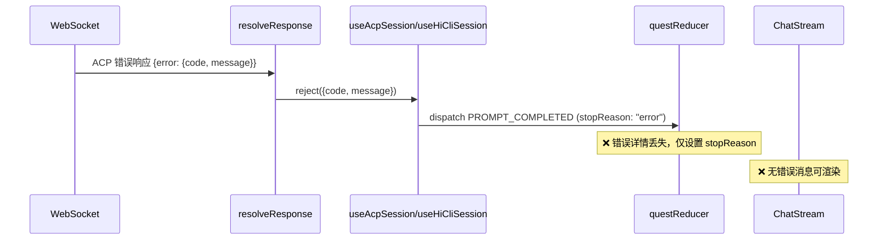
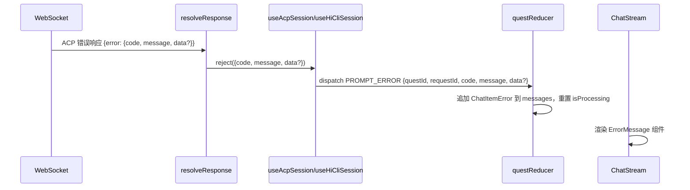

# 设计文档：ACP 错误响应处理

## 概述

本设计解决 ACP JSON-RPC 错误响应在 HiCoding、HiWork、HiCli 模块中未被展示在对话流中的问题。核心思路是在现有的消息处理链路中增加错误消息类型，使错误从 `resolveResponse` → Hook `.catch()` → reducer → ChatStream 的完整链路中被正确传递和渲染。

变更范围集中在前端 `himarket-web/himarket-frontend` 项目中，涉及 5 个关键文件的修改和 1 个新组件的创建。

## 架构

### 当前错误处理流程（有问题）



### 修复后的错误处理流程



## 组件与接口

### 1. 类型层 — `src/types/acp.ts`

新增 `ChatItemError` 接口并扩展 `ChatItem` 联合类型。同时扩展 `AcpResponse.error` 以支持 `data` 字段。

### 2. 状态管理层 — `src/context/QuestSessionContext.tsx`

在 `QuestAction` 联合类型中新增 `PROMPT_ERROR` action，在 `questReducer` 中处理该 action：追加错误消息到 messages 并重置处理状态。

### 3. Hook 层 — `src/hooks/useAcpSession.ts` 和 `src/hooks/useHiCliSession.ts`

修改 `startPrompt` 函数中 `trackRequest().catch()` 的逻辑，从 reject 的 error 对象中提取 `code`、`message`、`data`，dispatch `PROMPT_ERROR` 替代原来的 `PROMPT_COMPLETED`。

### 4. UI 层 — 新增 `src/components/quest/ErrorMessage.tsx`

新建错误消息渲染组件，在 `ChatStream.tsx` 中增加对 `error` 类型 ChatItem 的渲染分支。

## 数据模型

### ChatItemError 类型

```typescript
export interface ChatItemError {
  type: "error";
  id: string;
  code: number;
  message: string;
  data?: Record<string, unknown>;
}
```

### AcpResponse.error 扩展

```typescript
// 现有定义
error?: { code: number; message: string };

// 扩展后
error?: { code: number; message: string; data?: Record<string, unknown> };
```

### PROMPT_ERROR Action

```typescript
{
  type: "PROMPT_ERROR";
  questId: string;
  requestId: JsonRpcId;
  code: number;
  message: string;
  data?: Record<string, unknown>;
}
```

### Reducer 处理逻辑（伪代码）

```typescript
case "PROMPT_ERROR":
  return updateQuestById(state, action.questId, q => {
    if (action.requestId !== undefined &&
        q.inflightPromptId !== null &&
        q.inflightPromptId !== action.requestId) {
      return q;  // 忽略过期请求
    }
    const errorItem: ChatItemError = {
      type: "error",
      id: chatItemId(),
      code: action.code,
      message: action.message,
      ...(action.data ? { data: action.data } : {}),
    };
    return {
      ...q,
      messages: [...q.messages, errorItem],
      isProcessing: false,
      inflightPromptId: null,
      lastStopReason: "error",
      lastCompletedAt: Date.now(),
    };
  });
```


## 正确性属性

*正确性属性是一种在系统所有有效执行中都应成立的特征或行为——本质上是关于系统应该做什么的形式化陈述。属性是人类可读规范与机器可验证正确性保证之间的桥梁。*

### Property 1: PROMPT_ERROR action 正确更新 reducer 状态

*For any* 有效的 quest 状态（包含一个正在处理中的 quest）和任意有效的 PROMPT_ERROR action（requestId 匹配 inflightPromptId），dispatch 该 action 后，quest 的 messages 列表长度应增加 1，新增的最后一条消息类型应为 `error` 且包含与 action 中相同的 code 和 message，同时 `isProcessing` 应为 false，`inflightPromptId` 应为 null。

**Validates: Requirements 2.1, 2.2**

### Property 2: 过期请求的 PROMPT_ERROR 被忽略

*For any* 有效的 quest 状态和任意 PROMPT_ERROR action，当 action 的 requestId 与 quest 的 inflightPromptId 不匹配时，reducer 返回的状态应与输入状态完全相同（messages 不变、isProcessing 不变、inflightPromptId 不变）。

**Validates: Requirements 2.3**

### Property 3: 错误消息渲染包含完整错误信息

*For any* 随机生成的错误码（整数）和错误消息（非空字符串），ErrorMessage 组件的渲染输出应同时包含该错误码的文本表示和错误消息文本。

**Validates: Requirements 4.2**

### Property 4: resolveResponse 正确传递错误对象

*For any* 包含 error 字段的有效 ACP 错误响应对象，当对应的 pending request 存在时，resolveResponse 应调用 reject 回调并传递包含相同 code 和 message 的错误对象。

**Validates: Requirements 5.1**

### Property 5: 错误信息端到端保真

*For any* 有效的 ACP 错误响应（包含 code、message、可选 data），经过 resolveResponse → Hook catch → reducer dispatch → ChatItemError 的完整链路后，最终存储在 quest messages 中的 ChatItemError 的 code 和 message 应与原始 ACP 错误响应中的值相同。

**Validates: Requirements 5.2**

## 错误处理

### ACP 错误响应格式

系统需要处理以下 JSON-RPC 错误响应格式：

```json
{
  "jsonrpc": "2.0",
  "id": 5,
  "error": {
    "code": -32603,
    "message": "Internal error",
    "data": {
      "codex_error_info": "other",
      "message": "stream disconnected before completion"
    }
  }
}
```

### 错误码分类

| 错误码 | 含义 | UI 展示策略 |
|-------|------|------------|
| `-32000` | 认证错误 | 展示认证提示 |
| `-32601` | 方法不存在 | 展示协议兼容性提示 |
| `-32603` | 内部错误 | 展示通用错误信息 + data 中的详情 |
| 其他 | 未知错误 | 展示错误码和原始消息 |

### 防御性处理

- Hook 层 `.catch()` 中需要对 error 对象做类型检查，确保 `code` 和 `message` 字段存在
- 如果 reject 的值不是预期的 `{ code, message }` 格式，应使用默认值（code: -1, message: "Unknown error"）
- reducer 中的 requestId 匹配检查防止过期错误消息污染对话流

## 测试策略

### 属性测试（Property-Based Testing）

使用 `fast-check` 库进行属性测试，每个属性至少运行 100 次迭代。

| 属性 | 测试目标 | 生成器 |
|------|---------|--------|
| Property 1 | questReducer PROMPT_ERROR 行为 | 随机 code（整数）、随机 message（字符串）、随机 data（可选对象） |
| Property 2 | questReducer 过期请求忽略 | 随机 requestId（确保与 inflightPromptId 不同） |
| Property 3 | ErrorMessage 渲染完整性 | 随机 code（整数）、随机 message（非空字符串） |
| Property 4 | resolveResponse 错误传递 | 随机 AcpResponse 对象（含 error 字段） |
| Property 5 | 端到端错误信息保真 | 随机 ACP 错误响应 → 完整链路验证 |

每个属性测试需标注注释：
```typescript
// Feature: acp-error-response-handling, Property N: {property_text}
```

### 单元测试

单元测试聚焦于具体示例和边界情况：

- `ChatItemError` 类型构造验证（含/不含 data 字段）
- `PROMPT_ERROR` action 处理的具体场景（标准错误、含 data 的错误）
- Hook 层 `.catch()` 中 error 对象格式异常时的降级处理
- `ErrorMessage` 组件渲染含 data 扩展数据的场景
- `ChatStream` 中 `error` 类型 ChatItem 的渲染分支覆盖

### 测试文件组织

```
src/
├── context/
│   └── QuestSessionContext.test.ts    # 扩展现有测试，增加 PROMPT_ERROR 测试
├── lib/utils/
│   └── acp.test.ts                    # resolveResponse 错误传递测试
└── components/quest/
    └── ErrorMessage.test.tsx          # ErrorMessage 组件渲染测试
```
