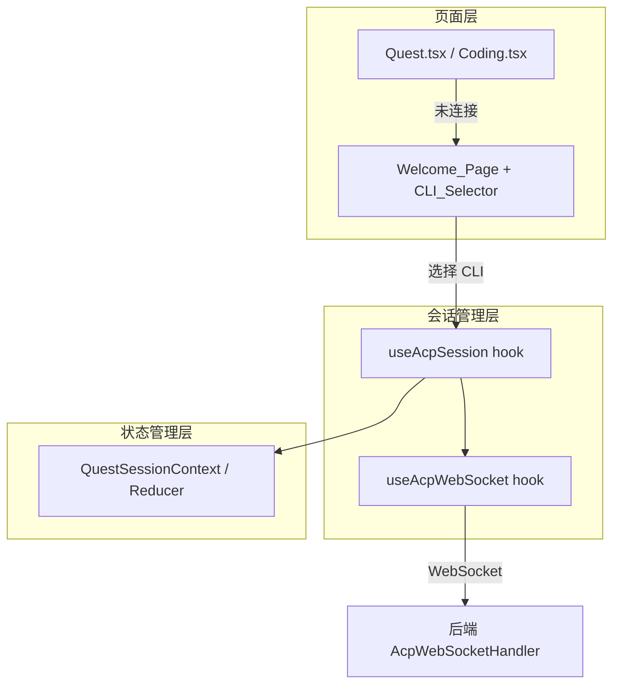
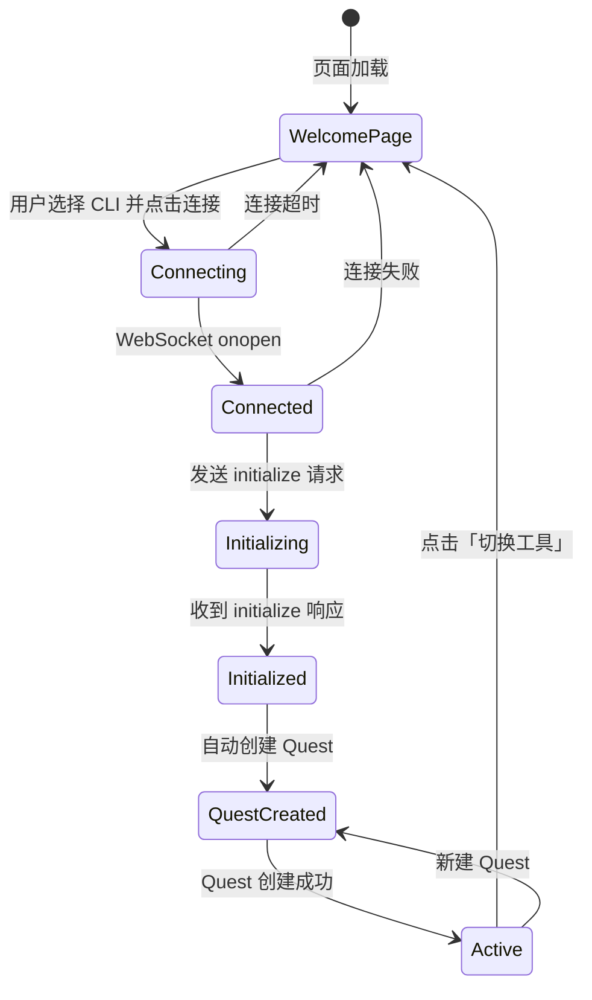

# 设计文档

## 概述

本设计将 hiwork（Quest 模块）和 hicoding（Coding 模块）的 ACP 会话管理重构为与 HiCli 一致的延迟连接模式。核心变化是：页面加载时不再立即建立 WebSocket 连接，而是先展示欢迎页让用户选择 CLI 工具，选择后才建立连接并自动创建会话。同时移除顶部栏的 CLI 切换下拉框，将 CLI 切换统一到欢迎页和侧边栏左下角。

### 当前问题

1. **hiwork**：页面加载时立即建立 WebSocket 连接（`buildWsUrl` 在组件初始化时调用），点击创建 Quest 后后端会话创建成功但前端列表不显示
2. **hicoding**：同样立即连接，切换 CLI 时 `RESET_STATE` 清空了 quests 但 `autoCreatedRef.current` 不会重置（它是 useRef），导致切换后不会自动创建新 Quest，模型列表为空
3. **顶部栏**：QuestTopBar 和 CodingTopBar 都包含 `CliProviderSelect` 下拉框，切换时触发 `RESET_STATE` + 重建 WebSocket，存在竞态条件

### 目标架构（参考 HiCli）

```
用户进入页面 → 欢迎页（CLI 选择器）→ 选择 CLI → 建立 WebSocket → 协议初始化 → 自动创建 Quest → 正常使用
                                                                                              ↑
侧边栏左下角「切换」按钮 → 断开连接 → RESET_STATE → 返回欢迎页 ─────────────────────────────────┘
```

## 架构

### 整体架构

hiwork 和 hicoding 将采用与 HiCli 相同的三层架构：



### 连接生命周期状态机



### 关键设计决策

1. **复用 useAcpSession hook**：不为 hiwork/hicoding 创建新的 session hook，而是修改现有的 `useAcpSession` 支持延迟连接模式（初始 wsUrl 为空时不连接）
2. **复用 HiCliSelector 组件**：hiwork 和 hicoding 的欢迎页直接复用 HiCli 的 `HiCliSelector` 组件（或提取为公共组件）
3. **侧边栏统一模式**：hiwork 的 `QuestSidebar` 参考 `HiCliSidebar`，在底部添加切换工具按钮
4. **autoCreatedRef 重置**：在断开连接时（`!isConnected`）重置 `autoCreatedRef.current = false`，与 HiCli 保持一致

## 组件和接口

### 需要修改的组件

#### 1. Quest.tsx（hiwork 页面）

**当前行为**：页面加载时立即 `buildWsUrl` 并传给 `useAcpSession`，没有欢迎页 CLI 选择步骤。

**目标行为**：
- 初始 `wsUrl` 为空字符串 `""`
- 展示欢迎页（含 CLI 选择器）
- 用户选择 CLI 后设置 `wsUrl`，触发连接
- 连接成功 + 初始化完成后自动创建 Quest
- 断开时重置 `autoCreatedRef`

**接口变化**：
```typescript
// 新增状态
const [currentWsUrl, setCurrentWsUrl] = useState("");  // 初始为空，不触发连接
const autoCreatedRef = useRef(false);

// 新增回调
const handleSelectCli = (cliId: string, cwd: string) => void;
const handleSwitchTool = () => void;

// useAcpSession 传入动态 wsUrl
const session = useAcpSession({ wsUrl: currentWsUrl, runtimeType: "local" });
```

#### 2. Coding.tsx（hicoding 页面）

**当前行为**：页面加载时立即 `buildWsUrl(currentProvider)` 并传给 `useAcpSession`。`handleProviderChange` 通过 `RESET_STATE` + `setWsUrl` 切换 CLI，但 `autoCreatedRef` 不重置。

**目标行为**：
- 初始 `wsUrl` 为空字符串 `""`
- 展示欢迎页（含 CLI 选择器）
- 用户选择 CLI 后设置 `wsUrl`，触发连接
- 连接成功 + 初始化完成后自动创建 Quest
- 切换工具时断开连接、重置状态、返回欢迎页
- 断开时重置 `autoCreatedRef`

#### 3. QuestTopBar.tsx

**变化**：移除 `CliProviderSelect` 组件和相关 props（`currentProvider`、`onProviderChange`）。

```typescript
// 移除的 props
// currentProvider: string;
// onProviderChange: (providerKey: string, providerObj?: ICliProvider) => void;

// 移除的 JSX
// <CliProviderSelect value={currentProvider} onChange={onProviderChange} />
```

#### 4. CodingTopBar.tsx

**变化**：同 QuestTopBar，移除 `CliProviderSelect` 组件和相关 props。

#### 5. QuestSidebar.tsx

**变化**：参考 `HiCliSidebar`，在底部添加「切换工具」按钮。

```typescript
// 新增 props
interface QuestSidebarProps {
  // ... 现有 props
  onSwitchTool: () => void;  // 新增
  status: WsStatus;          // 新增（用于显示连接状态和控制按钮可用性）
}
```

#### 6. QuestWelcome.tsx

**变化**：改造为支持两种状态——未连接时显示 CLI 选择器，已连接时显示创建 Quest 引导。参考 `HiCliWelcome` 的实现。

```typescript
interface QuestWelcomeProps {
  onSelectCli: (cliId: string, cwd: string) => void;  // 新增
  onCreateQuest: () => void;
  isConnected: boolean;   // 新增
  disabled: boolean;
  creatingQuest?: boolean;
}
```

#### 7. useAcpSession.ts

**变化**：确保 `wsUrl` 为空时不触发连接。当前已通过 `useAcpWebSocket` 的 `autoConnect` 参数控制，但需要确认 `wsUrl` 为空字符串时 `autoConnect` 为 false。

```typescript
// 关键修改：wsUrl 为空时不自动连接
const { status, send, connect, disconnect } = useAcpWebSocket({
  url: wsUrl,
  onMessage: handleMessage,
  autoConnect: !isWebContainer && !!wsUrl,  // wsUrl 为空时不连接
});
```

### 需要提取的公共组件

#### CliSelector（从 HiCliSelector 提取）

将 `HiCliSelector` 的核心逻辑提取为公共组件，供 hiwork、hicoding、hicli 三个模块复用。hiwork 和 hicoding 不需要运行时选择（固定为 local），所以公共组件应支持隐藏运行时选择器。

```typescript
interface CliSelectorProps {
  onSelect: (cliId: string, cwd: string, runtime?: string, providerObj?: ICliProvider) => void;
  disabled: boolean;
  showRuntimeSelector?: boolean;  // 默认 false，HiCli 传 true
}
```

## 数据模型

### 状态变化对比

#### Quest.tsx 状态（修改前 → 修改后）

| 状态 | 修改前 | 修改后 |
|------|--------|--------|
| `wsUrl` | `buildWsUrl(currentProvider)` 立即有值 | `""` 初始为空 |
| `currentProvider` | `localStorage.getItem(...)` | 用户选择后设置 |
| `autoCreatedRef` | 无 | 新增，断开时重置 |
| CLI 选择入口 | 顶部栏 CliProviderSelect | 欢迎页 CliSelector + 侧边栏切换按钮 |

#### Coding.tsx 状态（修改前 → 修改后）

| 状态 | 修改前 | 修改后 |
|------|--------|--------|
| `wsUrl` | `buildWsUrl(currentProvider)` 立即有值 | `""` 初始为空 |
| `currentProvider` | `localStorage.getItem(...)` | 用户选择后设置 |
| `autoCreatedRef` | 有，但不在断开时重置 | 断开时重置为 false |
| CLI 选择入口 | 顶部栏 CliProviderSelect | 欢迎页 CliSelector + 侧边栏切换按钮 |

### useAcpWebSocket 行为变化

| 场景 | 修改前 | 修改后 |
|------|--------|--------|
| `url=""` | 尝试连接空 URL（失败） | `autoConnect=false`，不连接 |
| `url` 从空变为有效值 | N/A | useEffect 检测到 url 变化，自动连接 |
| 切换 CLI | 直接改 url，竞态条件 | 先 disconnect + RESET_STATE，再设新 url |

### QuestState 不变

`QuestSessionContext` 中的 `QuestState` 接口和 `questReducer` 不需要修改。现有的 `RESET_STATE`、`WS_CONNECTED`、`WS_DISCONNECTED`、`PROTOCOL_INITIALIZED`、`QUEST_CREATED` 等 action 已经能满足需求。


## 正确性属性

*正确性属性是一种在系统所有有效执行中都应成立的特征或行为——本质上是关于系统应该做什么的形式化陈述。属性是人类可读规范与机器可验证正确性保证之间的桥梁。*

### Property 1: CLI 选择后 URL 构建正确性

*对于任意* CLI provider key，调用 `buildAcpWsUrl` 构建的 WebSocket URL 应包含该 provider key 作为查询参数，且 runtime 参数固定为 "local"。

**Validates: Requirements 1.2, 2.2**

### Property 2: RESET_STATE 恢复初始状态

*对于任意* QuestState，dispatch `RESET_STATE` action 后，返回的状态应严格等于 `initialState`（connected=false, initialized=false, quests={}, activeQuestId=null）。

**Validates: Requirements 4.4**

### Property 3: 断开连接后状态重置

*对于任意*连接状态，当 WebSocket status 变为 "disconnected" 时，`initializedRef` 应被重置为 false，`clearPendingRequests` 应被调用，且 `WS_DISCONNECTED` 应被 dispatch（将 connected 和 initialized 设为 false）。

**Validates: Requirements 4.3**

### Property 4: WebSocket URL 与连接行为的关系

*对于任意* WebSocket URL 值，当 URL 为空字符串时 `autoConnect` 应为 false（不建立连接）；当 URL 为非空有效值时 `autoConnect` 应为 true（自动建立连接）。

**Validates: Requirements 4.1, 4.2**

### Property 5: createQuest 并发控制和清理

*对于任意* createQuest 调用序列，当一个 createQuest 正在执行时，后续调用应被拒绝并返回错误；当 createQuest 完成（无论成功或失败）后，`creatingQuestRef` 应为 false 且 `creatingQuest` 状态应为 false。

**Validates: Requirements 5.1, 5.2**

### Property 6: QUEST_CREATED 状态同步

*对于任意* sessionId、models 列表和 modes 列表，dispatch `QUEST_CREATED` action 后，`quests[sessionId]` 应存在，`activeQuestId` 应等于 sessionId，且新 Quest 的 `availableModels` 和 `availableModes` 应等于传入的列表。

**Validates: Requirements 1.4, 5.3**

### Property 7: clearPendingRequests 清理所有等待请求

*对于任意*数量的 pending 请求，调用 `clearPendingRequests` 后，所有 pending promise 应被 reject（错误信息为 "Connection reset"），且 pending map 应为空。

**Validates: Requirements 5.4**

### Property 8: local 运行时不使用 pendingMessageMap

*对于任意* runtime=local 的 WebSocket session，`pendingMessageMap` 中不应存在该 session 的条目，`handleTextMessage` 应直接将消息转发到本地运行时进程。

**Validates: Requirements 6.2**

### Property 9: resolveRuntimeType 默认值

*对于任意* null 值或仅包含空白字符的字符串，`resolveRuntimeType` 应返回 `RuntimeType.LOCAL`。

**Validates: Requirements 6.3**

## 错误处理

### 前端错误处理

| 错误场景 | 处理方式 |
|----------|----------|
| CLI 工具列表加载失败 | 在 CLI_Selector 中显示错误信息和重试按钮（复用 HiCliSelector 的错误处理） |
| WebSocket 连接失败 | useAcpWebSocket 的自动重连机制（指数退避，最多 10 次） |
| initialize 请求超时（15秒） | dispatch PROTOCOL_INITIALIZED（空 models/modes），让用户能看到错误而不是永远置灰 |
| createQuest 失败 | 在控制台记录错误，creatingQuestRef 重置为 false，用户可重试 |
| 重复 createQuest 调用 | 直接 reject，返回 "Quest creation already in progress" 错误 |
| 切换工具时旧连接 cleanup | wsRef.current.onclose 置空避免触发旧重连逻辑，然后 setStatus("disconnected") |

### 后端错误处理

| 错误场景 | 处理方式 |
|----------|----------|
| runtime 参数无效 | resolveRuntimeType 返回 LOCAL 作为默认值，记录 warn 日志 |
| CLI provider 不存在 | 关闭 WebSocket 连接，返回 POLICY_VIOLATION |
| 本地运行时启动失败 | 关闭 WebSocket 连接，返回 SERVER_ERROR |
| K8s 依赖不可用但 runtime=local | 不影响，local 路径不依赖 K8s 相关服务 |

## 测试策略

### 属性测试（Property-Based Testing）

使用 **fast-check** 库进行属性测试，每个属性至少运行 100 次迭代。

#### 前端属性测试

| 属性 | 测试方法 | 生成器 |
|------|----------|--------|
| Property 1: URL 构建 | 生成随机 provider key，验证 URL 包含该 key 和 runtime=local | `fc.string()` 生成 provider key |
| Property 2: RESET_STATE | 生成随机 QuestState，dispatch RESET_STATE，验证等于 initialState | 自定义 QuestState 生成器 |
| Property 4: URL 与连接 | 生成随机 URL（含空字符串），验证 autoConnect 行为 | `fc.oneof(fc.constant(""), fc.webUrl())` |
| Property 5: createQuest 并发 | 模拟并发调用，验证第二次被拒绝 | N/A（行为测试） |
| Property 6: QUEST_CREATED | 生成随机 sessionId/models/modes，验证 reducer 输出 | 自定义 Model/Mode 生成器 |
| Property 7: clearPendingRequests | 生成随机数量的 pending 请求，验证全部被 reject | `fc.integer({min:0, max:50})` |

#### 后端属性测试

| 属性 | 测试方法 | 生成器 |
|------|----------|--------|
| Property 9: resolveRuntimeType | 生成随机空白字符串和 null，验证返回 LOCAL | 自定义空白字符串生成器 |

### 单元测试

#### 前端单元测试

- QuestTopBar 渲染测试：验证不包含 CliProviderSelect（Requirements 3.1）
- CodingTopBar 渲染测试：验证不包含 CliProviderSelect（Requirements 3.2）
- Quest 页面初始状态测试：验证初始显示欢迎页（Requirements 1.1）
- Coding 页面初始状态测试：验证初始显示欢迎页（Requirements 2.1）
- 自动创建 Quest 流程测试：验证 initialized + quests 为空时自动创建（Requirements 1.3, 2.3）
- 切换工具流程测试：验证 disconnect + RESET_STATE + 返回欢迎页（Requirements 1.5, 2.4）

#### 后端单元测试

- resolveRuntimeType 测试：验证 "local"、"LOCAL"、null、"" 的返回值（Requirements 6.3）
- local 运行时路径测试：验证 runtime=local 时不进入 K8s 分支（Requirements 6.1）
- pendingMessageMap 隔离测试：验证 local session 不在 map 中（Requirements 6.2）

### 测试配置

- 属性测试库：**fast-check**（前端）、**jqwik**（后端 Java）
- 每个属性测试最少 100 次迭代
- 每个属性测试必须包含注释引用设计文档中的属性编号
- 标签格式：**Feature: acp-session-fix, Property {number}: {property_text}**
