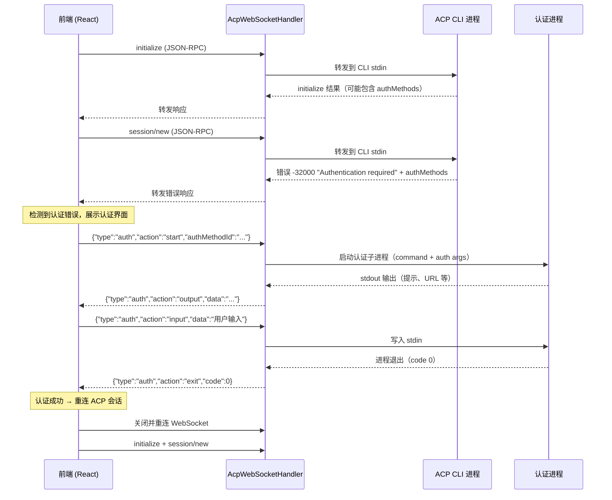
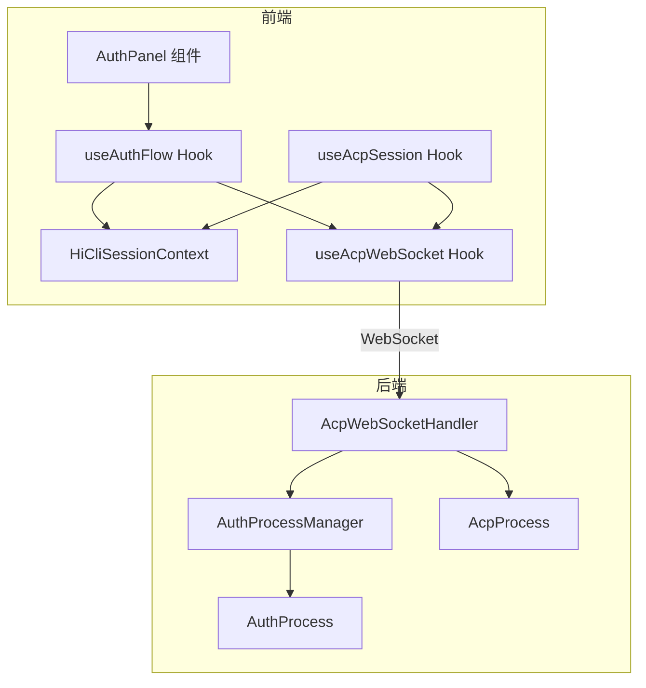
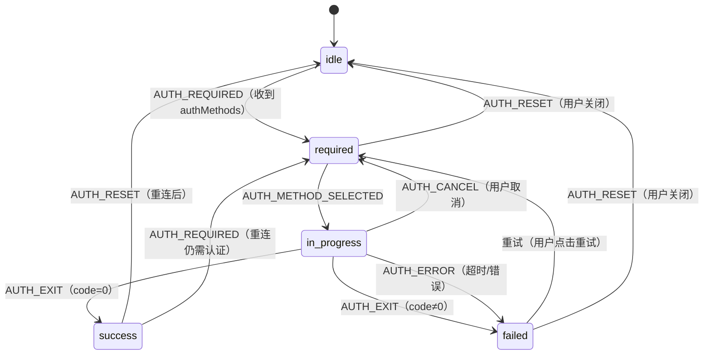

# 设计文档：CLI Agent 认证

## 概述

本设计为 HiMarket 的 HiCoding 模块实现通用的 CLI Agent 认证流程。当 CLI Agent（如 qwen-code、claude-code）在 ACP 协议交互中返回认证错误时，系统检测到认证需求，向用户展示认证界面，在后端启动隔离的认证子进程，通过 WebSocket 代理交互式终端会话，认证成功后无缝重连 ACP 会话。

架构设计与具体 Provider 无关：依赖每个 CLI Agent 声明的 `authMethods` 契约，而非硬编码特定的认证机制。当前主要对接 qwen-code，但设计支持任何在 `initialize` 响应或 `session/new` 错误中声明 `authMethods` 的 ACP 兼容 CLI。

### 关键设计决策

1. **复用现有 WebSocket 连接，通过消息类型多路复用**，而非为认证开启独立的 WebSocket。这减少了连接开销并简化了握手拦截器。认证消息通过 `type: "auth"` 信封区分。
2. **复用现有的 `AcpProcess` 模式**，创建轻量级的 `AuthProcess`，基于标准 `ProcessBuilder` 封装子进程，支持响应式 stdout/stdin 流。
3. **前端状态机**管理认证流程，集成到现有的 `HiCliSessionContext` reducer 模式中。
4. **300 秒超时**强制终止进程，符合需求规格。

## 架构



### 组件交互图



## 组件与接口

### 后端组件

#### 1. AuthProcess

用于运行 CLI 认证命令的轻量级子进程封装。类似于 `AcpProcess` 但更简单——无 JSON-RPC 帧，仅原始 stdin/stdout 字节流。

**文件位置**: `himarket-server/src/main/java/com/alibaba/himarket/service/acp/AuthProcess.java`

```java
public class AuthProcess {
    private final String command;
    private final List<String> args;
    private final String cwd;
    private final Map<String, String> env;
    private Process process;
    private OutputStream stdin;
    private volatile boolean closed;
    private final Sinks.Many<String> stdoutSink;
    private ScheduledFuture<?> timeoutFuture;

    // 构造函数：command, args 来自 AuthMethod, cwd = workspace 路径
    public AuthProcess(String command, List<String> args, String cwd, Map<String, String> env);

    public void start(ScheduledExecutorService scheduler, long timeoutSeconds);
    public void send(String input) throws IOException;  // 写入 stdin
    public Flux<String> stdout();                        // 响应式 stdout 流
    public int getExitCode();                            // 运行中返回 -1
    public boolean isAlive();
    public void close();                                 // 销毁 + 清理
}
```

**关键行为**：
- `start()` 启动进程并调度超时任务（默认 300 秒）
- stdout 逐行读取，通过 Reactor `Sinks.Many<String>` 发射
- 超时时强制终止进程，sink 以超时标记完成
- `close()` 取消超时任务、销毁进程、释放读取调度器


#### 2. AuthProcessManager

管理每个 WebSocket 会话的认证进程生命周期。确保每个会话最多一个认证进程，并处理清理工作。

**文件位置**: `himarket-server/src/main/java/com/alibaba/himarket/service/acp/AuthProcessManager.java`

```java
public class AuthProcessManager {
    private final Map<String, AuthProcess> authProcesses = new ConcurrentHashMap<>();
    private final ScheduledExecutorService scheduler;
    private static final long AUTH_TIMEOUT_SECONDS = 300;

    public AuthProcessManager();

    /**
     * 为指定会话启动认证进程。
     * @return Flux<String> stdout 行流
     */
    public Flux<String> startAuth(
        String sessionId,
        String command,
        List<String> authArgs,
        String cwd,
        Map<String, String> env
    );

    /** 将用户输入写入认证进程的 stdin */
    public void sendInput(String sessionId, String input) throws IOException;

    /** 取消/清理指定会话的认证进程 */
    public void cancelAuth(String sessionId);

    /** 清理会话的所有资源（WebSocket 断开时调用） */
    public void cleanup(String sessionId);
}
```

#### 3. AcpWebSocketHandler（修改）

扩展现有 Handler 以识别认证信封消息并委托给 `AuthProcessManager`。

**对现有类的修改**：

```java
// 新增字段
private final AuthProcessManager authProcessManager;

// 在 handleTextMessage() 中添加认证消息路由：
@Override
protected void handleTextMessage(WebSocketSession session, TextMessage message) {
    String payload = message.getPayload();

    // 检查是否为认证信封消息
    JsonNode root = objectMapper.readTree(payload);
    if (root.has("type") && "auth".equals(root.get("type").asText())) {
        handleAuthMessage(session, root);
        return;
    }

    // ... 现有 ACP JSON-RPC 转发逻辑 ...
}

private void handleAuthMessage(WebSocketSession session, JsonNode root) {
    String action = root.get("action").asText();
    String sessionId = session.getId();

    switch (action) {
        case "start" -> handleAuthStart(session, root);
        case "input" -> handleAuthInput(session, root);
        case "cancel" -> authProcessManager.cancelAuth(sessionId);
    }
}
```

**认证消息协议**（前端 → 后端）：

| 动作 | 载荷 | 描述 |
|------|------|------|
| `start` | `{"type":"auth","action":"start","authMethodId":"..."}` | 为选定方式启动认证进程 |
| `input` | `{"type":"auth","action":"input","data":"用户文本"}` | 将用户输入发送到认证进程 stdin |
| `cancel` | `{"type":"auth","action":"cancel"}` | 取消进行中的认证进程 |

**认证消息协议**（后端 → 前端）：

| 动作 | 载荷 | 描述 |
|------|------|------|
| `output` | `{"type":"auth","action":"output","data":"..."}` | 认证进程 stdout 行 |
| `exit` | `{"type":"auth","action":"exit","code":0}` | 认证进程已退出 |
| `error` | `{"type":"auth","action":"error","message":"..."}` | 认证进程错误（如超时） |

### 前端组件

#### 4. 认证状态管理

扩展 `HiCliSessionContext`，添加认证相关的状态和动作。

**`HiCliState` 中的新状态字段**：

```typescript
export type AuthFlowStatus =
  | "idle"           // 无需认证
  | "required"       // 检测到认证错误，展示方式选择
  | "in_progress"    // 认证进程运行中
  | "success"        // 认证完成，正在重连
  | "failed";        // 认证失败

export interface AuthFlowState {
  status: AuthFlowStatus;
  availableMethods: AuthMethod[];  // 来自 acp.ts（已定义）
  selectedMethodId: string | null;
  outputLines: string[];           // 认证进程的终端输出
  exitCode: number | null;
  errorMessage: string | null;
}
```

**`HiCliAction` 中的新动作**：

```typescript
| { type: "AUTH_REQUIRED"; methods: AuthMethod[] }
| { type: "AUTH_METHOD_SELECTED"; methodId: string }
| { type: "AUTH_OUTPUT"; data: string }
| { type: "AUTH_EXIT"; code: number }
| { type: "AUTH_ERROR"; message: string }
| { type: "AUTH_RESET" }
```

#### 5. useAuthFlow Hook

封装认证流程逻辑，与现有 WebSocket 连接集成。

**文件位置**: `himarket-web/himarket-frontend/src/hooks/useAuthFlow.ts`

```typescript
export function useAuthFlow() {
  const state = useHiCliState();
  const dispatch = useHiCliDispatch();

  // 检测 session/new 响应中的认证错误
  function handleSessionNewError(error: { code: number; message: string; data?: any }): boolean;

  // 为选定方式启动认证
  function startAuth(methodId: string): void;

  // 将用户输入发送到认证进程
  function sendAuthInput(input: string): void;

  // 取消认证流程
  function cancelAuth(): void;

  // 处理来自 WebSocket 的认证消息
  function handleAuthMessage(msg: { type: string; action: string; [key: string]: any }): void;

  return {
    authState: state.authFlow,
    startAuth,
    sendAuthInput,
    cancelAuth,
    handleAuthMessage,
  };
}
```

#### 6. AuthPanel 组件

认证流程的 UI 组件。

**文件位置**: `himarket-web/himarket-frontend/src/components/hicli/AuthPanel.tsx`

**行为**：
- 当 `authFlow.status === "required"` 时：展示认证方式选择卡片（仅一种方式时自动选择）
- 当 `authFlow.status === "in_progress"` 时：展示终端风格的输出面板，包含：
  - 可滚动的输出区域，使用等宽字体
  - URL 检测：将 `http://` 和 `https://` URL 渲染为可点击链接（`<a target="_blank">`）
  - 输入提示检测：显示文本输入框
  - 敏感输入检测：当输出包含 "key"、"secret"、"password"、"token" 等关键词时使用 `<input type="password">`
  - 等待输出时显示加载指示器
  - 取消按钮
- 当 `authFlow.status === "success"` 时：显示成功消息，自动触发重连
- 当 `authFlow.status === "failed"` 时：显示错误消息和重试按钮


## 数据模型

### 认证消息信封（WebSocket 协议）

认证流程复用现有的 ACP WebSocket 连接。认证消息通过顶层 `"type": "auth"` 字段与 JSON-RPC 消息区分。

```typescript
// 前端 → 后端
interface AuthStartMessage {
  type: "auth";
  action: "start";
  authMethodId: string;
}

interface AuthInputMessage {
  type: "auth";
  action: "input";
  data: string;
}

interface AuthCancelMessage {
  type: "auth";
  action: "cancel";
}

// 后端 → 前端
interface AuthOutputMessage {
  type: "auth";
  action: "output";
  data: string;  // 单行 stdout
}

interface AuthExitMessage {
  type: "auth";
  action: "exit";
  code: number;
}

interface AuthErrorMessage {
  type: "auth";
  action: "error";
  message: string;
}
```

### AuthMethod（已在 acp.ts 中定义）

```typescript
export interface AuthMethod {
  id: string;
  name: string;
  description?: string;
  type?: string;       // "terminal" | 未来类型
  args?: string[];     // 认证子进程的 CLI 参数
}
```

### 认证错误响应（来自 CLI Agent）

CLI Agent 通过 `session/new` 的 JSON-RPC 错误表示需要认证：

```json
{
  "jsonrpc": "2.0",
  "id": 2,
  "error": {
    "code": -32000,
    "message": "Authentication required",
    "data": {
      "authMethods": [
        {
          "id": "oauth-login",
          "name": "OAuth Login",
          "description": "通过浏览器 OAuth 流程登录",
          "type": "terminal",
          "args": ["auth", "login"]
        }
      ]
    }
  }
}
```

`authMethods` 也可能出现在 `initialize` 响应结果中：

```json
{
  "jsonrpc": "2.0",
  "id": 1,
  "result": {
    "protocolVersion": 1,
    "serverCapabilities": {},
    "authMethods": [...]
  }
}
```

### 前端认证状态

```typescript
interface AuthFlowState {
  status: AuthFlowStatus;
  availableMethods: AuthMethod[];
  selectedMethodId: string | null;
  outputLines: string[];
  exitCode: number | null;
  errorMessage: string | null;
}

// 初始状态
const initialAuthFlowState: AuthFlowState = {
  status: "idle",
  availableMethods: [],
  selectedMethodId: null,
  outputLines: [],
  exitCode: null,
  errorMessage: null,
};
```

### 后端认证进程状态

由 `AuthProcessManager` 通过 `ConcurrentHashMap<String, AuthProcess>` 内部管理。每个条目以 WebSocket 会话 ID 为键。无需持久化存储——认证状态是临时的，与 WebSocket 连接生命周期绑定。

### 认证进程环境

启动认证子进程时，环境配置如下：

```java
Map<String, String> processEnv = new HashMap<>(providerConfig.getEnv());
if (providerConfig.isIsolateHome()) {
    processEnv.put("HOME", workspacePath);  // 与 ACP 主进程一致
}
```

这确保凭证写入用户的隔离工作目录（`~/.himarket/workspaces/{userId}/`），与 ACP 主进程保持一致。

## 正确性属性

*属性是在系统所有有效执行中都应成立的特征或行为——本质上是关于系统应该做什么的形式化陈述。属性是人类可读规格与机器可验证正确性保证之间的桥梁。*

### 属性 1：AuthMethods 解析往返一致性

*对于任意*包含 `authMethods` 数组的有效 ACP 响应（无论在 `initialize` 结果还是 `session/new` 错误的 `data` 字段中），解析器应提取出与原始输入数组结构等价的 `AuthMethod[]`——保留每个条目的 id、name、description、type 和 args。

**验证：需求 1.1, 1.2**

### 属性 2：认证错误阻止会话重试

*对于任意*收到 `session/new` 错误码 `-32000` 的 ACP 会话，在认证流程完成或取消之前，不应自动重发 `session/new`。

**验证：需求 1.3**

### 属性 3：认证方式展示完整性

*对于任意*非空的 `AuthMethod[]` 数组，渲染的认证选择界面应包含数组中每个方式的 `name` 和 `description`。

**验证：需求 2.1**

### 属性 4：认证类型路由正确性

*对于任意* `type === "terminal"` 的 `AuthMethod`，选择它应触发基于子进程的认证流程。*对于任意*类型非 `"terminal"` 的 `AuthMethod`，选择它不应启动子进程。

**验证：需求 2.2, 3.7**

### 属性 5：取消认证恢复选择状态

*对于任意*处于 `"in_progress"` 状态的认证流程，调用取消应将状态转换为 `"required"`，保留原始 `availableMethods`，并将 `selectedMethodId` 重置为 null。

**验证：需求 2.4**

### 属性 6：认证进程环境隔离

*对于任意*给定 userId 的用户，当启动认证子进程时，`HOME` 环境变量应等于用户的工作空间路径（`{workspaceRoot}/{sanitizedUserId}`），与 ACP 主进程环境一致。

**验证：需求 3.2**

### 属性 7：认证 stdout 转发完整性

*对于任意*认证子进程 stdout 发出的行，前端应收到包含该行原始内容的认证输出消息，不做修改。

**验证：需求 3.3, 4.4**

### 属性 8：认证 stdin 转发完整性

*对于任意*前端通过认证输入消息发送的用户输入字符串，认证子进程应在其 stdin 上收到完全相同的字符串。

**验证：需求 3.4**

### 属性 9：认证退出码决定结果

*对于任意*认证进程退出，若退出码为 0，前端认证状态应转换为 `"success"` 并触发 WebSocket 重连。若退出码非零，前端认证状态应转换为 `"failed"` 并提供重试选项。

**验证：需求 5.1, 5.4**

### 属性 10：认证输出中的 URL 检测

*对于任意*包含匹配 `https?://[^\s]+` 子串的认证输出字符串，渲染输出应包含带 `target="_blank"` 的可点击超链接元素。

**验证：需求 4.1**

### 属性 11：敏感输入遮蔽

*对于任意*在输入提示上下文中包含 "key"、"secret"、"password" 或 "token" 关键词（不区分大小写）的认证输出字符串，输入框应使用 `type="password"` 遮蔽用户输入。

**验证：需求 4.3**

### 属性 12：Provider 认证状态独立性

*对于任意*两个不同的 CLI Provider，完成或失败一个 Provider 的认证不应影响另一个 Provider 的认证状态。

**验证：需求 6.3**


## 错误处理

### 后端错误场景

| 场景 | 处理方式 | 需求 |
|------|----------|------|
| 认证进程启动失败（命令未找到、权限拒绝） | 向前端发送 `{"type":"auth","action":"error","message":"..."}` | 3.1 |
| 认证进程超时（>300秒） | 强制终止进程，发送 `{"type":"auth","action":"error","message":"认证超时"}` | 3.6 |
| 认证期间 WebSocket 断开 | `AuthProcessManager.cleanup(sessionId)` 终止认证进程 | 3.5 |
| 认证进程 stdin 写入失败 | 记录错误，向前端发送错误消息 | 3.4 |
| 前端发送的认证消息格式无效 | 记录警告，忽略消息 | — |
| AuthMethod 类型未知 | 发送错误消息：不支持的认证类型 | 3.7 |

### 前端错误场景

| 场景 | 处理方式 | 需求 |
|------|----------|------|
| 错误响应中 `authMethods` 缺失或为空 | 显示通用错误提示，不展示认证界面 | 1.4 |
| 认证进程以非零退出码退出 | 显示"认证失败"及重试按钮 | 5.4 |
| 认证后重连仍然失败 | 重新展示认证界面并提示"认证可能未成功" | 5.3 |
| 认证流程中 WebSocket 断开 | 重置认证状态，显示连接错误 | — |
| 认证输出消息解析失败 | 记录错误，跳过该消息 | — |

### 状态机转换



## 测试策略

### 基于属性的测试

**测试库**：后端 Java 使用 [jqwik](https://jqwik.net/)，前端 TypeScript 使用 [fast-check](https://github.com/dubzzz/fast-check)。

设计文档中的每个正确性属性应实现为单个基于属性的测试，最少 100 次迭代。

**测试标签格式**：`Feature: cli-agent-auth, Property {N}: {title}`

**后端属性测试**（Java + jqwik）：
- 属性 1：生成随机 `AuthMethod[]` 数组，序列化为 JSON-RPC 错误/initialize 响应，解析并验证结构等价性
- 属性 2：状态机测试——生成事件序列，验证认证错误后不自动重试
- 属性 4：生成随机类型的 `AuthMethod` 对象，验证仅 `"terminal"` 触发子进程
- 属性 6：生成随机 userId，验证 HOME 环境变量匹配工作空间路径
- 属性 7：生成随机 stdout 行，验证通过 `AuthProcess` → WebSocket 消息的转发完整性
- 属性 8：生成随机输入字符串，验证 stdin 转发完整性

**前端属性测试**（TypeScript + fast-check）：
- 属性 3：生成随机 `AuthMethod[]` 数组，验证渲染输出包含所有 name/description
- 属性 5：生成处于 `"in_progress"` 的随机认证状态，验证取消转换正确
- 属性 9：生成随机退出码，验证状态转换
- 属性 10：生成包含/不包含 URL 的随机字符串，验证链接检测
- 属性 11：生成包含/不包含敏感关键词的随机字符串，验证密码输入使用
- 属性 12：生成 Provider 状态对，验证独立性

### 单元测试

单元测试作为属性测试的补充，覆盖特定示例和边界情况：

- **边界情况**：`authMethods` 为 `null`、`undefined` 或空数组 → 显示通用错误（需求 1.4）
- **边界情况**：仅一种认证方式 → 自动选择（需求 2.5）
- **边界情况**：认证进程恰好在 300 秒超时（需求 3.6）
- **示例**：解析特定的 qwen-code 认证错误响应
- **示例**：认证成功后的重连流程（需求 5.2）
- **示例**：重连后认证仍然失败的流程（需求 5.3）
- **集成测试**：从错误检测 → 方式选择 → 进程启动 → 输出 → 退出 → 重连的完整认证流程