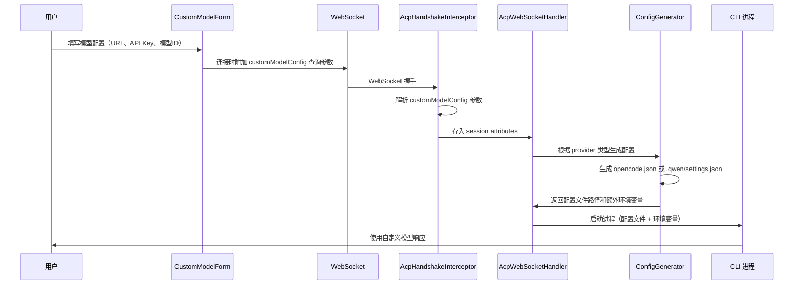
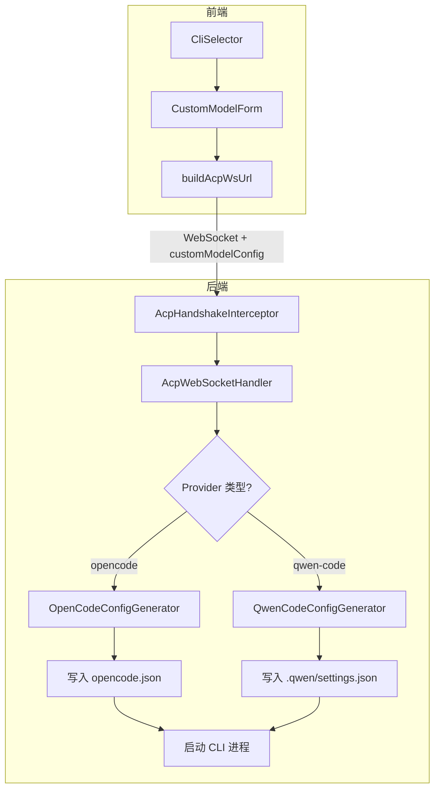

# 设计文档：CLI 自定义模型配置

## 概述

本功能为 HiCli 模块中的 Open Code 和 Qwen Code 两个 CLI 工具提供自定义模型配置能力。用户可以在前端 UI 中输入自定义 LLM 服务的接入点 URL 和 API Key，系统在启动 CLI 进程时自动生成对应工具的配置文件并注入环境变量，实现无感知的模型切换。

核心设计思路：
- 前端通过 WebSocket URL 查询参数将自定义模型配置传递给后端
- 后端在 CLI 进程启动前，根据 CLI 工具类型调用对应的配置生成器生成配置文件
- 配置文件写入 CLI 进程的工作目录，API Key 通过环境变量注入
- 整个流程对用户透明，不破坏已有功能

## 架构





## 组件与接口

### 1. CustomModelConfig 数据模型（后端）

```java
public class CustomModelConfig {
    private String baseUrl;       // 模型接入点 URL
    private String apiKey;        // API Key
    private String modelId;       // 模型 ID
    private String modelName;     // 模型显示名称
    private String protocolType;  // 协议类型: openai | anthropic | gemini，默认 openai
}
```

### 2. ConfigGenerator 接口（后端）

```java
public interface CliConfigGenerator {
    /** 该生成器支持的 provider key */
    String supportedProvider();
    
    /** 生成配置文件并返回需要注入的额外环境变量 */
    Map<String, String> generateConfig(String workingDirectory, CustomModelConfig config) throws IOException;
}
```

### 3. OpenCodeConfigGenerator

生成 `opencode.json` 文件到工作目录：

```java
public class OpenCodeConfigGenerator implements CliConfigGenerator {
    @Override
    public String supportedProvider() { return "opencode"; }
    
    @Override
    public Map<String, String> generateConfig(String workingDirectory, CustomModelConfig config) {
        // 1. 读取已有 opencode.json（如存在）
        // 2. 合并自定义 provider 配置
        // 3. 写入 opencode.json
        // 4. 返回 {"CUSTOM_MODEL_API_KEY": config.apiKey}
    }
}
```

生成的 `opencode.json` 格式：
```json
{
  "provider": {
    "custom-provider": {
      "npm": "@ai-sdk/openai-compatible",
      "name": "用户自定义模型",
      "options": {
        "baseURL": "https://api.example.com/v1",
        "apiKey": "{env:CUSTOM_MODEL_API_KEY}"
      },
      "models": {
        "user-model-id": {
          "name": "用户模型名称"
        }
      }
    }
  },
  "model": "custom-provider/user-model-id"
}
```

### 4. QwenCodeConfigGenerator

生成 `.qwen/settings.json` 文件到工作目录下的 `.qwen/` 子目录：

```java
public class QwenCodeConfigGenerator implements CliConfigGenerator {
    @Override
    public String supportedProvider() { return "qwen-code"; }
    
    @Override
    public Map<String, String> generateConfig(String workingDirectory, CustomModelConfig config) {
        // 1. 创建 .qwen/ 目录
        // 2. 读取已有 settings.json（如存在）
        // 3. 合并自定义 modelProviders 配置
        // 4. 写入 .qwen/settings.json
        // 5. 返回对应的环境变量 map
    }
}
```

生成的 `.qwen/settings.json` 格式：
```json
{
  "modelProviders": {
    "openai": [
      {
        "id": "user-model-id",
        "name": "用户模型名称",
        "envKey": "OPENAI_API_KEY",
        "baseUrl": "https://api.example.com/v1"
      }
    ]
  },
  "env": {
    "OPENAI_API_KEY": "sk-..."
  }
}
```

### 5. CliProviderConfig 扩展

在已有的 `CliProviderConfig` 中新增字段：

```java
// AcpProperties.CliProviderConfig 中新增
private boolean supportsCustomModel = false;
```

### 6. CliProviderInfo 扩展

在 `CliProviderController.CliProviderInfo` record 中新增字段：

```java
public record CliProviderInfo(
    String key,
    String displayName,
    boolean isDefault,
    boolean available,
    String runtimeCategory,
    List<RuntimeType> compatibleRuntimes,
    String containerImage,
    boolean supportsCustomModel  // 新增
) {}
```

### 7. AcpHandshakeInterceptor 扩展

在 WebSocket 握手时解析 `customModelConfig` 查询参数：

```java
// 在 beforeHandshake 方法中新增
String customModelConfigJson = params.getFirst("customModelConfig");
if (StrUtil.isNotBlank(customModelConfigJson)) {
    try {
        CustomModelConfig customModelConfig = 
            objectMapper.readValue(customModelConfigJson, CustomModelConfig.class);
        attributes.put("customModelConfig", customModelConfig);
    } catch (Exception e) {
        logger.warn("Failed to parse customModelConfig: {}", e.getMessage());
        // 忽略，按现有逻辑继续
    }
}
```

### 8. AcpWebSocketHandler 集成

在 `afterConnectionEstablished` 中，CLI 进程启动前调用配置生成器：

```java
// 从 session attributes 获取自定义模型配置
CustomModelConfig customModelConfig = 
    (CustomModelConfig) session.getAttributes().get("customModelConfig");

if (customModelConfig != null) {
    CliConfigGenerator generator = configGeneratorRegistry.get(providerKey);
    if (generator != null) {
        Map<String, String> extraEnv = generator.generateConfig(cwd, customModelConfig);
        processEnv.putAll(extraEnv);
    }
}
```

### 9. 前端 CustomModelForm 组件

```typescript
interface CustomModelFormData {
  baseUrl: string;
  apiKey: string;
  modelId: string;
  modelName: string;
  protocolType: 'openai' | 'anthropic' | 'gemini';
}
```

### 10. 前端 ICliProvider 接口扩展

```typescript
export interface ICliProvider {
  key: string;
  displayName: string;
  isDefault: boolean;
  available: boolean;
  compatibleRuntimes?: RuntimeType[];
  runtimeCategory?: 'native' | 'nodejs' | 'python';
  containerImage?: string;
  supportsCustomModel?: boolean;  // 新增
}
```

### 11. WebSocket URL 扩展

在 `WsUrlParams` 中新增 `customModelConfig` 参数：

```typescript
export interface WsUrlParams {
  provider?: string;
  runtime?: string;
  token?: string;
  sandboxMode?: string;
  customModelConfig?: string;  // JSON 序列化的自定义模型配置
}
```

## 数据模型

### CustomModelConfig

| 字段 | 类型 | 必填 | 默认值 | 说明 |
|------|------|------|--------|------|
| baseUrl | String | 是 | - | 模型接入点 URL，需符合 URL 格式 |
| apiKey | String | 是 | - | API Key 凭证 |
| modelId | String | 是 | - | 模型标识符 |
| modelName | String | 否 | 与 modelId 相同 | 模型显示名称 |
| protocolType | String | 否 | "openai" | 协议类型：openai、anthropic、gemini |

### 校验规则

- `baseUrl`：非空，必须是合法的 URL 格式（以 http:// 或 https:// 开头）
- `apiKey`：非空
- `modelId`：非空
- `protocolType`：必须是 openai、anthropic、gemini 之一，默认 openai

### Open Code 配置文件结构

```json
{
  "provider": {
    "custom-provider": {
      "npm": "@ai-sdk/openai-compatible",
      "name": "<modelName>",
      "options": {
        "baseURL": "<baseUrl>",
        "apiKey": "{env:CUSTOM_MODEL_API_KEY}"
      },
      "models": {
        "<modelId>": {
          "name": "<modelName>"
        }
      }
    }
  },
  "model": "custom-provider/<modelId>"
}
```

### Qwen Code 配置文件结构

```json
{
  "modelProviders": {
    "<protocolType>": [
      {
        "id": "<modelId>",
        "name": "<modelName>",
        "envKey": "<ENV_KEY_BY_PROTOCOL>",
        "baseUrl": "<baseUrl>"
      }
    ]
  },
  "env": {
    "<ENV_KEY_BY_PROTOCOL>": "<apiKey>"
  }
}
```

协议类型到环境变量的映射：
- `openai` → `OPENAI_API_KEY`
- `anthropic` → `ANTHROPIC_API_KEY`
- `gemini` → `GOOGLE_API_KEY`


## 正确性属性

*正确性属性是一种在系统所有合法执行中都应成立的特征或行为——本质上是关于系统应该做什么的形式化陈述。属性是人类可读规范与机器可验证正确性保证之间的桥梁。*

### Property 1: CustomModelConfig 序列化往返一致性

*对于任意*合法的 CustomModelConfig 对象，将其序列化为 JSON 字符串再反序列化，应产生与原始对象等价的 CustomModelConfig。

**Validates: Requirements 8.2, 6.1, 6.2**

### Property 2: 非法 CustomModelConfig 校验拒绝

*对于任意*包含非法字段的 CustomModelConfig（baseUrl 为空或格式不合法、apiKey 为空、modelId 为空、protocolType 不在允许范围内），校验器应拒绝该配置并返回对应的错误信息。

**Validates: Requirements 1.2, 1.3, 1.4**

### Property 3: OpenCode 配置生成正确性

*对于任意*合法的 CustomModelConfig，OpenCodeConfigGenerator 生成的 JSON 应满足：1) `provider.custom-provider.npm` 等于 `@ai-sdk/openai-compatible`；2) `provider.custom-provider.options.baseURL` 等于输入的 baseUrl；3) `provider.custom-provider.options.apiKey` 等于 `{env:CUSTOM_MODEL_API_KEY}`；4) `model` 等于 `custom-provider/<modelId>`；5) 返回的环境变量 map 包含 `CUSTOM_MODEL_API_KEY` 且值等于输入的 apiKey。

**Validates: Requirements 2.1, 2.2, 2.5, 4.2**

### Property 4: OpenCode 配置合并保留已有配置

*对于任意*已有的合法 opencode.json 配置和任意合法的 CustomModelConfig，合并后的配置应同时包含原有的所有 provider 条目和新增的 custom-provider 条目。

**Validates: Requirements 2.4, 8.3**

### Property 5: QwenCode 配置生成正确性

*对于任意*合法的 CustomModelConfig，QwenCodeConfigGenerator 生成的 JSON 应满足：1) `modelProviders` 中包含与 protocolType 对应的 provider key；2) 该 provider 下包含 modelId 和 baseUrl 与输入一致的条目；3) `env` 字段包含与 protocolType 对应的环境变量 key，值等于输入的 apiKey。

**Validates: Requirements 3.1, 3.2, 3.5, 4.2**

### Property 6: QwenCode 配置合并保留已有配置

*对于任意*已有的合法 .qwen/settings.json 配置和任意合法的 CustomModelConfig，合并后的配置应保留原有的所有 modelProviders 条目，并新增自定义模型条目。

**Validates: Requirements 3.4, 8.3**

## 错误处理

| 场景 | 处理方式 | 相关需求 |
|------|----------|----------|
| customModelConfig JSON 格式不合法 | 记录警告日志，忽略参数，按现有逻辑继续 | 6.4 |
| CustomModelConfig 校验失败（字段缺失/格式错误） | 拒绝配置，返回具体错误信息 | 1.2, 1.3, 1.4 |
| 已有配置文件不是合法 JSON | 记录警告日志，使用全新配置覆盖 | 8.4 |
| 配置文件写入失败（权限/磁盘空间） | 抛出 IOException，由上层处理 | 2.3, 3.3 |
| CLI 进程启动失败 | 清理已生成的配置文件，关闭 WebSocket 连接 | 4.5 |
| 用户未提供 customModelConfig | 跳过配置生成，按现有逻辑启动 | 4.3, 6.3 |
| 不支持自定义模型的 CLI 工具收到配置 | 忽略配置，正常启动 | 7.3 |

## 测试策略

### 属性测试（Property-Based Testing）

后端使用 **jqwik**（已在项目中配置），前端使用 **fast-check**（已在项目中配置）。

每个属性测试至少运行 100 次迭代，使用随机生成的输入数据。

| 属性 | 测试位置 | 框架 |
|------|----------|------|
| Property 1: 序列化往返一致性 | 后端 Java 测试 | jqwik |
| Property 2: 非法配置校验拒绝 | 后端 Java 测试 | jqwik |
| Property 3: OpenCode 配置生成正确性 | 后端 Java 测试 | jqwik |
| Property 4: OpenCode 配置合并保留已有配置 | 后端 Java 测试 | jqwik |
| Property 5: QwenCode 配置生成正确性 | 后端 Java 测试 | jqwik |
| Property 6: QwenCode 配置合并保留已有配置 | 后端 Java 测试 | jqwik |

每个属性测试必须包含注释引用设计文档中的属性编号：
```java
// Feature: cli-custom-model-config, Property 1: CustomModelConfig 序列化往返一致性
```

### 单元测试

单元测试覆盖具体示例、边界条件和错误处理：

- CustomModelConfig 默认值（protocolType 默认为 openai）
- AcpHandshakeInterceptor 解析 customModelConfig 参数（正常、缺失、非法 JSON）
- CliProviderController 响应包含 supportsCustomModel 字段
- 前端 CustomModelForm 组件渲染（开关显示/隐藏、密码输入框类型、表单校验）
- CLI 进程启动失败时的配置文件清理
- 无 customModelConfig 时的向后兼容性

### 集成测试

- 完整流程：前端配置 → WebSocket 传递 → 后端生成配置 → CLI 进程启动
- application.yml 中 Open Code 和 Qwen Code 的 supportsCustomModel 配置验证
