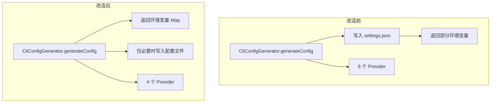
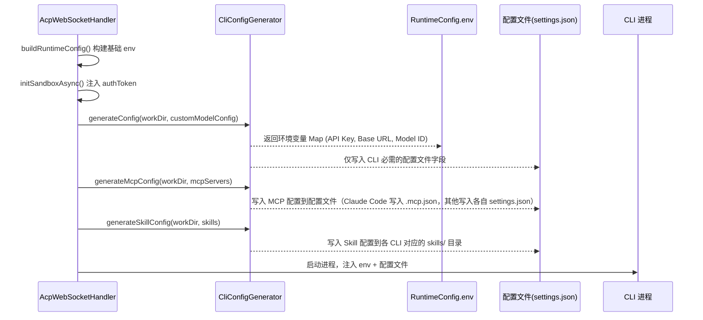

# 设计文档：CLI 配置注入机制统一重构

## 概述

HiMarket 平台当前支持 6 个 CLI Provider，其中 Kiro CLI 和 Codex CLI 已不再维护，需要移除。同时，现有的认证和模型配置注入方式不统一：部分 CLI 工具（如 Qwen Code）将认证信息和模型配置写入 settings.json 配置文件，而更优的做法是通过环境变量注入到 CLI 进程。

本次重构的核心目标：
1. 移除 Kiro CLI 和 Codex CLI 的 provider 配置及相关代码
2. 认证信息（API Key、Token）统一通过环境变量注入
3. 模型配置（baseUrl、modelId）尽可能通过环境变量注入，减少 settings.json 写入
4. Claude Code 新增自定义模型支持（通过环境变量）
5. Claude Code MCP 配置从 `.claude/settings.json` 迁移到 `.mcp.json`（与官方推荐一致）
6. Claude Code 和 QoderCli 新增 Skills 配置注入支持

## 架构

### 改造前后对比



### 配置注入流程



## 组件与接口

### 组件 1：CliConfigGenerator 接口（保持不变）

```java
public interface CliConfigGenerator {
    String supportedProvider();
    Map<String, String> generateConfig(String workingDirectory, CustomModelConfig config) throws IOException;
    default void generateMcpConfig(String workingDirectory, List<McpServerEntry> mcpServers) throws IOException {}
    default void generateSkillConfig(String workingDirectory, List<SkillEntry> skills) throws IOException {}
}
```

接口本身不变，改造集中在各实现类的 `generateConfig()` 方法内部逻辑。

### 组件 2：ClaudeCodeConfigGenerator（重点改造）

改造前：`generateConfig()` 返回空 Map，不支持自定义模型。MCP 配置写入 `.claude/settings.json`。未实现 Skills 配置。

改造后：
- 自定义模型：通过环境变量注入认证和模型配置
- MCP 配置：从 `.claude/settings.json` 迁移到 `.mcp.json`（官方推荐路径）
- Skills 配置：新增 `generateSkillConfig()`，写入 `.claude/skills/{name}/SKILL.md`

```java
// 改造后的 generateConfig 返回的环境变量
Map<String, String> envVars = new HashMap<>();
envVars.put("ANTHROPIC_API_KEY", config.getApiKey());
envVars.put("ANTHROPIC_BASE_URL", config.getBaseUrl());
envVars.put("ANTHROPIC_MODEL", config.getModelId());
return envVars;
```

同时在 `.claude/settings.json` 中写入 `env` 字段声明环境变量（Claude Code 的 settings.json 支持 `env` 字段作为声明式环境变量注入）：

```json
{
  "env": {
    "ANTHROPIC_API_KEY": "<apiKey>",
    "ANTHROPIC_BASE_URL": "<baseUrl>",
    "ANTHROPIC_MODEL": "<modelId>"
  },
  "model": "<modelId>"
}
```

application.yml 中需新增 `supports-custom-model: true`。

### 组件 3：QwenCodeConfigGenerator（优化改造）

改造前：将 `modelProviders`、`env`、`security.auth`、`model.name`、`tools.approvalMode` 全部写入 settings.json，同时返回协议对应的环境变量。

改造后：
- 认证信息（API Key）：通过环境变量注入（已有，保持不变）
- 模型配置（baseUrl、modelId）：仍需写入 `modelProviders`（Qwen Code 的环境变量 `OPENAI_BASE_URL`/`OPENAI_MODEL` 仅对默认 provider 生效，自定义 provider 必须通过 modelProviders 声明）
- `security.auth.selectedType`、`model.name`、`tools.approvalMode`：保留写入 settings.json（无对应环境变量）

实际上 Qwen Code 的改造幅度较小，因为其 modelProviders 注册机制本身就需要配置文件。主要优化点是确保 API Key 只通过环境变量传递，不再写入 settings.json 的 `env` 字段。

```java
// 改造后：不再写入 env 字段到 settings.json
// 移除: root.put("env", env);
// 保留: modelProviders、security.auth、model.name、tools.approvalMode
```

### 组件 4：OpenCodeConfigGenerator（优化改造）

改造前：将 provider 注册信息写入 opencode.json，API Key 通过 `{env:CUSTOM_MODEL_API_KEY}` 引用环境变量。

改造后：
- provider 注册仍需 opencode.json（OpenCode 不支持纯环境变量注册 provider）
- API Key 继续通过 `CUSTOM_MODEL_API_KEY` 环境变量注入（已有，保持不变）
- opencode.json 中的 `apiKey` 字段继续使用 `{env:CUSTOM_MODEL_API_KEY}` 引用语法

OpenCode 的改造幅度最小，当前实现已经是环境变量优先的模式。

### 组件 5：QoderCliConfigGenerator（小幅改造）

QoderCli 不支持自定义模型，认证通过 `QODER_PERSONAL_ACCESS_TOKEN` 环境变量注入（已在 `initSandboxAsync` 中通过 `authEnvVar` 机制实现）。

改造点：新增 `generateSkillConfig()`，写入 `.qoder/skills/{name}/SKILL.md`。逻辑与 QwenCodeConfigGenerator 的 Skills 实现一致。

## 数据模型

### application.yml providers 配置（改造后）

```yaml
acp:
  providers:
    # 移除: kiro-cli
    # 移除: codex
    qodercli:
      display-name: Qoder CLI
      command: ${ACP_CLI_COMMAND_QODERCLI:qodercli}
      args: ${ACP_CLI_ARGS_QODERCLI:--acp}
      runtime-category: native
      compatible-runtimes: LOCAL,K8S
      container-image: ${ACP_SANDBOX_IMAGE:...}
      auth-options: default,personal_access_token
      auth-env-var: QODER_PERSONAL_ACCESS_TOKEN
    claude-code:
      display-name: Claude Code
      command: ${ACP_CLI_COMMAND_CLAUDE:npx}
      args: ${ACP_CLI_ARGS_CLAUDE:@zed-industries/claude-code-acp}
      runtime-category: nodejs
      compatible-runtimes: LOCAL,K8S
      auth-env-var: ANTHROPIC_API_KEY
      supports-custom-model: true    # 新增
      supports-mcp: true             # 新增
      supports-skill: true           # 新增
    qwen-code:
      # ... 保持不变
    opencode:
      # ... 保持不变
```

### 各 CLI 环境变量注入对照表

| CLI 工具 | 认证环境变量 | 模型环境变量 | MCP 配置文件 | Skills 配置目录 | 仍需配置文件的字段 |
|---------|------------|------------|------------|--------------|----------------|
| QoderCli | `QODER_PERSONAL_ACCESS_TOKEN` (via authEnvVar) | 不支持自定义模型 | `.qoder/settings.json` → `mcpServers` | `.qoder/skills/{name}/SKILL.md` | MCP, Skills |
| Claude Code | `ANTHROPIC_API_KEY` (via authEnvVar + generateConfig) | `ANTHROPIC_BASE_URL`, `ANTHROPIC_MODEL` | `.mcp.json` → `mcpServers`（改造后） | `.claude/skills/{name}/SKILL.md`（新增） | MCP, Skills, `env`+`model` in settings.json |
| Qwen Code | 协议对应 Key (via generateConfig) | N/A (需 modelProviders) | `.qwen/settings.json` → `mcpServers` | `.qwen/skills/{name}/SKILL.md` | `modelProviders`, `security.auth`, `model.name`, `tools.approvalMode`, MCP, Skills |
| OpenCode | `CUSTOM_MODEL_API_KEY` (via generateConfig) | N/A (需 opencode.json provider) | `opencode.json` → `mcp` | `.opencode/skills/{name}/SKILL.md` | `provider` 注册, `model`, MCP, Skills |


## 关键函数与形式化规约

### 函数 1：ClaudeCodeConfigGenerator.generateConfig()

```java
Map<String, String> generateConfig(String workingDirectory, CustomModelConfig config) throws IOException
```

**前置条件：**
- `workingDirectory` 非空，目录可写
- `config` 非 null，且 `config.validate()` 返回空列表
- `config.getApiKey()` 非空
- `config.getBaseUrl()` 以 `http://` 或 `https://` 开头
- `config.getModelId()` 非空

**后置条件：**
- 返回的 Map 包含 `ANTHROPIC_API_KEY`、`ANTHROPIC_BASE_URL`、`ANTHROPIC_MODEL` 三个键
- `{workingDirectory}/.claude/settings.json` 文件已创建或更新
- settings.json 中包含 `env` 字段（声明式环境变量）和 `model` 字段
- 如果已有 settings.json，保留其他字段（如 mcpServers）不被覆盖

**循环不变量：** 无循环

### 函数 2：QwenCodeConfigGenerator.generateConfig()（改造后）

```java
Map<String, String> generateConfig(String workingDirectory, CustomModelConfig config) throws IOException
```

**前置条件：**
- 同上

**后置条件：**
- 返回的 Map 包含协议对应的 API Key 环境变量（`OPENAI_API_KEY` / `ANTHROPIC_API_KEY` / `GOOGLE_API_KEY`）
- settings.json 中包含 `modelProviders`、`security.auth`、`model.name`、`tools.approvalMode`
- settings.json 中不再包含 `env` 字段（API Key 不再写入配置文件）
- 已有 settings.json 的其他字段保持不变

### 函数 3：移除 Kiro CLI / Codex CLI

**前置条件：**
- application.yml 中存在 `kiro-cli` 和 `codex` provider 配置
- K8s `allowed-commands` 中包含 `kiro-cli`

**后置条件：**
- application.yml 中不再包含 `kiro-cli` 和 `codex` provider 配置
- K8s `allowed-commands` 中不再包含 `kiro-cli`
- 无编译错误，所有引用已清理

## 算法伪代码

### ClaudeCodeConfigGenerator.generateConfig 改造算法

```pascal
ALGORITHM generateConfig(workingDirectory, config)
INPUT: workingDirectory: String, config: CustomModelConfig
OUTPUT: envVars: Map<String, String>

BEGIN
  // Step 1: 构建环境变量 Map
  envVars ← new HashMap()
  envVars.put("ANTHROPIC_API_KEY", config.apiKey)
  envVars.put("ANTHROPIC_BASE_URL", config.baseUrl)
  envVars.put("ANTHROPIC_MODEL", config.modelId)

  // Step 2: 创建 .claude 目录
  claudeDir ← Path.of(workingDirectory, ".claude")
  Files.createDirectories(claudeDir)

  // Step 3: 读取已有 settings.json（保留 mcpServers 等字段）
  configPath ← claudeDir.resolve("settings.json")
  root ← readExistingConfig(configPath)

  // Step 4: 合并 env 字段（声明式环境变量）
  envSection ← root.getOrDefault("env", new LinkedHashMap())
  envSection.put("ANTHROPIC_API_KEY", config.apiKey)
  envSection.put("ANTHROPIC_BASE_URL", config.baseUrl)
  envSection.put("ANTHROPIC_MODEL", config.modelId)
  root.put("env", envSection)

  // Step 5: 设置 model 字段
  root.put("model", config.modelId)

  // Step 6: 写入 settings.json
  writeConfig(configPath, root)

  RETURN envVars
END
```

### QwenCodeConfigGenerator.mergeCustomModelProvider 改造算法

```pascal
ALGORITHM mergeCustomModelProvider(root, config)
INPUT: root: Map<String, Object>, config: CustomModelConfig
OUTPUT: 修改 root（原地操作）

BEGIN
  protocolType ← config.protocolType
  envKey ← getEnvKeyForProtocol(protocolType)
  modelName ← IF config.modelName IS NOT BLANK THEN config.modelName ELSE config.modelId

  // Step 1: 构建 modelProviders（保持不变）
  modelEntry ← {id: config.modelId, name: modelName, envKey: envKey, baseUrl: config.baseUrl}
  // ... 合并到 root.modelProviders（逻辑不变）

  // Step 2: 移除 env 字段写入（改造点）
  // 改造前: root.put("env", {envKey: config.apiKey})
  // 改造后: 不再写入 env 字段，API Key 通过进程环境变量注入

  // Step 3: 保留 security.auth、model.name、tools.approvalMode（不变）
  // 这些字段没有对应的环境变量，必须通过配置文件设置
  root.security.auth.selectedType ← protocolType
  root.model.name ← config.modelId
  root.tools.approvalMode ← "yolo"
END
```

## 示例用法

### 场景 1：Claude Code 自定义模型（改造后新增能力）

```java
// 用户通过前端配置自定义模型
CustomModelConfig config = new CustomModelConfig();
config.setBaseUrl("https://my-proxy.example.com/v1");
config.setApiKey("sk-xxx");
config.setModelId("claude-sonnet-4-20250514");
config.setProtocolType("anthropic");

// generateConfig 返回环境变量
ClaudeCodeConfigGenerator generator = new ClaudeCodeConfigGenerator(objectMapper);
Map<String, String> envVars = generator.generateConfig("/workspace", config);
// envVars = {
//   "ANTHROPIC_API_KEY": "sk-xxx",
//   "ANTHROPIC_BASE_URL": "https://my-proxy.example.com/v1",
//   "ANTHROPIC_MODEL": "claude-sonnet-4-20250514"
// }

// 同时 /workspace/.claude/settings.json 被写入：
// {
//   "env": {
//     "ANTHROPIC_API_KEY": "sk-xxx",
//     "ANTHROPIC_BASE_URL": "https://my-proxy.example.com/v1",
//     "ANTHROPIC_MODEL": "claude-sonnet-4-20250514"
//   },
//   "model": "claude-sonnet-4-20250514"
// }
```

### 场景 2：Qwen Code 自定义模型（改造后）

```java
// generateConfig 返回环境变量（不变）
Map<String, String> envVars = qwenGenerator.generateConfig("/workspace", config);
// envVars = {"OPENAI_API_KEY": "sk-xxx"}

// /workspace/.qwen/settings.json 不再包含 env 字段：
// {
//   "modelProviders": { "openai": [{ "id": "gpt-4o", "name": "GPT-4o", ... }] },
//   "security": { "auth": { "selectedType": "openai" } },
//   "model": { "name": "gpt-4o" },
//   "tools": { "approvalMode": "yolo" }
// }
// 注意：没有 "env" 字段了
```

## MCP 配置注入对照表

| CLI 工具 | MCP 配置文件路径 | MCP 字段名 | Transport 类型 | 远程 Server 格式 | 当前代码实现 |
|---------|---------------|-----------|--------------|----------------|-----------|
| QoderCli | `.qoder/settings.json` | `mcpServers` | stdio/sse/streamable-http | `{"url":..., "type":..., "headers":...}` | ✅ 已实现，格式正确 |
| Claude Code | `.mcp.json`（项目级推荐）或 `~/.claude.json`（本地级） | `mcpServers` | stdio/sse/http | `{"type": "http", "url":..., "headers":...}` | ⚠️ 当前写入 `.claude/settings.json`，建议改为 `.mcp.json` |
| Qwen Code | `.qwen/settings.json` | `mcpServers` | stdio/sse/http | `{"url":..., "type":..., "headers":...}` | ✅ 已实现，格式正确 |
| OpenCode | `opencode.json` | `mcp` | local/remote | `{"type": "remote", "url":..., "headers":..., "enabled": true}` | ✅ 已实现，格式正确 |

### Claude Code MCP 配置路径修正

当前代码将 MCP 配置写入 `.claude/settings.json` 的 `mcpServers` 字段。根据 [Claude Code 官方文档](https://docs.anthropic.com/en/docs/claude-code/mcp)，项目级 MCP 配置推荐使用 `.mcp.json` 文件（可提交到 git），格式为：

```json
{
  "mcpServers": {
    "server-name": {
      "type": "http",
      "url": "https://...",
      "headers": {
        "Authorization": "Bearer token"
      }
    }
  }
}
```

本次改造将 Claude Code 的 MCP 配置从 `.claude/settings.json` 迁移到 `.mcp.json`，与官方推荐一致。`.mcp.json` 支持环境变量展开语法 `${VAR}` 和 `${VAR:-default}`。

## Skills 配置注入对照表

| CLI 工具 | Skills 目录路径（项目级） | Skills 目录路径（用户级） | SKILL.md 格式 | 兼容路径 | 当前代码实现 |
|---------|---------------------|---------------------|-------------|---------|-----------|
| QoderCli | `.qoder/skills/{name}/SKILL.md` | `~/.qoder/skills/{name}/SKILL.md` | YAML frontmatter (name + description) + Markdown | 无 | ❌ 未实现 |
| Claude Code | `.claude/skills/{name}/SKILL.md` | `~/.claude/skills/{name}/SKILL.md` | YAML frontmatter (name + description) + Markdown | 无 | ❌ 未实现 |
| Qwen Code | `.qwen/skills/{name}/SKILL.md` | `~/.qwen/skills/{name}/SKILL.md` | YAML frontmatter (name + description) + Markdown | Extension Skills | ✅ 已实现 |
| OpenCode | `.opencode/skills/{name}/SKILL.md` | `~/.config/opencode/skills/{name}/SKILL.md` | YAML frontmatter (name + description + 可选 license/compatibility/metadata) + Markdown | 兼容 `.claude/skills/` 和 `.agents/skills/` | ✅ 已实现 |

### Skills 配置关键发现

1. 所有 4 个 CLI 的 Skills 格式高度统一：都使用 `{dir}/skills/{name}/SKILL.md` 目录结构，SKILL.md 都以 YAML frontmatter 开头（至少包含 `name` 和 `description`）
2. Claude Code 和 QoderCli 当前未实现 `generateSkillConfig()`，需要新增
3. OpenCode 额外兼容 `.claude/skills/` 和 `.agents/skills/` 路径，但我们使用 `.opencode/skills/` 即可
4. Qwen Code 和 OpenCode 的 Skills 实现逻辑几乎相同（写入 SKILL.md 文件到对应目录），可以复用

### 新增：ClaudeCodeConfigGenerator.generateSkillConfig()

```java
@Override
public void generateSkillConfig(String workingDirectory, List<CliSessionConfig.SkillEntry> skills) throws IOException {
    if (skills == null || skills.isEmpty()) return;
    for (CliSessionConfig.SkillEntry skill : skills) {
        String dirName = toKebabCase(skill.getName());
        Path skillDir = Path.of(workingDirectory, CLAUDE_DIR, "skills", dirName);
        Files.createDirectories(skillDir);
        // 写入 SKILL.md 和附属文件（逻辑同 QwenCodeConfigGenerator）
    }
}
```

### 新增：QoderCliConfigGenerator.generateSkillConfig()

```java
@Override
public void generateSkillConfig(String workingDirectory, List<CliSessionConfig.SkillEntry> skills) throws IOException {
    if (skills == null || skills.isEmpty()) return;
    for (CliSessionConfig.SkillEntry skill : skills) {
        String dirName = toKebabCase(skill.getName());
        Path skillDir = Path.of(workingDirectory, QODER_DIR, "skills", dirName);
        Files.createDirectories(skillDir);
        // 写入 SKILL.md 和附属文件（逻辑同 QwenCodeConfigGenerator）
    }
}
```

## 正确性属性

*属性是一种在系统所有有效执行中都应成立的特征或行为——本质上是对系统应做什么的形式化陈述。属性是人类可读规格说明与机器可验证正确性保证之间的桥梁。*

### Property 1: 环境变量完整性

*对于任意*有效的 CustomModelConfig 和任意支持自定义模型的 ConfigGenerator，调用 `generateConfig()` 返回的环境变量 Map 必须非空，且包含该 CLI 工具认证所需的所有 Key（Claude Code 返回 ANTHROPIC_API_KEY/ANTHROPIC_BASE_URL/ANTHROPIC_MODEL，Qwen Code 返回协议对应的 API Key 环境变量）。

**Validates: Requirements 2.1, 3.1, 7.3, 7.4**

### Property 2: 配置文件合并保留

*对于任意*已存在任意字段的配置文件（settings.json 或 .mcp.json），调用 `generateConfig()` 或 `generateMcpConfig()` 后，原有的非冲突字段应全部保留在文件中。

**Validates: Requirements 2.3, 3.4, 4.3**

### Property 3: Claude Code settings.json 内容正确性

*对于任意*有效的 CustomModelConfig，Claude Code ConfigGenerator 调用 `generateConfig()` 后写入的 `.claude/settings.json` 必须包含 `env` 字段（含 ANTHROPIC_API_KEY、ANTHROPIC_BASE_URL、ANTHROPIC_MODEL）和 `model` 字段。

**Validates: Requirements 2.2**

### Property 4: Qwen Code settings.json 不含 env 字段

*对于任意*有效的 CustomModelConfig，Qwen Code ConfigGenerator 调用 `generateConfig()` 后写入的 `.qwen/settings.json` 必须包含 `modelProviders`、`security.auth.selectedType`、`model.name`、`tools.approvalMode` 字段，且不包含 `env` 字段。

**Validates: Requirements 3.2, 3.3**

### Property 5: Claude Code MCP 配置路径正确性

*对于任意*有效的 MCP Server 列表，Claude Code ConfigGenerator 调用 `generateMcpConfig()` 后，mcpServers 应写入 `{workingDirectory}/.mcp.json` 文件，且 `.claude/settings.json` 中不应包含 mcpServers 字段。

**Validates: Requirements 4.1, 4.2**

### Property 6: Skills 文件创建与格式正确性

*对于任意*非空的 Skills 列表和任意支持 Skills 的 ConfigGenerator，调用 `generateSkillConfig()` 后，每个 Skill 应在对应 CLI 的标准目录下创建 `SKILL.md` 文件，且文件内容包含有效的 YAML frontmatter（至少含 `name` 和 `description` 字段）和 Markdown 正文。

**Validates: Requirements 5.1, 5.2, 6.1, 6.2**

### Property 7: Skills 目录隔离性

*对于任意* Skill 名称，当多个 CLI Provider 同时配置该 Skill 时，各 Provider 应在各自独立的目录（`.claude/skills/`、`.qwen/skills/`、`.opencode/skills/`、`.qoder/skills/`）下创建文件，互不影响。

**Validates: Requirements 9.1, 9.2, 9.3, 9.4, 9.5**

## 错误处理

### 场景 1：配置文件写入失败

**条件**：磁盘空间不足或目录权限不足
**响应**：`generateConfig()` 抛出 `IOException`，由 `prepareConfigFiles()` 捕获并记录日志
**恢复**：不阻断沙箱初始化流程，环境变量仍然会注入（CLI 可能降级运行）

### 场景 2：已有配置文件 JSON 格式错误

**条件**：已有 settings.json 不是合法 JSON
**响应**：记录 warn 日志，使用全新配置覆盖
**恢复**：自动恢复，不影响后续流程

### 场景 3：Claude Code 不支持的 protocolType

**条件**：用户传入 `protocolType` 不是 `anthropic`（如 `openai`）
**响应**：Claude Code 仅支持 Anthropic 协议，仍使用 `ANTHROPIC_*` 环境变量注入，忽略 protocolType
**恢复**：无需恢复，Claude Code 始终使用 Anthropic 协议

## 测试策略

### 单元测试

- `ClaudeCodeConfigGenerator.generateConfig()`：验证返回的环境变量包含 3 个 Key，验证 settings.json 写入内容
- `QwenCodeConfigGenerator.generateConfig()`：验证 settings.json 不再包含 `env` 字段，验证 `modelProviders` 正确
- 配置文件合并：验证已有 mcpServers 不被覆盖

### 集成测试

- 端到端验证：启动沙箱后，CLI 进程能正确读取环境变量并连接到自定义模型端点
- Provider 移除验证：确认 application.yml 加载后 providers map 只包含 4 个 provider

## 安全考虑

- API Key 通过进程环境变量注入，不写入配置文件明文（Qwen Code 改造后移除 `env` 字段写入）
- Claude Code 的 settings.json `env` 字段是 Claude Code 自身的声明式机制，文件权限由沙箱隔离保证
- 沙箱环境中 HOME 隔离机制确保不同用户的凭证互不可见

## 依赖

- 无新增外部依赖
- 现有依赖：Jackson ObjectMapper（JSON 序列化）、java.nio.file（文件操作）
- 各 CLI 工具的环境变量支持：Claude Code（ANTHROPIC_*）、Qwen Code（OPENAI_*/ANTHROPIC_*/GOOGLE_*）、OpenCode（CUSTOM_MODEL_API_KEY）
