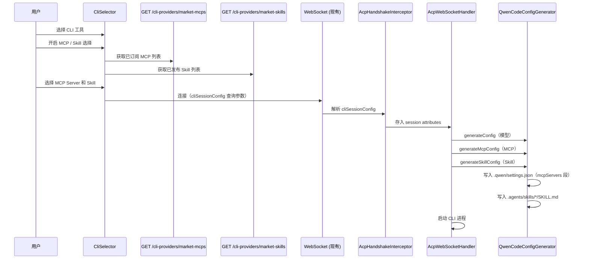

# 设计文档：CLI MCP 与 Skill 市场集成

## 概述

本功能在现有 CLI 自定义模型配置（cli-custom-model-config）和模型市场集成（himarket-model-integration）基础上，增加对市场中 MCP Server 和 Agent Skill 的支持。核心思路：

1. 后端新增两个轻量接口，分别返回已订阅的 MCP Server 列表和已发布的 Skill 列表
2. 扩展现有 `CliConfigGenerator` 接口，新增 MCP 和 Skill 配置注入方法
3. 新增 `CliSessionConfig` 数据模型，统一承载模型配置、MCP 配置和 Skill 配置
4. 前端在公共 `CliSelector` 组件中新增 MCP 和 Skill 选择器，三个模块自动获得新能力
5. 当前仅实现 Qwen Code 的 MCP/Skill 注入（通过 `.qwen/settings.json` 和 `.agents/skills/`），但接口设计预留扩展能力

设计原则：
- 最小化改动：复用现有 `MCPConfigResult.toTransportConfig()` 的 URL 提取逻辑和 `CredentialContext` 认证机制
- 向后兼容：保持对现有 `customModelConfig` WebSocket 参数的兼容
- 可扩展：`CliConfigGenerator` 接口的默认方法设计使新增 CLI 工具时无需修改接口

## 架构



```mermaid
graph TB
    subgraph 前端改动
        A[CliSelector 公共组件] --> B{配置选择}
        B -->|模型| C[CustomModelForm / MarketModelSelector 现有]
        B -->|MCP| D[MarketMcpSelector 新增]
        B -->|Skill| E[MarketSkillSelector 新增]
        D --> F[getMarketMcps API 新增]
        E --> G[getMarketSkills API 新增]
        C --> H[buildAcpWsUrl 扩展]
        D --> H
        E --> H
    end

    subgraph 后端改动
        I[CliProviderController] --> J[GET /market-mcps 新增]
        I --> K[GET /market-skills 新增]
        J --> L[ConsumerService 现有]
        J --> M[ProductService 现有]
        K --> M
        N[CliConfigGenerator] --> O[generateMcpConfig 新增]
        N --> P[generateSkillConfig 新增]
        Q[QwenCodeConfigGenerator] --> O
        Q --> P
        R[AcpHandshakeInterceptor] --> S[解析 cliSessionConfig]
        T[AcpWebSocketHandler] --> U[调用三种 generate 方法]
    end

    subgraph 复用现有逻辑
        V[MCPConfigResult.toTransportConfig]
        W[CredentialContext]
        X[SkillService.downloadSkill]
    end

    H --> S
    J --> V
    J --> W

## 组件与接口

### 1. CliSessionConfig 数据模型（后端新增）

统一承载模型配置、MCP 配置和 Skill 配置的会话配置对象：

```java
@Data
public class CliSessionConfig {
    /** 自定义模型配置（可选，复用现有 CustomModelConfig） */
    private CustomModelConfig customModelConfig;
    
    /** 选中的 MCP Server 列表（可选） */
    private List<McpServerEntry> mcpServers;
    
    /** 选中的 Skill 列表（可选） */
    private List<SkillEntry> skills;
    
    @Data
    public static class McpServerEntry {
        private String name;           // MCP 服务名称
        private String url;            // MCP 端点 URL（已拼接完成）
        private String transportType;  // sse 或 streamable-http
        private Map<String, String> headers; // 认证请求头（可选）
    }
    
    @Data
    public static class SkillEntry {
        private String name;           // 技能名称
        private String skillMdContent; // SKILL.md 文件内容
    }
}
```

### 2. MarketMcpInfo 响应 DTO（后端新增）

```java
@Data
@Builder
public class MarketMcpInfo {
    private String productId;       // 产品 ID
    private String name;            // MCP 服务名称（mcpServerName）
    private String url;             // 拼接后的 MCP 端点 URL
    private String transportType;   // 传输协议类型（sse | streamable-http）
    private String description;     // 产品描述
}
```

### 3. MarketMcpsResponse 响应 DTO（后端新增）

```java
@Data
@Builder
public class MarketMcpsResponse {
    private List<MarketMcpInfo> mcpServers;       // 已订阅的 MCP Server 列表
    private Map<String, String> authHeaders;       // Consumer 认证请求头
}
```

### 4. MarketSkillInfo 响应 DTO（后端新增）

```java
@Data
@Builder
public class MarketSkillInfo {
    private String productId;       // 产品 ID
    private String name;            // 技能名称
    private String description;     // 产品描述
    private List<String> skillTags; // 技能标签
}
```

### 5. CliProviderController 扩展（后端改动）

在现有 CliProviderController 中新增两个接口：

```java
@Operation(summary = "获取当前开发者已订阅的 MCP Server 列表")
@GetMapping("/market-mcps")
@DeveloperAuth
public MarketMcpsResponse listMarketMcps() {
    // 1. 获取 Primary Consumer
    // 2. 获取订阅列表，筛选 APPROVED 状态
    // 3. 批量获取产品详情，筛选 MCP_SERVER 类型
    // 4. 对每个产品调用 mcpConfig.toTransportConfig() 提取 URL 和传输类型
    // 5. 获取 CredentialContext，提取 authHeaders
    // 6. 组装响应
}

@Operation(summary = "获取已发布的 Skill 列表")
@GetMapping("/market-skills")
public List<MarketSkillInfo> listMarketSkills() {
    // 1. 查询所有 AGENT_SKILL 类型且已发布的产品
    // 2. 提取 name、description、skillTags
    // 3. 返回列表
}
```

MCP 接口的 URL 提取逻辑复用现有 `MCPConfigResult.toTransportConfig()`：

```java
private MarketMcpInfo buildMarketMcpInfo(ProductResult product) {
    MCPTransportConfig transportConfig = product.getMcpConfig().toTransportConfig();
    if (transportConfig == null) {
        return null;
    }
    
    String transportType = transportConfig.getTransportMode() == MCPTransportMode.STREAMABLE_HTTP
        ? "streamable-http" : "sse";
    
    return MarketMcpInfo.builder()
        .productId(product.getProductId())
        .name(transportConfig.getMcpServerName())
        .url(transportConfig.getUrl())
        .transportType(transportType)
        .description(product.getDescription())
        .build();
}
```

### 6. CliConfigGenerator 接口扩展（后端改动）

在现有接口中新增两个 default 方法，保持向后兼容：

```java
public interface CliConfigGenerator {
    String supportedProvider();
    
    /** 生成模型配置（现有） */
    Map<String, String> generateConfig(String workingDirectory, CustomModelConfig config) 
        throws IOException;
    
    /** 生成 MCP Server 配置（新增，默认空实现） */
    default void generateMcpConfig(String workingDirectory, 
                                    List<CliSessionConfig.McpServerEntry> mcpServers) 
        throws IOException {
        // 默认不执行任何操作，子类按需覆盖
    }
    
    /** 生成 Skill 配置（新增，默认空实现） */
    default void generateSkillConfig(String workingDirectory, 
                                      List<CliSessionConfig.SkillEntry> skills) 
        throws IOException {
        // 默认不执行任何操作，子类按需覆盖
    }
}
```

### 7. QwenCodeConfigGenerator 扩展（后端改动）

在现有 QwenCodeConfigGenerator 中实现 MCP 和 Skill 配置注入：

**MCP 配置注入** — 写入 `.qwen/settings.json` 的 `mcpServers` 段：

```java
@Override
public void generateMcpConfig(String workingDirectory, 
                               List<CliSessionConfig.McpServerEntry> mcpServers) 
    throws IOException {
    if (mcpServers == null || mcpServers.isEmpty()) return;
    
    Path qwenDir = Path.of(workingDirectory, QWEN_DIR);
    Path configPath = qwenDir.resolve(CONFIG_FILE_NAME);
    Files.createDirectories(qwenDir);
    
    Map<String, Object> root = readExistingConfig(configPath);
    mergeMcpServers(root, mcpServers);
    writeConfig(configPath, root);
}
```

生成的 `.qwen/settings.json` 中 `mcpServers` 段格式：

```json
{
  "mcpServers": {
    "my-mcp-server": {
      "url": "http://apigateway.example.com/mcp/sse",
      "type": "sse",
      "headers": {
        "Authorization": "Bearer xxx"
      }
    },
    "another-server": {
      "url": "http://apigateway.example.com/mcp2",
      "type": "streamable-http",
      "headers": {
        "Authorization": "Bearer xxx"
      }
    }
  }
}
```

**Skill 配置注入** — 写入 `.agents/skills/<name>/SKILL.md`：

```java
@Override
public void generateSkillConfig(String workingDirectory, 
                                 List<CliSessionConfig.SkillEntry> skills) 
    throws IOException {
    if (skills == null || skills.isEmpty()) return;
    
    for (CliSessionConfig.SkillEntry skill : skills) {
        String dirName = toKebabCase(skill.getName());
        Path skillDir = Path.of(workingDirectory, ".agents", "skills", dirName);
        Files.createDirectories(skillDir);
        Files.writeString(skillDir.resolve("SKILL.md"), skill.getSkillMdContent());
    }
}
```

`toKebabCase` 工具方法：将技能名称转换为 kebab-case 格式，去除特殊字符。

### 8. AcpHandshakeInterceptor 扩展（后端改动）

在 WebSocket 握手时解析 `cliSessionConfig` 查询参数，保持对 `customModelConfig` 的向后兼容：

```java
// 优先解析 cliSessionConfig（新参数）
String cliSessionConfigJson = params.getFirst("cliSessionConfig");
if (StrUtil.isNotBlank(cliSessionConfigJson)) {
    try {
        String decoded = URLDecoder.decode(cliSessionConfigJson, StandardCharsets.UTF_8);
        CliSessionConfig sessionConfig = objectMapper.readValue(decoded, CliSessionConfig.class);
        attributes.put("cliSessionConfig", sessionConfig);
        // 向后兼容：如果包含 customModelConfig，也设置到旧的 attribute key
        if (sessionConfig.getCustomModelConfig() != null) {
            attributes.put("customModelConfig", sessionConfig.getCustomModelConfig());
        }
    } catch (Exception e) {
        logger.warn("Failed to parse cliSessionConfig: {}", e.getMessage());
    }
}

// 向后兼容：如果没有 cliSessionConfig 但有 customModelConfig（旧客户端）
if (!attributes.containsKey("cliSessionConfig")) {
    String customModelConfigJson = params.getFirst("customModelConfig");
    if (StrUtil.isNotBlank(customModelConfigJson)) {
        // 现有逻辑保持不变...
        // 同时包装为 CliSessionConfig
        CliSessionConfig wrapper = new CliSessionConfig();
        wrapper.setCustomModelConfig(customModelConfig);
        attributes.put("cliSessionConfig", wrapper);
    }
}
```

### 9. AcpWebSocketHandler 扩展（后端改动）

在 `afterConnectionEstablished` 中，扩展配置注入逻辑：

```java
// 从 session attributes 获取统一会话配置
CliSessionConfig sessionConfig = 
    (CliSessionConfig) session.getAttributes().get("cliSessionConfig");

if (sessionConfig != null && providerConfig.isSupportsCustomModel()) {
    CliConfigGenerator generator = configGeneratorRegistry.get(providerKey);
    if (generator != null) {
        // 1. 模型配置注入（现有逻辑）
        if (sessionConfig.getCustomModelConfig() != null) {
            Map<String, String> extraEnv = 
                generator.generateConfig(cwd, sessionConfig.getCustomModelConfig());
            config.getEnv().putAll(extraEnv);
        }
        
        // 2. MCP 配置注入（新增）
        if (sessionConfig.getMcpServers() != null 
            && !sessionConfig.getMcpServers().isEmpty()
            && providerConfig.isSupportsMcp()) {
            generator.generateMcpConfig(cwd, sessionConfig.getMcpServers());
        }
        
        // 3. Skill 配置注入（新增）
        if (sessionConfig.getSkills() != null 
            && !sessionConfig.getSkills().isEmpty()
            && providerConfig.isSupportsSkill()) {
            generator.generateSkillConfig(cwd, sessionConfig.getSkills());
        }
    }
}
```

### 10. CliProviderConfig 扩展（后端改动）

在已有的 `CliProviderConfig` 中新增字段：

```java
// AcpProperties.CliProviderConfig 中新增
private boolean supportsMcp = false;
private boolean supportsSkill = false;
```

### 11. CliProviderInfo 扩展（后端改动）

在 `CliProviderController.CliProviderInfo` record 中新增字段：

```java
public record CliProviderInfo(
    String key,
    String displayName,
    boolean isDefault,
    boolean available,
    String runtimeCategory,
    List<RuntimeType> compatibleRuntimes,
    String containerImage,
    boolean supportsCustomModel,
    boolean supportsMcp,      // 新增
    boolean supportsSkill     // 新增
) {}
```

### 12. 前端 MarketMcpSelector 组件（新增）

```typescript
interface MarketMcpSelectorProps {
  enabled: boolean;
  onChange: (mcpServers: McpServerEntry[] | null) => void;
}
```

组件内部：
- `enabled` 变为 true 时调用 `getMarketMcps()` 获取列表
- 以 Checkbox.Group 形式展示 MCP Server 列表
- 选中/取消时回调 `onChange`，传递选中的 MCP Server 列表（含 authHeaders）

### 13. 前端 MarketSkillSelector 组件（新增）

```typescript
interface MarketSkillSelectorProps {
  enabled: boolean;
  onChange: (skills: SkillEntry[] | null) => void;
}
```

组件内部：
- `enabled` 变为 true 时调用 `getMarketSkills()` 获取列表
- 以 Checkbox.Group 形式展示 Skill 列表
- 选中时调用 `GET /skills/{productId}/download` 获取 SKILL.md 内容
- 回调 `onChange`，传递选中的 Skill 列表（含 skillMdContent）

### 14. 前端 CliSelector 公共组件扩展

在现有 CliSelector 中新增 MCP 和 Skill 选择状态：

```typescript
// 新增状态
const [mcpEnabled, setMcpEnabled] = useState(false);
const [skillEnabled, setSkillEnabled] = useState(false);
const [selectedMcps, setSelectedMcps] = useState<McpServerEntry[] | null>(null);
const [selectedSkills, setSelectedSkills] = useState<SkillEntry[] | null>(null);
```

连接时组装 `CliSessionConfig`：

```typescript
const handleConnect = () => {
  const sessionConfig: CliSessionConfig = {};
  
  // 模型配置（现有逻辑）
  if (modelConfigMode !== 'none' && customModelData) {
    sessionConfig.customModelConfig = customModelData;
  }
  
  // MCP 配置（新增）
  if (mcpEnabled && selectedMcps && selectedMcps.length > 0) {
    sessionConfig.mcpServers = selectedMcps;
  }
  
  // Skill 配置（新增）
  if (skillEnabled && selectedSkills && selectedSkills.length > 0) {
    sessionConfig.skills = selectedSkills;
  }
  
  // 有任何配置时传递 cliSessionConfig
  const hasConfig = sessionConfig.customModelConfig 
    || sessionConfig.mcpServers 
    || sessionConfig.skills;
  const configJson = hasConfig ? JSON.stringify(sessionConfig) : undefined;
  
  onSelect(selectedCliId, "", selectedRuntime, selectedProvider, configJson);
};
```

### 15. 前端 API 扩展（cliProvider.ts）

```typescript
// MCP 相关类型
export interface MarketMcpInfo {
  productId: string;
  name: string;
  url: string;
  transportType: string;
  description: string;
}

export interface MarketMcpsResponse {
  mcpServers: MarketMcpInfo[];
  authHeaders: Record<string, string> | null;
}

// Skill 相关类型
export interface MarketSkillInfo {
  productId: string;
  name: string;
  description: string;
  skillTags: string[];
}

// CliSessionConfig 类型
export interface McpServerEntry {
  name: string;
  url: string;
  transportType: string;
  headers?: Record<string, string>;
}

export interface SkillEntry {
  name: string;
  skillMdContent: string;
}

export interface CliSessionConfig {
  customModelConfig?: CustomModelFormData;
  mcpServers?: McpServerEntry[];
  skills?: SkillEntry[];
}

// API 函数
export function getMarketMcps() {
  return request.get<RespI<MarketMcpsResponse>, RespI<MarketMcpsResponse>>(
    "/cli-providers/market-mcps"
  );
}

export function getMarketSkills() {
  return request.get<RespI<MarketSkillInfo[]>, RespI<MarketSkillInfo[]>>(
    "/cli-providers/market-skills"
  );
}

export function downloadSkill(productId: string) {
  return request.get<string, string>(
    `/skills/${productId}/download`
  );
}
```

### 16. 前端 ICliProvider 接口扩展

```typescript
export interface ICliProvider {
  key: string;
  displayName: string;
  isDefault: boolean;
  available: boolean;
  compatibleRuntimes?: RuntimeType[];
  runtimeCategory?: 'native' | 'nodejs' | 'python';
  containerImage?: string;
  supportsCustomModel?: boolean;
  supportsMcp?: boolean;      // 新增
  supportsSkill?: boolean;    // 新增
}
```

### 17. WebSocket URL 扩展

在 `WsUrlParams` 中新增 `cliSessionConfig` 参数：

```typescript
export interface WsUrlParams {
  provider?: string;
  runtime?: string;
  token?: string;
  sandboxMode?: string;
  customModelConfig?: string;   // 保留向后兼容
  cliSessionConfig?: string;    // 新增：统一会话配置
}
```

`buildAcpWsUrl` 函数新增 `cliSessionConfig` 参数支持。

## 数据模型

### CliSessionConfig（WebSocket 传递）

| 字段 | 类型 | 必填 | 说明 |
|------|------|------|------|
| customModelConfig | CustomModelConfig | 否 | 自定义模型配置（复用现有） |
| mcpServers | List\<McpServerEntry\> | 否 | 选中的 MCP Server 列表 |
| skills | List\<SkillEntry\> | 否 | 选中的 Skill 列表 |

### McpServerEntry

| 字段 | 类型 | 必填 | 说明 |
|------|------|------|------|
| name | String | 是 | MCP 服务名称 |
| url | String | 是 | MCP 端点 URL（已拼接完成） |
| transportType | String | 是 | 传输协议类型：sse 或 streamable-http |
| headers | Map\<String, String\> | 否 | 认证请求头 |

### SkillEntry

| 字段 | 类型 | 必填 | 说明 |
|------|------|------|------|
| name | String | 是 | 技能名称 |
| skillMdContent | String | 是 | SKILL.md 文件完整内容 |

### MarketMcpsResponse（接口响应）

| 字段 | 类型 | 说明 |
|------|------|------|
| mcpServers | MarketMcpInfo[] | 已订阅的 MCP Server 列表 |
| authHeaders | Map\<String, String\> | Consumer 认证请求头，无凭证时为 null |

### MarketMcpInfo

| 字段 | 类型 | 来源 | 说明 |
|------|------|------|------|
| productId | String | ProductResult.productId | 产品唯一标识 |
| name | String | MCPConfigResult.mcpServerName | MCP 服务名称 |
| url | String | MCPConfigResult.toTransportConfig().url | 拼接后的端点 URL |
| transportType | String | MCPTransportMode 映射 | sse 或 streamable-http |
| description | String | ProductResult.description | 产品描述 |

### MarketSkillInfo

| 字段 | 类型 | 来源 | 说明 |
|------|------|------|------|
| productId | String | ProductResult.productId | 产品唯一标识 |
| name | String | ProductResult.name | 技能名称 |
| description | String | ProductResult.description | 产品描述 |
| skillTags | List\<String\> | ProductFeature.skillConfig.skillTags | 技能标签 |

### Qwen Code MCP 配置格式

```json
{
  "mcpServers": {
    "<mcpServerName>": {
      "url": "<endpoint-url>",
      "type": "<sse|streamable-http>",
      "headers": {
        "<header-key>": "<header-value>"
      }
    }
  }
}
```

### Skill 文件目录结构

```
<workingDirectory>/
  .agents/
    skills/
      <skill-name-kebab-case>/
        SKILL.md
```

### kebab-case 转换规则

- 将空格替换为 `-`
- 将大写字母转为小写
- 去除非字母数字和 `-` 的特殊字符
- 合并连续的 `-`
- 去除首尾 `-`
- 示例：`My Skill Name!` → `my-skill-name`

### application.yml 配置扩展

```yaml
acp:
  providers:
    qwen-code:
      display-name: Qwen Code
      command: ${ACP_CLI_COMMAND_QWEN:qwen}
      args: ${ACP_CLI_ARGS_QWEN:--acp}
      supports-custom-model: true
      supports-mcp: true        # 新增
      supports-skill: true      # 新增
```

## 正确性属性

*正确性属性是一种在系统所有合法执行中都应成立的特征或行为——本质上是关于系统应该做什么的形式化陈述。属性是人类可读规范与机器可验证正确性保证之间的桥梁。*

### Property 1: MCP 订阅筛选正确性

*对于任意*包含不同 productType 和 status 组合的订阅列表和产品详情，MCP 列表接口筛选后的结果应仅包含 productType 为 MCP_SERVER 且 status 为 APPROVED 的订阅对应的产品，且不遗漏任何符合条件的产品。

**Validates: Requirements 1.3**

### Property 2: Skill 发布筛选正确性

*对于任意*包含不同 productType 和发布状态的产品列表，Skill 列表接口筛选后的结果应仅包含 type 为 AGENT_SKILL 且已发布到当前门户的产品，且不遗漏任何符合条件的产品。

**Validates: Requirements 2.3, 2.4**

### Property 3: QwenCode MCP 配置生成正确性

*对于任意*合法的 MCP Server 列表（包含 name、url、transportType 和可选的 headers），QwenCodeConfigGenerator 生成的 `.qwen/settings.json` 中的 `mcpServers` 段应满足：1) 每个 MCP Server 的 name 作为 key 存在；2) 每个条目包含正确的 `url` 和 `type` 字段；3) 当输入包含 headers 时，条目中包含对应的 `headers` 字段。

**Validates: Requirements 6.1, 6.2, 6.3, 6.5**

### Property 4: QwenCode MCP 配置合并保留已有条目

*对于任意*已有的合法 `.qwen/settings.json` 配置（包含 `mcpServers` 段）和任意新的 MCP Server 列表，合并后的配置应同时包含原有的所有 MCP Server 条目和新增的条目，且按 name 去重（新条目覆盖同名旧条目）。

**Validates: Requirements 6.4**

### Property 5: Skill 文件写入往返一致性

*对于任意*合法的 Skill 列表（包含 name 和 skillMdContent），QwenCodeConfigGenerator 写入 `.agents/skills/<name>/SKILL.md` 后，读取该文件应得到与输入 skillMdContent 完全相同的内容。

**Validates: Requirements 7.1, 7.2, 7.3**

### Property 6: kebab-case 名称转换正确性

*对于任意*技能名称字符串，toKebabCase 转换后的结果应满足：1) 仅包含小写字母、数字和 `-`；2) 不以 `-` 开头或结尾；3) 不包含连续的 `-`；4) 对于仅包含字母数字和空格的输入，转换是确定性的（相同输入产生相同输出）。

**Validates: Requirements 7.4**

### Property 7: CliSessionConfig 序列化往返一致性

*对于任意*合法的 CliSessionConfig 对象（可包含 customModelConfig、mcpServers、skills 的任意组合），序列化为 JSON 字符串再反序列化应产生与原始对象等价的 CliSessionConfig。

**Validates: Requirements 13.1, 13.2, 13.3, 4.1, 4.2**

### Property 8: 传输协议类型映射正确性

*对于任意* MCP 产品的 meta.protocol 字符串值，传输类型映射结果应满足：1) 当值为 "HTTP" 或 "StreamableHTTP"（不区分大小写）时，映射为 "streamable-http"；2) 其他所有情况（包括 null 和空字符串）映射为 "sse"；3) 返回值始终是 "sse" 或 "streamable-http" 之一。

**Validates: Requirements 12.2, 12.3**

### Property 9: CliSessionConfig 组装正确性

*对于任意*有效的模型配置、MCP Server 选择列表和 Skill 选择列表的组合，前端组装的 CliSessionConfig 应满足：1) customModelConfig 字段等于输入的模型配置（或为 null）；2) mcpServers 字段包含所有选中的 MCP Server 且每个条目的 name、url、transportType、headers 与输入一致；3) skills 字段包含所有选中的 Skill 且每个条目的 name 和 skillMdContent 与输入一致。

**Validates: Requirements 10.1, 10.3**

## 错误处理

| 场景 | 处理方式 | 相关需求 |
|------|----------|----------|
| 开发者没有 Primary Consumer | MCP 接口返回空列表，authHeaders 为 null | 1.5 |
| 有 Consumer 但无 MCP_SERVER 订阅 | MCP 接口返回空列表 | 1.6 |
| MCP 产品 mcpConfig 数据不完整 | 跳过该产品，记录警告日志 | 1.8 |
| MCPConfigResult.toTransportConfig() 返回 null | 跳过该产品，记录警告日志 | 1.8 |
| 当前门户无已发布 AGENT_SKILL 产品 | Skill 接口返回空列表 | 2.5 |
| cliSessionConfig JSON 格式不合法 | 记录警告日志，忽略参数，按现有逻辑继续 | 4.5 |
| 仅有 customModelConfig 参数（旧客户端） | 包装为 CliSessionConfig，保持向后兼容 | 4.3 |
| MCP 配置生成失败（IO 异常） | 记录错误日志，不阻止 CLI 启动 | 6.1 |
| Skill 文件写入失败（IO 异常） | 记录错误日志，不阻止 CLI 启动 | 7.1 |
| 前端 MCP 接口调用失败 | 显示错误信息，提供重试按钮 | 8.6 |
| 前端 Skill 接口调用失败 | 显示错误信息，提供重试按钮 | 9.6 |
| 前端用户未登录访问 MCP 接口 | 显示"请先登录"提示 | 8.7 |
| Skill 下载接口返回 404 | 前端提示下载失败，跳过该 Skill | 9.4 |

## 测试策略

### 属性测试（Property-Based Testing）

后端使用 **jqwik**（项目已配置），前端使用 **fast-check**（项目已配置）。

每个属性测试至少运行 100 次迭代，使用随机生成的输入数据。

| 属性 | 测试位置 | 框架 | 说明 |
|------|----------|------|------|
| Property 1: MCP 订阅筛选正确性 | 后端 Java 测试 | jqwik | 生成随机订阅列表（混合类型和状态） |
| Property 2: Skill 发布筛选正确性 | 后端 Java 测试 | jqwik | 生成随机产品列表（混合类型和发布状态） |
| Property 3: QwenCode MCP 配置生成正确性 | 后端 Java 测试 | jqwik | 生成随机 MCP Server 列表 |
| Property 4: QwenCode MCP 配置合并保留已有条目 | 后端 Java 测试 | jqwik | 生成随机已有配置和新 MCP 列表 |
| Property 5: Skill 文件写入往返一致性 | 后端 Java 测试 | jqwik | 生成随机 Skill 列表，写入后读取验证 |
| Property 6: kebab-case 名称转换正确性 | 后端 Java 测试 | jqwik | 生成随机字符串，验证转换结果格式 |
| Property 7: CliSessionConfig 序列化往返一致性 | 后端 Java 测试 | jqwik | 生成随机 CliSessionConfig 对象 |
| Property 8: 传输协议类型映射正确性 | 后端 Java 测试 | jqwik | 生成随机 protocol 字符串 |
| Property 9: CliSessionConfig 组装正确性 | 前端 TypeScript 测试 | fast-check | 生成随机配置组合 |

每个属性测试必须包含注释引用设计文档中的属性编号：
```java
// Feature: cli-mcp-skill-integration, Property 3: QwenCode MCP 配置生成正确性
```

### 单元测试

单元测试覆盖具体示例、边界条件和错误处理：

**后端：**
- CliProviderController.listMarketMcps：无 Primary Consumer、无订阅、有订阅的场景
- CliProviderController.listMarketMcps：产品 mcpConfig 不完整时跳过的场景
- CliProviderController.listMarketSkills：无已发布 Skill、有已发布 Skill 的场景
- AcpHandshakeInterceptor：解析 cliSessionConfig（正常、缺失、非法 JSON、向后兼容 customModelConfig）
- QwenCodeConfigGenerator.generateMcpConfig：空列表、单个 MCP、多个 MCP、带 headers 的场景
- QwenCodeConfigGenerator.generateSkillConfig：空列表、单个 Skill、多个 Skill、覆盖已有文件的场景
- toKebabCase：各种特殊字符、空格、大小写混合的具体示例
- CliProviderInfo 响应包含 supportsMcp 和 supportsSkill 字段

**前端：**
- MarketMcpSelector 组件：加载中、加载成功、空列表、接口失败、未登录的渲染
- MarketSkillSelector 组件：加载中、加载成功、空列表、接口失败的渲染
- CliSelector 扩展：MCP/Skill 开关显示/隐藏逻辑、CliSessionConfig 组装
- getMarketMcps / getMarketSkills API 函数：正常响应和错误响应的处理
