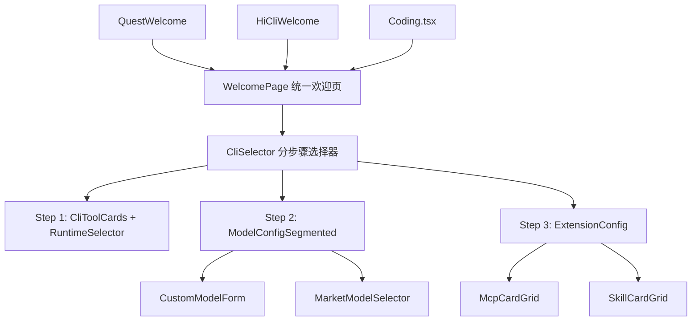

# 设计文档：CLI UX 优化

## 概述

本设计对 HiWork、HiCoding、HiCli 三个模块的前端交互体验进行全面优化。核心改动集中在共享的 `CliSelector` 组件及其子组件上，采用分步骤引导、卡片式选择、统一欢迎页等设计模式，将当前 demo 级别的 UI 提升到产品级别。

所有改动均为纯前端变更，不涉及后端 API 修改。数据接口（`getCliProviders`、`getMarketMcps`、`getMarketSkills`、`getMarketModels`）保持不变。

## 架构

### 组件层次结构



### 设计决策

1. **分步骤引导 vs 折叠面板**：选择分步骤引导（Step Wizard），因为配置流程有明确的先后顺序（先选工具，再配模型，最后选扩展），分步骤能减少认知负担。
2. **卡片式选择 vs 增强下拉框**：选择卡片式选择，因为 CLI 工具、MCP、Skill 的数量通常不超过 10-20 个，卡片布局能提供更好的信息密度和视觉反馈。
3. **Segmented Control vs Radio Group**：模型配置模式使用 antd 的 `Segmented` 组件替代 Switch 开关，三个互斥选项（默认/自定义/市场）更加直观。
4. **统一欢迎页组件**：提取公共的 `WelcomePage` 组件，通过 props 传入模块特定的图标、名称、描述，确保三个模块风格一致。

## 组件与接口

### 1. `sortCliProviders` 排序工具函数

```typescript
// src/lib/utils/cliProviderSort.ts

/**
 * 对 CLI Provider 列表进行排序：
 * 1. Qwen Code 排第一位（key 包含 "qwen"）
 * 2. 其余可用工具按原始顺序
 * 3. 不可用工具排末尾
 */
export function sortCliProviders(providers: ICliProvider[]): ICliProvider[] {
  const available = providers.filter(p => p.available);
  const unavailable = providers.filter(p => !p.available);
  
  const qwenIndex = available.findIndex(p => p.key.toLowerCase().includes('qwen'));
  if (qwenIndex > 0) {
    const [qwen] = available.splice(qwenIndex, 1);
    available.unshift(qwen);
  }
  
  return [...available, ...unavailable];
}
```

### 2. `SelectableCard` 通用可选卡片组件

```typescript
// src/components/common/SelectableCard.tsx

interface SelectableCardProps {
  selected: boolean;
  disabled?: boolean;
  onClick: () => void;
  children: React.ReactNode;
}
```

用于 CLI 工具选择、MCP 卡片、Skill 卡片的统一选中/未选中视觉样式。选中时边框变为主题色（blue-500），未选中时为灰色边框，disabled 时置灰。

### 3. `SearchFilterInput` 搜索过滤组件

```typescript
// src/components/common/SearchFilterInput.tsx

interface SearchFilterInputProps {
  value: string;
  onChange: (value: string) => void;
  placeholder?: string;
}
```

轻量搜索输入框，带搜索图标，用于 MCP 和 Skill 列表的过滤。

### 4. `filterByKeyword` 过滤工具函数

```typescript
// src/lib/utils/filterUtils.ts

/**
 * 对列表进行关键词模糊匹配过滤
 * fields 指定参与匹配的字段名
 */
export function filterByKeyword<T extends Record<string, any>>(
  items: T[],
  keyword: string,
  fields: (keyof T)[]
): T[] 
```

### 5. 重构后的 `CliSelector` 组件

```typescript
// src/components/common/CliSelector.tsx

// 新增内部状态
interface StepWizardState {
  currentStep: number;  // 0: 选择工具, 1: 模型配置, 2: 扩展配置
  totalSteps: number;   // 根据 provider 能力动态计算
}
```

核心变更：
- 使用 `sortCliProviders` 对列表排序
- 用卡片式单选替代 `Select` 下拉框
- 引入分步骤状态管理
- 模型配置使用 `Segmented` 组件
- MCP/Skill 区域移除 Switch 开关，直接在步骤三中展示卡片网格

### 6. 重构后的 `MarketMcpSelector` 组件

```typescript
// src/components/hicli/MarketMcpSelector.tsx

// Props 变更：移除 enabled，改为始终渲染
interface MarketMcpSelectorProps {
  onChange: (mcpServers: McpServerEntry[] | null) => void;
}
```

核心变更：
- 移除 `enabled` prop 和 Switch 控制逻辑
- `Checkbox.Group` 替换为卡片网格布局
- 列表超过 4 项时显示搜索框
- 使用 `SelectableCard` 和 `filterByKeyword`

### 7. 重构后的 `MarketSkillSelector` 组件

```typescript
// src/components/hicli/MarketSkillSelector.tsx

// Props 变更：同 MCP
interface MarketSkillSelectorProps {
  onChange: (skills: SkillEntry[] | null) => void;
}
```

核心变更：
- 同 MCP 选择器的卡片化改造
- 卡片额外展示 `skillTags` 标签
- 下载中的卡片显示 Spin 加载指示器

### 8. `WelcomePage` 统一欢迎页组件

```typescript
// src/components/common/WelcomePage.tsx

interface WelcomePageProps {
  icon: React.ReactNode;
  title: string;
  description: string;
  isConnected: boolean;
  disabled: boolean;
  // CLI 选择相关
  onSelectCli: (cliId: string, cwd: string, runtime?: string, providerObj?: ICliProvider, cliSessionConfig?: string) => void;
  showRuntimeSelector?: boolean;
  // 已连接后的操作
  connectedContent?: React.ReactNode;
}
```

统一三个模块的欢迎页布局：居中卡片容器 → 图标 → 标题 → 描述 → CliSelector/操作按钮。

## 数据模型

数据模型不变，所有 API 接口和类型定义保持现有结构：

- `ICliProvider`：CLI 工具对象，包含 `key`、`displayName`、`available`、`isDefault`、`supportsCustomModel`、`supportsMcp`、`supportsSkill`、`compatibleRuntimes`
- `MarketMcpInfo`：MCP Server 信息，包含 `productId`、`name`、`url`、`transportType`、`description`
- `MarketSkillInfo`：Skill 信息，包含 `productId`、`name`、`description`、`skillTags`
- `McpServerEntry`：选中的 MCP Server 条目
- `SkillEntry`：选中的 Skill 条目
- `CliSessionConfig`：会话配置对象

新增的纯前端类型：

```typescript
// 步骤状态
interface StepConfig {
  key: string;
  title: string;
  visible: boolean;  // 根据 provider 能力动态决定
}
```


## 正确性属性

*正确性属性是一种在系统所有有效执行中都应成立的特征或行为——本质上是关于系统应该做什么的形式化陈述。属性充当人类可读规范与机器可验证正确性保证之间的桥梁。*

### Property 1: CLI Provider 排序不变量

*For any* CLI Provider 列表，经过 `sortCliProviders` 排序后：(a) 如果列表中存在 key 包含 "qwen" 的可用 provider，该 provider 应位于排序结果的第一位；(b) 所有可用 provider 应排在所有不可用 provider 之前；(c) 排序不应改变列表的长度。

**Validates: Requirements 1.1**

### Property 2: 关键词过滤正确性

*For any* 对象列表和任意关键词字符串，`filterByKeyword` 返回的结果中每一项都应在指定字段中包含该关键词（大小写不敏感），且结果集应是原列表的子集（长度 ≤ 原列表长度）。

**Validates: Requirements 2.4, 3.4**

### Property 3: 动态步骤计算

*For any* CLI Provider 对象，当 `supportsCustomModel`、`supportsMcp`、`supportsSkill` 全部为 false 时，计算出的步骤数应为 1；当任一为 true 时，步骤数应大于 1 且不超过 3。

**Validates: Requirements 4.3**

### Property 4: CLI 工具单选不变量

*For any* CLI 工具列表和任意选择操作序列，在任意时刻最多只有一个工具处于选中状态，且选中的工具必须是可用的（available === true）。

**Validates: Requirements 7.2**

## 错误处理

| 场景 | 处理方式 |
|------|---------|
| CLI Provider 列表加载失败 | 展示错误信息 + 重试按钮，不展示空列表 |
| MCP Server 列表加载失败 | 在步骤三的 MCP 区域展示 Alert 错误提示 + 重试按钮 |
| Skill 列表加载失败 | 在步骤三的 Skill 区域展示 Alert 错误提示 + 重试按钮 |
| Skill SKILL.md 下载失败 | 跳过该 Skill，卡片上移除加载指示器，不阻塞其他 Skill 的选择 |
| MCP 401 未登录 | 展示"请先登录"提示，不显示重试按钮 |
| 搜索无结果 | 展示"无匹配结果"空状态提示 |

## 测试策略

### 属性测试（Property-Based Testing）

使用 `fast-check` 库（项目已安装）进行属性测试，每个属性至少运行 100 次迭代。

| 属性 | 测试文件 | 说明 |
|------|---------|------|
| Property 1: CLI Provider 排序不变量 | `src/lib/utils/__tests__/cliProviderSort.property.test.ts` | 生成随机 provider 列表，验证排序不变量 |
| Property 2: 关键词过滤正确性 | `src/lib/utils/__tests__/filterUtils.property.test.ts` | 生成随机对象列表和关键词，验证过滤结果正确性 |
| Property 3: 动态步骤计算 | `src/components/common/__tests__/stepCalculation.property.test.ts` | 生成随机 provider 能力组合，验证步骤数计算 |
| Property 4: CLI 工具单选不变量 | `src/components/common/__tests__/cliSelection.property.test.ts` | 生成随机选择操作序列，验证单选不变量 |

每个属性测试必须标注对应的设计属性编号：
- 标签格式：`Feature: cli-ux-optimization, Property {N}: {property_text}`

### 单元测试

单元测试聚焦于具体示例和边界情况：

- `sortCliProviders`：空列表、全部不可用、无 Qwen 的列表
- `filterByKeyword`：空关键词、空列表、特殊字符
- `StepWizard` 步骤计算：各种 provider 能力组合的边界情况
- `WelcomePage`：已连接/未连接状态的渲染验证
- `SelectableCard`：disabled 状态下点击不触发回调

### 测试配置

- 属性测试库：`fast-check`（已在 `node_modules` 中）
- 测试框架：`vitest`（已配置）
- 每个属性测试最少 100 次迭代
- 单元测试和属性测试互补：单元测试验证具体场景，属性测试验证通用规则
