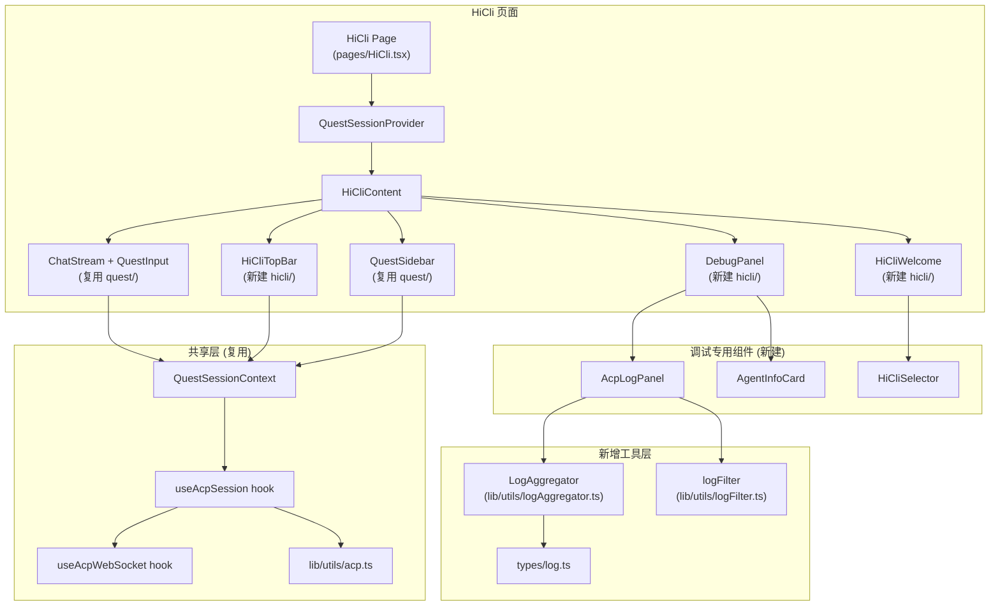

# 设计文档

## 概述

HiCli 模块将 acp-demo 的 ACP 协议调试前端能力集成到 himarket-frontend 中。设计核心原则：

1. **最大化复用**：ACP 通信层（useAcpWebSocket、useAcpSession、acp.ts、acpNormalize.ts）和会话管理（QuestSessionContext）直接复用现有代码
2. **最小化侵入**：通过扩展而非修改现有代码来添加调试能力
3. **样式统一**：使用 Tailwind CSS + Ant Design 替代 acp-demo 的原生 CSS

### 关键设计决策

| 决策 | 选择 | 理由 |
|------|------|------|
| 状态管理 | 扩展 QuestSessionContext | 与 HiWork/HiCoding 共享会话管理，仅新增调试相关状态字段 |
| 日志聚合 | 迁移 LogAggregator 类 | acp-demo 的聚合逻辑已经过测试，直接迁移到 lib/utils/ |
| CLI 选择 | 复用 CliProvider API | himarket 已有 `/cli-providers` 接口，无需使用 acp-demo 的 `/api/clis` |
| WebSocket URL | 复用 himarket 的 buildWsUrl 模式 | 与 HiWork/HiCoding 保持一致的 URL 构建和 token 传递方式 |
| 调试面板 | 新建 HiCli 专用组件 | 调试面板是 HiCli 独有功能，不适合放入共享组件 |

## 架构

### 整体架构



### 文件结构

```
himarket-web/himarket-frontend/src/
├── pages/
│   └── HiCli.tsx                          # 新建：HiCli 页面入口
├── components/
│   └── hicli/                             # 新建：HiCli 专用组件目录
│       ├── HiCliTopBar.tsx                # 顶部工具栏（含调试标签切换）
│       ├── HiCliWelcome.tsx               # 欢迎页（含 CLI 选择器）
│       ├── HiCliSelector.tsx              # CLI 工具选择器
│       ├── AcpLogPanel.tsx                # ACP 协议日志面板
│       ├── AgentInfoCard.tsx              # Agent 信息卡片
│       └── HiCliSidebar.tsx              # 侧边栏（含切换工具按钮）
├── types/
│   └── log.ts                             # 新建：日志聚合类型定义
├── lib/utils/
│   ├── logAggregator.ts                   # 新建：日志聚合器
│   └── logFilter.ts                       # 新建：日志过滤器
├── hooks/
│   └── useHiCliSession.ts                 # 新建：HiCli 专用 session hook（扩展 useAcpSession）
├── context/
│   └── HiCliSessionContext.tsx            # 新建：HiCli 专用 Context（扩展 QuestSessionContext）
└── router.tsx                             # 修改：添加 /hicli 路由
```

## 组件与接口

### 1. HiCli 页面入口 (pages/HiCli.tsx)

页面结构与 Coding.tsx 类似，使用 Header + 全屏内容区布局：

```typescript
// 页面结构
function HiCli() {
  return (
    <div className="h-screen flex flex-col overflow-hidden bg-gray-50/30">
      <Header />
      <div className="flex-1 min-h-0">
        <HiCliSessionProvider>
          <HiCliContent />
        </HiCliSessionProvider>
      </div>
    </div>
  );
}
```

### 2. HiCliSessionContext (context/HiCliSessionContext.tsx)

扩展 QuestSessionContext，新增调试相关状态：

```typescript
// 扩展的状态接口
interface HiCliState extends QuestState {
  // 调试专用状态
  rawMessages: RawMessage[];
  aggregatedLogs: AggregatedLogEntry[];
  agentInfo: AgentInfo | null;
  authMethods: AuthMethod[];
  agentCapabilities: AgentCapabilities | null;
  modesSource: 'initialize' | 'session_new' | null;
  // CLI 选择状态
  selectedCliId: string | null;
  cwd: string;
}

// 新增 Action 类型
type HiCliAction = QuestAction
  | { type: 'RAW_MESSAGE'; message: RawMessage }
  | { type: 'AGGREGATED_LOG'; entry: AggregatedLogEntry }
  | { type: 'CLI_SELECTED'; cliId: string; cwd: string }
  | { type: 'DEBUG_PROTOCOL_INITIALIZED'; agentInfo?: AgentInfo; authMethods?: AuthMethod[]; agentCapabilities?: AgentCapabilities; modesSource?: 'initialize' | null };
```

### 3. useHiCliSession hook (hooks/useHiCliSession.ts)

扩展 useAcpSession，增加日志记录和调试信息采集：

```typescript
interface UseHiCliSessionReturn {
  // 继承 useAcpSession 的所有返回值
  status: WsStatus;
  connect: () => void;
  disconnect: () => void;
  createQuest: (cwd: string) => Promise<string>;
  switchQuest: (questId: string) => void;
  closeQuest: (questId: string) => void;
  sendPrompt: (text: string, attachments?: Attachment[]) => void;
  cancelPrompt: () => void;
  setModel: (modelId: string) => void;
  setMode: (modeId: string) => void;
  respondPermission: (requestId: JsonRpcId, optionId: string) => void;
  // HiCli 专用
  connectToCli: (cliId: string, cwd: string) => void;
}
```

### 4. HiCliTopBar (components/hicli/HiCliTopBar.tsx)

```typescript
interface HiCliTopBarProps {
  status: WsStatus;
  onSetModel: (modelId: string) => void;
  onSetMode: (modeId: string) => void;
  currentProvider: string;
  onProviderChange: (providerKey: string) => void;
  debugTab: 'none' | 'acplog' | 'info';
  onToggleDebugTab: (tab: 'none' | 'acplog' | 'info') => void;
}
```

### 5. AcpLogPanel (components/hicli/AcpLogPanel.tsx)

```typescript
interface AcpLogPanelProps {
  filter: string;
  onFilterChange: (filter: string) => void;
}
```

### 6. HiCliSelector (components/hicli/HiCliSelector.tsx)

```typescript
interface HiCliSelectorProps {
  onSelect: (cliId: string, cwd: string) => void;
  disabled: boolean;
}
```

### 7. LogAggregator (lib/utils/logAggregator.ts)

从 acp-demo 迁移，接口保持不变：

```typescript
class LogAggregator {
  onEntry: ((entry: AggregatedLogEntry) => void) | null;
  processMessage(direction: RawMessageDirection, data: unknown): void;
  flush(): void;
  get pendingBufferCount(): number;
}
```

### 8. 路由变更 (router.tsx)

```typescript
// 新增路由
<Route path="/hicli" element={<HiCli />} />
```

### 9. Header 变更 (components/Header.tsx)

```typescript
// tabs 数组新增
{ path: "/hicli", label: "HiCli" }  // 位于 HiCoding 之后
```

## 数据模型

### 日志类型 (types/log.ts)

从 acp-demo 迁移，与 himarket 的类型体系对齐：

```typescript
// 聚合日志条目
interface AggregatedLogEntry {
  id: string;
  direction: 'client_to_agent' | 'agent_to_client';
  timestamp: number;
  endTimestamp: number;
  method?: string;
  rpcId?: number;
  summary: string;
  data: unknown;
  messageCount: number;
  isAggregated: boolean;
}

// 流式消息缓冲区
interface ChunkBuffer {
  type: 'agent_message' | 'agent_thought';
  sessionId: string;
  startTimestamp: number;
  chunks: Array<{ timestamp: number; data: unknown }>;
  textAccumulator: string;
}
```

### 原始消息类型

```typescript
// 在 types/acp.ts 中新增（或在 types/log.ts 中定义）
type RawMessageDirection = 'client_to_agent' | 'agent_to_client';

interface RawMessage {
  id: string;
  direction: RawMessageDirection;
  timestamp: number;
  data: unknown;
  method?: string;
  rpcId?: number;
}
```

### Agent 调试信息类型

```typescript
// 在 types/acp.ts 中新增
interface AgentInfo {
  name?: string;
  title?: string;
  version?: string;
}

interface AuthMethod {
  id: string;
  name: string;
  description?: string;
  type?: string;
  args?: string[];
}

interface AgentCapabilities {
  loadSession?: boolean;
  mcpCapabilities?: Record<string, unknown>;
  promptCapabilities?: Record<string, unknown>;
  [key: string]: unknown;
}
```


## 正确性属性

*正确性属性是一种在系统所有有效执行中都应成立的特征或行为——本质上是关于系统应该做什么的形式化陈述。属性是人类可读规范与机器可验证正确性保证之间的桥梁。*

### Property 1: LogAggregator 流式消息聚合

*对于任意* ACP 消息序列，LogAggregator 处理后应满足：连续的同类型流式 chunk 消息（agent_message_chunk 或 agent_thought_chunk）被聚合为单条日志条目，其 `isAggregated` 为 true，`messageCount` 等于 chunk 数量，`summary` 为拼接文本的前 100 个字符；非流式消息各自产生一条独立日志条目，其 `isAggregated` 为 false，`messageCount` 为 1。

**Validates: Requirements 5.2, 5.3, 5.8**

### Property 2: 日志过滤正确性

*对于任意* 聚合日志列表和任意过滤文本，filterLogs 函数返回的每条日志的 method 或 summary 字段都应包含该过滤文本（不区分大小写）；当过滤文本为空时，返回完整列表。

**Validates: Requirements 5.7**

### Property 3: Quest 列表排序与管理

*对于任意* Quest 集合，侧边栏展示的 Quest 列表应按 createdAt 降序排列；关闭任意一个 Quest 后，该 Quest 不再出现在列表中，且列表中剩余 Quest 的数量减少 1。

**Validates: Requirements 3.2, 3.4**

### Property 4: 流式消息累积渲染

*对于任意* agent_message_chunk 序列，reducer 处理后的最终 agent 消息文本应等于所有 chunk 文本的顺序拼接。

**Validates: Requirements 4.2**

### Property 5: 原始消息记录完整性

*对于任意* 通过 WebSocket 发送或接收的 ACP 消息，rawMessages 状态中应包含一条对应记录，且该记录包含 direction、timestamp、data 字段，如果原始消息包含 method 或 id 字段则记录中也应包含。

**Validates: Requirements 8.2, 8.4**

### Property 6: Agent 信息缺失字段占位

*对于任意* AgentInfo 对象，当其某个字段（name、title、version）为 undefined 时，Agent_Info_Card 渲染的对应字段值应为占位文本 "-" 或 "未提供"。

**Validates: Requirements 6.8**

### Property 7: 日志条目渲染完整性

*对于任意* AggregatedLogEntry，渲染输出应包含：方向指示（发送或接收）、method 或 summary 文本、时间戳；如果 isAggregated 为 true 且 messageCount > 1，还应包含消息数徽章。

**Validates: Requirements 5.5**

## 错误处理

| 场景 | 处理方式 |
|------|----------|
| WebSocket 连接失败 | 展示错误信息，提供重试按钮，指数退避重连（最多 10 次） |
| ACP initialize 握手失败 | 控制台记录错误，保持 initialized 为 false，用户可手动重试 |
| CLI Provider API 请求失败 | 展示错误信息和重试按钮 |
| JSON 解析失败 | 静默忽略无效消息，不影响后续消息处理 |
| WebSocket 意外断开 | 自动重连，重连期间展示 "disconnected" 状态 |
| Agent 未提供信息字段 | 展示占位文本，不影响其他字段展示 |

## 测试策略

### 属性测试

使用 **vitest** 作为测试框架（项目已配置），配合 **fast-check** 作为属性测试库。

每个属性测试至少运行 100 次迭代，使用注释标注对应的设计属性：

```typescript
// Feature: hicli-module, Property 1: LogAggregator 流式消息聚合
it.prop([...], (inputs) => { ... }, { numRuns: 100 });
```

### 单元测试

- LogAggregator：测试流式聚合、非流式直通、flush 行为
- logFilter：测试空过滤、大小写不敏感、无匹配结果
- HiCliSessionContext reducer：测试各 action 的状态变更
- WebSocket URL 构建：测试各种参数组合

### 测试文件结构

```
src/
├── lib/utils/__tests__/
│   ├── logAggregator.test.ts      # LogAggregator 单元测试 + 属性测试
│   └── logFilter.test.ts          # logFilter 单元测试 + 属性测试
├── context/__tests__/
│   └── HiCliSessionContext.test.ts # reducer 单元测试 + 属性测试
└── components/hicli/__tests__/
    └── AgentInfoCard.test.tsx      # 组件渲染测试
```
