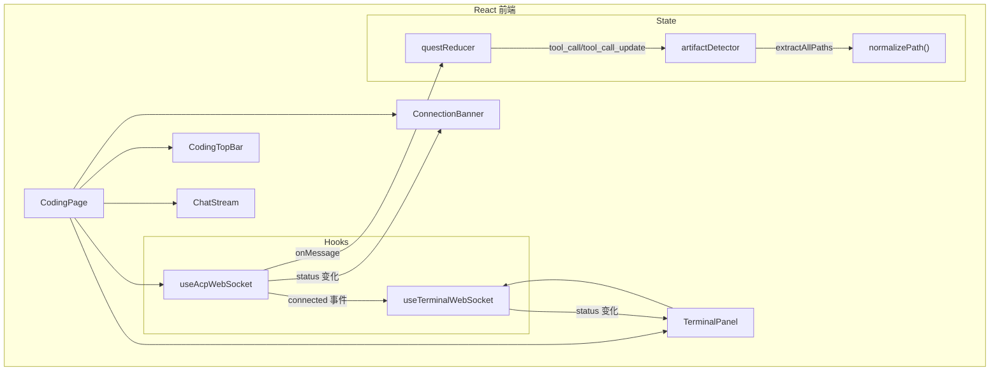
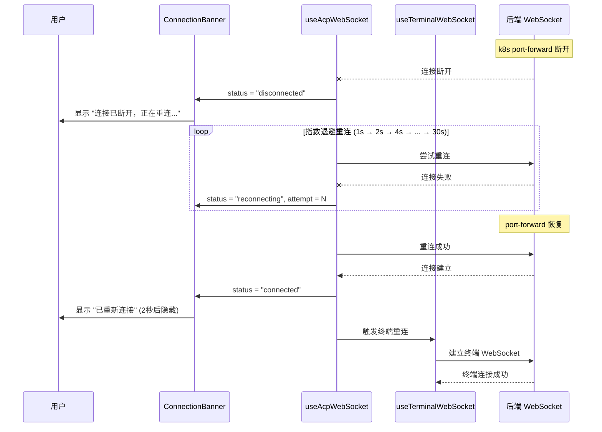
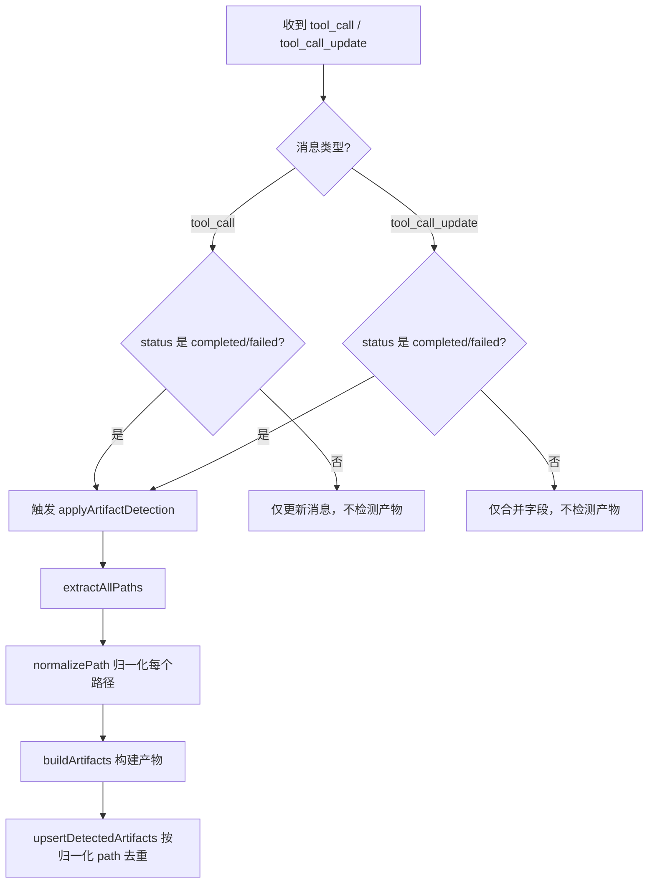

# 设计文档：HiCoding 连接韧性与产物去重优化

## 概述

本特性解决 HiCoding 中两个核心问题：

1. **产物检测重复**：ACP tool_call 消息的产物检测存在多次触发和路径不一致导致的重复问题。`applyArtifactDetection` 在 `tool_call`（完整消息）和 `tool_call_update`（增量更新）两个入口都会触发，同一个 tool_call 可能被检测多次。此外 `rawInput.path` 和 `locations[0].path` 的格式差异（如 `./` 前缀）会绕过按 path 去重的逻辑。

2. **WebSocket 断连不恢复**：当 k8s port-forward 断开时，ACP 和终端的 WebSocket 连接断开后仅重试 2 次就放弃，没有 UI 提示，终端也不会跟随 ACP 重连。用户只能刷新页面。

本设计通过路径归一化、统一检测时机、无限重连策略、断连 UI 提示和终端联动重连来解决这些问题。

## 架构

### 整体组件关系



### WebSocket 重连时序



### 产物检测去重流程



## 组件和接口

### 组件 1：路径归一化工具 — `normalizePath()`

**所在文件**：`artifactDetector.ts`

**接口**：
```typescript
/**
 * 归一化文件路径，消除格式差异：
 * - 移除 "./" 前缀
 * - 合并连续的 "/"
 * - 移除末尾 "/"
 */
function normalizePath(filePath: string): string
```

**职责**：
- 将 `./src/foo.html` 和 `src/foo.html` 归一化为同一路径
- 将 `src//foo.html` 归一化为 `src/foo.html`
- 确保 `extractAllPaths` 和 `upsertDetectedArtifacts` 中的路径比较一致

### 组件 2：产物检测时机控制 — `handleSessionUpdate` 修改

**所在文件**：`QuestSessionContext.tsx`

**接口变更**：
```typescript
// tool_call_update 分支：移除 hasLocationsField 触发条件
// 修改前：
if ((reachedTerminal || hasLocationsField) && mergedToolCall) {
  updated = applyArtifactDetection(updated, mergedToolCall);
}

// 修改后：仅在终态触发
if (reachedTerminal && mergedToolCall) {
  updated = applyArtifactDetection(updated, mergedToolCall);
}
```

**职责**：
- `tool_call_update`：仅在 status 变为 `completed` 或 `failed` 时触发产物检测
- `tool_call`：保持现有逻辑（仅在 `completed`/`failed` 时触发）
- 消除同一个 tool_call 被多次检测的问题

### 组件 3：增强型 ACP WebSocket Hook — `useAcpWebSocket`

**所在文件**：`useAcpWebSocket.ts`

**接口**：
```typescript
type WsStatus = "disconnected" | "connecting" | "connected" | "reconnecting";

interface UseWebSocketOptions {
  url: string;
  onMessage: (data: string) => void;
  onConnected?: (send: (data: string) => void) => void;
  autoConnect?: boolean;
  // 移除 maxReconnectAttempts，改为无限重连
}

interface UseWebSocketReturn {
  status: WsStatus;
  reconnectAttempt: number;  // 新增：当前重连次数
  connect: () => void;
  disconnect: () => void;
  send: (data: string) => void;
  manualReconnect: () => void;  // 新增：手动重连（重置计数器）
}
```

**职责**：
- 连接断开后自动无限重连，使用指数退避（1s → 2s → 4s → ... → 30s 封顶）
- 新增 `reconnecting` 状态，区分"首次连接中"和"断连后重连中"
- 暴露 `reconnectAttempt` 供 UI 展示重连进度
- 提供 `manualReconnect()` 方法，用户点击"重新连接"按钮时重置计数器并立即重连
- 仅在调用 `disconnect()` 时停止重连（用户主动断开或组件卸载）

### 组件 4：增强型终端 WebSocket Hook — `useTerminalWebSocket`

**所在文件**：`useTerminalWebSocket.ts`

**接口**：
```typescript
interface UseTerminalWebSocketOptions {
  url: string;
  onOutput: (data: Uint8Array) => void;
  onExit?: (code: number) => void;
  autoConnect?: boolean;
  // 移除 maxReconnectAttempts，改为无限重连
}

interface UseTerminalWebSocketReturn {
  status: TerminalWsStatus;
  connect: () => void;
  disconnect: () => void;
  sendInput: (data: string) => void;
  sendResize: (cols: number, rows: number) => void;
  reconnect: () => void;  // 新增：外部触发重连
}
```

**职责**：
- 与 ACP WebSocket 相同的无限重连 + 指数退避策略
- 新增 `reconnect()` 方法，供 ACP 重连成功后联动调用
- 重连时自动重新发送 resize 信息

### 组件 5：断连提示横幅 — `ConnectionBanner`

**所在文件**：新建 `components/coding/ConnectionBanner.tsx`

**接口**：
```typescript
interface ConnectionBannerProps {
  acpStatus: WsStatus;
  reconnectAttempt: number;
  onManualReconnect: () => void;
}

function ConnectionBanner(props: ConnectionBannerProps): JSX.Element | null
```

**职责**：
- `acpStatus === "connected"`：不显示（或短暂显示"已重新连接"后自动隐藏）
- `acpStatus === "reconnecting"`：显示黄色横幅 "连接已断开，正在重连...（第 N 次）"
- `acpStatus === "disconnected"`：显示红色横幅 "连接已断开" + "重新连接"按钮
- 横幅固定在聊天区域顶部，不遮挡内容（推挤布局）

### 组件 6：终端重连联动 — `CodingPage` 协调逻辑

**所在文件**：使用 `useAcpWebSocket` 和 `useTerminalWebSocket` 的父组件

**接口**：
```typescript
// 在父组件中监听 ACP status 变化
useEffect(() => {
  if (acpStatus === "connected" && prevAcpStatus === "reconnecting") {
    // ACP 重连成功，触发终端重连
    terminalReconnect();
  }
}, [acpStatus]);
```

**职责**：
- 监听 ACP WebSocket 从 `reconnecting` 变为 `connected` 的状态转换
- 自动触发终端 WebSocket 重连
- 确保终端重连时清理旧的 xterm 输出缓冲

## 数据模型

### WsStatus 枚举扩展

```typescript
// 修改前
type WsStatus = "disconnected" | "connecting" | "connected";

// 修改后
type WsStatus = "disconnected" | "connecting" | "connected" | "reconnecting";
```

**状态转换规则**：
- `disconnected` → `connecting`：首次连接或手动重连
- `connecting` → `connected`：连接成功
- `connecting` → `disconnected`：首次连接失败且无自动重连
- `connected` → `reconnecting`：连接意外断开，开始自动重连
- `reconnecting` → `connected`：重连成功
- `reconnecting` → `reconnecting`：重连失败，继续下一次尝试
- 任意状态 → `disconnected`：调用 `disconnect()`（主动断开）

### 重连配置常量

```typescript
const RECONNECT_CONFIG = {
  baseDelay: 1000,       // 初始重连延迟 1 秒
  maxDelay: 30000,       // 最大重连延迟 30 秒
  backoffMultiplier: 2,  // 指数退避倍数
};
```

### Artifact 路径归一化

```typescript
// artifactDetector.ts 中 extractAllPaths 返回的路径
// 修改前：原始路径，可能包含 "./" 前缀
// 修改后：所有路径经过 normalizePath() 处理

// upsertDetectedArtifacts 中的比较
// 修改前：直接比较 a.path === artifact.path
// 修改后：比较 normalizePath(a.path) === normalizePath(artifact.path)
// 同时 artifact.path 存储归一化后的路径
```

## 错误处理

### 场景 1：port-forward 长时间不可用

**条件**：k8s port-forward 断开超过数分钟
**响应**：WebSocket 持续以 30 秒间隔重连，UI 显示重连次数
**恢复**：port-forward 恢复后自动重连成功，横幅显示"已重新连接"

### 场景 2：后端服务重启

**条件**：后端 Java 服务重启导致 WebSocket 断开
**响应**：与 port-forward 断开相同的重连策略
**恢复**：服务就绪后自动重连，会话状态通过 `onConnected` 回调重新初始化

### 场景 3：网络抖动

**条件**：短暂网络波动导致连接断开
**响应**：1 秒后首次重连，通常立即成功
**恢复**：用户几乎无感知，横幅短暂闪现后消失

### 场景 4：用户主动离开页面

**条件**：组件卸载
**响应**：调用 `disconnect()` 停止重连，清理所有定时器
**恢复**：无需恢复

## 测试策略

### 单元测试

- `normalizePath()`：覆盖 `./`、`//`、尾部 `/`、空字符串、绝对路径等边界情况
- `extractAllPaths()`：验证返回的路径已归一化且去重
- `upsertDetectedArtifacts()`：验证 `./src/a.html` 和 `src/a.html` 被识别为同一产物
- 产物检测时机：验证 `tool_call_update` 中 `hasLocationsField` 不再触发检测

### 属性测试

**属性测试库**：fast-check

- 对任意路径字符串，`normalizePath(normalizePath(p)) === normalizePath(p)`（幂等性）
- 对任意 tool_call 序列，最终产物列表中不存在路径归一化后相同的重复项

### 集成测试

- 模拟 WebSocket 断连 → 重连 → 验证 `ConnectionBanner` 状态转换
- 模拟 ACP 重连成功 → 验证终端 WebSocket 自动重连
- 模拟同一 tool_call 的 update + completed 序列 → 验证产物仅被检测一次

## 性能考虑

- `normalizePath()` 是纯字符串操作，性能开销可忽略
- 指数退避的最大间隔 30 秒避免了高频无效重连对服务端的压力
- `ConnectionBanner` 使用条件渲染，`connected` 状态下不产生 DOM 节点
- 产物检测从"每次 update 都触发"改为"仅终态触发"，减少了 reducer 中的计算量

## 安全考虑

- WebSocket 重连时复用原有 URL（包含 token 参数），不需要额外的认证流程
- 如果 token 过期导致重连失败（服务端返回 401 关闭），应引导用户重新登录而非无限重连
- `manualReconnect()` 不暴露任何敏感信息

## 依赖

- 无新增外部依赖
- 使用现有的 React hooks、lucide-react 图标库、Tailwind CSS
- `ConnectionBanner` 组件风格与现有 `ErrorMessage` 组件保持一致

## 正确性属性

*属性是一种在系统所有有效执行中都应成立的特征或行为——本质上是关于系统应该做什么的形式化陈述。属性是人类可读规范与机器可验证正确性保证之间的桥梁。*

### 属性 1：路径归一化幂等性

*对任意*文件路径字符串 p，`normalizePath(normalizePath(p))` 应等于 `normalizePath(p)`。即对同一路径多次归一化的结果与单次归一化的结果完全相同。

**验证: 需求 1.4**

### 属性 2：产物路径去重不变量

*对任意* tool_call 消息序列（包含 tool_call 和 tool_call_update），经过 Artifact_Detector 处理后的最终产物列表中，不存在两个产物的路径经过 normalizePath 归一化后相同。

**验证: 需求 1.5, 2.4**

### 属性 3：指数退避延迟上界

*对任意*重连尝试次数 N（N ≥ 0），计算出的重连延迟应等于 `min(baseDelay × 2^N, maxDelay)`，即延迟不超过 maxDelay（30 秒），且每次尝试时 reconnectAttempt 计数器正确递增。

**验证: 需求 3.2, 3.6**

### 属性 4：disconnect 终止不变量

*对任意* WebSocket 状态（disconnected、connecting、connected、reconnecting），调用 `disconnect()` 后状态应变为 `disconnected`，且不再有后续的重连尝试。

**验证: 需求 3.4, 4.4, 7.4**

### 属性 5：ConnectionBanner 重连次数显示

*对任意*正整数 N 作为 reconnectAttempt，当 acpStatus 为 `reconnecting` 时，ConnectionBanner 渲染的内容应包含该重连次数 N。

**验证: 需求 5.1**
