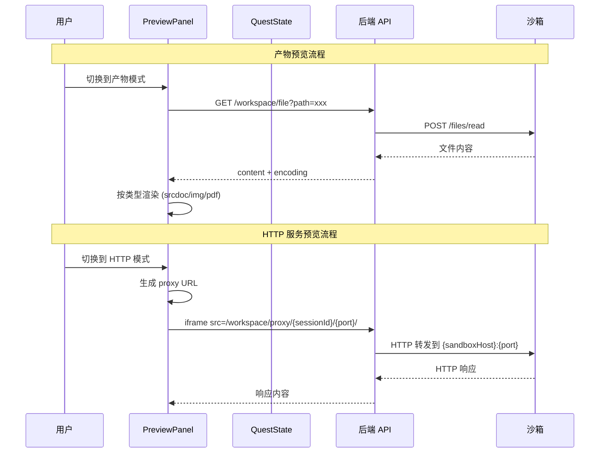
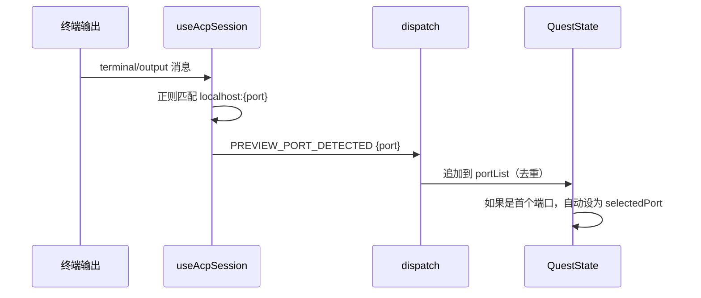

# 设计文档：HiCoding 预览系统架构改造

## 概述

本次改造将 HiCoding 预览面板从"单端口 HTTP 预览"重构为"产物预览 + HTTP 服务预览"双模式架构。核心变更包括：

1. **双模式预览面板**：产物预览（Artifact Preview）和 HTTP 服务预览（HTTP Preview）两种模式可自由切换
2. **多端口管理**：从 `previewPort: number | null` 升级为端口列表 + 当前选中端口的结构
3. **反向代理**：改造现有 `DevProxyController`，支持按 sessionId 路由到对应沙箱的指定端口（Remote 模式）
4. **产物渲染**：复用现有 workspace API 读取文件内容，在前端按类型渲染（HTML/图片/PDF/PPT）

### 当前架构问题

- `PreviewPanel` 只接受单个 `port`，无法管理多端口
- `getPreviewUrl()` 直接拼接 `sandboxHost:port`，Remote 模式下浏览器无法直连
- `PREVIEW_PORT_DETECTED` action 每次覆盖 `previewPort`，丢失历史端口
- 产物预览和 HTTP 预览混在一起，没有独立的模式切换

### 改造后架构

```
┌─────────────────────────────────────────────────┐
│                  PreviewPanel                    │
│  ┌──────────────┐  ┌──────────────────────────┐ │
│  │ 模式切换按钮  │  │ 工具栏（端口选择/刷新等）│ │
│  └──────────────┘  └──────────────────────────┘ │
│  ┌──────────────────────────────────────────────┐│
│  │  ArtifactPreviewPane  │  HttpPreviewPane     ││
│  │  (srcdoc/img/pdf/ppt) │  (iframe → proxy)    ││
│  └──────────────────────────────────────────────┘│
└─────────────────────────────────────────────────┘
         │                        │
         ▼                        ▼
   workspace API            DevProxyController
   (读取文件内容)         /workspace/proxy/{sessionId}/{port}/**
                                  │
                                  ▼
                          沙箱 http://{host}:{port}
```

## 架构

### 整体数据流



### 端口检测流程



## 组件与接口

### 1. PreviewPanel 组件（重构）

当前 `PreviewPanel` 是一个简单的 iframe 包装器。改造后拆分为：

```typescript
// PreviewPanel.tsx — 主容器
interface PreviewPanelProps {
  sessionId: string | null;
  previewState: PreviewPortState;
  artifacts: Artifact[];
  activeArtifactId: string | null;
  onPortSelect: (port: number) => void;
  onAddPort: (port: number) => void;
  onSelectArtifact: (artifactId: string) => void;
}

type PreviewMode = "artifact" | "http";
```

内部子组件：
- **PreviewToolbar**：模式切换按钮、端口选择器、刷新/外部打开按钮、产物文件名显示
- **ArtifactPreviewPane**：根据产物类型渲染内容（HTML→srcdoc, 图片→img, PDF→pdf viewer, PPT→转换后展示）
- **HttpPreviewPane**：iframe 嵌入反向代理 URL
- **PortSelector**：端口下拉菜单 + 手动输入入口
- **EmptyState**：无产物且无端口时的引导提示

### 2. DevProxyController（改造）

现有控制器按 `/{port}/**` 路由，直接代理到 localhost。改造为按 `/{sessionId}/{port}/**` 路由，根据 sessionId 查找沙箱 host。

```java
// 改造后的路径格式
@RequestMapping("/{sessionId}/{port}/**")
public Mono<ResponseEntity<byte[]>> proxy(
    @PathVariable String sessionId,
    @PathVariable int port,
    HttpServletRequest request,
    @RequestBody(required = false) byte[] body)
```

需要注入 `AcpConnectionManager` 来查找 sessionId 对应的沙箱信息。由于 `AcpConnectionManager` 当前不存储 sandboxHost，需要新增一个映射。

### 3. AcpConnectionManager（扩展）

新增 `sandboxHostMap` 存储每个 WebSocket session 对应的沙箱 host：

```java
private final ConcurrentHashMap<String, String> sandboxHostMap = new ConcurrentHashMap<>();

// 在 registerConnection 或沙箱初始化成功后调用
public void setSandboxHost(String sessionId, String host) { ... }
public String getSandboxHost(String sessionId) { ... }
```

注意：这里的 sessionId 是 WebSocket session ID，而前端传给 proxy 的 sessionId 是 ACP session ID（由 `session/new` 返回）。需要建立 ACP sessionId → WebSocket sessionId 的映射，或者直接用 userId 作为查找键。

**设计决策**：使用 WebSocket sessionId 作为 proxy 的路由键。前端在 `QUEST_CREATED` 时已知 WebSocket 连接对应的 sessionId，可以直接使用。但考虑到 WebSocket sessionId 是后端内部 ID，前端不可见，改为：

- 在 `AcpConnectionManager` 中新增 `userSandboxMap: ConcurrentHashMap<String, SandboxConnectionInfo>`
- key 为 userId，value 包含 sandboxHost 和 sidecarPort
- DevProxyController 通过当前认证用户的 userId 查找沙箱信息
- proxy URL 格式简化为 `/workspace/proxy/{port}/**`，sessionId 从认证 token 中获取 userId

**最终方案**：保留 `/{sessionId}/{port}/**` 格式，但 sessionId 使用前端可见的 ACP session ID。在 `AcpConnectionManager` 中新增 `acpSessionSandboxMap` 映射 ACP sessionId → sandbox host。在 `rewriteSessionNewCwd` 拦截 `session/new` 响应时记录映射。

考虑到实现复杂度，采用更简单的方案：

**采用方案**：proxy URL 使用 `/{port}/**` 格式（保持现有路径），通过认证 token 中的 userId 查找沙箱 host。每个用户同时只有一个活跃沙箱连接，userId 足以唯一定位。

### 4. QuestState 状态变更

```typescript
// 新增端口状态结构
interface PreviewPortState {
  ports: number[];          // 已检测到的端口列表（有序、去重）
  selectedPort: number | null;  // 当前选中的端口
}

// QuestData 变更
interface QuestData {
  // 移除: previewPort: number | null;
  // 新增:
  previewPorts: PreviewPortState;
  // artifacts 和 activeArtifactId 已存在，无需变更
}
```

### 5. 新增 Reducer Actions

```typescript
// 改造现有 action
| { type: "PREVIEW_PORT_DETECTED"; questId: string; port: number }
// 行为变更：追加到 ports 列表（去重），首个端口自动设为 selectedPort

// 新增 actions
| { type: "PREVIEW_PORT_SELECTED"; questId: string; port: number }
| { type: "PREVIEW_PORT_ADDED"; questId: string; port: number }
```

### 6. 预览 URL 生成

```typescript
// workspaceApi.ts — 改造 getPreviewUrl
export function getPreviewUrl(port: number): string {
  // Remote 模式：通过后端反向代理
  return `/workspace/proxy/${port}/`;
}
```

不再需要 `sandboxHost` 参数，所有请求都走后端代理。

## 数据模型

### 前端状态模型

```typescript
// 端口管理状态
interface PreviewPortState {
  ports: number[];              // 已检测到的端口列表，有序去重
  selectedPort: number | null;  // 当前选中端口
}

// QuestData 中的变更字段
interface QuestData {
  // ... 现有字段 ...
  previewPorts: PreviewPortState;  // 替代 previewPort: number | null
  artifacts: Artifact[];            // 已存在
  activeArtifactId: string | null;  // 已存在
}
```

### 后端数据模型

```java
// AcpConnectionManager 新增映射
// userId → sandbox host（Remote 模式下沙箱地址）
private final ConcurrentHashMap<String, String> userSandboxHostMap = new ConcurrentHashMap<>();
```

### Artifact 类型（已存在，无需变更）

```typescript
type ArtifactType = "html" | "markdown" | "svg" | "image" | "pdf" | "file";

interface Artifact {
  id: string;
  toolCallId: string;
  type: ArtifactType;
  path: string;
  fileName: string;
  content: string | null;
  updatedAt: number;
}
```

### 端口校验规则

- 有效范围：1024 - 65535
- 去重：同一端口只保留一条记录
- 自动选中：首个检测到的端口自动设为 selectedPort


## 正确性属性

*属性是一种在系统所有有效执行中都应成立的特征或行为——本质上是关于系统应该做什么的形式化陈述。属性是人类可读规范与机器可验证正确性保证之间的桥梁。*

### Property 1: 端口列表追加与去重

*For any* 端口检测事件序列（每个端口在 1024-65535 范围内），将这些端口依次通过 `PREVIEW_PORT_DETECTED` action 应用到初始空状态后，最终的 `ports` 列表应该包含所有不重复的端口，且列表中无重复元素。

**Validates: Requirements 3.1, 3.2, 6.3, 8.1**

### Property 2: 端口范围校验

*For any* 整数 n，端口校验函数 `isValidPort(n)` 返回 true 当且仅当 1024 ≤ n ≤ 65535。

**Validates: Requirements 3.5, 6.2**

### Property 3: 终端输出端口检测

*For any* 包含 `localhost:{port}` 或 `127.0.0.1:{port}` 模式的字符串（port 为 1024-65535 范围内的数字），端口检测正则应该能正确提取出该端口号。对于不包含这些模式的字符串，不应提取到任何端口。

**Validates: Requirements 6.1**

### Property 4: 代理 URL 生成格式

*For any* 有效端口号 port（1024-65535）和任意路径字符串 path，`getPreviewUrl(port)` 生成的 URL 应该匹配 `/workspace/proxy/{port}/` 格式。

**Validates: Requirements 4.3, 5.1**

### Property 5: 响应头过滤

*For any* HTTP 响应头集合，经过 DevProxy 的头过滤逻辑后，结果中不应包含 `transfer-encoding` 和 `connection` 头。其他头应该被保留。

**Validates: Requirements 4.4**

### Property 6: 端口切换状态更新

*For any* 包含多个端口的 `PreviewPortState`，当 dispatch `PREVIEW_PORT_SELECTED` action 指定一个列表中存在的端口时，`selectedPort` 应该更新为该端口，`ports` 列表不变。

**Validates: Requirements 8.2**

### Property 7: 端口状态序列化 round-trip

*For any* 有效的 `PreviewPortState`（ports 列表非空、selectedPort 在列表中），序列化为 JSON 再反序列化后应该得到等价的对象。

**Validates: Requirements 8.3**

## 错误处理

### 前端错误处理

| 场景 | 处理方式 |
|------|---------|
| 产物文件读取失败 | 显示错误信息 + 重试按钮（需求 2.6） |
| 手动输入端口超出范围 | 输入框显示校验错误提示（需求 3.5） |
| iframe 加载超时/失败 | 显示连接失败提示 + 刷新按钮 |
| 无产物且无端口 | 显示空状态引导（需求 1.4） |

### 后端错误处理

| 场景 | HTTP 状态码 | 描述 |
|------|-----------|------|
| 沙箱不可达 | 502 | "Proxy error: Connection refused"（需求 4.5） |
| userId 无对应沙箱 | 404 | "No active sandbox found"（需求 4.6） |
| 端口超出范围 | 400 | "Invalid port: must be 1024-65535" |
| 代理超时 | 504 | 30 秒超时（需求 4.7） |

## 测试策略

### 属性测试（Property-Based Testing）

使用 `fast-check` 库进行属性测试，每个属性至少运行 100 次迭代。

每个属性测试必须用注释标注对应的设计属性：

```typescript
// Feature: hicoding-preview-revamp, Property 1: 端口列表追加与去重
```

属性测试覆盖：
- **Property 1**: 生成随机端口序列（含重复），验证 reducer 处理后的去重和完整性
- **Property 2**: 生成随机整数，验证端口校验函数的边界行为
- **Property 3**: 生成包含/不包含端口模式的随机字符串，验证正则提取
- **Property 4**: 生成随机端口和路径，验证 URL 格式
- **Property 5**: 生成随机 HTTP 头集合，验证过滤逻辑
- **Property 6**: 生成随机端口状态和切换操作，验证状态更新
- **Property 7**: 生成随机 PreviewPortState，验证 JSON round-trip

### 单元测试

单元测试聚焦于具体示例和边界情况：

- **PreviewPanel 渲染**：验证不同模式下的组件渲染（需求 1.1-1.6, 2.2-2.5, 7.1-7.5）
- **DevProxyController**：验证 502/404 错误响应（需求 4.5, 4.6）
- **边界情况**：空产物列表、空端口列表、端口边界值（1024, 65535, 1023, 65536）

### 测试工具

- 前端属性测试：`fast-check` + `vitest`
- 前端组件测试：`@testing-library/react` + `vitest`
- 后端单元测试：`JUnit 5` + `WebTestClient`（Spring WebFlux 测试）
