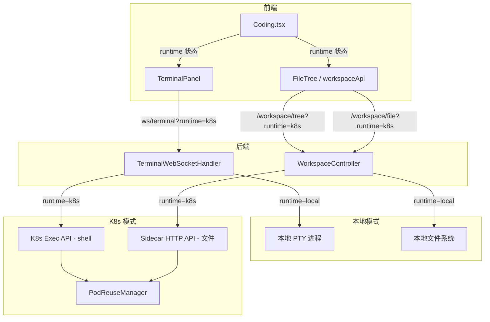
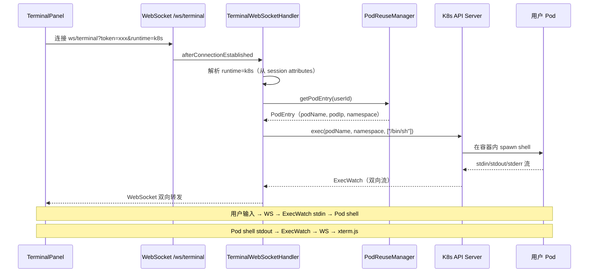
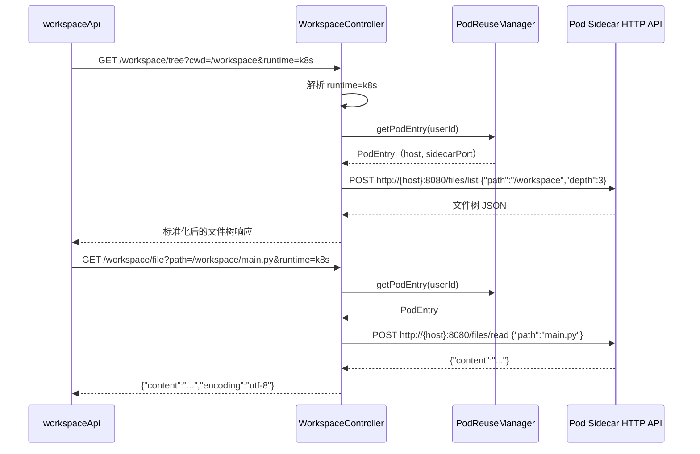

# 技术设计文档：HiCoding 终端与文件树 K8s 沙箱对接

## 概述

HiCoding（Coding 页面）在选择 K8s 沙箱运行时后，终端（TerminalPanel）和文件树/文件内容（WorkspaceController）仍然连接本地服务器。本设计将这两个模块改造为根据 runtime 类型动态选择数据源：本地模式保持现有行为，K8s 模式通过 Pod 内 Sidecar HTTP API 读取文件、通过 K8s Exec API 在 Pod 内 spawn 交互式 shell。

核心改造点：
1. **终端**：`TerminalWebSocketHandler` 根据 runtime 参数选择本地 PTY 或 K8s Pod Exec 两种终端后端
2. **文件树/文件内容**：`WorkspaceController` 根据 runtime 参数选择本地文件系统或 Sidecar HTTP API 两种数据源
3. **前端**：`TerminalPanel` 和 `workspaceApi` 传递 runtime 参数，使后端能区分运行时类型

## 架构

### 整体架构



### 终端连接流程（K8s 模式）



### 文件操作流程（K8s 模式）




## 组件与接口

### 后端组件

#### 1. TerminalWebSocketHandler 改造

**当前状态**：`afterConnectionEstablished` 直接创建本地 `TerminalProcess`，无 runtime 概念。

**改造方案**：引入 `TerminalBackend` 接口抽象终端后端，根据 runtime 参数创建不同实现。

```java
/**
 * 终端后端抽象接口。
 * 统一本地 PTY 和 K8s Exec 两种终端实现。
 */
interface TerminalBackend {
    /** 启动终端 */
    void start(int cols, int rows) throws IOException;
    /** 写入用户输入 */
    void write(String data) throws IOException;
    /** 调整终端大小 */
    void resize(int cols, int rows);
    /** 终端输出流（响应式） */
    Flux<byte[]> output();
    /** 终端是否存活 */
    boolean isAlive();
    /** 关闭终端 */
    void close();
}
```

**LocalTerminalBackend**：封装现有 `TerminalProcess`，行为不变。

**K8sTerminalBackend**：通过 K8s Exec API 在 Pod 内执行 `/bin/sh`，将 stdin/stdout 双向桥接到 WebSocket。

```java
/**
 * K8s Pod 内的终端后端。
 * 通过 fabric8 K8s client 的 exec API 在 Pod 容器内 spawn shell。
 */
class K8sTerminalBackend implements TerminalBackend {
    private final KubernetesClient k8sClient;
    private final String podName;
    private final String namespace;
    private final String containerName;
    private ExecWatch execWatch;
    
    @Override
    public void start(int cols, int rows) throws IOException {
        // 使用 K8s exec API 在 Pod 内启动交互式 shell
        // 设置 TTY=true 以支持交互式终端
        execWatch = k8sClient.pods()
            .inNamespace(namespace)
            .withName(podName)
            .inContainer(containerName)
            .redirectingInput()
            .redirectingOutput()
            .redirectingError()
            .withTTY()
            .exec("/bin/sh", "-l");
        // 从 execWatch.getOutput() 读取输出 → outputSink
    }
    
    @Override
    public void write(String data) throws IOException {
        // 写入 execWatch.getInput()
        execWatch.getInput().write(data.getBytes(StandardCharsets.UTF_8));
        execWatch.getInput().flush();
    }
    
    @Override
    public void resize(int cols, int rows) {
        // K8s exec API 的 resize 通过 execWatch.resize(cols, rows) 实现
        execWatch.resize(cols, rows);
    }
}
```

**TerminalWebSocketHandler 改造后的核心逻辑**：

```java
@Override
public void afterConnectionEstablished(WebSocketSession session) throws Exception {
    String userId = (String) session.getAttributes().get("userId");
    String runtimeParam = (String) session.getAttributes().get("runtime");
    boolean isK8s = "k8s".equalsIgnoreCase(runtimeParam);
    
    TerminalBackend backend;
    if (isK8s) {
        // K8s 模式：从 PodReuseManager 获取用户的 Pod 信息
        PodEntry podEntry = podReuseManager.getPodEntry(userId);
        if (podEntry == null) {
            session.close(CloseStatus.SERVER_ERROR);
            return;
        }
        KubernetesClient client = k8sConfigService.getClient("default");
        backend = new K8sTerminalBackend(client, podEntry.getPodName(), 
                                          "himarket", "sandbox");
    } else {
        // 本地模式：保持现有行为
        String cwd = buildWorkspacePath(userId);
        backend = new LocalTerminalBackend(cwd);
    }
    
    backend.start(80, 24);
    backendMap.put(session.getId(), backend);
    // ... 订阅 output 流，转发到 WebSocket（逻辑不变）
}
```

#### 2. WorkspaceController 改造

**当前状态**：所有端点直接读本地文件系统。

**改造方案**：新增 `runtime` 查询参数，K8s 模式下通过 Sidecar HTTP API 操作 Pod 内文件。

```java
@GetMapping("/tree")
public ResponseEntity<?> getDirectoryTree(
        @RequestParam String cwd,
        @RequestParam(defaultValue = "3") int depth,
        @RequestParam(required = false) String runtime) {
    String userId = getCurrentUserId();
    
    if ("k8s".equalsIgnoreCase(runtime)) {
        return getDirectoryTreeFromK8s(userId, cwd, depth);
    }
    // 本地模式：保持现有逻辑不变
    return getDirectoryTreeLocal(userId, cwd, depth);
}

@GetMapping("/file")
public ResponseEntity<?> readFile(
        @RequestParam String path,
        @RequestParam(defaultValue = "false") boolean raw,
        @RequestParam(required = false) String runtime) {
    String userId = getCurrentUserId();
    
    if ("k8s".equalsIgnoreCase(runtime)) {
        return readFileFromK8s(userId, path);
    }
    // 本地模式：保持现有逻辑不变
    return readFileLocal(userId, path, raw);
}
```

**K8s 文件操作的实现**：

```java
private ResponseEntity<?> getDirectoryTreeFromK8s(String userId, String cwd, int depth) {
    PodEntry podEntry = podReuseManager.getPodEntry(userId);
    if (podEntry == null) {
        return ResponseEntity.status(503).body(Map.of("error", "沙箱未就绪"));
    }
    String host = resolveAccessHost(podEntry);
    // 调用 Sidecar HTTP API 获取文件树
    String url = "http://" + host + ":8080/files/list";
    // POST { "path": cwd, "depth": depth }
    // 将 Sidecar 返回的文件列表转换为前端期望的树形结构
}

private ResponseEntity<?> readFileFromK8s(String userId, String path) {
    PodEntry podEntry = podReuseManager.getPodEntry(userId);
    if (podEntry == null) {
        return ResponseEntity.status(503).body(Map.of("error", "沙箱未就绪"));
    }
    String host = resolveAccessHost(podEntry);
    // 调用 Sidecar HTTP API 读取文件
    String url = "http://" + host + ":8080/files/read";
    // POST { "path": relativePath }
}
```

#### 3. RemoteWorkspaceService（新增）

抽取 K8s 文件操作为独立 Service，供 WorkspaceController 调用，避免 Controller 直接处理 HTTP 调用逻辑。

```java
@Service
public class RemoteWorkspaceService {
    private final PodReuseManager podReuseManager;
    private final K8sConfigService k8sConfigService;
    private final HttpClient httpClient;
    private final ObjectMapper objectMapper;
    
    /**
     * 获取 Pod 内的目录树。
     * 通过 Sidecar HTTP API /files/list 实现。
     */
    public Map<String, Object> getDirectoryTree(String userId, String cwd, int depth) 
            throws IOException {
        PodEntry podEntry = podReuseManager.getPodEntry(userId);
        String host = resolveAccessHost(podEntry);
        // POST http://{host}:8080/files/list {"path": cwd, "depth": depth}
        // 将 Sidecar 返回的文件列表转换为前端期望的树形结构
    }
    
    /**
     * 读取 Pod 内的文件内容。
     */
    public String readFile(String userId, String filePath) throws IOException {
        PodEntry podEntry = podReuseManager.getPodEntry(userId);
        String host = resolveAccessHost(podEntry);
        // POST http://{host}:8080/files/read {"path": filePath}
    }
    
    /**
     * 获取 Pod 内的文件变更列表（用于轮询）。
     */
    public List<WorkspaceChange> getChanges(String userId, String cwd, long since) 
            throws IOException {
        // 通过 Sidecar API 获取文件变更
    }
    
    private String resolveAccessHost(PodEntry podEntry) {
        return podEntry.getServiceIp() != null && !podEntry.getServiceIp().isBlank()
            ? podEntry.getServiceIp() : podEntry.getPodIp();
    }
}
```

### 前端组件

#### 1. TerminalPanel 改造

**当前状态**：`buildTerminalWsUrl()` 不传递 runtime 参数。

**改造方案**：接收 runtime prop，构建 WebSocket URL 时附加 runtime 参数。

```typescript
interface TerminalPanelProps {
  height: number;
  collapsed: boolean;
  onToggleCollapse: () => void;
  runtime?: string;  // 新增：运行时类型
}

function buildTerminalWsUrl(runtime?: string): string {
  const protocol = window.location.protocol === "https:" ? "wss:" : "ws:";
  const base = `${protocol}//${window.location.host}/ws/terminal`;
  const params = new URLSearchParams();
  const token = localStorage.getItem("access_token");
  if (token) params.set("token", token);
  if (runtime) params.set("runtime", runtime);
  const qs = params.toString();
  return qs ? `${base}?${qs}` : base;
}
```

**关键变更**：当 runtime 变化时（如从 local 切换到 k8s），需要重新建立 WebSocket 连接。通过 `wsUrl` 状态变化触发 `useTerminalWebSocket` 重连。

#### 2. workspaceApi 改造

**当前状态**：API 调用不传递 runtime 参数。

**改造方案**：所有 API 函数新增可选 `runtime` 参数。

```typescript
export async function fetchDirectoryTree(
  cwd: string, 
  depth = 5, 
  runtime?: string
): Promise<FileNode[]> {
  const resp: FileNode = await request.get("/workspace/tree", {
    params: { cwd, depth, ...(runtime ? { runtime } : {}) },
  });
  return resp.children ?? [];
}

export async function fetchArtifactContent(
  filePath: string,
  opts?: { raw?: boolean; runtime?: string }
): Promise<ArtifactContentResult> {
  const resp: FileContentResponse = await request.get("/workspace/file", {
    params: { 
      path: filePath, 
      raw: opts?.raw === true,
      ...(opts?.runtime ? { runtime: opts.runtime } : {}),
    },
  });
  return { content: resp.content ?? null, encoding: resp.encoding ?? null, error: null };
}

export async function fetchWorkspaceChanges(
  cwd: string, 
  since: number, 
  limit = 200,
  runtime?: string
): Promise<WorkspaceChange[]> {
  const resp: WorkspaceChangesResponse = await request.get("/workspace/changes", {
    params: { cwd, since, limit, ...(runtime ? { runtime } : {}) },
  });
  return resp.changes ?? [];
}
```

#### 3. Coding.tsx 改造

**改造方案**：将 `currentRuntimeRef.current` 传递给 TerminalPanel 和所有 workspaceApi 调用。

```typescript
// TerminalPanel 传递 runtime
<TerminalPanel
  height={terminalPanel.size}
  collapsed={terminalCollapsed}
  onToggleCollapse={toggleTerminalCollapse}
  runtime={currentRuntimeRef.current}
/>

// 文件树加载传递 runtime
fetchDirectoryTree(activeQuest.cwd, 5, currentRuntimeRef.current)

// 文件内容加载传递 runtime
fetchArtifactContent(filePath, { raw: true, runtime: currentRuntimeRef.current })

// 文件变更轮询传递 runtime
fetchWorkspaceChanges(cwd, lastPollRef.current, 200, currentRuntimeRef.current)
```


## 数据模型

### TerminalBackend 接口

| 方法 | 参数 | 返回值 | 说明 |
|------|------|--------|------|
| start | cols: int, rows: int | void | 启动终端进程 |
| write | data: String | void | 写入用户输入 |
| resize | cols: int, rows: int | void | 调整终端大小 |
| output | - | Flux<byte[]> | 终端输出的响应式流 |
| isAlive | - | boolean | 终端进程是否存活 |
| close | - | void | 关闭终端 |

### TerminalBackend 实现对比

| 特性 | LocalTerminalBackend | K8sTerminalBackend |
|------|---------------------|-------------------|
| 底层技术 | pty4j PTY 进程 | fabric8 K8s Exec API |
| 工作目录 | 本地 `{workspaceRoot}/{userId}` | Pod 内 `/workspace` |
| Shell | `/bin/zsh -l` | `/bin/sh -l`（Pod 内可用 shell） |
| TTY 支持 | pty4j 原生支持 | K8s exec `withTTY()` |
| Resize | `PtyProcess.setWinSize()` | `ExecWatch.resize()` |
| 生命周期 | 随 WebSocket 连接创建/销毁 | 随 WebSocket 连接创建/销毁，Pod 由 PodReuseManager 管理 |

### WorkspaceController 新增参数

| 端点 | 新增参数 | 类型 | 默认值 | 说明 |
|------|---------|------|--------|------|
| GET /workspace/tree | runtime | String | null（等同 local） | 运行时类型 |
| GET /workspace/file | runtime | String | null（等同 local） | 运行时类型 |
| GET /workspace/changes | runtime | String | null（等同 local） | 运行时类型 |
| POST /workspace/upload | runtime | String | null（等同 local） | 运行时类型 |

### WebSocket URL 参数

| 端点 | 参数 | 说明 |
|------|------|------|
| ws/terminal | token | JWT 认证 token |
| ws/terminal | runtime | 运行时类型（local/k8s），新增 |

### Sidecar HTTP API（Pod 内）

| 端点 | 方法 | 请求体 | 响应 | 说明 |
|------|------|--------|------|------|
| /files/read | POST | `{"path":"relative/path"}` | `{"content":"..."}` | 读取文件内容（已有） |
| /files/write | POST | `{"path":"...","content":"..."}` | 200 OK | 写入文件（已有） |
| /files/list | POST | `{"path":"/workspace","depth":3}` | `[{"name":"src","type":"dir","children":[...]},...]` | 获取目录树（新增） |
| /health | GET | - | 200 OK | 健康检查（已有） |

### K8s 文件树获取策略

所有文件操作（读取、写入、目录树）统一通过 Sidecar HTTP API 实现，保持一致性和稳定性。

需要扩展 Sidecar 新增 `/files/list` 端点用于目录树获取：

| 端点 | 方法 | 请求体 | 响应 | 说明 |
|------|------|--------|------|------|
| /files/list | POST | `{"path":"/workspace","depth":3}` | `[{"name":"src","type":"dir","children":[...]},...]` | 获取目录树 |

设计理由：
1. 与 `/files/read`、`/files/write` 保持一致的 HTTP API 风格
2. 避免使用 K8s Exec 通道执行 find 命令（exec 通道不稳定，且项目已从 exec 迁移到 Sidecar）
3. `PodFileSystemAdapter` 已标记 `@deprecated`，不应再新增依赖

### 废弃代码清理

`PodFileSystemAdapter` 已标记 `@deprecated`（项目已从 exec 方式迁移到 Sidecar HTTP API），本次改造需一并清理：
- 删除 `PodFileSystemAdapter.java`
- 删除所有对 `PodFileSystemAdapter` 的引用和导入
- 确保无其他代码依赖该类

## 错误处理

### 终端错误处理

| 场景 | 处理方式 |
|------|---------|
| K8s Pod 未找到（getPodEntry 返回 null） | 关闭 WebSocket，发送 `{"type":"exit","code":-1}` |
| K8s Exec 连接失败 | 关闭 WebSocket，发送 exit 消息，前端显示"终端连接失败" |
| K8s Exec 连接中断 | 触发 outputSink complete，前端显示 "[Shell exited]" |
| Pod 被驱逐/重启 | ExecWatch 关闭，终端自动断开，前端可重连 |
| 本地 PTY 启动失败 | 保持现有行为：关闭 WebSocket，返回 SERVER_ERROR |

### 文件操作错误处理

| 场景 | 处理方式 |
|------|---------|
| K8s Pod 未找到 | 返回 503 `{"error":"沙箱未就绪"}` |
| Sidecar 不可达 | 返回 502 `{"error":"沙箱连接失败"}` |
| Sidecar 返回错误 | 透传错误信息，返回对应 HTTP 状态码 |
| 文件不存在（K8s） | Sidecar 返回 404，Controller 透传 |
| 本地文件操作失败 | 保持现有行为不变 |

### 前端错误处理

| 场景 | 处理方式 |
|------|---------|
| 终端 WebSocket 断开（K8s） | 显示 "[Shell exited]"，状态点变红，自动重连（已有逻辑） |
| 文件树加载失败（K8s） | 显示空树 + "加载失败"提示 |
| 文件内容加载失败（K8s） | 显示错误 toast（已有逻辑） |
| runtime 切换时终端重连 | wsUrl 变化触发 useTerminalWebSocket 重连 |

## 测试策略

### 单元测试

#### 后端

| 测试类 | 覆盖范围 |
|--------|---------|
| `K8sTerminalBackendTest` | K8s exec 启动、输入输出转发、resize、关闭 |
| `LocalTerminalBackendTest` | 封装后的本地 PTY 行为不变 |
| `TerminalWebSocketHandlerTest` | runtime 参数解析、本地/K8s 分支选择 |
| `RemoteWorkspaceServiceTest` | Sidecar API 调用、exec 文件树构建、错误处理 |
| `WorkspaceControllerTest` | runtime 参数路由、本地/K8s 分支 |

#### 前端

| 测试文件 | 覆盖范围 |
|---------|---------|
| `TerminalPanel.test.tsx` | runtime prop 传递、WebSocket URL 构建 |
| `workspaceApi.test.ts` | runtime 参数附加、API 调用 |

### 集成测试

| 测试场景 | 说明 |
|---------|------|
| 本地终端端到端 | 连接 → 输入命令 → 收到输出 → 关闭 |
| K8s 终端端到端 | 连接（mock K8s client）→ 输入 → 输出 → 关闭 |
| 本地文件树 | 请求 /workspace/tree → 返回本地目录结构 |
| K8s 文件树 | 请求 /workspace/tree?runtime=k8s → 通过 exec 返回 Pod 目录结构 |

### 属性测试

| 属性 | 测试库 | 说明 |
|------|--------|------|
| buildTerminalWsUrl 参数完整性 | fast-check | 任意 runtime 值都正确附加到 URL |
| WorkspaceController runtime 路由 | jqwik | 任意 runtime 值正确路由到对应实现 |

## 性能考虑

- **K8s Exec 延迟**：exec API 建立连接有一定延迟（~100-500ms），但终端是长连接，只在首次连接时有感知
- **文件树 exec 性能**：`find` 命令在大目录下可能较慢，通过 `-maxdepth` 限制深度（默认 3 层）
- **Sidecar 文件读取**：HTTP 调用延迟约 10-50ms，对用户体验影响可忽略
- **文件变更轮询**：K8s 模式下轮询需要 exec 调用，可适当增大轮询间隔（如 5s → 10s）

## 安全考虑

- **路径遍历防护**：K8s 模式下，Sidecar 和 exec 命令的路径参数需要验证，防止访问 `/workspace` 之外的目录
- **Pod 隔离**：每个用户有独立的 Pod，终端和文件操作限定在用户自己的 Pod 内
- **认证**：终端 WebSocket 和文件 API 都通过 `AcpHandshakeInterceptor` / JWT 认证，K8s 模式额外通过 userId 关联 Pod

## 依赖

| 依赖 | 用途 | 状态 |
|------|------|------|
| fabric8 kubernetes-client | K8s Exec API | 已有 |
| PodReuseManager | 获取用户 Pod 信息 | 已有 |
| K8sConfigService | 获取 K8s client | 已有 |
| AcpHandshakeInterceptor | WebSocket 认证 + runtime 参数解析 | 已有 |
| pty4j | 本地 PTY 终端 | 已有 |
| Sidecar HTTP API | Pod 内文件读写和目录树 | 已有（/files/read, /files/write），需新增 /files/list |

## 正确性属性

*正确性属性是系统在所有有效执行中都应保持为真的特征或行为——本质上是关于系统应该做什么的形式化陈述。属性是人类可读规范与机器可验证正确性保证之间的桥梁。*

### Property 1: 终端 runtime 路由正确性

*对于任意* runtime 字符串值，当值为 "k8s"（不区分大小写）时，TerminalWebSocketHandler 应创建 K8sTerminalBackend 实例；当值为 "local"、null、空字符串或其他任意值时，应创建 LocalTerminalBackend 实例。两种情况互斥且完备。

**Validates: Requirements 1.1, 1.2**

### Property 2: 文件 API runtime 路由正确性

*对于任意* WorkspaceController 端点（/workspace/tree、/workspace/file、/workspace/changes）和任意 runtime 参数值，当 runtime 为 "k8s" 时应通过 RemoteWorkspaceService 获取数据；当 runtime 为 "local"、null 或缺失时应从本地文件系统获取数据。路由决策仅取决于 runtime 参数值。

**Validates: Requirements 3.1, 3.2, 3.3, 3.4, 3.5, 3.6**

### Property 3: 终端 WebSocket URL 参数完整性

*对于任意* 非空 runtime 字符串，buildTerminalWsUrl(runtime) 生成的 URL 应包含 `runtime` 查询参数且值与输入一致；当 runtime 为 undefined 时，URL 不应包含 runtime 参数。URL 始终为合法的 WebSocket URL 格式。

**Validates: Requirements 6.2, 6.3**

### Property 4: K8s 终端双向数据完整性

*对于任意* 用户输入字节序列 data，通过 K8sTerminalBackend.write(data) 写入的数据应完整到达 ExecWatch 的 stdin 流；ExecWatch stdout 产生的输出应完整通过 output() 响应式流传递。数据不应丢失、截断或乱序。

**Validates: Requirements 2.2, 2.3**

### Property 5: workspaceApi runtime 参数传递正确性

*对于任意* workspaceApi 函数（fetchDirectoryTree、fetchArtifactContent、fetchWorkspaceChanges）和任意 runtime 参数值，当 runtime 非空时 HTTP 请求应包含 runtime 查询参数且值一致；当 runtime 为 undefined 时请求不应包含 runtime 参数。

**Validates: Requirements 7.1, 7.2, 7.3, 7.4**

### Property 6: Sidecar 文件列表转换完整性

*对于任意* Sidecar /files/list 返回的合法 JSON 文件列表，RemoteWorkspaceService 转换后的树形结构应保留所有文件和目录条目，不丢失任何条目，且目录层级关系与原始数据一致。

**Validates: Requirement 4.3**

### Property 7: Pod 访问地址解析正确性

*对于任意* PodEntry 对象，当 serviceIp 非空且非空白时 resolveAccessHost 应返回 serviceIp；否则应返回 podIp。返回值始终为非空字符串。

**Validates: Requirement 4.4**

### Property 8: K8s 文件路径安全验证

*对于任意* 文件操作路径字符串，RemoteWorkspaceService 应验证路径解析后位于 /workspace 目录范围内。包含路径遍历字符（如 "../"）且解析后超出 /workspace 范围的路径应被拒绝。

**Validates: Requirements 12.1, 12.2**
