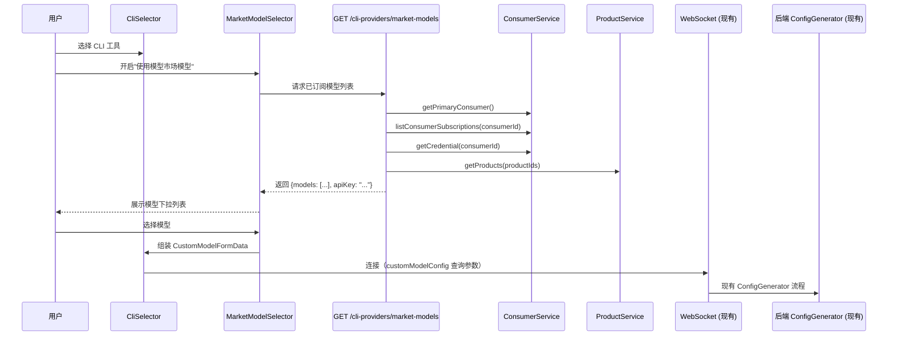
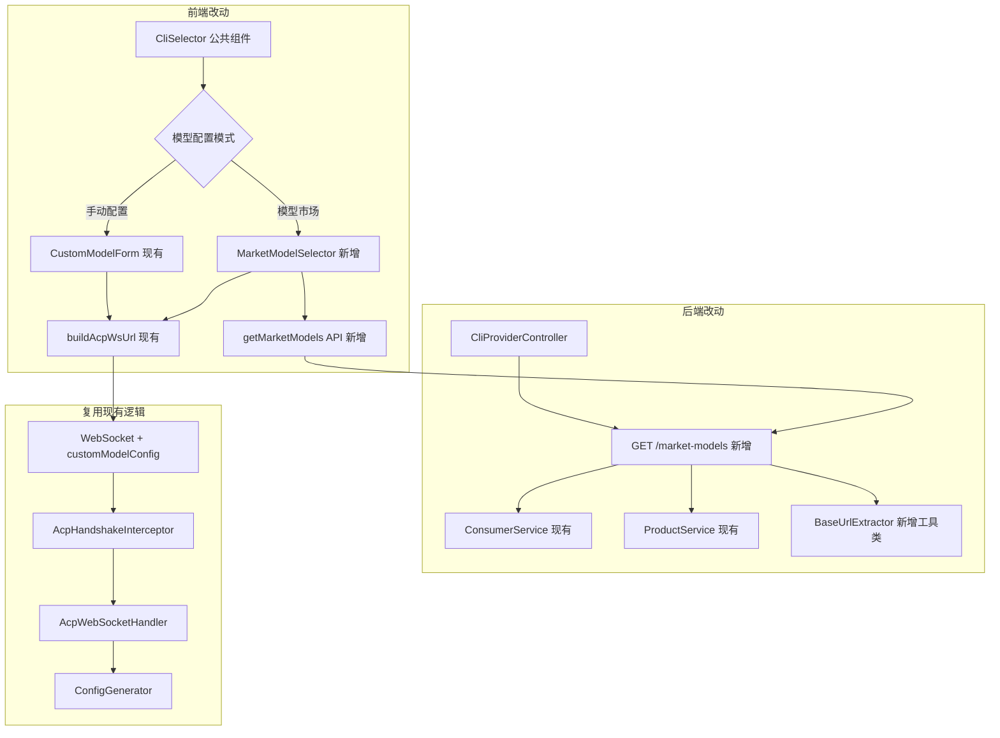

# 设计文档：HiMarket 模型市场集成

## 概述

本功能在现有 CLI 自定义模型配置（cli-custom-model-config）基础上，增加从 HiMarket 模型市场直接选择已发布模型的能力。核心思路是：

1. 后端新增一个轻量接口，聚合开发者的订阅信息、产品详情和凭证，返回可直接使用的模型列表
2. 前端新增 MarketModelSelector 组件，嵌入公共 CliSelector 中，与现有 CustomModelForm 并列
3. 用户选择模型后，前端自动组装 CustomModelConfig，复用现有的 WebSocket 传递和后端 ConfigGenerator 机制

设计原则：
- 最小化改动：后端仅新增一个接口，不修改现有 CustomModelConfig 和 ConfigGenerator 逻辑
- 前端改动集中在公共 CliSelector 组件，HiCli/HiCoding/HiWork 三个模块自动获得新能力
- BaseUrl 提取逻辑封装为独立工具方法，便于测试

## 架构





## 组件与接口

### 1. MarketModelInfo 响应 DTO（后端新增）

```java
@Data
@Builder
public class MarketModelInfo {
    private String productId;     // 产品 ID
    private String name;          // 产品名称（如 "daofeng-qwen-max"）
    private String modelId;       // 模型 ID（如 "qwen-max"，来自 feature.modelFeature.model）
    private String baseUrl;       // 拼接后的模型接入点 URL
    private String protocolType;  // 协议类型（"openai" | "anthropic"）
    private String description;   // 产品描述
}
```

### 2. MarketModelsResponse 响应 DTO（后端新增）

```java
@Data
@Builder
public class MarketModelsResponse {
    private List<MarketModelInfo> models;  // 已订阅的模型列表
    private String apiKey;                  // 开发者的 consumer apiKey，可能为 null
}
```

### 3. BaseUrlExtractor 工具类（后端新增）

从 MODEL_API 产品的路由配置中提取 baseUrl 的纯函数工具类：

```java
public class BaseUrlExtractor {
    
    /**
     * 从产品的路由配置中提取 baseUrl。
     * 
     * @param routes 产品的路由列表
     * @return 提取的 baseUrl，如果路由数据不完整则返回 null
     */
    public static String extract(List<HttpRouteResult> routes) {
        // 1. 取 routes[0].domains[0]
        // 2. 拼接 protocol://domain[:port]
        // 3. 从 match.path.value 中去掉 /chat/completions 后缀作为 pathPrefix
        // 4. 标准端口（http:80, https:443）或 null 时省略端口
    }
}
```

提取规则：
- 输入：`routes[0].domains[0]` 的 `{protocol, domain, port}` + `routes[0].match.path.value`
- path 处理：去掉 `/chat/completions` 后缀（如 `/qwen3-max/v1/chat/completions` → `/qwen3-max/v1`）
- 端口处理：null、http:80、https:443 时省略，其他情况包含
- 输出示例：`http://apigateway.cnkirito.cn/qwen3-max/v1`

### 4. ProtocolTypeMapper 工具方法（后端新增）

```java
public class ProtocolTypeMapper {
    /**
     * 将 aiProtocols 列表映射为 CustomModelConfig 的 protocolType。
     * 包含 "OpenAI" 的映射为 "openai"，包含 "Anthropic" 的映射为 "anthropic"，
     * 其他默认为 "openai"。
     */
    public static String map(List<String> aiProtocols) {
        if (aiProtocols == null || aiProtocols.isEmpty()) return "openai";
        String first = aiProtocols.get(0);
        if (first.toLowerCase().contains("openai")) return "openai";
        if (first.toLowerCase().contains("anthropic")) return "anthropic";
        return "openai";
    }
}
```

### 5. CliProviderController 扩展（后端改动）

在现有 CliProviderController 中新增接口：

```java
@Operation(summary = "获取当前开发者已订阅的模型市场模型列表")
@GetMapping("/market-models")
@DeveloperAuth
public MarketModelsResponse listMarketModels() {
    // 1. 获取 Primary Consumer
    // 2. 获取订阅列表，筛选 MODEL_API + APPROVED
    // 3. 批量获取产品详情
    // 4. 获取 credential 中的 apiKey
    // 5. 对每个产品提取 baseUrl、modelId、protocolType
    // 6. 组装响应
}
```

该接口需要注入 ConsumerService 和 ProductService。

### 6. MarketModelSelector 前端组件（新增）

```typescript
interface MarketModelSelectorProps {
  /** 是否启用（开关状态） */
  enabled: boolean;
  /** 选择模型后回调，data 为 null 表示未选择或数据不完整 */
  onChange: (data: CustomModelFormData | null) => void;
}
```

组件内部状态：
- `loading`: 加载状态
- `error`: 错误信息
- `models`: MarketModelInfo 列表
- `apiKey`: 开发者的 apiKey
- `selectedProductId`: 当前选中的产品 ID

### 7. CliSelector 公共组件改动

在现有 CliSelector 中增加模型配置模式管理：

```typescript
type ModelConfigMode = 'none' | 'custom' | 'market';
```

- `none`：不使用自定义模型
- `custom`：使用手动自定义模型（现有 CustomModelForm）
- `market`：使用模型市场模型（新增 MarketModelSelector）

两个开关互斥：开启一个自动关闭另一个。

### 8. 前端 API 扩展（cliProvider.ts）

```typescript
export interface MarketModelInfo {
  productId: string;
  name: string;
  modelId: string;
  baseUrl: string;
  protocolType: string;
  description: string;
}

export interface MarketModelsResponse {
  models: MarketModelInfo[];
  apiKey: string | null;
}

export function getMarketModels() {
  return request.get<RespI<MarketModelsResponse>, RespI<MarketModelsResponse>>(
    "/cli-providers/market-models"
  );
}
```

## 数据模型

### MarketModelsResponse（接口响应）

| 字段 | 类型 | 说明 |
|------|------|------|
| models | MarketModelInfo[] | 已订阅的 MODEL_API 模型列表 |
| apiKey | String \| null | 开发者 Primary Consumer 的 apiKey，无凭证时为 null |

### MarketModelInfo

| 字段 | 类型 | 来源 | 说明 |
|------|------|------|------|
| productId | String | ProductResult.productId | 产品唯一标识 |
| name | String | ProductResult.name | 产品名称 |
| modelId | String | ProductResult.feature.modelFeature.model | 模型标识符 |
| baseUrl | String | BaseUrlExtractor.extract(routes) | 拼接后的模型接入点 URL |
| protocolType | String | ProtocolTypeMapper.map(aiProtocols) | 协议类型 |
| description | String | ProductResult.description | 产品描述 |

### 字段映射关系（模型市场 → CustomModelConfig）

| CustomModelConfig 字段 | 来源 |
|------------------------|------|
| baseUrl | MarketModelInfo.baseUrl |
| apiKey | MarketModelsResponse.apiKey |
| modelId | MarketModelInfo.modelId |
| modelName | MarketModelInfo.name |
| protocolType | MarketModelInfo.protocolType |

### BaseUrl 提取规则

输入示例（来自产品 API 返回）：
```json
{
  "routes": [{
    "domains": [{
      "domain": "apigateway.cnkirito.cn",
      "port": null,
      "protocol": "http"
    }],
    "match": {
      "path": {
        "value": "/qwen3-max/v1/chat/completions",
        "type": "Exact"
      }
    }
  }]
}
```

提取步骤：
1. protocol = `"http"`
2. domain = `"apigateway.cnkirito.cn"`
3. port = `null` → 省略
4. pathPrefix = `"/qwen3-max/v1/chat/completions"` 去掉 `"/chat/completions"` → `"/qwen3-max/v1"`
5. 结果：`"http://apigateway.cnkirito.cn/qwen3-max/v1"`


## 正确性属性

*正确性属性是一种在系统所有合法执行中都应成立的特征或行为——本质上是关于系统应该做什么的形式化陈述。属性是人类可读规范与机器可验证正确性保证之间的桥梁。*

### Property 1: BaseUrl 提取正确性

*对于任意*包含有效 protocol、domain、port 和 path 的路由配置，BaseUrlExtractor 提取的 baseUrl 应满足：
1. 以 `{protocol}://` 开头
2. 包含 domain
3. 当 port 为 null 或标准端口（http:80, https:443）时不包含端口，否则包含 `:{port}`
4. 当 path 以 `/chat/completions` 结尾时，pathPrefix 为去掉该后缀的部分；否则使用完整 path
5. 最终格式为 `{protocol}://{domain}[:{port}]{pathPrefix}`

**Validates: Requirements 1.7, 5.1, 5.2, 5.3, 5.4, 5.5, 5.6**

### Property 2: 协议类型映射正确性

*对于任意* aiProtocols 字符串列表，ProtocolTypeMapper 的映射结果应满足：
1. 如果列表为空或 null，返回 "openai"
2. 如果第一个元素包含 "openai"（不区分大小写），返回 "openai"
3. 如果第一个元素包含 "anthropic"（不区分大小写），返回 "anthropic"
4. 其他情况返回 "openai"
5. 返回值始终是 "openai" 或 "anthropic" 之一

**Validates: Requirements 1.8**

### Property 3: 订阅筛选正确性

*对于任意*包含不同 productType 和 status 组合的订阅列表，筛选后的结果应仅包含 productType 为 MODEL_API 且 status 为 APPROVED 的订阅，且不遗漏任何符合条件的订阅。

**Validates: Requirements 1.3**

### Property 4: 模型市场数据到 CustomModelFormData 组装正确性

*对于任意*有效的 MarketModelInfo 和非 null 的 apiKey，组装的 CustomModelFormData 应满足：
1. baseUrl 等于 MarketModelInfo.baseUrl
2. apiKey 等于响应中的 apiKey
3. modelId 等于 MarketModelInfo.modelId
4. modelName 等于 MarketModelInfo.name
5. protocolType 等于 MarketModelInfo.protocolType

**Validates: Requirements 2.5, 3.5**

### Property 5: 模式切换状态互斥性

*对于任意*模式切换操作序列（none → custom → market → none 等），在任意时刻：
1. 最多只有一种模式处于激活状态
2. 切换到新模式时，前一个模式的配置数据被清除
3. 切换到 none 时，所有配置数据被清除

**Validates: Requirements 3.1, 3.2, 3.3**

## 错误处理

| 场景 | 处理方式 | 相关需求 |
|------|----------|----------|
| 开发者没有 Primary Consumer | 返回空模型列表，apiKey 为 null | 1.5 |
| 有 Consumer 但无 MODEL_API 订阅 | 返回空模型列表，apiKey 正常返回 | 1.6 |
| Consumer 无 credential 或 apiKeyConfig 为空 | apiKey 返回 null，前端提示配置凭证 | 1.10, 2.6 |
| 产品 modelConfig/routes 数据不完整 | 跳过该产品，记录警告日志 | 1.9 |
| 前端接口调用失败（网络错误等） | 显示错误信息，提供重试按钮 | 2.8 |
| 用户未登录（匿名访问） | 显示"请先登录"提示 | 2.9 |
| 模型列表为空 | 显示"暂无已订阅模型"提示 | 2.7 |
| getPrimaryConsumer 抛出异常 | 捕获异常，返回空列表和 null apiKey | 1.5 |

## 测试策略

### 属性测试（Property-Based Testing）

后端使用 **jqwik**（项目已配置），前端使用 **fast-check**（项目已配置）。

每个属性测试至少运行 100 次迭代，使用随机生成的输入数据。

| 属性 | 测试位置 | 框架 | 说明 |
|------|----------|------|------|
| Property 1: BaseUrl 提取正确性 | 后端 Java 测试 | jqwik | 生成随机 protocol/domain/port/path 组合 |
| Property 2: 协议类型映射正确性 | 后端 Java 测试 | jqwik | 生成随机 aiProtocols 列表 |
| Property 3: 订阅筛选正确性 | 后端 Java 测试 | jqwik | 生成随机订阅列表（混合类型和状态） |
| Property 4: 组装正确性 | 前端 TypeScript 测试 | fast-check | 生成随机 MarketModelInfo 和 apiKey |
| Property 5: 模式切换互斥性 | 前端 TypeScript 测试 | fast-check | 生成随机模式切换序列 |

每个属性测试必须包含注释引用设计文档中的属性编号：
```java
// Feature: himarket-model-integration, Property 1: BaseUrl 提取正确性
```

### 单元测试

单元测试覆盖具体示例、边界条件和错误处理：

**后端：**
- BaseUrlExtractor：port 为 null、标准端口、非标准端口的具体示例
- BaseUrlExtractor：path 有/无 `/chat/completions` 后缀的具体示例
- ProtocolTypeMapper：各种 aiProtocols 值的映射示例
- CliProviderController.listMarketModels：无 Primary Consumer、无订阅、有订阅的场景
- CliProviderController.listMarketModels：产品数据不完整时跳过的场景

**前端：**
- MarketModelSelector 组件：加载中、加载成功、空列表、apiKey 为 null、接口失败的渲染
- CliSelector 模式切换：custom ↔ market ↔ none 的状态变化
- getMarketModels API 函数：正常响应和错误响应的处理
