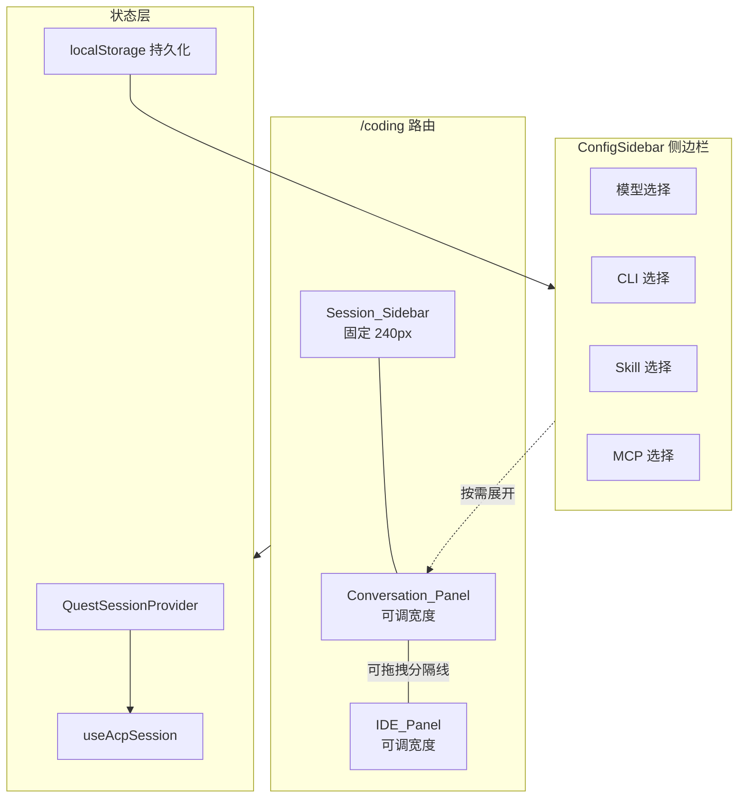
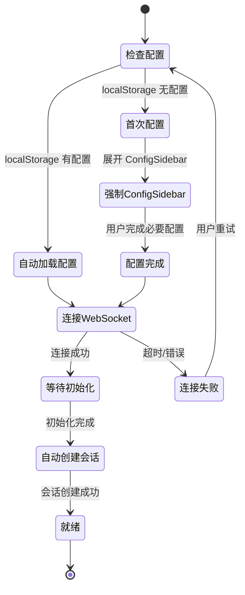
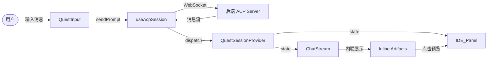

# 设计文档：HiWork 与 HiCoding 合并

## 概述

本设计将 HiWork（Quest）的对话式 Agent 交互功能整合到 HiCoding 页面中，形成一个统一的以对话为核心的 IDE 体验。合并后的 HiCoding_Page 采用三栏布局：左侧固定宽度的 Session_Sidebar（240px）、中间的 Conversation_Panel、右侧的 IDE_Panel（支持 Code/Preview 切换）。

核心变更：
- 移除 HiWork 独立标签页和路由，`/quest` 重定向到 `/coding`
- 删除 HiWork（Quest）页面及其专用前端组件
- 用 ConfigSidebar 替代 WelcomePage + CliSelector 的配置流程
- Artifacts/Diff/Terminal 从独立的 RightPanel 改为在 ChatStream 中内联展示
- IDE_Panel 默认展示 Preview 模式，可切换到 Code 模式
- 配置持久化到 localStorage，首次使用强制完成配置
- 新增简单的后端 CRUD 接口和数据库表，用于 HiCoding 会话数据的持久化存储（V1 简单方案，后续优化）

本次以前端重构为主，后端仅新增一个 `coding_session` 表和对应的简单 CRUD REST 接口，用于会话持久化。所有现有后端服务（ACP WebSocket、REST API、沙箱管理等）均为 HiCoding/HiWork/HiCli 共享基础设施，不存在仅为 HiWork 服务的后端代码，无需删除或修改。详见"后端影响分析"章节。

## 架构

### 整体架构

合并后的页面仍然基于现有的 React + TypeScript 技术栈，复用 `QuestSessionProvider` 状态管理和 `useAcpSession` WebSocket 通信层。



### 页面生命周期



### 数据流



## 组件与接口

### 组件层级结构

```
Coding (页面入口)
└── Layout
    └── QuestSessionProvider
        └── CodingContent (核心逻辑)
            ├── Session_Sidebar (固定 240px)
            │   ├── 新建会话按钮
            │   ├── 会话列表 (按创建时间倒序)
            │   ├── 连接状态指示器
            │   └── ConfigSidebar 入口按钮
            ├── Conversation_Panel (可调宽度)
            │   ├── ConversationTopBar (会话标题 + 状态)
            │   ├── ChatStream (消息流 + 内联 Artifacts)
            │   │   ├── 文本消息
            │   │   ├── InlineArtifact (Artifact 预览块)
            │   │   ├── InlineDiff (Diff 变更块)
            │   │   └── InlineTerminal (Terminal 输出块)
            │   ├── PlanDisplay (可选)
            │   └── QuestInput (输入区域)
            ├── ResizeHandle (可拖拽分隔线)
            ├── IDE_Panel (可调宽度)
            │   ├── IDE 模式切换栏 (Code / Preview)
            │   ├── Preview_Mode
            │   │   └── PreviewPanel
            │   └── Code_Mode
            │       ├── FileTree (可折叠)
            │       ├── EditorArea
            │       └── TerminalPanel
            ├── ConfigSidebar (按需展开的侧边栏)
            │   ├── 模型选择区
            │   ├── CLI 选择区
            │   ├── Skill 选择区
            │   └── MCP 选择区
            └── PermissionDialog (权限弹窗)
```

### 关键组件接口

#### Session_Sidebar

改造自现有 `QuestSidebar`，固定宽度 240px（原为 `w-56` ≈ 224px）。

```typescript
interface SessionSidebarProps {
  onCreateQuest: () => void;
  onSwitchQuest: (questId: string) => void;
  onCloseQuest: (questId: string) => void;
  onOpenConfig: () => void;        // 新增：打开 ConfigSidebar
  status: WsStatus;
  creatingQuest?: boolean;
}
```

变更点：
- 移除 `onSwitchTool` 回调，改为 `onOpenConfig` 打开 ConfigSidebar
- 固定宽度从 `w-56` 改为 `w-60`（240px）
- 标题从 "HiWork" 改为 "HiCoding"
- 底部增加 ConfigSidebar 入口按钮（齿轮图标）

#### ConfigSidebar

新组件，替代 WelcomePage + CliSelector + QuestTopBar 中的模型选择。以 Drawer/侧边栏形式从右侧或左侧滑出。

```typescript
interface CodingConfig {
  modelId: string | null;           // 选中的模型 ID
  cliProviderId: string | null;     // 选中的 CLI 工具 ID
  cliRuntime: string;               // 运行时类型: "local" | "k8s"
  cliSessionConfig?: string;        // CLI 会话配置
  skills: string[];                 // 选中的 Skill ID 列表
  mcpServers: string[];             // 选中的 MCP Server ID 列表
}

interface ConfigSidebarProps {
  open: boolean;
  onClose: () => void;
  config: CodingConfig;
  onConfigChange: (config: CodingConfig) => void;
  isFirstTime: boolean;             // 首次使用标记，控制是否可关闭
  availableModels: ModelInfo[];
  onConnect: (config: CodingConfig) => void;  // 确认配置并连接
}
```

localStorage key: `hicoding:config`

#### InlineArtifact

新组件，在 ChatStream 消息流中内联展示 Artifact/Diff/Terminal 内容。

```typescript
type InlineBlockType = 'artifact' | 'diff' | 'terminal';

interface InlineArtifactProps {
  type: InlineBlockType;
  title: string;
  children: React.ReactNode;        // 具体内容（ArtifactPreview / ChangesView / TerminalView）
  defaultExpanded?: boolean;         // 默认展开，默认 true
  onPreviewClick?: () => void;       // 点击预览时回调（仅 artifact 类型）
}
```

#### IDE_Panel 模式切换

复用现有 Coding.tsx 中的 Code/Preview 切换逻辑，但调整默认值：

```typescript
type IDEMode = 'preview' | 'code';

// 默认模式改为 'preview'（原为 'code'）
const [ideMode, setIdeMode] = useState<IDEMode>('preview');
```

自动切换规则：
- Agent 编辑文件时 → 自动切换到 Code 模式并打开文件（保留现有逻辑）
- 检测到 previewPort 时 → 自动切换到 Preview 模式（保留现有逻辑）
- 用户点击 InlineArtifact 预览块 → 切换到 Preview 模式

#### ConversationTopBar

简化版的顶部栏，替代 QuestTopBar 和 CodingTopBar。模型选择移入 ConfigSidebar，顶部栏只保留会话标题和状态信息。

```typescript
interface ConversationTopBarProps {
  status: WsStatus;
  questTitle: string;
  usage?: { used: number; size: number; cost?: { amount: number } };
}
```

### 路由变更

```typescript
// router.tsx 变更
// 移除: <Route path="/quest" element={<Quest />} />
// 新增: <Route path="/quest" element={<Navigate to="/coding" />} />
// 保留: <Route path="/coding" element={<Coding />} />
```

### Header 导航变更

```typescript
// Header.tsx tabs 数组变更
const tabs = [
  { path: "/chat", label: "HiChat" },
  { path: "/hicli", label: "HiCli" },
  { path: "/coding", label: "HiCoding" },
  // 移除: { path: "/quest", label: "HiWork" },
  { path: "/agents", label: "智能体" },
  { path: "/mcp", label: "MCP" },
  { path: "/models", label: "模型" },
  { path: "/apis", label: "API" },
  { path: "/skills", label: "Skills" },
];
```


## 数据模型

### CodingConfig（配置数据模型）

存储在 localStorage 中的配置对象，key 为 `hicoding:config`。

```typescript
interface CodingConfig {
  modelId: string | null;           // 选中的市场模型 ID
  cliProviderId: string | null;     // 选中的 CLI 工具 ID
  cliRuntime: string;               // 运行时类型: "local" | "k8s"
  cliSessionConfig?: string;        // CLI 会话配置 JSON
  skills: string[];                 // 选中的 Skill ID 列表
  mcpServers: string[];             // 选中的 MCP Server ID 列表
}

// 默认配置
const DEFAULT_CONFIG: CodingConfig = {
  modelId: null,
  cliProviderId: null,
  cliRuntime: "local",
  skills: [],
  mcpServers: [],
};
```

必要配置项（首次使用时必须完成）：
- `modelId` — 不能为 null
- `cliProviderId` — 不能为 null

### 面板尺寸持久化

复用现有 `useResizable` hook 的 localStorage 持久化机制，key 规划：

| Key | 说明 | 默认值 |
|-----|------|--------|
| `hicoding:conversationWidth` | Conversation_Panel 宽度 | 420px |
| `hicoding:fileTreeWidth` | FileTree 宽度 | 200px |
| `hicoding:terminalHeight` | Terminal 高度 | 200px |
| `hicoding:fileTreeVisible` | FileTree 是否可见 | true |
| `hicoding:terminalCollapsed` | Terminal 是否折叠 | false |

Session_Sidebar 固定 240px，不持久化。

### QuestState（复用现有）

现有 `QuestSessionContext` 中的 `QuestState` 和 `QuestData` 接口保持不变，合并后的页面直接复用：

```typescript
// 现有接口，无需修改
interface QuestState {
  quests: Record<string, QuestData>;
  activeQuestId: string | null;
  initialized: boolean;
  models: ModelInfo[];
  usage: UsageInfo | null;
  sandboxStatus: SandboxStatus | null;
  pendingPermission: PermissionRequest | null;
}

interface QuestData {
  id: string;
  title: string;
  cwd: string;
  createdAt: number;
  messages: ChatItem[];
  artifacts: Artifact[];
  isProcessing: boolean;
  promptQueue: QueuedPromptItem[];
  currentModelId: string | null;
  availableModels: ModelInfo[];
  openFiles: OpenFile[];
  activeFilePath: string | null;
  activeArtifactId: string | null;
  previewPort: number | null;
}
```

### InlineBlock 数据模型

内联展示块的数据结构，用于在 ChatStream 中渲染 Artifact/Diff/Terminal：

```typescript
type InlineBlockType = 'artifact' | 'diff' | 'terminal';

interface InlineBlockData {
  type: InlineBlockType;
  id: string;                       // 唯一标识
  title: string;                    // 显示标题
  expanded: boolean;                // 展开/折叠状态
}
```

内联块的数据来源于现有的 `ChatItem` 消息类型：
- `artifact` → 从 `QuestData.artifacts` 中获取
- `diff` → 从 `ChatItemToolCall.content` 中 `type === "diff"` 的条目获取
- `terminal` → 从 `ChatItemToolCall.content` 中 `type === "terminal"` 的条目获取

这些数据已经存在于 `QuestSessionContext` 中，无需新增后端接口。

### CodingSession 数据模型（数据库持久化）

用于将 HiCoding 会话数据持久化到数据库的数据模型。

```typescript
// 前端使用的会话持久化数据结构
interface CodingSession {
  sessionId: string;                // UUID，会话唯一标识
  title: string | null;             // 会话标题
  config: CodingConfig | null;      // 会话配置快照
  sessionData: {                    // 会话完整数据（V1 简单 JSON 存储）
    messages: ChatItem[];           // 消息历史
    artifacts: Artifact[];          // Artifact 列表
    openFiles: OpenFile[];          // 打开的文件列表
    activeFilePath: string | null;  // 当前活跃文件
    previewPort: number | null;     // 预览端口
  } | null;
  createdAt: string;                // ISO 时间戳
  updatedAt: string;                // ISO 时间戳
}
```

对应后端 Java Entity：

```java
@Entity
@Table(name = "coding_session")
public class CodingSessionEntity {
    @Id
    @GeneratedValue(strategy = GenerationType.IDENTITY)
    private Long id;

    @Column(name = "session_id", nullable = false, unique = true)
    private String sessionId;

    @Column(name = "user_id", nullable = false)
    private String userId;

    private String title;

    @Column(columnDefinition = "json")
    private String config;          // JSON 字符串

    @Column(name = "session_data", columnDefinition = "json")
    private String sessionData;     // JSON 字符串

    private LocalDateTime createdAt;
    private LocalDateTime updatedAt;
}
```


## 后端影响分析

### 现有后端服务：共享基础设施，无需变更

| 后端模块 | 说明 | 使用方 | 结论 |
|----------|------|--------|------|
| WebSocket 端点 `/ws/acp`（AcpWebSocketHandler） | ACP 协议的 WebSocket 入口 | HiCoding、HiWork、HiCli | 共享，保留 |
| ACP 运行时服务（沙箱管理、文件系统适配器） | 沙箱创建/销毁、K8s/Local 运行时适配 | HiCoding、HiWork、HiCli | 共享，保留 |
| REST API `/cli-providers` | CLI 工具列表查询 | HiCoding、HiWork | 共享，保留 |
| REST API `/runtime/available` | 可用运行时查询 | HiCoding、HiWork | 共享，保留 |
| REST API `/api/workspace/*` | 工作区文件操作（目录树、文件内容、变更） | HiCoding | 保留 |
| Session/Chat API `/sessions` | HiChat 会话和聊天消息管理 | HiChat | 与 HiWork 无关，保留 |
| QuestSessionContext / useAcpSession | 前端状态管理和 WebSocket 通信层 | HiCoding、HiWork 共用 | 前端共享代码，保留 |

### 新增后端：HiCoding 会话持久化（V1 简单方案）

为了让 HiCoding 的会话数据在页面刷新或重新登录后不丢失，新增一个简单的数据库持久化方案。V1 采用最简方式实现，后续再进行细致化优化。

#### 新增数据库表：`coding_session`

参考现有 `chat_session` 表的设计模式，新增 `coding_session` 表（Flyway 迁移文件 `V9__Add_coding_session_table.sql`）：

```sql
CREATE TABLE IF NOT EXISTS `coding_session` (
    `id` bigint NOT NULL AUTO_INCREMENT,
    `session_id` varchar(64) NOT NULL,          -- 会话唯一标识（UUID）
    `user_id` varchar(64) NOT NULL,             -- 所属用户 ID
    `title` varchar(255) DEFAULT NULL,          -- 会话标题
    `config` json DEFAULT NULL,                 -- 会话配置快照（CodingConfig JSON）
    `session_data` json DEFAULT NULL,           -- 会话数据（消息历史、artifacts 等，JSON 存储）
    `created_at` datetime(3) DEFAULT CURRENT_TIMESTAMP(3),
    `updated_at` datetime(3) DEFAULT CURRENT_TIMESTAMP(3) ON UPDATE CURRENT_TIMESTAMP(3),
    PRIMARY KEY (`id`),
    UNIQUE KEY `uk_session_id` (`session_id`),
    KEY `idx_user_id` (`user_id`),
    KEY `idx_updated_at` (`updated_at`)
) ENGINE=InnoDB DEFAULT CHARSET=utf8mb4 COLLATE=utf8mb4_unicode_ci;
```

设计说明：
- `config` 字段以 JSON 格式存储 `CodingConfig`（模型、CLI、Skill、MCP 选择），方便后续扩展
- `session_data` 字段以 JSON 格式存储会话的完整数据（消息列表、artifacts 等），V1 采用整体存储的简单方案
- 后续优化方向：可将消息拆分到独立表、增加分页查询、增加数据压缩等

#### 新增 REST API 端点：`/coding-sessions`

参考现有 `SessionController` 的模式，新增 `CodingSessionController`，提供简单的 CRUD 接口：

| 方法 | 路径 | 说明 | 认证 |
|------|------|------|------|
| `POST` | `/coding-sessions` | 创建新会话 | `@DeveloperAuth` |
| `GET` | `/coding-sessions` | 获取当前用户的会话列表（按 updated_at 倒序） | `@DeveloperAuth` |
| `GET` | `/coding-sessions/{sessionId}` | 获取单个会话详情（含完整 session_data） | `@DeveloperAuth` |
| `PUT` | `/coding-sessions/{sessionId}` | 更新会话（标题、配置、数据） | `@DeveloperAuth` |
| `DELETE` | `/coding-sessions/{sessionId}` | 删除会话 | `@DeveloperAuth` |

请求/响应示例：

```typescript
// 创建会话请求
interface CreateCodingSessionParam {
  title?: string;
  config?: CodingConfig;
}

// 更新会话请求
interface UpdateCodingSessionParam {
  title?: string;
  config?: CodingConfig;
  sessionData?: object;   // 完整的会话数据 JSON
}

// 会话响应
interface CodingSessionResult {
  sessionId: string;
  title: string | null;
  config: CodingConfig | null;
  sessionData: object | null;  // 仅在 GET /{sessionId} 时返回，列表接口不返回
  createdAt: string;
  updatedAt: string;
}
```

#### 前端集成方式

前端在以下时机调用后端接口进行持久化：
- 创建新会话时 → `POST /coding-sessions`
- 会话标题变更时 → `PUT /coding-sessions/{sessionId}`
- 会话消息更新时 → `PUT /coding-sessions/{sessionId}`（防抖，避免频繁写入）
- 页面加载时 → `GET /coding-sessions` 恢复会话列表
- 切换会话时 → `GET /coding-sessions/{sessionId}` 加载完整数据
- 关闭会话时 → `DELETE /coding-sessions/{sessionId}`

配置仍然同时保存到 localStorage（快速加载）和数据库（跨设备持久化）。

### 结论

本次合并以前端重构为主，后端仅新增 `coding_session` 表和简单 CRUD 接口用于会话持久化。现有后端服务零变更、零删除。

---

## 前端文件清理清单

### 需要删除的文件（Quest 页面专用）

以下文件仅被 `Quest.tsx` 页面导入使用，合并后不再需要：

| 文件路径 | 说明 | 删除原因 |
|----------|------|----------|
| `src/pages/Quest.tsx` | HiWork 页面入口 | 整个页面被移除，功能已整合到 Coding.tsx |
| `src/components/quest/QuestWelcome.tsx` | Quest 欢迎页 + CLI 选择器 | 被 ConfigSidebar 替代 |
| `src/components/quest/QuestTopBar.tsx` | Quest 顶部栏（含模型选择） | 模型选择移入 ConfigSidebar，状态信息由 ConversationTopBar 替代 |
| `src/components/quest/QuestSidebar.tsx` | Quest 会话列表侧边栏 | 被新的 Session_Sidebar 组件替代（改造而非复用，因为接口和布局有较大变化） |
| `src/components/quest/RightPanel.tsx` | Quest 右侧 Artifacts/Diff/Terminal 面板 | Artifacts/Diff/Terminal 改为在 ChatStream 中内联展示 |

### 需要保留的共享组件

以下 `src/components/quest/` 目录下的组件被 `Coding.tsx` 直接导入使用，必须保留：

| 文件路径 | 说明 | 保留原因 |
|----------|------|----------|
| `src/components/quest/ChatStream.tsx` | 消息流渲染 | Coding.tsx 直接导入使用 |
| `src/components/quest/QuestInput.tsx` | 用户输入框 | Coding.tsx 直接导入使用 |
| `src/components/quest/PermissionDialog.tsx` | 权限确认弹窗 | Coding.tsx 直接导入使用 |
| `src/components/quest/PlanDisplay.tsx` | 计划展示组件 | Coding.tsx 直接导入使用 |

### 间接依赖的组件（保留）

以下组件虽然不被 Coding.tsx 直接导入，但被上述共享组件内部引用，需要保留：

| 文件路径 | 说明 |
|----------|------|
| `src/components/quest/AgentMessage.tsx` | ChatStream 内部使用 |
| `src/components/quest/UserMessage.tsx` | ChatStream 内部使用 |
| `src/components/quest/ArtifactPreview.tsx` | ChatStream 内部使用 |
| `src/components/quest/ChangesView.tsx` | ChatStream 内部使用 |
| `src/components/quest/DiffViewer.tsx` | ChangesView 内部使用 |
| `src/components/quest/TerminalOutput.tsx` | ChatStream 内部使用 |
| `src/components/quest/TerminalView.tsx` | ChatStream 内部使用 |
| `src/components/quest/ToolCallCard.tsx` | ChatStream 内部使用 |
| `src/components/quest/ToolDetails.tsx` | ToolCallCard 内部使用 |
| `src/components/quest/ToolPanel.tsx` | ChatStream 内部使用 |
| `src/components/quest/ThoughtBlock.tsx` | ChatStream 内部使用 |
| `src/components/quest/WorkUnitCard.tsx` | ChatStream 内部使用 |
| `src/components/quest/ErrorMessage.tsx` | ChatStream 内部使用 |
| `src/components/quest/SlashMenu.tsx` | QuestInput 内部使用 |
| `src/components/quest/FileMentionMenu.tsx` | QuestInput 内部使用 |
| `src/components/quest/renderers/` | ChatStream 渲染器目录 |

### 路由和导航变更

| 变更项 | 文件 | 操作 |
|--------|------|------|
| 移除 Quest 路由 | `src/router.tsx`（或等效路由配置文件） | 删除 `/quest` → `Quest` 组件的路由，改为 `/quest` → `Navigate to /coding` |
| 移除 Quest 懒加载导入 | `src/router.tsx` | 删除 `lazy(() => import('./pages/Quest'))` |
| 移除 HiWork 导航标签 | `src/components/Header.tsx` | 从 tabs 数组中移除 `{ path: "/quest", label: "HiWork" }` |

---

## 正确性属性

*本节已移除。本项目采用常规单元测试策略，不使用属性测试（property-based testing）。*

## 错误处理

### 连接错误

| 场景 | 处理方式 |
|------|----------|
| WebSocket 连接失败 | 显示错误信息和"重新连接"按钮，允许用户重试 |
| WebSocket 连接断开 | 重置 `autoCreatedRef`，显示断开状态，允许重新配置 |
| 沙箱创建失败（K8s） | 显示 `sandboxStatus.message` 错误信息和重连按钮 |
| 会话创建失败 | 通过 `SANDBOX_STATUS` dispatch 显示错误，不无限重试 |

### 配置错误

| 场景 | 处理方式 |
|------|----------|
| localStorage 读取失败 | 降级为默认配置，强制展开 ConfigSidebar |
| localStorage 数据损坏 | JSON.parse 异常时清除数据，使用默认配置 |
| 配置不完整 | 禁用消息输入，提示用户完成配置 |

### UI 错误

| 场景 | 处理方式 |
|------|----------|
| 文件内容加载失败 | 使用 `message.warning` 提示用户（复用现有逻辑） |
| 预览端口不可用 | Preview 面板显示空白或加载提示 |
| 文件树加载失败 | 显示"加载中..."或空状态 |

### 会话持久化错误

| 场景 | 处理方式 |
|------|----------|
| 会话保存失败（网络错误） | 静默重试一次，失败后在 console 记录警告，不阻塞用户操作 |
| 会话列表加载失败 | 降级为空列表，允许用户创建新会话 |
| 会话详情加载失败 | 提示用户加载失败，允许重试或创建新会话 |
| 会话删除失败 | 提示用户删除失败，前端仍从列表移除（下次加载时会恢复） |

## 测试策略

### 测试方法

本项目采用常规单元测试策略，使用 Vitest 作为测试框架，配合 React Testing Library 进行组件测试。

### 单元测试覆盖

1. **路由测试**
   - `/quest` 重定向到 `/coding`（需求 1.2, 8.2）
   - `/coding` 正确渲染 HiCoding_Page（需求 8.1）

2. **Header 导航测试**
   - Header 不包含 "HiWork" 标签（需求 1.1, 8.3）
   - Header 包含 "HiCoding" 标签（需求 1.3）

3. **Session_Sidebar 测试**
   - 固定宽度 240px（需求 2.1, 7.5）
   - 会话列表按创建时间倒序排列（需求 2.2）
   - 新建会话按钮调用 createQuest（需求 2.3）
   - 点击会话切换活跃会话（需求 2.4）
   - 关闭会话从列表移除（需求 2.5）
   - 会话条目显示标题和创建时间（需求 2.6）
   - 高亮活跃会话（需求 2.7）

4. **ConfigSidebar 测试**
   - 包含模型、CLI、Skill、MCP 四个选择区（需求 3.1-3.4）
   - 点击入口按钮展开（需求 3.6）
   - 收起操作（需求 3.7）
   - 切换模型调用 setModel（需求 3.5）
   - 首次使用强制展开（需求 4.3）

5. **配置持久化测试**
   - 配置保存到 localStorage 后可正确读取（需求 4.1, 4.2）
   - 配置完整性验证：modelId 和 cliProviderId 均非空时启用输入（需求 4.4, 4.5, 4.6）

6. **IDE_Panel 测试**
   - 默认 Preview 模式（需求 5.2）
   - Code/Preview 切换（需求 5.5, 5.6）
   - Code 模式包含文件树、编辑器、终端（需求 5.4）
   - Agent 编辑文件自动切换到 Code 模式（需求 5.7）

7. **InlineArtifact 测试**
   - 不同类型内容渲染对应的内联块（需求 6.1, 6.2, 6.3, 6.5）
   - 默认展开状态（需求 6.4）
   - 点击 Artifact 预览块切换 IDE 到 Preview 模式（需求 6.6）

8. **布局测试**
   - 三栏布局结构（需求 7.1）
   - 可拖拽分隔线存在（需求 7.3）

9. **会话持久化 API 测试**（后端）
   - CRUD 接口基本功能验证
   - 会话列表按 updated_at 倒序返回
   - 用户只能访问自己的会话数据

