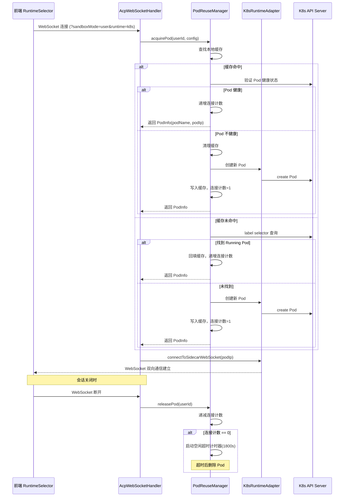
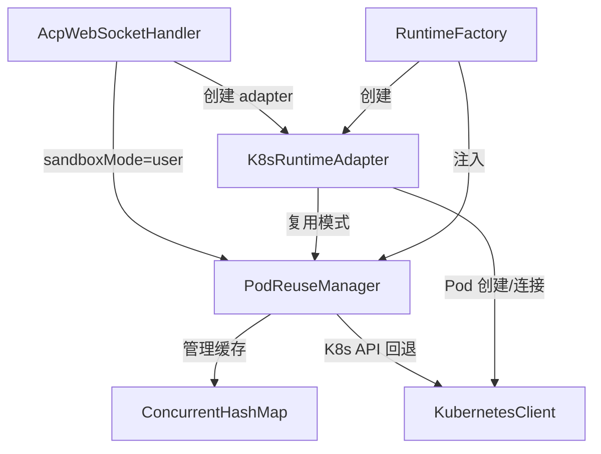

# 设计文档：K8s 沙箱 Pod 复用

## 概述

本设计实现 K8s 用户级沙箱 Pod 复用功能。核心思路是引入 `PodReuseManager` 组件，在 Java 后端维护一个以 userId 为键的 Pod 缓存池，当用户发起新会话时优先复用已有的 Running Pod，而非每次创建新 Pod。前端在运行时选择器中增加沙箱模式子选项，通过 WebSocket 查询参数将用户选择传递给后端。

改动范围：
- **前端**：`RuntimeSelector` 组件增加沙箱模式子选项，`WsUrlParams` 增加 `sandboxMode` 参数
- **后端**：新增 `PodReuseManager` 组件，修改 `K8sRuntimeAdapter` 支持复用模式，修改 `AcpHandshakeInterceptor` 解析 `sandboxMode` 参数

## 架构

### 整体流程



### 组件关系



## 组件与接口

### 1. PodReuseManager（新增）

Pod 复用管理器，Spring Bean（单例），负责 Pod 缓存和生命周期管理。

```java
@Component
public class PodReuseManager {

    private final ConcurrentHashMap<String, PodEntry> podCache = new ConcurrentHashMap<>();
    private final ScheduledExecutorService scheduler;
    private final KubernetesClient k8sClient;
    private final long idleTimeoutSeconds; // 默认 1800

    /**
     * 获取或创建用户级沙箱 Pod。
     * 1. 查缓存 → 2. 验证健康 → 3. K8s API 回退 → 4. 创建新 Pod
     * 线程安全：使用 computeIfAbsent + 双重检查。
     */
    public PodInfo acquirePod(String userId, RuntimeConfig config);

    /**
     * 释放一个连接。递减连接计数，计数归零时启动空闲超时。
     */
    public void releasePod(String userId);

    /**
     * 查询指定用户的 Pod 缓存条目（用于测试和监控）。
     */
    public PodEntry getPodEntry(String userId);

    /**
     * 强制移除指定用户的 Pod 缓存并删除 K8s Pod。
     */
    public void evictPod(String userId);
}
```

### 2. PodEntry（新增）

Pod 缓存条目数据类。

```java
public class PodEntry {
    private final String podName;
    private final String podIp;
    private final Instant createdAt;
    private final AtomicInteger connectionCount;
    private volatile ScheduledFuture<?> idleTimer;
}
```

### 3. PodInfo（新增）

Pod 信息传递对象，acquirePod 的返回值。

```java
public record PodInfo(String podName, String podIp, URI sidecarWsUri, boolean reused) {}
```

### 4. K8sRuntimeAdapter（修改）

增加复用模式支持：

```java
// 新增：复用模式下的 start 方法，跳过 Pod 创建，直接连接
public String startWithExistingPod(PodInfo podInfo) {
    // 1. 设置 podName, podIp, sidecarWsUri
    // 2. 建立 WebSocket 连接
    // 3. 启动健康检查
    // 4. 创建文件系统适配器
    // 5. 状态 → RUNNING
}

// 修改：close() 增加 reuse 标志
// reuse=true 时只断开 WebSocket，不删除 Pod
private boolean reuseMode = false;

@Override
public void close() {
    // ... 断开 WebSocket 连接 ...
    if (!reuseMode) {
        cleanupPod(); // 仅非复用模式删除 Pod
    }
}
```

### 5. AcpHandshakeInterceptor（修改）

增加 `sandboxMode` 参数解析：

```java
// 在 beforeHandshake 中增加：
String sandboxMode = params.getFirst("sandboxMode");
if (StrUtil.isNotBlank(sandboxMode)) {
    attributes.put("sandboxMode", sandboxMode);
}
```

### 6. AcpWebSocketHandler（修改）

在 `afterConnectionEstablished` 中根据 sandboxMode 路由：

```java
String sandboxMode = (String) session.getAttributes().get("sandboxMode");
boolean isUserScoped = "user".equals(sandboxMode) || runtimeType == RuntimeType.K8S;
// POC 阶段：K8s 运行时默认使用用户级沙箱

if (runtimeType == RuntimeType.K8S && isUserScoped) {
    // 通过 PodReuseManager 获取 Pod
    PodInfo podInfo = podReuseManager.acquirePod(userId, config);
    K8sRuntimeAdapter adapter = (K8sRuntimeAdapter) runtimeFactory.create(runtimeType, config);
    adapter.setReuseMode(true);
    adapter.startWithExistingPod(podInfo);
    runtime = adapter;
} else {
    // 原有逻辑
    runtime = runtimeFactory.create(runtimeType, config);
    runtime.start(config);
}
```

`cleanup` 方法中增加释放逻辑：

```java
private void cleanup(String sessionId) {
    // ... 原有清理逻辑 ...
    RuntimeAdapter runtime = runtimeMap.remove(sessionId);
    if (runtime != null) {
        runtime.close(); // 复用模式下只断开 WebSocket
        // 释放 Pod 连接计数
        String userId = userIdMap.get(sessionId);
        String sandboxMode = sandboxModeMap.get(sessionId);
        if ("user".equals(sandboxMode) && userId != null) {
            podReuseManager.releasePod(userId);
        }
    }
}
```

### 7. 前端 RuntimeSelector（修改）

在 K8s 运行时选项下增加沙箱模式子选项：

```typescript
// types/runtime.ts 增加
export type SandboxMode = 'user' | 'session';

// WsUrlParams 增加
export interface WsUrlParams {
  // ... 现有字段 ...
  sandboxMode?: string;
}

// RuntimeSelector 中，当选中 K8s 时展示子选项
// 用户级沙箱：可选，默认选中
// 会话级沙箱：标记"即将推出"，disabled
```

### 8. useRuntimeSelection Hook（修改）

增加 sandboxMode 状态管理：

```typescript
const [sandboxMode, setSandboxMode] = useState<SandboxMode>(() => {
  const stored = localStorage.getItem('himarket:sandboxMode');
  return stored === 'user' || stored === 'session' ? stored : 'user';
});
```

## 数据模型

### PodEntry 缓存结构

```
ConcurrentHashMap<String, PodEntry>
  key: userId
  value: PodEntry {
    podName: String          // K8s Pod 名称
    podIp: String            // Pod IP 地址
    createdAt: Instant       // Pod 创建时间
    connectionCount: AtomicInteger  // 活跃连接数
    idleTimer: ScheduledFuture<?>   // 空闲超时计时器（可为 null）
  }
```

### K8s Pod 标签

```yaml
labels:
  app: sandbox
  userId: "{userId}"
  sandboxMode: "user"       # 新增：标识沙箱模式
  provider: "{providerKey}"
```

### WebSocket 查询参数

```
ws://host/ws/acp?provider=qodercli&runtime=k8s&sandboxMode=user&token=xxx
```

### localStorage 键

```
himarket:sandboxMode  →  "user" | "session"
```


## 正确性属性

*正确性属性是一种在系统所有有效执行中都应成立的特征或行为——本质上是关于系统应该做什么的形式化陈述。属性是人类可读规范与机器可验证正确性保证之间的桥梁。*

基于需求文档中的验收标准，以下是可通过属性测试验证的正确性属性：

### Property 1: WebSocket URL 构建包含 sandboxMode 参数

*对于任意* provider、runtime 和 sandboxMode 的组合，当 sandboxMode 非空时，`buildAcpWsUrl` 构建的 URL 查询字符串中应包含 `sandboxMode` 参数且值与输入一致。

**Validates: Requirements 1.6**

### Property 2: sandboxMode 参数解析与回退

*对于任意* 字符串作为 sandboxMode 查询参数值，`AcpHandshakeInterceptor` 应正确提取该值；当值为 null、空字符串或非 `user`/`session` 的任意字符串时，后端路由逻辑应回退到用户级沙箱模式。

**Validates: Requirements 2.1, 2.3**

### Property 3: Pod 缓存 round-trip

*对于任意* userId 和有效的 RuntimeConfig，当 `PodReuseManager.acquirePod` 创建新 Pod 后，立即调用 `getPodEntry(userId)` 应返回非空的 PodEntry，且 podName 和 podIp 与创建结果一致。

**Validates: Requirements 3.1, 4.2**

### Property 4: Pod 缓存清理一致性

*对于任意* 已缓存的 userId，当调用 `evictPod(userId)` 后，`getPodEntry(userId)` 应返回 null。

**Validates: Requirements 4.3**

### Property 5: 新建用户级沙箱 Pod 标签完整性

*对于任意* userId 和 providerKey，当 `PodReuseManager` 创建新的用户级沙箱 Pod 时，Pod 的标签应包含 `app=sandbox`、`userId={userId}`、`sandboxMode=user` 和 `provider={providerKey}`。

**Validates: Requirements 3.4**

### Property 6: 复用模式 close 不删除 Pod

*对于任意* 处于复用模式（reuseMode=true）的 K8sRuntimeAdapter 实例，调用 `close()` 后，对应的 K8s Pod 应仍然存在（不被删除）。

**Validates: Requirements 5.1**

### Property 7: 连接计数不变量

*对于任意* acquire 和 release 操作序列，`PodEntry.connectionCount` 的值应始终等于 acquire 调用次数减去 release 调用次数，且不小于零。

**Validates: Requirements 5.2**

## 错误处理

| 场景 | 处理策略 |
|------|---------|
| 缓存中的 Pod 健康检查失败 | 清理缓存条目，删除不健康 Pod，创建新 Pod |
| K8s API 查询超时/失败 | 直接创建新 Pod，记录 warn 日志 |
| Pod 创建失败 | 抛出 RuntimeException，由 AcpWebSocketHandler 关闭 WebSocket 连接 |
| WebSocket 连接到 Pod 失败 | 清理缓存条目，尝试创建新 Pod |
| 空闲超时删除 Pod 失败 | 记录 error 日志，保留缓存条目等待下次清理 |
| 并发 acquirePod 竞态 | 使用 ConcurrentHashMap.compute 保证原子性，避免重复创建 |

## 测试策略

### 单元测试

- **PodReuseManager**: 测试 acquirePod/releasePod 的核心逻辑，包括缓存命中/未命中、健康检查失败、空闲超时等场景
- **K8sRuntimeAdapter**: 测试 startWithExistingPod 和复用模式下的 close 行为
- **AcpHandshakeInterceptor**: 测试 sandboxMode 参数解析
- **前端 buildAcpWsUrl**: 测试 sandboxMode 参数正确附加到 URL

### 属性测试

使用 **jqwik**（Java 属性测试库）和 **fast-check**（TypeScript 属性测试库）。

每个属性测试配置最少 100 次迭代，每个测试通过注释引用设计文档中的属性编号。

标签格式：**Feature: k8s-pod-reuse, Property {number}: {property_text}**

- Property 1 → fast-check：生成随机 WsUrlParams，验证 URL 构建
- Property 2 → jqwik：生成随机字符串作为 sandboxMode，验证解析和回退
- Property 3 → jqwik：生成随机 userId/config，验证缓存 round-trip
- Property 4 → jqwik：生成随机 userId，验证 evict 后缓存清除
- Property 5 → jqwik：生成随机 userId/providerKey，验证 Pod 标签
- Property 6 → jqwik：验证复用模式 close 不删除 Pod
- Property 7 → jqwik：生成随机 acquire/release 序列，验证连接计数不变量

### 测试分工

- **单元测试**：覆盖具体的边界条件和错误场景（缓存未命中回退、健康检查失败、空闲超时触发等）
- **属性测试**：覆盖通用的正确性属性（缓存一致性、连接计数不变量、参数解析等）
- 两者互补：单元测试验证具体场景，属性测试验证通用规则
