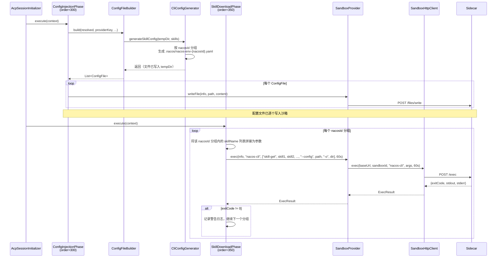

# 技术设计文档：Nacos-CLI 沙箱集成

## 概述

本设计改造 HiCoding 沙箱初始化流程，将 Skill 传输方式从"后端打包压缩 → HTTP 传输压缩包到沙箱 → 解压"改为"传递 Nacos 坐标和凭证（nacos-env.yaml）→ 沙箱内 nacos-cli 下载"。

核心变更：
1. 在 `SandboxHttpClient` 和 `SandboxProvider` 层新增 `exec()` 命令执行能力
2. 将 4 个 `CliConfigGenerator` 的 `generateSkillConfig()` 从写入 JSON 凭证改为生成 `nacos-env.yaml` 配置文件
3. 新增 `SkillDownloadPhase`（order=350）在 Pipeline 中通过 exec API 执行 `nacos-cli skill-get`，按 nacosId 分组批量下载
4. `ConfigFileBuilder.inferConfigType()` 兼容 `.nacos/` 目录下的 yaml 文件
5. `ConfigInjectionPhase` 移除 tar.gz 压缩解压机制，改为逐个 `writeFile` 注入（Skill 文件改由 nacos-cli 下载后，剩余配置文件数量很少）
6. 移除 `extractArchive` 相关方法（SandboxHttpClient、SandboxProvider、RemoteSandboxProvider）

### 设计决策

| 决策 | 选择 | 理由 |
|------|------|------|
| exec 方法签名 | 返回 `ExecResult` record | 与 sidecar `/exec` 响应体一一对应，简洁明确 |
| nacos-env.yaml 生成位置 | `CliConfigGenerator` 接口默认方法 | 4 个实现的 YAML 生成逻辑完全相同，提取到接口避免重复 |
| nacos-env 文件命名 | `nacos-env-{nacosId}.yaml` | 支持多 Nacos 实例场景，按 nacosId 隔离配置 |
| nacos-env 存放目录 | `.nacos/` | 独立于各 CLI 工具目录，所有 CLI 共享同一份 nacos-env 配置 |
| SkillDownloadPhase 容错 | 单个 nacosId 分组失败只记录警告 | Skill 下载失败不应阻塞整个会话初始化 |
| exec 超时 | 调用方传入，SkillDownloadPhase 使用 60 秒 | Skill 下载涉及网络 I/O，需要比默认 10 秒更长的超时 |
| serverAddr URL 解析 | `java.net.URI` 解析 host/port | 标准库方案，无需引入额外依赖，能处理 `http://host:port` 格式 |
| skillsDirectory 方法 | 各 Generator 实现返回各自路径 | QoderCli→`.qoder/skills/`、ClaudeCode→`.claude/skills/`、QwenCode→`.qwen/skills/`、OpenCode→`.opencode/skills/` |
| nacos-cli 批量下载 | 按 nacosId 分组，同组 skill 名称合并为一次 `skill-get` 调用 | `nacos-cli skill-get skill1 skill2 ...` 原生支持多 skill 并发下载，减少 exec 调用次数 |
| 配置注入方式 | 逐个 writeFile，移除 tar.gz | Skill 文件改由 nacos-cli 下载后，剩余配置文件仅 2~4 个，无需压缩解压 |

## 架构

### 整体数据流



### Pipeline 阶段顺序


## 组件与接口

### 1. ExecResult（新增 record）

```java
package com.alibaba.himarket.service.acp.runtime;

/**
 * 沙箱命令执行结果。
 */
public record ExecResult(int exitCode, String stdout, String stderr) {}
```

**位置**: `himarket-server/src/main/java/com/alibaba/himarket/service/acp/runtime/ExecResult.java`

### 2. SandboxHttpClient.exec()（新增方法）

```java
/**
 * 在沙箱内执行命令。
 *
 * <p>调用 Sidecar POST /exec，请求体为 {"command": command, "args": args}。
 * 使用调用方传入的 timeout 作为 HTTP 请求超时时间。
 *
 * @param baseUrl   Sidecar 基础 URL
 * @param sandboxId 沙箱标识（用于异常信息）
 * @param command   要执行的命令
 * @param args      命令参数列表
 * @param timeout   HTTP 请求超时时间
 * @return 命令执行结果
 * @throws IOException 当 HTTP 响应非 200 或请求失败时
 */
public ExecResult exec(String baseUrl, String sandboxId, String command,
                       List<String> args, Duration timeout) throws IOException {
    String url = baseUrl + "/exec";
    String body = objectMapper.writeValueAsString(Map.of("command", command, "args", args));
    HttpResponse<String> response = doPost(url, body, timeout);
    if (response.statusCode() != 200) {
        throw new IOException(
            "Sidecar exec 失败 (sandbox: " + sandboxId
            + ", status: " + response.statusCode() + "): " + response.body());
    }
    var tree = objectMapper.readTree(response.body());
    return new ExecResult(
        tree.get("exitCode").asInt(),
        tree.get("stdout").asText(),
        tree.get("stderr").asText());
}
```

**要点**:
- 复用已有的 `doPost()` 私有方法，该方法已处理 `InterruptedException`（恢复中断标志 + 包装为 IOException）
- timeout 由调用方传入，不使用 `DEFAULT_TIMEOUT`（10s），因为命令执行可能耗时较长
- 请求体 JSON 格式与 sidecar `/exec` API 契约一致

### 3. SandboxProvider.exec()（新增默认方法）

```java
/**
 * 在沙箱内执行命令。
 * 默认抛出 UnsupportedOperationException。
 *
 * @param info    沙箱信息
 * @param command 要执行的命令
 * @param args    命令参数列表
 * @param timeout 超时时间
 * @return 命令执行结果
 */
default ExecResult exec(SandboxInfo info, String command, List<String> args,
                        Duration timeout) throws IOException {
    throw new UnsupportedOperationException("exec not implemented");
}
```

### 4. RemoteSandboxProvider.exec()（覆写）

```java
@Override
public ExecResult exec(SandboxInfo info, String command, List<String> args,
                       Duration timeout) throws IOException {
    return sandboxHttpClient.exec(sidecarBaseUrl(info), info.sandboxId(), command, args, timeout);
}
```

**说明**: 直接委托给 `SandboxHttpClient.exec()`，复用 `sidecarBaseUrl()` 辅助方法。exec 执行的命令在沙箱全局环境中运行，不需要路径转换。

### 5. CliConfigGenerator 接口改造

```java
/**
 * 返回该 CLI 工具的 skills 目录路径（相对于工作目录）。
 * 用于 SkillDownloadPhase 确定 nacos-cli 的输出目录。
 *
 * @return skills 目录相对路径，如 ".qoder/skills/"
 */
default String skillsDirectory() {
    return "skills/";
}

/**
 * 生成 Skill 配置（默认实现：生成 nacos-env.yaml）。
 * 按 nacosId 分组，为每个 Nacos 实例生成独立的 .nacos/nacos-env-{nacosId}.yaml 文件。
 * 子类不再需要覆写此方法。
 */
default void generateSkillConfig(
        String workingDirectory,
        List<ResolvedSessionConfig.ResolvedSkillEntry> skills) throws IOException {
    if (skills == null || skills.isEmpty()) return;
    NacosEnvGenerator.generateNacosEnvFiles(workingDirectory, skills);
}
```

各实现类的 `skillsDirectory()` 返回值：

| 实现类 | skillsDirectory() |
|--------|-------------------|
| QoderCliConfigGenerator | `.qoder/skills/` |
| ClaudeCodeConfigGenerator | `.claude/skills/` |
| QwenCodeConfigGenerator | `.qwen/skills/` |
| OpenCodeConfigGenerator | `.opencode/skills/` |

### 6. NacosEnvGenerator（新增工具类）

```java
package com.alibaba.himarket.service.acp;

import java.io.IOException;
import java.net.URI;
import java.nio.file.Files;
import java.nio.file.Path;
import java.util.List;
import java.util.Map;
import java.util.stream.Collectors;
import org.slf4j.Logger;
import org.slf4j.LoggerFactory;

/**
 * nacos-env.yaml 生成工具。
 * 按 nacosId 分组，为每个 Nacos 实例生成独立的配置文件。
 */
public final class NacosEnvGenerator {

    private static final Logger logger = LoggerFactory.getLogger(NacosEnvGenerator.class);
    private static final String NACOS_DIR = ".nacos";

    private NacosEnvGenerator() {}

    /**
     * 为 Skill 列表生成 nacos-env.yaml 文件。
     * 按 nacosId 分组，每个 nacosId 生成一个 .nacos/nacos-env-{nacosId}.yaml。
     */
    public static void generateNacosEnvFiles(
            String workingDirectory,
            List<ResolvedSessionConfig.ResolvedSkillEntry> skills) throws IOException {

        Path nacosDir = Path.of(workingDirectory, NACOS_DIR);
        Files.createDirectories(nacosDir);

        // 按 nacosId 分组，取每组第一个 entry 的凭证信息
        Map<String, ResolvedSessionConfig.ResolvedSkillEntry> byNacosId = skills.stream()
                .collect(Collectors.toMap(
                        ResolvedSessionConfig.ResolvedSkillEntry::getNacosId,
                        s -> s,
                        (existing, replacement) -> existing));

        for (var entry : byNacosId.entrySet()) {
            String nacosId = entry.getKey();
            var skill = entry.getValue();
            try {
                String yaml = buildNacosEnvYaml(skill);
                Path filePath = nacosDir.resolve("nacos-env-" + nacosId + ".yaml");
                Files.writeString(filePath, yaml);
            } catch (Exception e) {
                logger.error("生成 nacos-env-{}.yaml 失败: {}", nacosId, e.getMessage(), e);
            }
        }
    }

    /**
     * 从 ResolvedSkillEntry 构建 nacos-env.yaml 内容。
     */
    static String buildNacosEnvYaml(ResolvedSessionConfig.ResolvedSkillEntry skill) {
        HostPort hp = parseServerAddr(skill.getServerAddr());

        StringBuilder sb = new StringBuilder();
        sb.append("host: ").append(hp.host()).append('\n');
        sb.append("port: ").append(hp.port()).append('\n');

        boolean isAliyun = skill.getAccessKey() != null && !skill.getAccessKey().isBlank()
                && skill.getSecretKey() != null && !skill.getSecretKey().isBlank();
        sb.append("authType: ").append(isAliyun ? "aliyun" : "nacos").append('\n');

        sb.append("username: ").append(nullToEmpty(skill.getUsername())).append('\n');
        sb.append("password: ").append(nullToEmpty(skill.getPassword())).append('\n');
        sb.append("namespace: ").append(nullToEmpty(skill.getNamespace())).append('\n');

        if (isAliyun) {
            sb.append("accessKey: ").append(skill.getAccessKey()).append('\n');
            sb.append("secretKey: ").append(skill.getSecretKey()).append('\n');
        }

        return sb.toString();
    }

    /**
     * 解析 serverAddr URL 为 host 和 port。
     * 支持格式: http://host:port, https://host:port, host:port
     */
    static HostPort parseServerAddr(String serverAddr) {
        if (serverAddr == null || serverAddr.isBlank()) {
            throw new IllegalArgumentException("serverAddr 不能为空");
        }
        try {
            // 确保有 scheme 以便 URI 正确解析
            String uriStr = serverAddr;
            if (!uriStr.contains("://")) {
                uriStr = "http://" + uriStr;
            }
            URI uri = URI.create(uriStr);
            String host = uri.getHost();
            int port = uri.getPort();
            if (host == null || host.isBlank()) {
                throw new IllegalArgumentException("无法从 serverAddr 解析 host: " + serverAddr);
            }
            if (port == -1) {
                port = 8848; // Nacos 默认端口
            }
            return new HostPort(host, port);
        } catch (IllegalArgumentException e) {
            throw new IllegalArgumentException("serverAddr 格式不合法: " + serverAddr, e);
        }
    }

    record HostPort(String host, int port) {}

    private static String nullToEmpty(String s) {
        return s == null ? "" : s;
    }
}
```

**URL 解析逻辑**:
- 输入 `http://nacos:8848` → host=`nacos`, port=`8848`
- 输入 `https://nacos.example.com:443` → host=`nacos.example.com`, port=`443`
- 输入 `nacos:8848`（无 scheme）→ 自动补 `http://` → host=`nacos`, port=`8848`
- 输入 `http://nacos`（无端口）→ host=`nacos`, port=`8848`（默认）
- 输入 `null` 或空 → 抛出 `IllegalArgumentException`

### 7. SkillDownloadPhase（新增）

```java
package com.alibaba.himarket.service.acp.runtime;

import com.alibaba.himarket.service.acp.ResolvedSessionConfig;
import java.time.Duration;
import java.util.ArrayList;
import java.util.LinkedHashMap;
import java.util.List;
import java.util.Map;
import java.util.stream.Collectors;
import org.slf4j.Logger;
import org.slf4j.LoggerFactory;

/**
 * Skill 下载阶段。
 * 在 ConfigInjectionPhase（300）之后、SidecarConnectPhase（400）之前执行。
 * 按 nacosId 分组，通过 sidecar exec API 调用 nacos-cli skill-get 批量下载 Skill 文件。
 */
public class SkillDownloadPhase implements InitPhase {

    private static final Logger logger = LoggerFactory.getLogger(SkillDownloadPhase.class);
    private static final Duration EXEC_TIMEOUT = Duration.ofSeconds(60);
    private static final String NACOS_ENV_DIR = ".nacos";

    private static final Map<String, String> PROVIDER_SKILLS_DIR = Map.of(
            "qodercli", ".qoder/skills/",
            "claude-code", ".claude/skills/",
            "qwen-code", ".qwen/skills/",
            "opencode", ".opencode/skills/"
    );

    @Override
    public String name() {
        return "skill-download";
    }

    @Override
    public int order() {
        return 350;
    }

    @Override
    public boolean shouldExecute(InitContext context) {
        ResolvedSessionConfig resolved = context.getResolvedSessionConfig();
        return resolved != null
                && resolved.getSkills() != null
                && !resolved.getSkills().isEmpty();
    }

    @Override
    public void execute(InitContext context) throws InitPhaseException {
        ResolvedSessionConfig resolved = context.getResolvedSessionConfig();
        List<ResolvedSessionConfig.ResolvedSkillEntry> skills = resolved.getSkills();
        String providerKey = context.getRuntimeConfig().getProviderKey();
        String skillsDir = PROVIDER_SKILLS_DIR.getOrDefault(providerKey, "skills/");
        SandboxProvider provider = context.getProvider();
        SandboxInfo info = context.getSandboxInfo();

        // 按 nacosId 分组（skills 来自用户前端勾选，经 ResolvedSessionConfig 传入）
        Map<String, List<ResolvedSessionConfig.ResolvedSkillEntry>> byNacosId = skills.stream()
                .collect(Collectors.groupingBy(
                        ResolvedSessionConfig.ResolvedSkillEntry::getNacosId,
                        LinkedHashMap::new,
                        Collectors.toList()));

        logger.info("[SkillDownload] 开始下载 {} 个 Skill ({} 个 Nacos 实例), provider={}, skillsDir={}",
                skills.size(), byNacosId.size(), providerKey, skillsDir);

        int successGroups = 0;
        for (var entry : byNacosId.entrySet()) {
            String nacosId = entry.getKey();
            List<String> skillNames = entry.getValue().stream()
                    .map(ResolvedSessionConfig.ResolvedSkillEntry::getSkillName)
                    .toList();
            String nacosEnvPath = NACOS_ENV_DIR + "/nacos-env-" + nacosId + ".yaml";

            // 构建参数: skill-get skill1 skill2 ... --config path -o dir
            List<String> args = new ArrayList<>();
            args.add("skill-get");
            args.addAll(skillNames);
            args.add("--config");
            args.add(nacosEnvPath);
            args.add("-o");
            args.add(skillsDir);

            try {
                ExecResult result = provider.exec(info, "nacos-cli", args, EXEC_TIMEOUT);

                if (result.exitCode() != 0) {
                    logger.warn("[SkillDownload] Skill 下载失败: nacosId={}, skills={}, exitCode={}, stderr={}",
                            nacosId, skillNames, result.exitCode(), result.stderr());
                } else {
                    successGroups++;
                    logger.info("[SkillDownload] Skill 下载成功: nacosId={}, skills={}", nacosId, skillNames);
                }
            } catch (Exception e) {
                logger.warn("[SkillDownload] Skill 下载异常: nacosId={}, skills={}, error={}",
                        nacosId, skillNames, e.getMessage());
            }
        }

        logger.info("[SkillDownload] 下载完成: {}/{} 分组成功", successGroups, byNacosId.size());
    }

    @Override
    public boolean verify(InitContext context) {
        return true;
    }

    @Override
    public RetryPolicy retryPolicy() {
        return RetryPolicy.none();
    }
}
```

### 8. ConfigFileBuilder.inferConfigType() 更新

```java
static ConfigFile.ConfigType inferConfigType(String relativePath) {
    // 新增：.nacos/ 目录下的 yaml 文件识别为 SKILL_CONFIG
    if (relativePath.startsWith(".nacos/") && relativePath.endsWith(".yaml")) {
        return ConfigFile.ConfigType.SKILL_CONFIG;
    }
    if (relativePath.contains("skills") && relativePath.endsWith("SKILL.md")) {
        return ConfigFile.ConfigType.SKILL_CONFIG;
    }
    if (relativePath.endsWith("settings.json")) {
        return ConfigFile.ConfigType.MODEL_SETTINGS;
    }
    return ConfigFile.ConfigType.CUSTOM;
}
```

### 8.1 ConfigInjectionPhase 改造（移除 tar.gz）

`ConfigInjectionPhase.execute()` 移除 tar.gz 压缩解压逻辑，改为逐个 `writeFile` 注入：

```java
@Override
public void execute(InitContext context) throws InitPhaseException {
    // ... 省略 configFileBuilder.build() 调用 ...

    SandboxProvider provider = context.getProvider();
    SandboxInfo info = context.getSandboxInfo();

    try {
        for (ConfigFile config : pendingConfigs) {
            provider.writeFile(info, config.relativePath(), config.content());
        }
        logger.info("[ConfigInjection] 逐个写入完成: {} 个文件已注入", pendingConfigs.size());
    } catch (IOException e) {
        throw new InitPhaseException("config-injection", "配置注入失败: " + e.getMessage(), e, true);
    }
}
```

同时移除 `buildTarGz()` 静态方法和 `commons-compress` 相关 import。

### 8.2 移除 extractArchive 相关方法

以下方法/代码将被移除：

| 类 | 移除内容 |
|------|----------|
| `SandboxHttpClient` | `extractArchive(String, String, byte[])` 和 `extractArchive(String, String, byte[], String)` 两个重载方法，以及 `EXTRACT_TIMEOUT` 常量 |
| `SandboxProvider` | `extractArchive(SandboxInfo, byte[])` 默认方法 |
| `RemoteSandboxProvider` | `extractArchive(SandboxInfo, byte[])` 覆写方法 |
| `ConfigInjectionPhase` | `buildTarGz()` 静态方法、tar.gz 压缩逻辑、extractArchive 调用和 fallback 逻辑 |

### 9. AcpSessionInitializer Pipeline 注册

```java
// 构建 Pipeline（新增 SkillDownloadPhase）
SandboxInitPipeline pipeline =
        new SandboxInitPipeline(
                List.of(
                        new SandboxAcquirePhase(),
                        new FileSystemReadyPhase(),
                        new ConfigInjectionPhase(configFileBuilder),
                        new SkillDownloadPhase(),
                        new SidecarConnectPhase()),
                InitConfig.defaults());
```

### 10. 各 CliConfigGenerator 实现改造

4 个实现类（QoderCli、ClaudeCode、QwenCode、OpenCode）的改造方式一致：

1. **删除** `generateSkillConfig()` 覆写方法（改用接口默认实现生成 nacos-env.yaml）
2. **新增** `skillsDirectory()` 覆写方法，返回各自的 skills 目录路径

示例（QoderCliConfigGenerator）：
```java
@Override
public String skillsDirectory() {
    return ".qoder/skills/";
}

// 删除原有的 generateSkillConfig() 方法
// 接口默认方法会生成 .nacos/nacos-env-{nacosId}.yaml
```

## 数据模型

### ExecResult

| 字段 | 类型 | 说明 |
|------|------|------|
| exitCode | int | 命令退出码，0 表示成功 |
| stdout | String | 标准输出 |
| stderr | String | 标准错误输出 |

### Sidecar /exec API 请求体

```json
{
    "command": "nacos-cli",
    "args": ["skill-get", "skill-creator", "skill-analyzer", "--config", ".nacos/nacos-env-1.yaml", "-o", ".qoder/skills/"]
}
```

### Sidecar /exec API 响应体

```json
{
    "exitCode": 0,
    "stdout": "Downloaded skill: skill-creator",
    "stderr": ""
}
```

### nacos-env.yaml 数据模型

Nacos 认证模式（authType=nacos）：
```yaml
host: 127.0.0.1
port: 8848
authType: nacos
username: nacos
password: nacos
namespace: ""
```

阿里云认证模式（authType=aliyun）：
```yaml
host: mse-xxx.nacos.mse.aliyuncs.com
port: 8848
authType: aliyun
username: ""
password: ""
namespace: dev
accessKey: LTAI5t***
secretKey: Gkr8q***
```

### 文件目录结构（沙箱内）

```
workspace/
├── .nacos/
│   ├── nacos-env-1.yaml          # Nacos 实例 1 的配置
│   └── nacos-env-2.yaml          # Nacos 实例 2 的配置
├── .qoder/
│   ├── settings.json             # QoderCli 配置（不再包含 skills 段）
│   └── skills/
│       ├── skill-creator/        # nacos-cli 下载的 Skill 文件
│       └── skill-analyzer/
├── .claude/
│   ├── settings.json
│   └── skills/
├── .qwen/
│   ├── settings.json
│   └── skills/
└── .opencode/
    └── skills/
```

## 正确性属性

*属性是在系统所有合法执行中都应成立的特征或行为——本质上是对系统应做什么的形式化陈述。属性是人类可读规格说明与机器可验证正确性保证之间的桥梁。*

### Property 1: serverAddr URL 解析正确性

*For any* 合法的 serverAddr 字符串（格式为 `http://host:port`、`https://host:port` 或 `host:port`），`NacosEnvGenerator.parseServerAddr()` 解析出的 host 应为 URL 中的主机名，port 应为 URL 中的端口号；当 URL 不包含端口时，port 应默认为 8848。

**Validates: Requirements 3.3**

### Property 2: nacos-env.yaml 按 nacosId 分组生成

*For any* 非空的 ResolvedSkillEntry 列表，调用 `NacosEnvGenerator.generateNacosEnvFiles()` 后，`.nacos/` 目录下生成的文件数量应等于列表中不同 nacosId 的数量，且每个文件命名为 `nacos-env-{nacosId}.yaml`。

**Validates: Requirements 3.1, 3.2, 8.1, 8.3**

### Property 3: nacos-env.yaml 内容完整性与 authType 正确性

*For any* ResolvedSkillEntry，`NacosEnvGenerator.buildNacosEnvYaml()` 生成的 YAML 内容应包含 host、port、authType、username、password、namespace 字段；当 accessKey 和 secretKey 均非空时 authType 应为 `aliyun` 且包含 accessKey/secretKey 字段，否则 authType 应为 `nacos`。

**Validates: Requirements 3.4, 3.5, 3.6**

### Property 4: exec 非 200 响应抛出 IOException

*For any* 非 200 的 HTTP 状态码，`SandboxHttpClient.exec()` 应抛出 IOException，且异常消息中包含 sandboxId 和状态码信息。

**Validates: Requirements 1.4**

### Property 5: shouldExecute 与 skills 列表一致性

*For any* InitContext，`SkillDownloadPhase.shouldExecute()` 返回 true 当且仅当 `resolvedSessionConfig` 非 null 且其 skills 列表非空。

**Validates: Requirements 4.2**

### Property 6: SkillDownloadPhase 容错性

*For any* Skill 列表（按 nacosId 分组后，其中部分或全部分组的 exec 调用失败），`SkillDownloadPhase.execute()` 不应抛出 `InitPhaseException`，应继续处理后续分组。

**Validates: Requirements 4.7**

### Property 7: providerKey 到 skillsDirectory 映射正确性

*For any* 已知的 providerKey（qodercli、claude-code、qwen-code、opencode），SkillDownloadPhase 应将其映射到对应的 skills 目录路径（.qoder/skills/、.claude/skills/、.qwen/skills/、.opencode/skills/）。

**Validates: Requirements 4.4**

### Property 8: generateSkillConfig 不再写入 JSON skills 段

*For any* CliConfigGenerator 实现和任意非空 Skill 列表，调用 `generateSkillConfig()` 后，工作目录下的 settings.json（或 opencode.json）不应包含 `skills` 字段，且 `.nacos/` 目录下应存在对应的 nacos-env yaml 文件。

**Validates: Requirements 6.1, 6.2, 6.3, 6.4, 6.5**

### Property 9: inferConfigType 兼容性

*For any* 文件路径，`ConfigFileBuilder.inferConfigType()` 对 `.nacos/*.yaml` 路径返回 `SKILL_CONFIG`，对 `settings.json` 路径返回 `MODEL_SETTINGS`，对含 `skills` 且以 `SKILL.md` 结尾的路径返回 `SKILL_CONFIG`，其余返回 `CUSTOM`。

**Validates: Requirements 9.1, 9.2**

## 错误处理

### SandboxHttpClient.exec()

| 场景 | 处理方式 |
|------|----------|
| HTTP 响应非 200 | 抛出 IOException，包含 sandboxId、状态码、响应体 |
| HTTP 请求被中断 | 恢复线程中断标志（`Thread.currentThread().interrupt()`），抛出 IOException |
| JSON 序列化/反序列化失败 | 由 ObjectMapper 抛出 JsonProcessingException（IOException 子类） |
| 网络超时 | HttpClient 抛出 HttpTimeoutException（IOException 子类） |

### NacosEnvGenerator

| 场景 | 处理方式 |
|------|----------|
| serverAddr 为 null 或空 | 抛出 IllegalArgumentException |
| serverAddr 格式不合法 | 抛出 IllegalArgumentException，包含原始值 |
| 单个 nacosId 的 YAML 生成失败 | 记录 error 日志，跳过该实例，继续处理其他实例 |
| 文件系统写入失败 | 抛出 IOException |

### SkillDownloadPhase

| 场景 | 处理方式 |
|------|----------|
| Provider 不支持 exec | 捕获 UnsupportedOperationException，记录警告 |
| nacos-cli 返回非 0 exitCode | 记录包含 nacosId、skillNames、exitCode、stderr 的警告日志，继续下一个分组 |
| exec 调用抛出 IOException | 记录包含 nacosId、skillNames、error 的警告日志，继续下一个分组 |
| 所有分组下载失败 | 不抛出 InitPhaseException，verify 仍返回 true |

### 设计原则

- **Skill 下载失败不阻塞会话**：SkillDownloadPhase 采用"尽力而为"策略，单个 Skill 失败不影响其他 Skill 和后续阶段
- **retryPolicy 为 none**：避免因网络抖动导致 Pipeline 长时间阻塞
- **日志分级**：成功用 info，失败用 warn，异常用 error

## 测试策略

### 属性测试（Property-Based Testing）

使用 **jqwik** 作为 Java 属性测试库，每个属性测试至少运行 100 次迭代。

每个测试用 `@Tag` 注解标记对应的设计属性：

```java
// Feature: nacos-cli-sandbox-integration, Property 1: serverAddr URL 解析正确性
@Property(tries = 100)
@Tag("Feature: nacos-cli-sandbox-integration, Property 1: serverAddr URL 解析正确性")
void parseServerAddr_extractsHostAndPort(@ForAll("validServerAddrs") String serverAddr) {
    // ...
}
```

属性测试覆盖范围：

| 属性 | 测试类 | 生成器 |
|------|--------|--------|
| Property 1: URL 解析 | NacosEnvGeneratorPropertyTest | 生成合法 URL 字符串（含/不含 scheme、含/不含端口） |
| Property 2: 按 nacosId 分组 | NacosEnvGeneratorPropertyTest | 生成随机 ResolvedSkillEntry 列表（不同 nacosId 组合） |
| Property 3: YAML 内容与 authType | NacosEnvGeneratorPropertyTest | 生成随机 ResolvedSkillEntry（含/不含 accessKey） |
| Property 4: 非 200 抛异常 | SandboxHttpClientPropertyTest | 生成随机非 200 状态码 |
| Property 5: shouldExecute 一致性 | SkillDownloadPhasePropertyTest | 生成随机 InitContext（skills 列表为空/非空） |
| Property 6: 容错性 | SkillDownloadPhasePropertyTest | 生成随机失败场景（exitCode 非 0、IOException） |
| Property 7: providerKey 映射 | SkillDownloadPhasePropertyTest | 枚举所有已知 providerKey |
| Property 8: 不写入 JSON skills | CliConfigGeneratorPropertyTest | 生成随机 Skill 列表，验证所有 Generator |
| Property 9: inferConfigType | ConfigFileBuilderPropertyTest | 生成随机文件路径 |

### 单元测试

单元测试聚焦于具体示例和边界情况，与属性测试互补：

| 测试类 | 覆盖内容 |
|--------|----------|
| NacosEnvGeneratorTest | serverAddr 解析的具体示例（`http://nacos:8848`、`nacos:8848`、无端口、非法格式）；YAML 生成的具体输出验证 |
| SandboxHttpClientTest | exec 方法的 mock HTTP 测试（200 成功、404 失败、中断处理） |
| SkillDownloadPhaseTest | name/order/retryPolicy 的具体值验证；shouldExecute 的边界情况（null config、空列表） |
| ConfigFileBuilderTest | inferConfigType 的具体路径示例（`.nacos/nacos-env-1.yaml`、`settings.json`、`SKILL.md`） |
| ExecResultTest | record 的 equals/hashCode/toString 行为 |

### 测试配置

- 属性测试库：`net.jqwik:jqwik:1.9.1`
- 每个属性测试最少 100 次迭代
- 使用 `@Tag` 注解关联设计属性
- 属性测试和单元测试放在同一个 test source set 中
