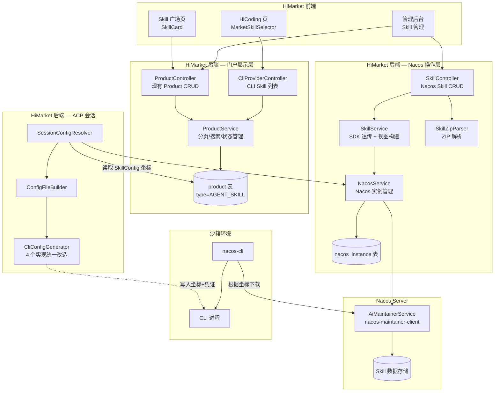
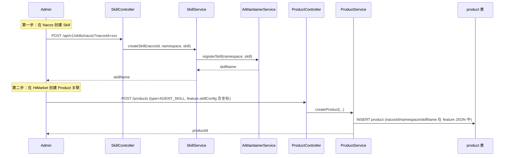
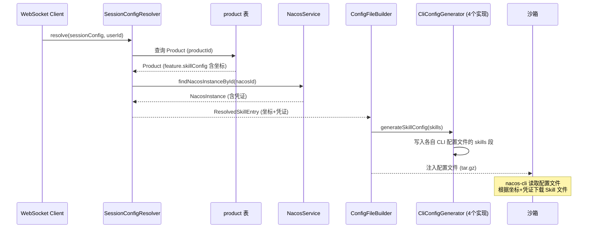
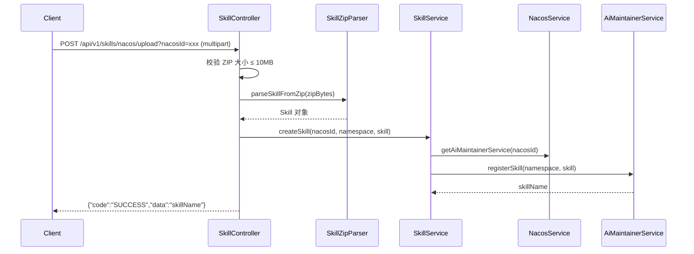

# 技术设计文档：Nacos Skill 集成重构

## 概述

本设计将 HiMarket 现有的 Skill 市场逻辑从本地 `product` + `skill_file` 表存储模式，重构为 **Product 表做门户展示层 + Nacos 做 Skill 文件存储层** 的双层架构。核心思路：

1. **Product 表保留为门户展示层**：Skill 作为 `ProductType.AGENT_SKILL` 类型的 Product 继续存在，复用现有的 icon、status、分页查询、admin 管理流程。`SkillConfig`（ProductFeature 的子字段）新增 Nacos 坐标（nacosId、namespace、skillName），将 Product 从"存储 Skill 文件"变为"指向 Nacos Skill 的引用"
2. **Nacos 做 Skill 文件存储**：Skill 元数据（name、description、instruction）和文件内容（resource Map）全部由 Nacos 管理，通过 `nacos-maintainer-client` SDK 透传操作
3. **复用 Nacos 实例管理**：通过已有的 `nacos_instance` 表和 `NacosServiceImpl.buildDynamicAiService()` 缓存机制获取 `AiMaintainerService`
4. **ACP 会话解耦**：不再主动下载 Skill 文件注入沙箱，改为传递 Skill 坐标 + Nacos 凭证，由沙箱内置 nacos-cli 下载
5. **skill_file 表废弃**：不再有代码引用，保留数据以备回滚

### 设计决策

| 决策 | 选择 | 理由 |
|------|------|------|
| 门户展示层 | 继续使用 Product 表（type=AGENT_SKILL） | Product 表已有完整的门户展示能力（icon、status、分页查询、admin 管理流程），前端门户的 Skill 广场和 HiCoding Skill 选择器都依赖 Product 体系做分页、搜索、分类展示。Nacos SDK 的 listSkills() 不提供 icon、tags 等门户字段，且无法跨多个 Nacos 实例聚合展示 |
| Nacos 坐标存储位置 | `ProductFeature.SkillConfig` 新增 nacosId/namespace/skillName 字段 | 复用已有的 ProductFeature JSON 字段，无需新增数据库列，最大程度复用现有 Skill 设计 |
| 发布状态管理 | 复用 Product.status（PUBLISHED/PENDING） | 不需要单独的 `skill_publish` 表，Product 体系已有完整的发布/下线流程 |
| AiMaintainerService 获取方式 | 复用 NacosServiceImpl 的 buildDynamicAiService + ConcurrentHashMap 缓存 | 避免重复代码，已有成熟的缓存和错误处理机制 |
| NacosService 接口扩展 | 新增 `getAiMaintainerService(String nacosId)` 公开方法 | 让 SkillService 能通过 nacosId 获取 AiMaintainerService，而不暴露 NacosInstance 实体 |
| Nacos Skill 管理 API 路径 | `/api/v1/skills/nacos/...`，nacosId 作为 query parameter | 与门户 Skill 管理（复用 Product 体系）区分，专门用于 Nacos 侧的 Skill CRUD 操作 |
| ZIP 上传方式 | HiMarket 自行解析 ZIP → 构建 Skill 对象 → 调用 SDK registerSkill() | 参考 Nacos 服务端的 `SkillZipParser.parseSkillFromZip()` 逻辑，完全走 SDK 通道 |
| CliConfigGenerator Skill 配置 | 所有 4 个实现（QoderCli、QwenCode、ClaudeCode、OpenCode）统一改造 | 当前 4 个实现的 `generateSkillConfig()` 逻辑完全相同，统一改为写入 Skill 坐标+凭证 |


## 架构

### 双层架构



> **注意**：`CliConfigGenerator` 有 4 个实现（QoderCliConfigGenerator、QwenCodeConfigGenerator、ClaudeCodeConfigGenerator、OpenCodeConfigGenerator），它们的 `generateSkillConfig()` 逻辑完全相同，统一改造为写入 Skill 坐标+凭证。

### 数据流：管理员创建 Skill（两步流程）



### ACP 会话 Skill 坐标传递流程



### ZIP 上传数据流（本地解析 ZIP → registerSkill）



> HiMarket 参考 Nacos 服务端的 `SkillZipParser.parseSkillFromZip()` 实现 ZIP 解析，完全走 SDK 通道。


## 组件与接口

### 1. SkillConfig 扩展（ProductFeature 子字段）

在现有 `SkillConfig` 中新增 Nacos 坐标字段：

```java
@Data
public class SkillConfig {
    // 已有字段
    private List<String> skillTags;
    private Long downloadCount;

    // 新增：Nacos Skill 坐标
    private String nacosId;      // 关联 nacos_instance.nacos_id
    private String namespace;    // Nacos 命名空间，默认 "public"
    private String skillName;    // Nacos Skill name（唯一标识）
}
```

存储在 `product.feature` JSON 字段中，无需新增数据库列。示例：

```json
{
  "skillConfig": {
    "skillTags": ["java", "spring"],
    "downloadCount": 42,
    "nacosId": "nacos-001",
    "namespace": "public",
    "skillName": "java-coding-standards"
  }
}
```

### 2. NacosService 接口扩展

在现有 `NacosService` 接口中新增公开方法，让 SkillService 能通过 nacosId 获取 `AiMaintainerService`：

```java
public interface NacosService {
    // ... 已有方法 ...

    /**
     * 根据 nacosId 获取缓存的 AiMaintainerService 实例。
     * 复用 NacosServiceImpl 中已有的 buildDynamicAiService + ConcurrentHashMap 缓存机制。
     *
     * @param nacosId nacos_instance 表主键
     * @return AiMaintainerService 实例
     * @throws BusinessException nacosId 不存在或连接失败
     */
    AiMaintainerService getAiMaintainerService(String nacosId);

    /**
     * 根据 nacosId 查询 NacosInstance 记录（用于提取凭证信息）。
     *
     * @param nacosId nacos_instance 表主键
     * @return NacosInstance 实体
     * @throws BusinessException nacosId 不存在
     */
    NacosInstance findNacosInstanceById(String nacosId);
}
```

`NacosServiceImpl` 实现：将已有的 `private buildDynamicAiService()` 和 `private findNacosInstance()` 逻辑暴露为公开方法。

### 3. SkillService（Nacos SDK 透传服务）

新增 `SkillService` 接口（替换现有的同名接口），专注于 Nacos 侧的 Skill CRUD 操作：

```java
public interface SkillService {

    /** 创建 Skill → SDK registerSkill() */
    String createSkill(String nacosId, String namespace, Skill skill);

    /** 查询 Skill 详情 → SDK getSkillDetail() */
    Skill getSkillDetail(String nacosId, String namespace, String skillName);

    /** 更新 Skill → SDK updateSkill() */
    void updateSkill(String nacosId, String namespace, Skill skill);

    /** 删除 Skill → SDK deleteSkill() */
    void deleteSkill(String nacosId, String namespace, String skillName);

    /** 分页列表 → SDK listSkills() */
    Page<SkillBasicInfo> listSkills(String nacosId, String namespace,
                                     String search, int pageNo, int pageSize);

    /** 获取 SKILL.md 文档（拼装 frontmatter + instruction） */
    String getSkillDocument(String nacosId, String namespace, String skillName);

    /** 获取文件树 */
    List<SkillFileTreeNode> getFileTree(String nacosId, String namespace, String skillName);

    /** 获取所有文件内容 */
    List<SkillFileContentResult> getAllFiles(String nacosId, String namespace, String skillName);

    /** 获取单文件内容 */
    SkillFileContentResult getFileContent(String nacosId, String namespace,
                                           String skillName, String path);

    /** ZIP 流式下载 */
    void downloadZip(String nacosId, String namespace, String skillName,
                     HttpServletResponse response) throws IOException;
}
```

实现要点：
- 所有方法通过 `nacosService.getAiMaintainerService(nacosId)` 获取 SDK 实例
- NacosException 统一转换为 BusinessException
- 不涉及 Product 表操作（Product 由现有 ProductController/ProductService 管理）
- 不涉及发布/下线逻辑（由 Product.status 管理）

### 4. SkillController（Nacos 操作 API）

重构现有 `SkillController`，拆分为两组 API：

```
Nacos 操作 API（本 Controller）：/api/v1/skills/nacos/...
门户展示 API：复用现有 ProductController（/products/...）
```

```java
@RestController
@RequestMapping("/skills/nacos")
public class SkillController {

    // --- Nacos Skill CRUD ---
    @PostMapping                          // 创建 Skill
    @AdminAuth
    createSkill(@RequestParam nacosId, @RequestParam namespace, @RequestBody Skill)

    @PostMapping("/upload")               // ZIP 上传
    @AdminAuth
    uploadSkill(@RequestParam nacosId, @RequestParam namespace, @RequestParam MultipartFile)

    @GetMapping                           // 分页列表
    @AdminAuth
    listSkills(@RequestParam nacosId, @RequestParam namespace, ...)

    @GetMapping("/{name}")                // 详情
    @AdminAuth
    getSkillDetail(@RequestParam nacosId, @RequestParam namespace, @PathVariable name)

    @PutMapping("/{name}")                // 更新
    @AdminAuth
    updateSkill(@RequestParam nacosId, @RequestParam namespace, @PathVariable name, @RequestBody Skill)

    @DeleteMapping("/{name}")             // 删除
    @AdminAuth
    deleteSkill(@RequestParam nacosId, @RequestParam namespace, @PathVariable name)

    // --- 视图类 API ---
    @GetMapping("/{name}/document")       // SKILL.md 文档
    getSkillDocument(...)

    @GetMapping("/{name}/download")       // ZIP 下载
    downloadSkill(...)

    @GetMapping("/{name}/files/tree")     // 文件树
    getFileTree(...)

    @GetMapping("/{name}/files")          // 全量文件
    getAllFiles(...)

    @GetMapping("/{name}/files/content")  // 单文件
    getFileContent(..., @RequestParam path)
}
```

认证策略：
- 管理操作（CRUD、上传）：`@AdminAuth`
- 视图类（文档、下载、文件树、文件内容）：无认证或 `@AdminOrDeveloperAuth`

### 5. SessionConfigResolver（ACP 会话 Skill 坐标解析）

改造现有 `resolveSkillConfig()` 方法，从"下载 Skill 文件"变为"解析 Skill 坐标 + 提取 Nacos 凭证"：

```java
// 改造前（当前实现）
private void resolveSkillConfig(CliSessionConfig config, ResolvedSessionConfig resolved) {
    for (CliSessionConfig.SkillEntry skillEntry : config.getSkills()) {
        List<SkillFileContentResult> files =
                skillPackageService.getAllFiles(skillEntry.getProductId());  // 下载文件
        resolvedSkill.setFiles(files);
    }
}

// 改造后
private void resolveSkillConfig(CliSessionConfig config, ResolvedSessionConfig resolved) {
    for (CliSessionConfig.SkillEntry skillEntry : config.getSkills()) {
        // 1. 通过 productId 查询 Product → 提取 SkillConfig 坐标
        Product product = productRepository.findByProductId(skillEntry.getProductId());
        SkillConfig skillConfig = product.getFeature().getSkillConfig();

        // 2. 通过 nacosId 查询 NacosInstance → 提取凭证
        NacosInstance nacos = nacosService.findNacosInstanceById(skillConfig.getNacosId());

        // 3. 构建 ResolvedSkillEntry（坐标 + 凭证，不含文件）
        ResolvedSkillEntry resolvedSkill = new ResolvedSkillEntry();
        resolvedSkill.setName(skillEntry.getName());
        resolvedSkill.setNacosId(skillConfig.getNacosId());
        resolvedSkill.setNamespace(skillConfig.getNamespace());
        resolvedSkill.setSkillName(skillConfig.getSkillName());
        resolvedSkill.setServerAddr(nacos.getServerUrl());
        resolvedSkill.setUsername(nacos.getUsername());
        resolvedSkill.setPassword(nacos.getPassword());
        resolvedSkill.setAccessKey(nacos.getAccessKey());
        resolvedSkill.setSecretKey(nacos.getSecretKey());
    }
}
```

关键变化：
- 依赖从 `SkillPackageService` 改为 `ProductRepository` + `NacosService`
- `CliSessionConfig.SkillEntry` 继续使用 `productId`（前端门户选择的是 Product）
- `ResolvedSkillEntry` 从包含 `files` 改为包含坐标 + 凭证

### 6. CliConfigGenerator（Skill 配置注入改造）

所有 4 个实现（QoderCli、QwenCode、ClaudeCode、OpenCode）的 `generateSkillConfig()` 当前逻辑完全相同：遍历 skills → 创建目录 → 写入文件。改造为写入 Skill 坐标 + Nacos 凭证。

接口签名不变，但 `ResolvedSkillEntry` 内容变化：

```java
// 改造前：ResolvedSkillEntry 包含 files
@Data
public static class ResolvedSkillEntry {
    private String name;
    private List<SkillFileContentResult> files;  // 文件内容
}

// 改造后：ResolvedSkillEntry 包含坐标 + 凭证
@Data
public static class ResolvedSkillEntry {
    private String name;
    // Skill 坐标
    private String nacosId;
    private String namespace;
    private String skillName;
    // Nacos 凭证
    private String serverAddr;
    private String username;
    private String password;
    private String accessKey;
    private String secretKey;
}
```

`generateSkillConfig()` 改造后逻辑（以 QoderCli 为例）：

```java
@Override
public void generateSkillConfig(
        String workingDirectory, List<ResolvedSessionConfig.ResolvedSkillEntry> skills)
        throws IOException {
    if (skills == null || skills.isEmpty()) return;

    Path configPath = Path.of(workingDirectory, QODER_DIR, CONFIG_FILE_NAME);
    Map<String, Object> root = readExistingConfig(configPath);

    // 写入 skills 段：每个 Skill 包含坐标 + 凭证
    List<Map<String, Object>> skillsList = new ArrayList<>();
    for (ResolvedSessionConfig.ResolvedSkillEntry skill : skills) {
        Map<String, Object> entry = new LinkedHashMap<>();
        entry.put("name", skill.getName());
        entry.put("nacosId", skill.getNacosId());
        entry.put("namespace", skill.getNamespace());
        entry.put("skillName", skill.getSkillName());
        entry.put("serverAddr", skill.getServerAddr());
        entry.put("username", skill.getUsername());
        entry.put("password", skill.getPassword());
        if (skill.getAccessKey() != null) entry.put("accessKey", skill.getAccessKey());
        if (skill.getSecretKey() != null) entry.put("secretKey", skill.getSecretKey());
        skillsList.add(entry);
    }
    root.put("skills", skillsList);

    writeConfig(configPath, root);
}
```

其他 3 个实现（QwenCode、ClaudeCode、OpenCode）按各自 CLI 配置文件格式写入相同的坐标 + 凭证信息。由于 4 个实现的 Skill 配置逻辑完全相同，可考虑将公共逻辑提取到 `CliConfigGenerator` 接口的 default 方法中。

### 7. CliProviderController（CLI Skill 列表）

`listMarketSkills()` 继续从 Product 表查询，无需改动核心逻辑。仅在返回的 `MarketSkillInfo` 中补充 Nacos 坐标信息：

```java
// 当前实现已经从 Product 表查询 AGENT_SKILL 类型产品
// 只需在 builder 中补充 SkillConfig 的坐标字段
return MarketSkillInfo.builder()
        .productId(product.getProductId())
        .name(product.getName())
        .description(product.getDescription())
        .skillTags(skillTags)
        // 新增：Nacos 坐标（前端创建 ACP 会话时仍传 productId，后端 SessionConfigResolver 负责解析坐标）
        .build();
```

> 注意：前端 MarketSkillSelector 和 SkillCard 继续使用 productId，不需要感知 Nacos 坐标。坐标解析在后端 SessionConfigResolver 中完成。

### 8. SkillZipParser（ZIP 解析工具类）

新增 HiMarket 本地的 `SkillZipParser` 工具类，参考 Nacos 服务端 `nacos/ai/src/main/java/com/alibaba/nacos/ai/utils/SkillZipParser.java` 实现：

```java
public class SkillZipParser {

    /**
     * 解析 ZIP 包为 Nacos Skill 对象。
     *
     * @param zipBytes ZIP 文件字节数组
     * @param namespaceId Nacos 命名空间
     * @return Skill 对象（含 name、description、instruction、resources）
     */
    public static Skill parseSkillFromZip(byte[] zipBytes, String namespaceId) {
        // 1. 解压 ZIP → List<ZipEntryData>
        // 2. 查找 SKILL.md（根目录或一级子目录）
        // 3. 解析 YAML frontmatter（name、description）
        // 4. 提取 instruction 正文
        // 5. 构建 resource Map（文本文件 UTF-8，二进制文件 Base64）
        // 6. 过滤 macOS 元数据文件（._* 前缀）
    }
}
```

核心逻辑与 Nacos 服务端一致，确保 HiMarket 上传的 ZIP 包与 Nacos Console 直接上传的结果相同。

### 9. SkillMdBuilder（SKILL.md 拼装工具类）

新增工具类，负责从 Nacos Skill 对象拼装 SKILL.md 内容：

```java
public class SkillMdBuilder {

    /**
     * 从 Skill 对象生成 SKILL.md 内容。
     * 格式：YAML frontmatter（name、description）+ instruction 正文
     */
    public static String build(Skill skill) {
        StringBuilder sb = new StringBuilder();
        sb.append("---\n");
        sb.append("name: ").append(skill.getName()).append("\n");
        sb.append("description: ").append(skill.getDescription()).append("\n");
        sb.append("---\n\n");
        sb.append(skill.getInstruction());
        return sb.toString();
    }
}
```

### 10. FileTreeBuilder（文件树构建工具类）

复用或改造现有的文件树构建逻辑，从 Nacos Skill 的 `resource` Map 构建树形结构：

```java
public class FileTreeBuilder {

    /**
     * 从 Skill 的 resource Map 构建文件树。
     * 在根节点下添加 SKILL.md 虚拟节点。
     * 按目录优先、同类型按名称字母序排列。
     */
    public static List<SkillFileTreeNode> build(Skill skill) {
        // 1. 遍历 skill.getResource() Map
        // 2. 按路径分隔符拆分，构建目录层级
        // 3. 添加 SKILL.md 虚拟节点
        // 4. 排序：目录优先，同类型按名称字母序
    }
}
```


## 数据模型变更

### 不新增表

本次重构不需要新增数据库表。`skill_publish` 表不再需要，因为 Product.status（PUBLISHED/PENDING）已经提供了完整的发布/下线能力。

### 现有表变更

| 表 | 变更 | 说明 |
|---|------|------|
| `product` | feature JSON 字段内容扩展 | `skillConfig` 新增 nacosId、namespace、skillName 三个字段，存储在 JSON 中，无需 DDL 变更 |
| `skill_file` | 废弃（不再有代码引用） | 保留数据以备回滚，不删除表 |

### SkillConfig 字段说明

| 字段 | 类型 | 说明 |
|------|------|------|
| skillTags | `List<String>` | 已有，Skill 标签列表（门户展示用） |
| downloadCount | `Long` | 已有，下载次数（门户展示用） |
| nacosId | `String` | 新增，关联 `nacos_instance.nacos_id` |
| namespace | `String` | 新增，Nacos 命名空间，默认 "public" |
| skillName | `String` | 新增，Nacos Skill name（唯一标识） |


## DTO 变更

### ResolvedSessionConfig.ResolvedSkillEntry

```java
// 改造前
@Data
public static class ResolvedSkillEntry {
    private String name;
    private List<SkillFileContentResult> files;  // 文件内容列表
}

// 改造后
@Data
public static class ResolvedSkillEntry {
    private String name;
    // Skill 坐标
    private String nacosId;
    private String namespace;
    private String skillName;
    // Nacos 凭证（由 SessionConfigResolver 从 NacosInstance 提取）
    private String serverAddr;
    private String username;
    private String password;
    private String accessKey;
    private String secretKey;
}
```

### CliSessionConfig.SkillEntry（不变）

```java
@Data
public static class SkillEntry {
    private String productId;  // 继续使用 productId（前端门户选择的是 Product）
    private String name;
}
```

### MarketSkillInfo（不变）

```java
@Data
@Builder
public class MarketSkillInfo {
    private String productId;      // 继续使用 productId
    private String name;
    private String description;
    private List<String> skillTags; // 继续从 SkillConfig 读取
}
```

> 前端门户（MarketSkillSelector、SkillCard）继续使用 productId 体系，不需要感知 Nacos 坐标。


## 废弃代码

| 组件 | 处理方式 | 说明 |
|------|----------|------|
| `SkillPackageService` 接口 | 删除 | 功能由新 SkillService（Nacos 透传）承接 |
| `SkillPackageServiceImpl` 实现 | 删除 | 同上 |
| `skill_file` 表 | 废弃（保留数据） | 不再有代码引用，保留以备回滚 |
| `SkillFile` 实体 | 删除 | 不再需要 |
| `SkillFileRepository` | 删除 | 不再需要 |
| 旧 `SkillService.downloadSkill()` | 重构 | 替换为 Nacos SDK 透传实现 |
| 旧 `SkillController` 中基于 productId 的接口 | 重构 | 替换为基于 nacosId + skillName 的 Nacos 操作 API |

保留的组件：
- `Product` 表和 `ProductType.AGENT_SKILL`：继续作为门户展示层
- `SkillConfig`：扩展 Nacos 坐标字段，继续存储 skillTags、downloadCount
- `ProductController` / `ProductService`：继续管理 Product CRUD 和发布状态
- `CliProviderController.listMarketSkills()`：继续从 Product 表查询
- `MarketSkillInfo`：继续使用 productId


## 配置项

| 配置项 | 说明 |
|--------|------|
| `himarket.skill.zip.max-size` | ZIP 上传最大文件大小，默认 10MB |

> 不需要 `nacos.skill.server-addr` 等独立配置项，所有 Nacos 连接信息通过 `nacos_instance` 表动态获取。


## 错误处理

| 场景 | 错误码 | 说明 |
|------|--------|------|
| nacosId 不存在 | `RESOURCE_NOT_FOUND` | nacos_instance 表中无对应记录 |
| Nacos SDK 调用失败 | `INTERNAL_ERROR` | NacosException 转换为 BusinessException |
| Skill 不存在 | `RESOURCE_NOT_FOUND` | Nacos 侧 getSkillDetail 返回 null |
| ZIP 文件过大 | `INVALID_PARAMETER` | 超过 max-size 限制 |
| ZIP 解析失败 | `INVALID_PARAMETER` | SKILL.md 缺失或格式错误 |
| Product 的 SkillConfig 坐标缺失 | `INVALID_PARAMETER` | nacosId/namespace/skillName 为空 |
| ACP 会话 Nacos 凭证获取失败 | `INTERNAL_ERROR` | NacosInstance 查询或凭证提取失败 |


## 测试策略

| 层级 | 范围 | 说明 |
|------|------|------|
| 单元测试 | SkillZipParser | ZIP 解析逻辑：SKILL.md 查找、frontmatter 解析、resource 构建、macOS 元数据过滤 |
| 单元测试 | SkillMdBuilder | SKILL.md 拼装和往返一致性 |
| 单元测试 | FileTreeBuilder | 文件树构建、排序、SKILL.md 虚拟节点 |
| 单元测试 | CliConfigGenerator.generateSkillConfig | 坐标 + 凭证写入 CLI 配置文件（4 个实现） |
| 集成测试 | SkillService | Mock AiMaintainerService，验证 SDK 透传逻辑 |
| 集成测试 | SessionConfigResolver | Mock ProductRepository + NacosService，验证坐标解析流程 |
| 端到端测试 | SkillController API | 启动后端，调用 Nacos 操作 API，验证完整链路 |
