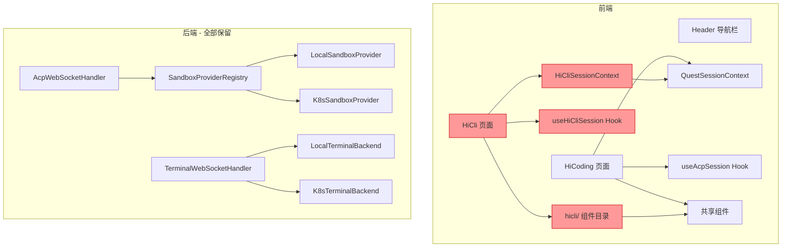
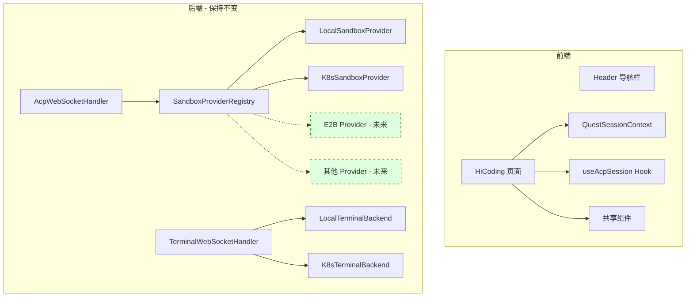
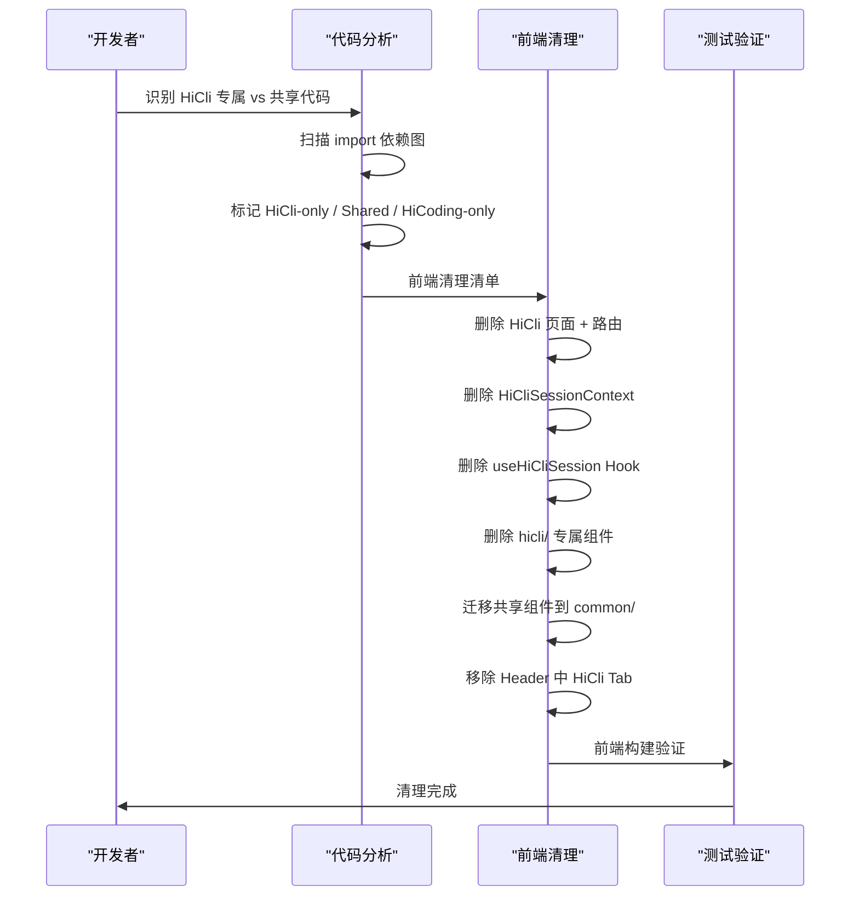

# 设计文档：HiCli POC 代码清理

## 概述

HiCli 最初作为 POC（概念验证）模块开发，用于验证 ACP 协议和 CLI Agent 的交互模式。现在 HiCoding 已基本完成，HiCli 的历史使命已经结束，需要移除 HiCli 前端相关逻辑。

本地沙箱模式（LOCAL sandbox）的后端代码全部保留——包括 LocalSandboxProvider、LocalSidecarAdapter、LocalSidecarProcess、LocalTerminalBackend 等，以及 SandboxType.LOCAL 枚举值、AcpProperties 中的 localEnabled 字段、SandboxConfig 中的 localSidecarPort 字段、application.yml 中的 local-enabled 配置、AcpWebSocketHandler 和 TerminalWebSocketHandler 中的 LOCAL 相关逻辑、RuntimeSelector 中的 LOCAL 分支，以及所有 LOCAL 相关的后端测试文件。本地模式在开发调试阶段仍有价值，且保留多类型沙箱抽象有利于未来扩展。

清理范围严格限定在前端：删除 HiCli 页面、HiCliSessionContext、useHiCliSession Hook、hicli/ 目录下的 HiCli 专属组件，迁移 hicli/ 目录下被 HiCoding 共用的组件到 common/，移除路由和导航栏中的 HiCli 入口，删除 HiCli 相关的前端测试文件。

## 架构

### 清理前架构



红色标注的是需要移除的前端模块。后端代码全部保留，不做任何修改。

### 清理后架构




## 清理范围分析

### 核心原则

1. **后端零改动**：所有后端 Java 代码、配置文件、后端测试文件均不做任何修改
2. **仅清理前端 HiCli 相关代码**：删除 HiCli 专属页面、组件、Hook、Context、测试
3. **迁移共享组件**：将 hicli/ 目录下被 HiCoding 共用的组件迁移到 common/
4. **保留前端 LOCAL 运行时类型**：RuntimeType 中的 `'local'` 保留，因为后端仍支持 LOCAL 模式

### 主序列图：清理决策流程



### 明确不在清理范围内的后端代码

以下后端代码全部保留，不做任何修改：

| 保留的后端文件 | 说明 |
|--------------|------|
| `LocalSandboxProvider.java` | 本地沙箱提供者 |
| `LocalSidecarAdapter.java` | 本地 Sidecar WebSocket 适配器 |
| `LocalSidecarProcess.java` | 本地 Sidecar 进程封装 |
| `LocalTerminalBackend.java` | 本地终端后端 |
| `LocalRuntimeAdapter.java` | 本地运行时适配器（即使已 @Deprecated 也保留） |
| `LocalFileSystemAdapter.java` | 本地文件系统适配器（即使已 @Deprecated 也保留） |
| `SandboxType.java` | 保留 LOCAL 枚举值 |
| `AcpProperties.java` | 保留 localEnabled 字段 |
| `SandboxConfig.java` | 保留 localSidecarPort 字段 |
| `AcpWebSocketHandler.java` | 保留 LOCAL 相关逻辑 |
| `TerminalWebSocketHandler.java` | 保留本地终端分支 |
| `RuntimeSelector.java` | 保留 LOCAL 分支 |
| `application.yml` | 保留 local-enabled 配置 |
| 所有 LOCAL 相关后端测试文件 | 全部保留 |

## 组件和接口

### 第一部分：前端需要删除的文件（HiCli 专属）

以下文件仅被 HiCli 页面使用，可以安全删除：

| 文件路径 | 说明 | 风险 |
|---------|------|------|
| `src/pages/HiCli.tsx` | HiCli 页面组件 | 无，专属 |
| `src/context/HiCliSessionContext.tsx` | HiCli 状态管理（扩展 QuestState） | 无，专属 |
| `src/hooks/useHiCliSession.ts` | HiCli WebSocket 会话 Hook | 无，专属 |
| `src/components/hicli/HiCliSelector.tsx` | HiCli CLI 选择器（包装 CliSelector） | 无，专属 |
| `src/components/hicli/HiCliSidebar.tsx` | HiCli 侧边栏 | 无，专属 |
| `src/components/hicli/HiCliTopBar.tsx` | HiCli 顶部工具栏 | 无，专属 |
| `src/components/hicli/HiCliWelcome.tsx` | HiCli 欢迎页 | 无，专属 |
| `src/components/hicli/AcpLogPanel.tsx` | ACP 日志面板（依赖 HiCliState） | 无，专属 |
| `src/components/hicli/AgentInfoCard.tsx` | Agent 信息卡片 | 无，专属 |

### 第二部分：前端需要删除的测试文件

| 文件路径 | 说明 |
|---------|------|
| `src/context/__tests__/HiCliSessionContext.test.ts` | HiCliSessionContext reducer 属性测试 |
| `src/hooks/__tests__/useHiCliSession.lazySession.test.ts` | HiCli 延迟创建会话 bug 测试 |
| `src/hooks/__tests__/useHiCliSession.preservation.test.ts` | HiCli 会话保持测试（如存在） |
| `src/components/hicli/__tests__/AcpLogPanel.test.tsx` | AcpLogPanel 属性测试 |

### 第三部分：前端需要修改的文件（共享代码）

| 文件路径 | 修改内容 | 风险 |
|---------|---------|------|
| `src/router.tsx` | 移除 HiCli import 和 `/hicli` 路由 | 低 |
| `src/components/Header.tsx` | 移除 `{ path: "/hicli", label: "HiCli" }` Tab | 低 |
| `src/pages/Coding.tsx` | 将 `SandboxInitProgress` 的 import 路径从 `hicli/` 迁移到 `common/` | 中 |
| `src/components/common/CliSelector.tsx` | 更新从 `hicli/` 迁移到 `common/` 的组件 import 路径；移除 HiCli 相关注释 | 中 |
| `src/lib/utils/wsUrl.ts` | 移除注释中对 HiCli 的引用 | 低 |

**注意**：`src/types/runtime.ts` 中的 `RuntimeType` 保留 `'local'` 类型不变，`src/hooks/useRuntimeSelection.ts` 中的 local 相关逻辑也保留不变，因为后端仍支持 LOCAL 模式。

### 第四部分：前端需要迁移的共享组件

以下组件位于 `hicli/` 目录但被 HiCoding 也使用，需迁移到 `common/`：

| 文件路径 | 被谁使用 | 迁移目标 |
|---------|---------|---------|
| `src/components/hicli/SandboxInitProgress.tsx` | Coding.tsx | `src/components/common/SandboxInitProgress.tsx` |
| `src/components/hicli/CustomModelForm.tsx` | CliSelector.tsx | `src/components/common/CustomModelForm.tsx` |
| `src/components/hicli/MarketModelSelector.tsx` | CliSelector.tsx | `src/components/common/MarketModelSelector.tsx` |
| `src/components/hicli/MarketMcpSelector.tsx` | CliSelector.tsx | `src/components/common/MarketMcpSelector.tsx` |
| `src/components/hicli/MarketSkillSelector.tsx` | CliSelector.tsx | `src/components/common/MarketSkillSelector.tsx` |

迁移后 `src/components/hicli/` 目录可以整体删除。


## 数据模型

### RuntimeType 前端类型（保持不变）

```typescript
// 保持不变，后端仍支持 LOCAL 模式
export type RuntimeType = 'local' | 'k8s';
```

### 后端数据模型（全部保持不变）

后端的 SandboxType 枚举、AcpProperties、SandboxConfig 等数据模型全部保持不变：

```java
// 保持不变
public enum SandboxType {
    LOCAL("local"),
    K8S("k8s"),
    E2B("e2b");
}

// 保持不变
@ConfigurationProperties(prefix = "acp")
public class AcpProperties {
    private boolean localEnabled = true;
    private String defaultRuntime = "local";
    // ...
}

// 保持不变
public record SandboxConfig(
    String userId,
    String workspace,
    String k8sNamespace,
    String containerImage,
    String e2bTemplate,
    int localSidecarPort
) {}
```

## 错误处理

### 风险场景与应对策略

| 风险场景 | 影响 | 应对策略 |
|---------|------|---------|
| HiCoding 引用了 hicli/ 组件 | 编译失败 | 先迁移共享组件到 common/，再删除 hicli/ |
| 前端 import 路径未更新 | TypeScript 编译错误 | 迁移组件后全局搜索 `hicli/` import，确保全部更新 |
| 迁移组件内部引用其他 hicli/ 组件 | 编译失败 | 检查迁移组件的内部 import，确保指向正确路径 |

## 测试策略

### 编译验证

- 前端：`npm run build` 确认无 TypeScript 错误

### 功能验证

- HiCoding 页面正常加载，CLI 选择器正常工作
- WebSocket 连接正常建立（LOCAL 和 K8s 运行时均可用）
- 终端功能正常（LOCAL 和 K8s 终端均可用）
- 导航栏正确显示（无 HiCli Tab）
- 访问 `/hicli` 路径应 404 或重定向

### 回归验证

- HiCoding 的所有现有功能不受影响
- HiChat 功能不受影响
- LOCAL 模式功能不受影响（后端未改动）
- 运行时选择器仍可选择 LOCAL 和 K8S

## 性能考虑

此次改造为纯前端代码清理，不涉及性能变更。后端代码完全不变，不影响任何运行时行为。

## 安全考虑

本次清理仅涉及前端 HiCli 页面移除，不影响安全模型。LOCAL 和 K8S 沙箱模式的安全隔离机制保持不变。

## 依赖

### 保留的核心抽象（不可删除）

**后端（全部保留）：**
- `SandboxProvider` 接口 — 沙箱提供者抽象
- `SandboxProviderRegistry` — 提供者注册中心
- `SandboxType` 枚举 — 保留 LOCAL、K8S 和 E2B
- `LocalSandboxProvider` — 本地沙箱提供者
- `LocalSidecarAdapter` / `LocalSidecarProcess` — 本地 Sidecar 相关
- `LocalTerminalBackend` — 本地终端后端
- `RuntimeAdapter` 接口 — 运行时适配器抽象
- `RuntimeSelector` — 运行时选择器（含 LOCAL 分支）
- `AcpWebSocketHandler` — WebSocket 处理器（含 LOCAL 逻辑）
- `TerminalWebSocketHandler` — 终端 WebSocket 处理器（含本地终端分支）
- `SandboxConfig` / `SandboxInfo` — 沙箱配置和信息
- `AcpProperties` — ACP 配置（含 localEnabled）
- `application.yml` — 应用配置（含 local-enabled）

**前端（保留）：**
- `QuestSessionContext` — Quest 状态管理（HiCoding 使用）
- `useAcpSession` / `useAcpWebSocket` — WebSocket Hook（HiCoding 使用）
- `CliSelector` / `RuntimeSelector` 组件 — CLI 和运行时选择器（HiCoding 使用）
- `RuntimeType` — 运行时类型（保留 `'local'`）
- `useRuntimeSelection` — 运行时选择 Hook（保留 local 逻辑）

## 正确性属性

*属性是在系统所有有效执行中都应成立的特征或行为——本质上是关于系统应该做什么的形式化陈述。属性是人类可读规范与机器可验证正确性保证之间的桥梁。*

### 属性 1：HiCli 引用清除不变量

*对于任意*前端源代码文件，清理完成后不应存在对任何已删除 HiCli 模块（HiCli_Page、HiCliSessionContext、useHiCliSession_Hook、HiCli_Components）的 import 语句，也不应存在指向 `src/components/hicli/` 目录的 import 路径。

**验证: 需求 7.5, 8.2, 2.3, 3.2**

### 属性 2：共享组件迁移后编译完整性

*对于任意*从 `hicli/` 迁移到 `common/` 的共享组件，迁移后该组件的功能行为应与迁移前完全一致，且所有引用该组件的文件的 import 路径均指向 Common_Directory。

**验证: 需求 4.1, 4.2, 4.3, 4.4**