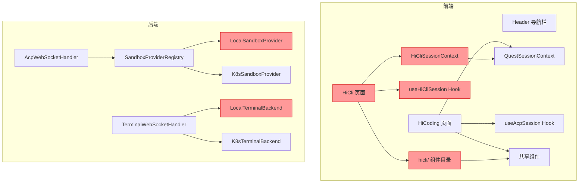
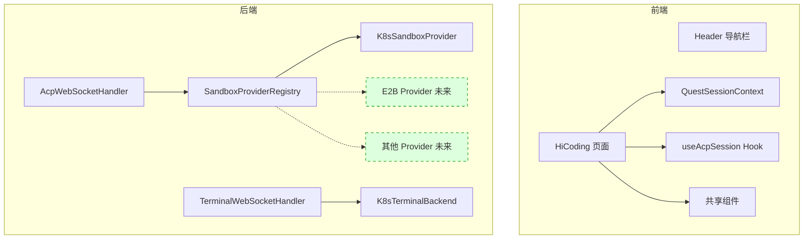
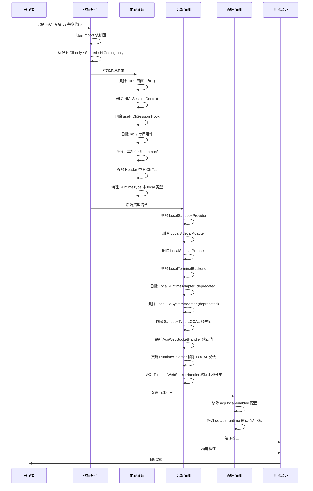

# 设计文档：HiCli POC 代码清理

## 概述

HiCli 最初作为 POC（概念验证）模块开发，用于验证 ACP 协议和 CLI Agent 的交互模式。现在 HiCoding 已基本完成，HiCli 的历史使命已经结束，需要完全移除 HiCli 前后端相关逻辑。

同时，本地模式（LOCAL sandbox）也不再需要支持——未来只通过沙箱运行 CLI Agent。但沙箱的多类型抽象设计（SandboxProvider / SandboxType 枚举）必须保留，因为当前对接的是 K8s Pod 自建方案，未来还会对接 E2B、OpenSandbox、AgentRun 等商业化沙箱产品。

核心挑战在于 HiCli 和 HiCoding 共用了大量基础设施代码（QuestSessionContext、ChatStream、QuestInput、useAcpWebSocket、CliSelector 等），清理时必须精确识别 HiCli 专属代码与共享代码的边界，避免破坏 HiCoding 功能。

## 架构

### 清理前架构



红色标注的是需要移除的模块。

### 清理后架构



## 清理范围分析

### 主序列图：清理决策流程



## 组件和接口

### 第一部分：前端需要删除的文件（HiCli 专属）

以下文件仅被 HiCli 页面使用，可以安全删除：

| 文件路径 | 说明 | 风险 |
|---------|------|------|
| `src/pages/HiCli.tsx` | HiCli 页面组件 | 无，专属 |
| `src/context/HiCliSessionContext.tsx` | HiCli 状态管理（扩展 QuestState） | 无，专属 |
| `src/hooks/useHiCliSession.ts` | HiCli WebSocket 会话 Hook | 无，专属 |
| `src/components/hicli/HiCliSelector.tsx` | HiCli CLI 选择器（包装 CliSelector） | 无，专属 |
| `src/components/hicli/HiCliSidebar.tsx` | HiCli 侧边栏 | 无，专属 |
| `src/components/hicli/HiCliTopBar.tsx` | HiCli 顶部工具栏 | 无，专属 |
| `src/components/hicli/HiCliWelcome.tsx` | HiCli 欢迎页 | 无，专属 |
| `src/components/hicli/AcpLogPanel.tsx` | ACP 日志面板（依赖 HiCliState） | 无，专属 |
| `src/components/hicli/AgentInfoCard.tsx` | Agent 信息卡片 | 无，专属 |

### 第二部分：前端需要删除的测试文件

| 文件路径 | 说明 |
|---------|------|
| `src/context/__tests__/HiCliSessionContext.test.ts` | HiCliSessionContext reducer 属性测试 |
| `src/hooks/__tests__/useHiCliSession.lazySession.test.ts` | HiCli 延迟创建会话 bug 测试 |
| `src/hooks/__tests__/useHiCliSession.preservation.test.ts` | HiCli 会话保持测试（如存在） |
| `src/components/hicli/__tests__/AcpLogPanel.test.tsx` | AcpLogPanel 属性测试 |

### 第三部分：前端需要修改的文件（共享代码）

| 文件路径 | 修改内容 | 风险 |
|---------|---------|------|
| `src/router.tsx` | 移除 HiCli import 和 `/hicli` 路由 | 低 |
| `src/components/Header.tsx` | 移除 `{ path: "/hicli", label: "HiCli" }` Tab | 低 |
| `src/pages/Coding.tsx` | 将 `SandboxInitProgress` 的 import 路径从 `hicli/` 迁移到 `common/` | 中 |
| `src/components/common/CliSelector.tsx` | 移除 `showRuntimeSelector` prop 和 HiCli 注释；移除对 `hicli/` 组件的 import | 中 |
| `src/types/runtime.ts` | 从 `RuntimeType` 中移除 `'local'` | 中 |
| `src/hooks/useRuntimeSelection.ts` | 移除 `local` 相关的默认选项和逻辑 | 中 |
| `src/lib/utils/wsUrl.ts` | 移除注释中对 HiCli 的引用 | 低 |

### 第四部分：前端需要迁移的共享组件

以下组件位于 `hicli/` 目录但被 HiCoding 也使用，需迁移到 `common/`：

| 文件路径 | 被谁使用 | 迁移目标 |
|---------|---------|---------|
| `src/components/hicli/SandboxInitProgress.tsx` | Coding.tsx | `src/components/common/SandboxInitProgress.tsx` |
| `src/components/hicli/CustomModelForm.tsx` | CliSelector.tsx | `src/components/common/CustomModelForm.tsx` |
| `src/components/hicli/MarketModelSelector.tsx` | CliSelector.tsx | `src/components/common/MarketModelSelector.tsx` |
| `src/components/hicli/MarketMcpSelector.tsx` | CliSelector.tsx | `src/components/common/MarketMcpSelector.tsx` |
| `src/components/hicli/MarketSkillSelector.tsx` | CliSelector.tsx | `src/components/common/MarketSkillSelector.tsx` |

迁移后 `src/components/hicli/` 目录可以整体删除。

### 第五部分：后端需要删除的文件

| 文件路径 | 说明 | 风险 |
|---------|------|------|
| `LocalSandboxProvider.java` | 本地沙箱提供者（启动 Sidecar 进程） | 无，LOCAL 专属 |
| `LocalSidecarAdapter.java` | 本地 Sidecar WebSocket 适配器 | 无，LOCAL 专属 |
| `LocalSidecarProcess.java` | 本地 Sidecar 进程封装 | 无，LOCAL 专属 |
| `LocalTerminalBackend.java` | 本地终端后端 | 无，LOCAL 专属 |
| `LocalRuntimeAdapter.java` | 已废弃的本地运行时适配器 | 无，已 @Deprecated |
| `LocalFileSystemAdapter.java` | 已废弃的本地文件系统适配器 | 无，已 @Deprecated |

### 第六部分：后端需要删除的测试文件

| 文件路径 | 说明 |
|---------|------|
| `LocalSandboxProviderPropertyTest.java` | LocalSandboxProvider 属性测试 |
| `LocalRuntimeAdapterTest.java` | LocalRuntimeAdapter 单元测试 |

### 第七部分：后端需要修改的文件

| 文件路径 | 修改内容 | 风险 |
|---------|---------|------|
| `SandboxType.java` | 移除 `LOCAL("local")` 枚举值 | 高——需确认所有引用已清理 |
| `AcpProperties.java` | 移除 `localEnabled` 字段和 getter/setter | 中 |
| `AcpWebSocketHandler.java` | `resolveSandboxType()` 默认值从 LOCAL 改为 K8S；移除本地 cwd 逻辑 | 高 |
| `RuntimeSelector.java` | 移除 `isSandboxAvailable` 中 LOCAL 分支；移除 LOCAL 相关标签/描述 | 中 |
| `TerminalWebSocketHandler.java` | 移除本地终端分支，仅保留 K8s 终端逻辑 | 中 |
| `InitContext.java` | 无需修改（不直接依赖 LOCAL） | 无 |
| `SandboxConfig.java` | 移除 `localSidecarPort` 字段 | 低 |
| `RuntimeFaultNotification.java` | 移除注释中 LOCAL 引用 | 低 |
| `CliReadyPhase.java` | 移除注释中 LOCAL 相关说明 | 低 |
| `RuntimeAdapter.java` | 移除注释中 Local 引用 | 低 |
| `application.yml` | 移除 `local-enabled`；`default-runtime` 改为 `k8s` | 中 |

### 第八部分：后端测试需要修改的文件

| 文件路径 | 修改内容 |
|---------|---------|
| `AcpPropertiesTest.java` | 移除 LOCAL 相关的 compatibleRuntimes 测试 |
| `RuntimeControllerTest.java` | 移除 local-only provider 和 LOCAL 运行时测试 |
| `CliProviderControllerTest.java` | 移除 LOCAL 相关的 compatibleRuntimes 断言 |
| `RuntimeSelectionFilterPropertyTest.java` | 移除 LOCAL 相关的属性测试 |
| `RuntimeFaultNotificationTest.java` | 将 LOCAL 引用改为 K8S |
| `SandboxProviderRegistryTest.java` | 移除 LOCAL provider 注册测试 |
| `SandboxInfoPropertyTest.java` | 移除 localSandboxInfo 测试 |

## 数据模型

### SandboxType 枚举变更

```java
// 清理前
public enum SandboxType {
    LOCAL("local"),   // ← 移除
    K8S("k8s"),
    E2B("e2b");
}

// 清理后
public enum SandboxType {
    K8S("k8s"),
    E2B("e2b");
}
```

### RuntimeType 前端类型变更

```typescript
// 清理前
export type RuntimeType = 'local' | 'k8s';

// 清理后
export type RuntimeType = 'k8s';
// 未来扩展：export type RuntimeType = 'k8s' | 'e2b' | 'opensandbox';
```

### AcpProperties 配置变更

```java
// 清理前
@ConfigurationProperties(prefix = "acp")
public class AcpProperties {
    private boolean localEnabled = true;        // ← 移除
    private String defaultRuntime = "local";    // ← 改为 "k8s"
    // ...
}

// 清理后
@ConfigurationProperties(prefix = "acp")
public class AcpProperties {
    private String defaultRuntime = "k8s";
    // ...
}
```

### SandboxConfig 变更

```java
// 清理前
public record SandboxConfig(
    String userId,
    String workspace,
    String k8sNamespace,
    String containerImage,
    String e2bTemplate,
    int localSidecarPort  // ← 移除
) {}

// 清理后
public record SandboxConfig(
    String userId,
    String workspace,
    String k8sNamespace,
    String containerImage,
    String e2bTemplate
) {}
```

## 错误处理

### 风险场景与应对策略

| 风险场景 | 影响 | 应对策略 |
|---------|------|---------|
| HiCoding 引用了 hicli/ 组件 | 编译失败 | 先迁移共享组件到 common/，再删除 hicli/ |
| SandboxType.LOCAL 被反序列化 | 运行时异常 | 数据库中无 LOCAL 持久化数据，无风险 |
| application.yml 中 compatible-runtimes 包含 LOCAL | 启动失败 | 同步更新配置文件 |
| 前端 localStorage 中存储了 'local' 运行时 | 选择器异常 | useRuntimeSelection 已有 fallback 逻辑 |
| AcpWebSocketHandler 默认值变更 | 未传 runtime 参数的旧客户端 | 默认改为 K8S，旧客户端需更新 |

## 测试策略

### 编译验证

- 后端：`mvn compile -pl himarket-server` 确认无编译错误
- 前端：`npm run build` 确认无 TypeScript 错误

### 功能验证

- HiCoding 页面正常加载，CLI 选择器正常工作
- WebSocket 连接正常建立（K8s 运行时）
- 终端功能正常（K8s 终端）
- `/runtime/available` 接口返回正确（不含 LOCAL）
- `/cli-providers` 接口返回正确（compatibleRuntimes 不含 LOCAL）

### 回归验证

- HiCoding 的所有现有功能不受影响
- HiChat 功能不受影响
- 导航栏正确显示（无 HiCli Tab）
- 访问 `/hicli` 路径应 404 或重定向

## 性能考虑

此次改造为纯代码清理，不涉及性能变更。移除 LocalSandboxProvider 后，服务端不再需要管理本地 Sidecar 进程，减少了内存和 CPU 开销。

## 安全考虑

移除本地模式后，所有 CLI Agent 执行都在沙箱环境中运行，安全隔离性更好。不再有服务器本地进程启动的安全风险。

## 依赖

### 保留的核心抽象（不可删除）

- `SandboxProvider` 接口 — 沙箱提供者抽象
- `SandboxProviderRegistry` — 提供者注册中心
- `SandboxType` 枚举 — 保留 K8S 和 E2B
- `RuntimeAdapter` 接口 — 运行时适配器抽象
- `RuntimeSelector` — 运行时选择器
- `SandboxConfig` / `SandboxInfo` — 沙箱配置和信息
- `QuestSessionContext` — Quest 状态管理（HiCoding 使用）
- `useAcpSession` / `useAcpWebSocket` — WebSocket Hook（HiCoding 使用）
- `CliSelector` / `RuntimeSelector` 组件 — CLI 和运行时选择器（HiCoding 使用）

## 正确性属性

1. **HiCoding 功能完整性**：清理后 HiCoding 页面的所有功能（CLI 选择、WebSocket 连接、会话管理、终端、文件编辑）均正常工作
2. **路由正确性**：`/hicli` 路由不再存在，`/coding` 路由正常工作
3. **沙箱多类型扩展性**：SandboxType 枚举保留 K8S 和 E2B，SandboxProvider 接口不变，未来可无缝添加新的沙箱类型
4. **编译完整性**：前后端代码无编译/类型错误
5. **配置一致性**：application.yml 中不再引用 LOCAL，所有 provider 的 compatibleRuntimes 仅包含 K8S
