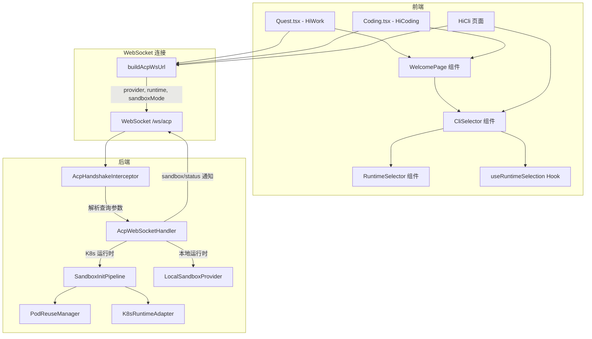
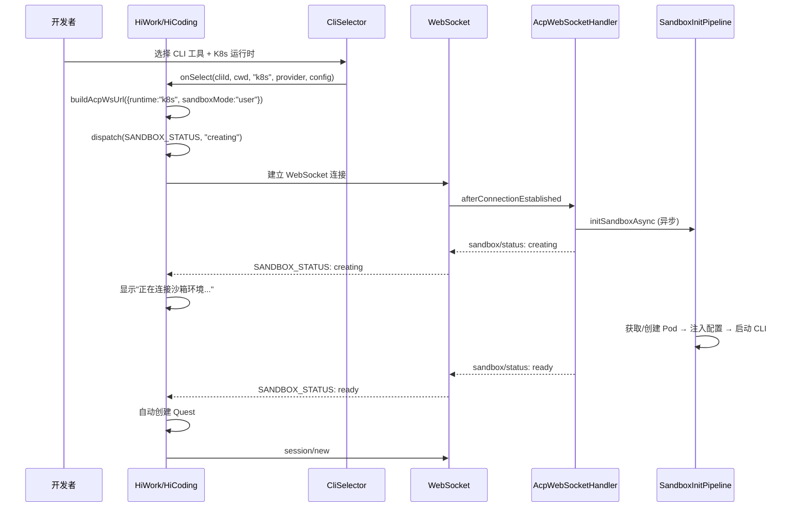
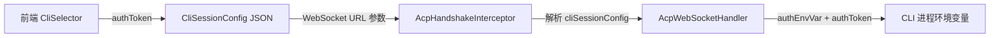

# 技术设计文档：HiWork 和 HiCoding 沙箱模式对接

## 概述

本设计将 HiWork（Quest 页面）和 HiCoding（Coding 页面）对接 K8s 沙箱模式，参考 HiCli 的现有实现。当前 HiWork 和 HiCoding 页面硬编码使用 `runtime: "local"`，不支持运行时选择和沙箱环境。本次改造的核心目标：

1. 在 HiWork 和 HiCoding 的 CliSelector 中启用运行时选择器（RuntimeSelector）
2. 将选中的运行时类型和 sandboxMode 参数传递到 WebSocket URL
3. 处理沙箱异步创建的状态展示（creating → ready / error）
4. 沙箱就绪后再自动创建 Quest，避免在 Pod 未就绪时发送请求
5. HiCli 的 CliSelector 补充 sandboxMode 参数传递
6. 支持 CLI 工具选择步骤的差异化处理（authOptions、认证方案）
7. 支持 CLI 工具扩展配置路径的差异化处理（各工具独立的 CliConfigGenerator）

### 设计决策

- **复用现有组件**：CliSelector、RuntimeSelector、useRuntimeSelection 已在 HiCli 中完整实现，HiWork 和 HiCoding 只需启用 `showRuntimeSelector={true}` 并在连接回调中使用实际的 runtime 参数
- **统一 WebSocket URL 构建**：三个页面统一使用 `buildAcpWsUrl()` 函数，确保参数一致性
- **后端无需修改沙箱流程**：AcpHandshakeInterceptor 已支持解析 runtime、sandboxMode 参数，AcpWebSocketHandler 已实现完整的沙箱初始化 Pipeline，后端改动仅限于 CliProviderConfig 新增 authOptions/authEnvVar 属性
- **渐进式支持**：会话级沙箱（session）标记为待支持，Kiro CLI 沙箱认证标记为待支持

## 架构

### 整体架构



### 连接流程（K8s 沙箱模式）




## 组件与接口

### 前端组件变更

#### 1. Quest.tsx（HiWork 页面）

**当前状态**：`handleSelectCli` 硬编码 `runtime: "local"`，不传递 sandboxMode。

**改造方案**：
- `WelcomePage` 传递 `showRuntimeSelector={true}`
- `handleSelectCli` 使用回调参数中的 `runtime` 值（而非硬编码 "local"）
- 当 `runtime === "k8s"` 时，在 `buildAcpWsUrl` 中附加 `sandboxMode: "user"`
- 连接 K8s 运行时时，立即 dispatch `SANDBOX_STATUS: creating`
- 修改自动创建 Quest 的逻辑：K8s 运行时需等待 `sandboxStatus.status === "ready"` 后再创建

```typescript
// 改造后的 handleSelectCli
const handleSelectCli = useCallback(
  (cliId: string, _cwd: string, runtime?: string, _providerObj?: ICliProvider, cliSessionConfig?: string) => {
    localStorage.setItem("hicoding:cliProvider", cliId);
    setCurrentProvider(cliId);
    const isK8s = runtime === "k8s";
    const url = buildAcpWsUrl({
      token: localStorage.getItem("access_token") || undefined,
      provider: cliId || undefined,
      runtime: runtime || "local",
      sandboxMode: isK8s ? "user" : undefined,
      cliSessionConfig,
    });
    if (isK8s) {
      dispatch({ type: "SANDBOX_STATUS", status: "creating", message: "正在连接沙箱环境..." });
    }
    setCurrentWsUrl(url);
  },
  [dispatch]
);
```

#### 2. Coding.tsx（HiCoding 页面）

**改造方案**：与 Quest.tsx 完全一致的改造模式。

#### 3. WelcomePage.tsx

**当前状态**：`showRuntimeSelector` 默认为 `false`。

**改造方案**：HiWork 和 HiCoding 传递 `showRuntimeSelector={true}`。

#### 4. CliSelector.tsx

**当前状态**：已支持 `showRuntimeSelector` prop 和运行时选择，但缺少 sandboxMode 传递和认证方案步骤。

**改造方案**：
- `onSelect` 回调中传递 `sandboxMode`（当 runtime 为 k8s 时传 "user"）
- `useRuntimeSelection` 已管理 sandboxMode 状态，需在 `handleConnect` 中将其传入 `buildAcpWsUrl`
- 新增认证方案选择步骤（authOptions）
- `computeSteps` 函数新增 `authOptions` 能力标志判断

#### 5. stepUtils.ts

**改造方案**：
- `ProviderCapabilities` 接口新增 `authOptions?: string[]` 属性
- `computeSteps` 函数新增认证方案步骤：当 `authOptions` 非空且长度 > 0 时，在"选择工具"和"模型配置"之间插入"认证方案"步骤

```typescript
export interface ProviderCapabilities {
  supportsCustomModel?: boolean;
  supportsMcp?: boolean;
  supportsSkill?: boolean;
  authOptions?: string[];
}

export function computeSteps(capabilities: ProviderCapabilities | null | undefined): StepConfig[] {
  const supportsCustomModel = capabilities?.supportsCustomModel === true;
  const supportsMcp = capabilities?.supportsMcp === true;
  const supportsSkill = capabilities?.supportsSkill === true;
  const hasAuthOptions = (capabilities?.authOptions?.length ?? 0) > 0;

  return [
    { key: 'select-tool', title: '选择工具', visible: true },
    { key: 'auth-config', title: '认证方案', visible: hasAuthOptions },
    { key: 'model-config', title: '模型配置', visible: supportsCustomModel },
    { key: 'extension-config', title: '扩展配置', visible: supportsMcp || supportsSkill },
  ];
}
```

### 前端类型变更

#### ICliProvider 接口扩展

```typescript
export interface ICliProvider {
  key: string;
  displayName: string;
  isDefault: boolean;
  available: boolean;
  compatibleRuntimes?: RuntimeType[];
  runtimeCategory?: 'native' | 'nodejs' | 'python';
  containerImage?: string;
  supportsCustomModel?: boolean;
  supportsMcp?: boolean;
  supportsSkill?: boolean;
  // 新增
  authOptions?: string[];    // 认证方案列表，如 ["default", "personal_access_token"]
  authEnvVar?: string;       // Token/API Key 对应的环境变量名
}
```

### 后端变更

#### 1. CliProviderConfig（AcpProperties.java）

新增两个可选属性：

```java
public static class CliProviderConfig {
    // ... 现有属性 ...
    
    /** 该 CLI 工具支持的认证方案列表（可选） */
    private List<String> authOptions;
    
    /** 该 CLI 工具的 Token/API Key 对应的环境变量名（可选） */
    private String authEnvVar;
    
    // getter/setter
}
```

#### 2. CliProviderInfo（CliProviderController.java）

扩展 record 以包含新属性：

```java
public record CliProviderInfo(
    String key,
    String displayName,
    boolean isDefault,
    boolean available,
    String runtimeCategory,
    List<RuntimeType> compatibleRuntimes,
    String containerImage,
    boolean supportsCustomModel,
    boolean supportsMcp,
    boolean supportsSkill,
    // 新增
    List<String> authOptions,
    String authEnvVar
) {}
```

#### 3. application.yml 配置扩展

```yaml
acp:
  providers:
    qodercli:
      # ... 现有配置 ...
      auth-options: default,personal_access_token
      auth-env-var: QODER_PERSONAL_ACCESS_TOKEN
    claude-code:
      # ... 现有配置 ...
      auth-env-var: ANTHROPIC_API_KEY
    kiro-cli:
      # ... 现有配置 ...
      # 无 authOptions 和 authEnvVar → 标识不支持沙箱认证
```

#### 4. CliSessionConfig 扩展

新增 `authToken` 字段，用于传递认证凭据：

```java
@Data
public class CliSessionConfig {
    private CustomModelConfig customModelConfig;
    private List<McpServerEntry> mcpServers;
    private List<SkillEntry> skills;
    // 新增
    private String authToken;  // 认证凭据（PAT / API Key）
}
```

#### 5. AcpWebSocketHandler 环境变量注入

在 `buildRuntimeConfig` 或 `prepareConfigFiles` 阶段，当 `CliSessionConfig.authToken` 非空且 `CliProviderConfig.authEnvVar` 已配置时，将 `authToken` 注入到 CLI 进程的环境变量中：

```java
if (sessionConfig != null && sessionConfig.getAuthToken() != null 
    && providerConfig.getAuthEnvVar() != null) {
    config.getEnv().put(providerConfig.getAuthEnvVar(), sessionConfig.getAuthToken());
}
```

#### 6. CliConfigGenerator 扩展

按需为新的 CLI 工具实现 CliConfigGenerator：
- `ClaudeCodeConfigGenerator`：MCP 配置写入 `.claude/settings.json`
- `QoderCliConfigGenerator`：MCP 配置写入 `.qoder/` 目录下的配置文件
- 现有 `QwenCodeConfigGenerator` 和 `OpenCodeConfigGenerator` 无需修改


## 数据模型

### 前端状态模型

#### QuestState 沙箱状态（已存在，无需修改）

```typescript
interface QuestState {
  // ... 现有字段 ...
  sandboxStatus: {
    status: "creating" | "ready" | "error";
    message: string;
  } | null;
}
```

#### CliSessionConfig 前端类型扩展

```typescript
export interface CliSessionConfig {
  customModelConfig?: CustomModelFormData;
  mcpServers?: McpServerEntry[];
  skills?: SkillEntry[];
  // 新增
  authToken?: string;  // 认证凭据
}
```

### WebSocket URL 参数模型

| 参数 | 类型 | 说明 | 示例 |
|------|------|------|------|
| token | string | JWT 认证 token | - |
| provider | string | CLI 工具 key | qodercli, qwen-code |
| runtime | string | 运行时类型 | local, k8s |
| sandboxMode | string | 沙箱模式（仅 K8s） | user |
| cliSessionConfig | string | JSON 序列化的会话配置 | - |

### 后端配置模型

#### CliProviderConfig 属性映射

| YAML 属性 | Java 字段 | 类型 | 说明 |
|-----------|----------|------|------|
| auth-options | authOptions | List\<String\> | 认证方案列表 |
| auth-env-var | authEnvVar | String | Token 环境变量名 |

### 认证方案数据流



### 各 CLI 工具认证方案对照表

| CLI 工具 | authOptions | authEnvVar | 沙箱认证 | 说明 |
|---------|-------------|------------|---------|------|
| QoderCli | ["default", "personal_access_token"] | QODER_PERSONAL_ACCESS_TOKEN | ✅ | 默认/PAT 两种方案 |
| Claude Code | - | ANTHROPIC_API_KEY | ✅ | 沙箱模式需 API Key |
| Kiro CLI | - | - | ❌ 待支持 | 仅支持 OAuth，沙箱无法完成 |
| Qwen Code | - | - | ✅ | 通过自定义模型配置认证 |
| OpenCode | - | - | ✅ | 通过自定义模型配置认证 |
| Codex | - | - | ✅ | 无需额外认证 |

### 各 CLI 工具扩展配置路径对照表

| CLI 工具 | MCP 配置路径 | Skill 配置路径 | ConfigGenerator |
|---------|-------------|---------------|-----------------|
| Qwen Code | `.qwen/settings.json` → mcpServers | `.qwen/skills/{name}/SKILL.md` | QwenCodeConfigGenerator ✅ |
| OpenCode | `opencode.json` | - | OpenCodeConfigGenerator ✅ |
| Claude Code | `.claude/settings.json` | - | ClaudeCodeConfigGenerator（新增） |
| QoderCli | `.qoder/` 目录（待确认） | - | QoderCliConfigGenerator（新增） |


## 正确性属性

*属性是在系统所有有效执行中都应成立的特征或行为——本质上是关于系统应该做什么的形式化陈述。属性是人类可读规范与机器可验证正确性保证之间的桥梁。*

### Property 1: WebSocket URL 参数完整性

*对于任意* 非空的 WsUrlParams（包含 provider、runtime、token、sandboxMode、cliSessionConfig 的任意组合），`buildAcpWsUrl` 生成的 URL 应包含所有非空参数作为查询字符串键值对，且参数值与输入一致。

**Validates: Requirements 1.2, 1.3, 2.2, 2.3, 3.4**

### Property 2: sandboxMode 条件附加

*对于任意* CLI provider 和运行时类型组合，当 runtime 为 "k8s" 时，构建的 WebSocket URL 应包含 `sandboxMode=user` 查询参数；当 runtime 为 "local" 时，URL 不应包含 sandboxMode 参数。

**Validates: Requirements 3.1, 3.2, 3.3, 6.2, 6.3**

### Property 3: 单一运行时自动选中

*对于任意* 只包含一个可用运行时选项的 compatibleRuntimes 列表，`useRuntimeSelection` Hook 应自动将 selectedRuntime 设置为该唯一可用选项的类型。

**Validates: Requirements 1.4**

### Property 4: Quest 自动创建条件

*对于任意* 连接状态和沙箱状态组合：
- 当 runtime 为 "local" 且 connected=true 且 initialized=true 时，应自动创建 Quest
- 当 runtime 为 "k8s" 且 sandboxStatus.status 为 "creating" 时，不应自动创建 Quest
- 当 runtime 为 "k8s" 且 sandboxStatus.status 变为 "ready" 且 connected=true 且 initialized=true 时，应自动创建 Quest

**Validates: Requirements 5.1, 5.2, 5.3, 5.4, 5.5**

### Property 5: computeSteps 纯函数正确性

*对于任意* ProviderCapabilities 组合（supportsCustomModel、supportsMcp、supportsSkill、authOptions 的布尔/列表组合），`computeSteps` 返回的可见步骤列表应满足：
- "选择工具"步骤始终可见
- "认证方案"步骤仅当 authOptions 非空时可见
- "模型配置"步骤仅当 supportsCustomModel=true 时可见
- "扩展配置"步骤仅当 supportsMcp=true 或 supportsSkill=true 时可见

**Validates: Requirements 8.1, 8.2, 8.3, 8.4, 8.5**

### Property 6: authToken 环境变量注入

*对于任意* 非空的 authToken 和非空的 authEnvVar 配置，后端在构建 CLI 进程环境变量时，应将 authToken 的值设置到 authEnvVar 指定的环境变量名中。

**Validates: Requirements 9.4, 9.5**

### Property 7: /cli-providers 接口返回 authOptions 和 authEnvVar

*对于任意* 配置了 authOptions 或 authEnvVar 的 CliProviderConfig，`/cli-providers` 接口的响应中对应的 CliProviderInfo 应包含这些属性值，且与配置一致。

**Validates: Requirements 8.7**

### Property 8: MCP 配置写入路径正确性（Qwen Code）

*对于任意* 非空的 MCP Server 列表，`QwenCodeConfigGenerator.generateMcpConfig` 写入的 `.qwen/settings.json` 文件应包含所有 MCP Server 的配置，且每个 Server 的 url 和 transportType 与输入一致。

**Validates: Requirements 10.1**

### Property 9: Skill 配置路径正确性（Qwen Code）

*对于任意* 非空的 Skill 列表，`QwenCodeConfigGenerator.generateSkillConfig` 应为每个 Skill 在 `.qwen/skills/{kebab-case-name}/SKILL.md` 路径创建文件，且文件内容与输入的 skillMdContent 一致。

**Validates: Requirements 10.2**

### Property 10: 未注册 ConfigGenerator 的容错

*对于任意* 未在 configGeneratorRegistry 中注册的 provider key，配置注入阶段应静默跳过，不抛出异常，不影响后续流程。

**Validates: Requirements 10.6**


## 错误处理

### 前端错误处理

| 场景 | 处理方式 |
|------|---------|
| K8s 沙箱创建失败（sandbox/status: error） | 在页面显示错误信息，允许用户切换工具或重试 |
| WebSocket 连接断开 | 重置 sandboxStatus 为 null，重置 autoCreatedRef，显示重连选项 |
| Quest 自动创建失败 | dispatch SANDBOX_STATUS error，显示错误信息 |
| 运行时可用性 API 调用失败 | 回退为仅 local 可用，K8s 标记为不可用并显示原因 |
| CLI Provider 列表加载失败 | 显示错误信息和重试按钮 |
| Kiro CLI + K8s 运行时 | 禁用连接按钮，显示"沙箱认证待支持"提示 |
| authToken 为空但选择了需要认证的方案 | 前端校验，禁用连接按钮直到输入有效凭据 |

### 后端错误处理

| 场景 | 处理方式 |
|------|---------|
| Pod 创建超时 | 通过 SandboxInitPipeline 的重试机制处理，最终发送 sandbox/status: error |
| authEnvVar 未配置但收到 authToken | 忽略 authToken，不注入环境变量，记录 warn 日志 |
| CliConfigGenerator 执行异常 | 记录错误日志，发送 sandbox/status: error，关闭 WebSocket |
| 未知 provider key | 关闭 WebSocket 连接，返回 POLICY_VIOLATION |
| cliSessionConfig JSON 解析失败 | 记录 warn 日志，继续处理（已有容错逻辑） |

## 测试策略

### 测试框架

- **前端单元测试**：Vitest + React Testing Library
- **前端属性测试**：fast-check（已在 node_modules 中）
- **后端单元测试**：JUnit 5 + Mockito
- **后端属性测试**：jqwik（已在项目中使用）

### 属性测试（Property-Based Testing）

每个属性测试至少运行 100 次迭代，使用随机生成的输入数据验证属性的普遍性。

#### 前端属性测试

| 属性 | 测试文件 | 说明 |
|------|---------|------|
| Property 1: WebSocket URL 参数完整性 | `wsUrl.property.test.ts` | 生成随机 WsUrlParams，验证 URL 包含所有非空参数 |
| Property 2: sandboxMode 条件附加 | `wsUrl.property.test.ts` | 生成随机 provider + runtime 组合，验证 sandboxMode 条件 |
| Property 3: 单一运行时自动选中 | `useRuntimeSelection.property.test.ts` | 生成单元素运行时列表，验证自动选中 |
| Property 5: computeSteps 正确性 | `stepUtils.property.test.ts` | 生成随机 ProviderCapabilities，验证步骤可见性 |

```typescript
// Feature: sandbox-hiwork-hicoding, Property 1: WebSocket URL 参数完整性
// 示例：fast-check 属性测试
import fc from 'fast-check';
import { buildAcpWsUrl } from './wsUrl';

test('Property 1: 所有非空参数应出现在 URL 查询字符串中', () => {
  fc.assert(
    fc.property(
      fc.record({
        provider: fc.option(fc.string({ minLength: 1 })),
        runtime: fc.option(fc.constantFrom('local', 'k8s')),
        token: fc.option(fc.string({ minLength: 1 })),
        sandboxMode: fc.option(fc.constantFrom('user', 'session')),
      }),
      (params) => {
        const cleaned = Object.fromEntries(
          Object.entries(params).filter(([, v]) => v != null)
        );
        const url = buildAcpWsUrl(cleaned as any, '/ws/acp', 'ws://localhost');
        const searchParams = new URL(url).searchParams;
        for (const [key, value] of Object.entries(cleaned)) {
          expect(searchParams.get(key)).toBe(value);
        }
      }
    ),
    { numRuns: 100 }
  );
});
```

#### 后端属性测试

| 属性 | 测试文件 | 说明 |
|------|---------|------|
| Property 6: authToken 环境变量注入 | `AuthTokenInjectionPropertyTest.java` | 生成随机 authToken + authEnvVar，验证环境变量注入 |
| Property 7: /cli-providers 接口返回 | `CliProviderControllerPropertyTest.java` | 生成随机 CliProviderConfig，验证响应包含 authOptions/authEnvVar |
| Property 8: MCP 配置写入（Qwen Code） | `QwenCodeConfigGeneratorPropertyTest.java` | 生成随机 MCP Server 列表，验证 settings.json 内容 |
| Property 9: Skill 配置路径（Qwen Code） | `QwenCodeConfigGeneratorPropertyTest.java` | 生成随机 Skill 列表，验证文件路径和内容 |
| Property 10: 未注册 ConfigGenerator 容错 | `AcpWebSocketHandlerPropertyTest.java` | 生成随机未注册 provider key，验证静默跳过 |

```java
// Feature: sandbox-hiwork-hicoding, Property 6: authToken 环境变量注入
@Property(tries = 100)
void authTokenShouldBeInjectedToEnvVar(
    @ForAll @StringLength(min = 1, max = 100) String authToken,
    @ForAll @StringLength(min = 1, max = 50) String authEnvVar) {
    
    CliSessionConfig sessionConfig = new CliSessionConfig();
    sessionConfig.setAuthToken(authToken);
    
    CliProviderConfig providerConfig = new CliProviderConfig();
    providerConfig.setAuthEnvVar(authEnvVar);
    
    Map<String, String> env = new HashMap<>();
    // 执行注入逻辑
    if (sessionConfig.getAuthToken() != null && providerConfig.getAuthEnvVar() != null) {
        env.put(providerConfig.getAuthEnvVar(), sessionConfig.getAuthToken());
    }
    
    assertThat(env).containsEntry(authEnvVar, authToken);
}
```

### 单元测试

#### 前端单元测试

| 测试文件 | 覆盖范围 |
|---------|---------|
| `Quest.test.tsx` | HiWork 页面 K8s 连接流程、sandboxStatus 状态展示、Quest 自动创建条件 |
| `Coding.test.tsx` | HiCoding 页面 K8s 连接流程（与 Quest 对称） |
| `CliSelector.test.tsx` | 认证方案步骤渲染、Kiro CLI 禁用逻辑、Claude Code API Key 表单 |
| `RuntimeSelector.test.tsx` | 单一运行时自动选中、K8s 不可用时的 disabled 状态 |
| `stepUtils.test.ts` | computeSteps 边界情况（null/undefined 输入、各工具具体配置） |
| `wsUrl.test.ts` | buildAcpWsUrl 边界情况（空参数、特殊字符） |

#### 后端单元测试

| 测试文件 | 覆盖范围 |
|---------|---------|
| `CliProviderControllerTest.java` | /cli-providers 接口返回 authOptions/authEnvVar |
| `AcpWebSocketHandlerTest.java` | authToken 环境变量注入、未注册 ConfigGenerator 容错 |
| `ClaudeCodeConfigGeneratorTest.java` | Claude Code MCP 配置写入路径 |
| `QoderCliConfigGeneratorTest.java` | QoderCli MCP 配置写入路径 |

### 测试要求

- 每个属性测试必须引用设计文档中的属性编号
- 标签格式：**Feature: sandbox-hiwork-hicoding, Property {number}: {property_text}**
- 每个正确性属性由一个属性测试实现
- 属性测试最少 100 次迭代
- 单元测试覆盖具体示例、边界情况和错误条件
- 属性测试覆盖所有输入的普遍性质

