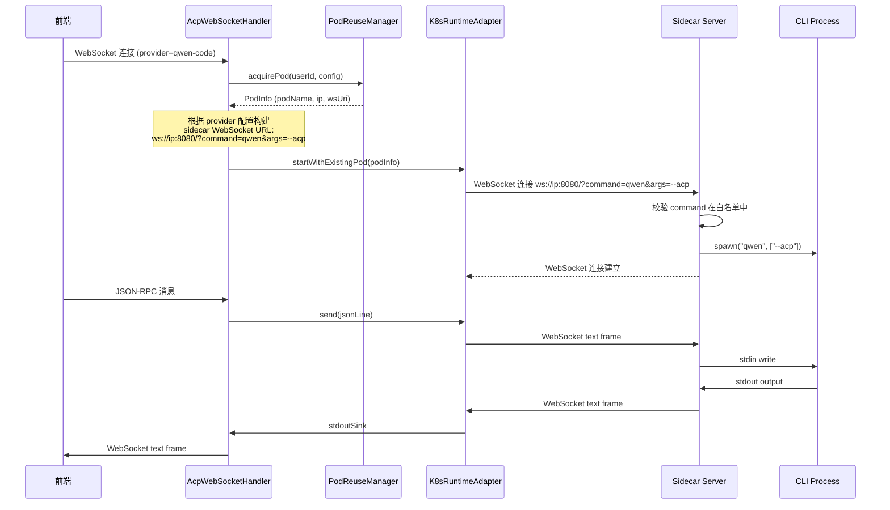

# 设计文档：沙箱多 CLI Sidecar

## 概述

本设计将 K8s 沙箱 Pod 中的 websocat sidecar 替换为基于 Node.js 的自研 WebSocket Server。新的 Sidecar Server 支持通过 WebSocket URL 查询参数动态指定 CLI 命令，使单个 Pod 能同时运行多个不同的 CLI 工具进程。

选择 Node.js 的理由：
- 沙箱镜像已预装 Node.js 20 LTS，无需额外安装
- `ws` 库成熟稳定，WebSocket + 子进程管理是 Node.js 的强项
- 未来扩展（鉴权中间件、日志、指标）生态丰富
- 相比 Python 的 asyncio，Node.js 事件循环模型更适合 I/O 密集的消息桥接场景
- 资源占用低，启动快

## 架构

### 整体架构变更

```
改造前:
┌─────────────────────────────────────────┐
│ K8s Pod                                 │
│  websocat (ws-l:0.0.0.0:8080)          │
│    └── sh-c: ${CLI_COMMAND} ${CLI_ARGS} │  ← 固定一个 CLI
└─────────────────────────────────────────┘

改造后:
┌──────────────────────────────────────────────────┐
│ K8s Pod                                          │
│  sidecar-server (Node.js, ws://0.0.0.0:8080)    │
│    ├── ws conn 1 → CLI Process A (qodercli)      │
│    ├── ws conn 2 → CLI Process B (qwen --acp)    │
│    └── ws conn N → CLI Process X (...)           │
└──────────────────────────────────────────────────┘
```

### 连接流程



## 组件与接口

### 1. Sidecar Server（新建：`sandbox/sidecar-server/`）

Node.js WebSocket 服务，运行在 Pod 内，监听 8080 端口。

**职责：**
- 接收 WebSocket 连接，解析 URL 查询参数 `command` 和 `args`
- 校验 command 是否在白名单中
- 为每个连接 spawn 独立的 CLI 子进程
- 双向桥接 WebSocket 消息 ↔ CLI stdin/stdout
- 管理子进程生命周期（优雅退出、僵尸进程清理）
- 提供 `/health` HTTP 端点

**接口：**

```
WebSocket: ws://0.0.0.0:8080/?command=<cmd>&args=<arg1+arg2>
  - command: 必填，CLI 命令名（如 qodercli, qwen）
  - args: 可选，空格分隔的参数（URL 编码）

HTTP: GET /health
  - 200: {"status":"ok","connections":<n>,"processes":<n>}
```

**配置：**

```
环境变量:
  SIDECAR_PORT          - 监听端口，默认 8080
  ALLOWED_COMMANDS      - 逗号分隔的命令白名单，如 "qodercli,qwen"
  GRACEFUL_TIMEOUT_MS   - 子进程优雅退出超时，默认 5000ms
```

### 2. K8sRuntimeAdapter（修改）

**变更点：**

- `buildPodSpec()`: 移除 `CLI_COMMAND` 和 `CLI_ARGS` 环境变量，新增 `ALLOWED_COMMANDS` 环境变量
- `connectToSidecarWebSocket()`: WebSocket URI 从 `ws://ip:8080/` 改为 `ws://ip:8080/?command=xxx&args=xxx`
- `startWithExistingPod()`: 接受额外的 CLI 参数用于构建 WebSocket URL
- 新增 `buildSidecarWsUri(String ip, String command, String args)` 方法

**新增方法签名：**

```java
// 构建带 CLI 参数的 Sidecar WebSocket URI
URI buildSidecarWsUri(String ip, String command, String args) {
    String uri = String.format("ws://%s:%d/?command=%s", ip, SIDECAR_PORT,
        URLEncoder.encode(command, StandardCharsets.UTF_8));
    if (args != null && !args.isBlank()) {
        uri += "&args=" + URLEncoder.encode(args, StandardCharsets.UTF_8);
    }
    return URI.create(uri);
}
```

### 3. PodReuseManager（修改）

**变更点：**

- `createNewPod()`: 移除 `CLI_COMMAND`/`CLI_ARGS` 环境变量，移除 `provider` 标签，新增 `ALLOWED_COMMANDS` 环境变量
- `queryPodFromK8sApi()`: 移除 `provider` 标签过滤条件
- `acquirePod()`: 返回的 `PodInfo` 中 `sidecarWsUri` 不再包含 CLI 参数（由 K8sRuntimeAdapter 在连接时添加）

### 4. AcpWebSocketHandler（修改）

**变更点：**

- `initK8sPodAsync()`: 将 provider 的 command/args 传递给 K8sRuntimeAdapter，用于构建 Sidecar WebSocket URL
- RuntimeConfig 中的 command/args 仍然保留，但不再用于 Pod 创建，而是用于 Sidecar 连接

### 5. entrypoint.sh（修改）

**变更点：**

```bash
# 改造前
exec websocat --text -E "ws-l:0.0.0.0:${SIDECAR_PORT}" "sh-c:${CLI_CMD}"

# 改造后
exec node /usr/local/lib/sidecar-server/index.js
```

### 6. Dockerfile（修改）

**变更点：**

- 移除 websocat 二进制文件的 COPY 步骤
- 新增 sidecar-server 目录的 COPY 和 `npm install --production`

## 数据模型

### Sidecar Server 内部数据结构

```typescript
// 单个连接的会话状态
interface Session {
  id: string;                    // 连接唯一标识
  ws: WebSocket;                 // WebSocket 连接对象
  process: ChildProcess | null;  // CLI 子进程
  command: string;               // CLI 命令
  args: string[];                // CLI 参数
  createdAt: Date;               // 连接创建时间
}

// 服务器状态
interface ServerState {
  sessions: Map<string, Session>;  // 活跃会话映射
  allowedCommands: Set<string>;    // 命令白名单
  port: number;                    // 监听端口
  gracefulTimeoutMs: number;       // 优雅退出超时
}
```

### 后端数据模型变更

**PodInfo（无结构变更）：** `sidecarWsUri` 字段的语义变化——不再包含 CLI 参数，仅为基础 URI `ws://ip:8080/`。CLI 参数由 K8sRuntimeAdapter 在连接时动态拼接。

**RuntimeConfig（无结构变更）：** `command` 和 `args` 字段的用途变化——不再用于 Pod 环境变量，而是用于构建 Sidecar WebSocket URL。

**AcpProperties（新增配置项）：**

```yaml
acp:
  k8s:
    allowed-commands: ${ACP_K8S_ALLOWED_COMMANDS:qodercli,qwen}  # 新增
```

对应 Java 配置类新增字段：

```java
// K8sConfig 新增
private String allowedCommands = "qodercli,qwen";
```


## 正确性属性

*正确性属性是一种在系统所有合法执行中都应成立的特征或行为——本质上是关于系统应该做什么的形式化陈述。属性是人类可读规格与机器可验证正确性保证之间的桥梁。*

### Property 1: WebSocket-CLI 消息 Round-Trip

*对于任意* 文本消息，通过 WebSocket 发送给 Sidecar Server 后，经 CLI 进程（使用 cat 命令回显）处理，WebSocket 客户端应收到与原始消息相同的内容。

**Validates: Requirements 1.3, 1.4**

### Property 2: 非白名单命令被拒绝

*对于任意* 不在 Allowed_Commands 白名单中的命令字符串，Sidecar Server 应拒绝 WebSocket 连接。

**Validates: Requirements 2.2**

### Property 3: 并发连接隔离性

*对于任意* N 个并发 WebSocket 连接（每个使用不同或相同的 CLI 命令），每个连接发送的消息应只被路由到该连接对应的 CLI 进程，不会串到其他连接。

**Validates: Requirements 1.7**

### Property 4: WebSocket 关闭触发进程终止

*对于任意* 活跃的 WebSocket 连接，关闭该连接后，对应的 CLI 子进程应在优雅退出超时内被终止。

**Validates: Requirements 1.5**

### Property 5: 进程退出触发连接关闭

*对于任意* 活跃的 WebSocket 连接，当对应的 CLI 子进程退出时，该 WebSocket 连接应被关闭。

**Validates: Requirements 1.6**

### Property 6: Pod 规格不含旧环境变量且包含白名单

*对于任意* RuntimeConfig 输入，K8sRuntimeAdapter.buildPodSpec() 和 PodReuseManager.createNewPod() 构建的 Pod 规格应满足：不包含 `CLI_COMMAND` 和 `CLI_ARGS` 环境变量，包含 `ALLOWED_COMMANDS` 环境变量，且 Pod 标签中不包含 `provider` 字段。

**Validates: Requirements 4.1, 4.2, 4.3, 4.4**

### Property 7: Sidecar WebSocket URI 包含 CLI 参数

*对于任意* command 和 args 组合，buildSidecarWsUri() 构建的 URI 应包含正确编码的 `command` 查询参数，且当 args 非空时包含正确编码的 `args` 查询参数。

**Validates: Requirements 6.1, 6.3**

### Property 8: 健康检查端点反映实际状态

*对于任意* 数量的活跃 WebSocket 连接，`/health` 端点返回的 `connections` 和 `processes` 数值应与实际活跃的连接数和进程数一致。

**Validates: Requirements 8.3**

### Property 9: SIGTERM 优雅关闭清理所有资源

*对于任意* 数量的活跃连接和 CLI 进程，Sidecar Server 收到 SIGTERM 后，所有 CLI 子进程应被终止，所有 WebSocket 连接应被关闭。

**Validates: Requirements 7.2**

## 错误处理

### Sidecar Server 错误处理

| 场景 | 处理方式 |
|------|---------|
| command 参数缺失 | 返回 WebSocket 关闭帧 (code=4400, reason="Missing command parameter") |
| command 不在白名单 | 返回 WebSocket 关闭帧 (code=4403, reason="Command not allowed: xxx") |
| CLI 进程 spawn 失败 | 发送错误 JSON 消息后关闭 WebSocket (code=4500) |
| CLI 进程异常退出 | 发送退出码信息后关闭 WebSocket (code=1000) |
| WebSocket 消息写入 stdin 失败 | 记录错误日志，关闭该连接 |

### 后端错误处理

| 场景 | 处理方式 |
|------|---------|
| Sidecar WebSocket 连接失败 | 保持现有重试逻辑，记录错误日志 |
| Sidecar 返回 4403 (命令不允许) | 记录错误日志，通知前端 |
| Pod 内 Sidecar 未启动 | 保持现有健康检查和超时机制 |

## 测试策略

### 属性测试（Property-Based Testing）

使用 `fast-check` 库（Node.js 生态成熟的 PBT 库）对 Sidecar Server 进行属性测试。

**配置：**
- 每个属性测试最少运行 100 次迭代
- 每个测试用注释标注对应的设计文档属性编号
- 标签格式：`Feature: sandbox-multi-cli-sidecar, Property N: <property_text>`

**属性测试覆盖：**
- Property 1 (Round-Trip): 使用 `cat` 命令作为 CLI，验证消息往返一致性
- Property 2 (白名单拒绝): 生成随机非白名单命令字符串
- Property 3 (并发隔离): 生成随机数量的并发连接和消息
- Property 7 (URI 构建): 生成随机 command/args 组合，验证 URI 格式

### 单元测试

**Sidecar Server（Node.js，使用 Jest）：**
- 白名单解析和校验逻辑
- URL 参数解析
- 进程生命周期管理（spawn、kill、cleanup）
- 健康检查端点响应格式
- 边界情况：空 command、特殊字符、超长参数

**后端 Java（使用 JUnit 5）：**
- `buildPodSpec()` 不含旧环境变量
- `buildSidecarWsUri()` URI 格式正确
- `createNewPod()` 不含 provider 标签
- `queryPodFromK8sApi()` 不按 provider 过滤

### 集成测试

- 端到端 WebSocket 连接 → CLI 进程 → 消息往返
- 多连接并发场景
- 进程异常退出场景
- SIGTERM 优雅关闭场景
