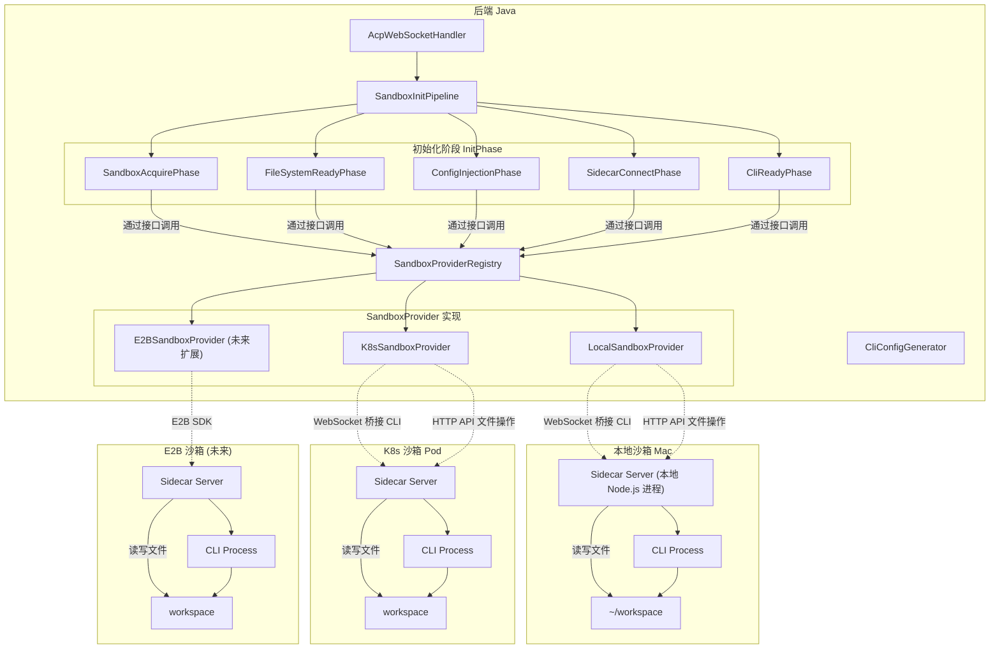
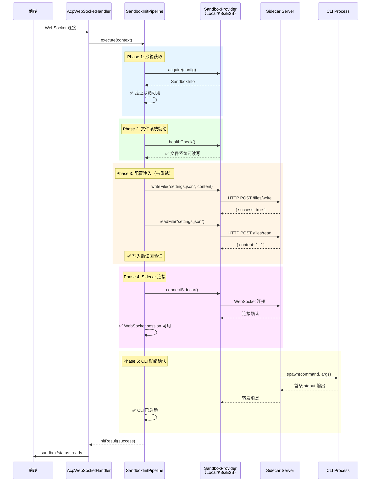
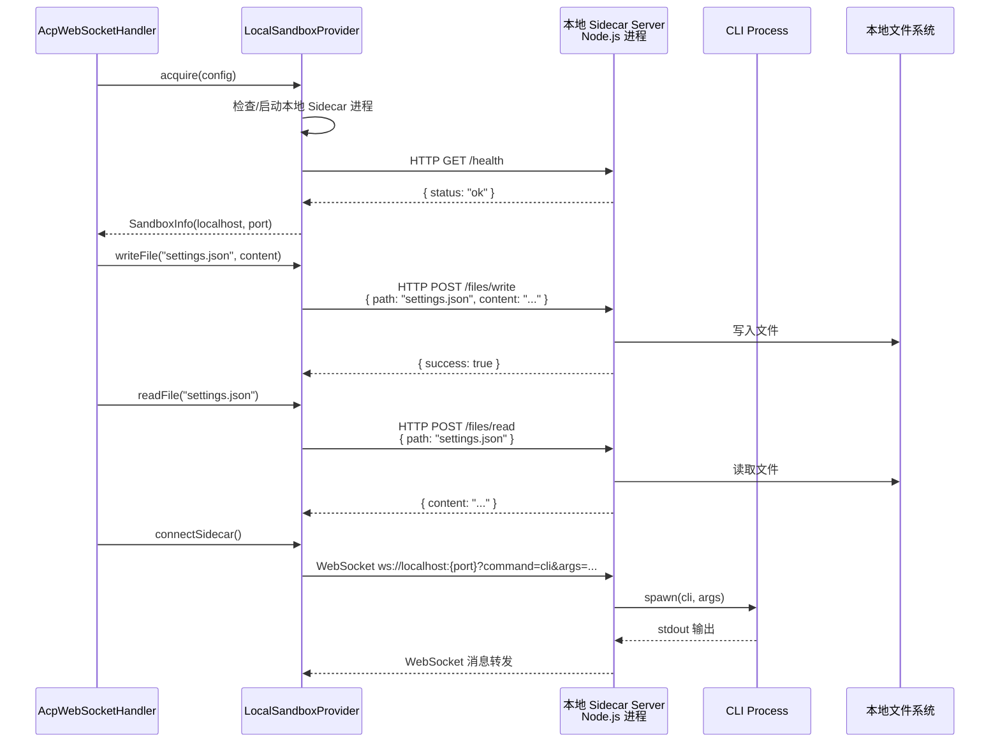

# 设计文档：统一沙箱运行时抽象

## 概述

本设计对沙箱运行时架构进行根本性重构，引入统一的 **SandboxProvider** 抽象层。核心理念是：本地 Mac 是一种沙箱，K8s Pod 是一种沙箱，未来的 E2B 也是一种沙箱——它们共享相同的初始化流水线、通信协议和生命周期管理。

当前架构中，`LocalRuntimeAdapter` 通过 `ProcessBuilder` 直接启动 CLI 子进程，而 `K8sRuntimeAdapter` 通过 Sidecar WebSocket 桥接 CLI。两条路径的初始化逻辑、配置注入方式、错误处理完全不同，导致本地模式和沙箱模式的行为不一致。`AcpWebSocketHandler.afterConnectionEstablished()` 中存在大量 `if (runtimeType == RuntimeType.K8S)` 分支，本地模式的配置注入在 Handler 中同步完成，K8s 模式则通过 `injectConfigIntoPod()` 异步写入 Pod。

重构方案的核心改动：
1. **本地也启动 Sidecar**：本地开发时启动 `sidecar-server/index.js`，使本地流程与 K8s 沙箱完全一致
2. **统一 SandboxProvider 接口**：`LocalSandboxProvider`、`K8sSandboxProvider`、未来的 `E2BSandboxProvider` 实现相同的接口
3. **文件操作统一走 Sidecar HTTP API**：所有沙箱类型的 writeFile/readFile 都通过 Sidecar 的 HTTP 端点（`POST /files/write`、`POST /files/read`）完成，Java 后端不再直接操作文件系统，K8s 也不再通过 kubectl exec 写文件
4. **SandboxInitPipeline 对所有沙箱类型通用**：每个 InitPhase 通过 SandboxProvider 执行具体操作，不直接依赖 K8s API
5. **消除 Handler 中的类型分支**：`AcpWebSocketHandler` 只与 `SandboxProvider` 和 `SandboxInitPipeline` 交互

### 当前架构 vs 目标架构

| 维度 | 当前架构 | 目标架构 |
|------|---------|---------|
| 运行时类型 | `LOCAL` / `K8S` 两种 RuntimeAdapter | `SandboxProvider` 统一抽象，多种实现 |
| 本地模式 | ProcessBuilder 直接启动 CLI，无 Sidecar | 本地启动 Sidecar，通过 WebSocket 桥接 CLI |
| 配置注入 | 本地：直接写文件；K8s：kubectl exec 写入 Pod | 统一通过 Sidecar HTTP API（`POST /files/write`） |
| 文件操作 | 本地：Java Files API；K8s：kubectl exec | 统一通过 Sidecar HTTP API，Java 不直接操作文件系统 |
| 初始化流程 | 本地同步、K8s 异步，逻辑分散在 Handler 中 | 统一 `SandboxInitPipeline`，所有类型走相同流水线 |
| Handler 分支 | 大量 `if K8S` 分支 | 无类型分支，面向 SandboxProvider 接口编程 |
| 可扩展性 | 新增类型需修改 Handler + Factory | 新增 SandboxProvider 实现即可，文件操作零成本 |

## 架构

### 目标架构总览



### 统一初始化流程（所有沙箱类型共享）




### 本地沙箱模式详细流程

本地沙箱模式的关键改动：本地也启动 Sidecar Server（`sidecar-server/index.js`），CLI 通过 Sidecar WebSocket 桥接，而非 `ProcessBuilder` 直接启动。



## 组件与接口

### 1. SandboxProvider — 统一沙箱提供者接口

所有沙箱类型的核心抽象。每个 InitPhase 通过此接口执行操作，不直接依赖具体实现。

```java
/**
 * 统一沙箱提供者接口。
 * 
 * 抽象不同沙箱环境（本地 Mac、K8s Pod、E2B）的差异，
 * 为 SandboxInitPipeline 提供统一的操作契约。
 */
public interface SandboxProvider {

    /** 沙箱类型标识 */
    SandboxType getType();

    /**
     * 获取或创建沙箱实例。
     * - Local: 确保本地 Sidecar 进程已启动
     * - K8s: 通过 PodReuseManager 获取 Pod
     * - E2B: 通过 E2B SDK 创建沙箱实例
     *
     * @return 沙箱信息（访问地址、端口等）
     */
    SandboxInfo acquire(SandboxConfig config);

    /**
     * 释放沙箱资源。
     * - Local: 停止本地 Sidecar 进程（可选，可复用）
     * - K8s: 释放 Pod（复用模式下仅断开连接）
     * - E2B: 销毁 E2B 沙箱实例
     */
    void release(SandboxInfo info);

    /**
     * 文件系统健康检查。
     * 通过 Sidecar HTTP API（POST /files/exists）验证沙箱内文件系统可读写。
     */
    boolean healthCheck(SandboxInfo info);

    /**
     * 写入文件到沙箱工作空间。
     * 所有沙箱类型统一通过 Sidecar HTTP API（POST /files/write）写入。
     * Java 后端不直接操作文件系统，也不通过 kubectl exec 写文件。
     */
    void writeFile(SandboxInfo info, String relativePath, String content) throws IOException;

    /**
     * 从沙箱工作空间读取文件。
     * 所有沙箱类型统一通过 Sidecar HTTP API（POST /files/read）读取。
     */
    String readFile(SandboxInfo info, String relativePath) throws IOException;

    /**
     * 建立到 Sidecar 的 WebSocket 连接。
     * 所有沙箱类型都通过 Sidecar WebSocket 桥接 CLI。
     *
     * @return RuntimeAdapter（封装 WebSocket 连接和 CLI 通信）
     */
    RuntimeAdapter connectSidecar(SandboxInfo info, RuntimeConfig config);

    /**
     * 获取 Sidecar WebSocket URI。
     */
    URI getSidecarUri(SandboxInfo info, String command, String args);
}
```

### 2. SandboxType — 沙箱类型枚举

```java
/**
 * 沙箱类型枚举。
 * 替代原有的 RuntimeType（LOCAL/K8S），支持更多沙箱类型。
 */
public enum SandboxType {

    /** 本地 Mac 沙箱：本地启动 Sidecar + CLI */
    LOCAL("local"),

    /** K8s Pod 沙箱：Pod 内运行 Sidecar + CLI */
    K8S("k8s"),

    /** E2B 云沙箱：通过 E2B SDK 管理（未来扩展） */
    E2B("e2b");

    private final String value;

    SandboxType(String value) { this.value = value; }

    public String getValue() { return value; }

    public static SandboxType fromValue(String value) {
        for (SandboxType type : values()) {
            if (type.value.equalsIgnoreCase(value) || type.name().equalsIgnoreCase(value)) {
                return type;
            }
        }
        throw new IllegalArgumentException("未知的沙箱类型: " + value);
    }
}
```

### 3. SandboxInfo — 沙箱实例信息

```java
/**
 * 沙箱实例信息，由 SandboxProvider.acquire() 返回。
 * 包含连接沙箱所需的所有信息。
 */
public record SandboxInfo(
    SandboxType type,
    String sandboxId,         // 唯一标识（Local: "local-{port}", K8s: podName, E2B: sandboxId）
    String host,              // 访问地址（Local: "localhost", K8s: podIp/serviceIp, E2B: e2b host）
    int sidecarPort,          // Sidecar 端口
    String workspacePath,     // 工作空间路径（Local: ~/workspace/{userId}, K8s: /workspace）
    boolean reused,           // 是否复用已有沙箱
    Map<String, String> metadata  // 扩展元数据（K8s: podName/namespace, E2B: sandboxUrl 等）
) {
    /** 构建 Sidecar WebSocket URI */
    public URI sidecarWsUri(String command, String args) {
        String query = "command=" + command;
        if (args != null && !args.isBlank()) {
            query += "&args=" + URLEncoder.encode(args, StandardCharsets.UTF_8);
        }
        return URI.create("ws://" + host + ":" + sidecarPort + "/?" + query);
    }
}
```

### 4. SandboxConfig — 沙箱配置

```java
/**
 * 沙箱创建/获取配置。
 * 统一各沙箱类型的配置参数。
 */
public record SandboxConfig(
    String userId,
    SandboxType type,
    String workspacePath,         // 期望的工作空间路径
    Map<String, String> env,      // 环境变量
    // K8s 特有配置
    String k8sConfigId,           // K8s 集群配置 ID
    Map<String, String> resources, // 资源限制（cpu, memory）
    // E2B 特有配置（未来）
    String e2bTemplate,           // E2B 沙箱模板
    // 本地特有配置
    int localSidecarPort          // 本地 Sidecar 端口（默认 0 = 自动分配）
) {}
```


### 5. LocalSandboxProvider — 本地沙箱提供者

本地模式的核心改动：启动本地 Sidecar Server 进程，所有文件操作通过 Sidecar HTTP API 完成，Java 后端不再直接操作本地文件系统。

```java
/**
 * 本地沙箱提供者。
 * 
 * 在本地 Mac 上启动 Sidecar Server（Node.js 进程），
 * 通过 WebSocket 桥接 CLI，通过 HTTP API 操作文件系统，
 * 使本地开发流程与 K8s 沙箱完全一致。
 * 
 * 关键设计决策：
 * - writeFile/readFile 统一通过 Sidecar HTTP API，不直接调用 Java Files API
 * - 这确保了本地/K8s/E2B 的文件操作路径完全一致
 * - Sidecar 是唯一接触文件系统的进程
 * 
 * Sidecar 进程生命周期：
 * - 首次 acquire() 时启动，后续复用
 * - 每个用户独立的 Sidecar 进程（不同端口）
 * - release() 时可选择保留进程供下次复用
 */
public class LocalSandboxProvider implements SandboxProvider {

    /** 用户 → 本地 Sidecar 进程映射，支持复用 */
    private final Map<String, LocalSidecarProcess> sidecarProcesses = new ConcurrentHashMap<>();
    private final HttpClient httpClient;

    @Override
    public SandboxType getType() { return SandboxType.LOCAL; }

    @Override
    public SandboxInfo acquire(SandboxConfig config) {
        // 1. 确保工作空间目录存在
        String cwd = config.workspacePath();
        Files.createDirectories(Path.of(cwd));

        // 2. 检查是否有可复用的 Sidecar 进程
        LocalSidecarProcess existing = sidecarProcesses.get(config.userId());
        if (existing != null && existing.isAlive()) {
            return new SandboxInfo(SandboxType.LOCAL, "local-" + existing.port(),
                "localhost", existing.port(), cwd, true, Map.of());
        }

        // 3. 启动新的 Sidecar Server 进程
        int port = config.localSidecarPort() > 0 ? config.localSidecarPort() : findAvailablePort();
        LocalSidecarProcess sidecar = startSidecarProcess(port, config);
        sidecarProcesses.put(config.userId(), sidecar);

        return new SandboxInfo(SandboxType.LOCAL, "local-" + port,
            "localhost", port, cwd, false, Map.of());
    }

    @Override
    public void writeFile(SandboxInfo info, String relativePath, String content) throws IOException {
        // 通过 Sidecar HTTP API 写文件，不直接操作本地文件系统
        String url = sidecarBaseUrl(info) + "/files/write";
        String body = objectMapper.writeValueAsString(Map.of(
            "path", relativePath,
            "content", content
        ));
        HttpResponse<String> response = httpClient.send(
            HttpRequest.newBuilder(URI.create(url))
                .POST(HttpRequest.BodyPublishers.ofString(body))
                .header("Content-Type", "application/json")
                .build(),
            HttpResponse.BodyHandlers.ofString()
        );
        if (response.statusCode() != 200) {
            throw new IOException("Sidecar writeFile 失败: " + response.body());
        }
    }

    @Override
    public String readFile(SandboxInfo info, String relativePath) throws IOException {
        // 通过 Sidecar HTTP API 读文件，不直接操作本地文件系统
        String url = sidecarBaseUrl(info) + "/files/read";
        String body = objectMapper.writeValueAsString(Map.of("path", relativePath));
        HttpResponse<String> response = httpClient.send(
            HttpRequest.newBuilder(URI.create(url))
                .POST(HttpRequest.BodyPublishers.ofString(body))
                .header("Content-Type", "application/json")
                .build(),
            HttpResponse.BodyHandlers.ofString()
        );
        if (response.statusCode() != 200) {
            throw new IOException("Sidecar readFile 失败: " + response.body());
        }
        return objectMapper.readTree(response.body()).get("content").asText();
    }

    @Override
    public boolean healthCheck(SandboxInfo info) {
        // HTTP GET http://localhost:{port}/health
        // 验证 Sidecar 进程存活且响应正常
    }

    @Override
    public RuntimeAdapter connectSidecar(SandboxInfo info, RuntimeConfig config) {
        // 复用现有 K8sRuntimeAdapter 的 WebSocket 连接逻辑
        // 连接到 ws://localhost:{port}?command=...&args=...
        // 返回封装了 WebSocket 通信的 RuntimeAdapter
    }

    private String sidecarBaseUrl(SandboxInfo info) {
        return "http://" + info.host() + ":" + info.sidecarPort();
    }

    /**
     * 启动本地 Sidecar Server 进程。
     * 使用 ProcessBuilder 启动 node sidecar-server/index.js
     */
    private LocalSidecarProcess startSidecarProcess(int port, SandboxConfig config) {
        ProcessBuilder pb = new ProcessBuilder("node", sidecarServerPath)
            .directory(new File(config.workspacePath()));
        pb.environment().put("SIDECAR_PORT", String.valueOf(port));
        pb.environment().put("ALLOWED_COMMANDS", allowedCommands);
        // 继承父进程环境变量 + 用户自定义环境变量
        pb.environment().putAll(config.env());
        Process process = pb.start();
        // 等待 Sidecar 就绪（轮询 /health 端点）
        waitForSidecarReady(port, Duration.ofSeconds(10));
        return new LocalSidecarProcess(process, port);
    }
}
```

### 6. K8sSandboxProvider — K8s 沙箱提供者

封装现有的 `PodReuseManager` 逻辑，文件操作统一通过 Pod 内 Sidecar HTTP API 完成，不再使用 kubectl exec 写文件。

```java
/**
 * K8s Pod 沙箱提供者。
 * 
 * 复用现有的 PodReuseManager 管理 Pod 生命周期。
 * 文件操作统一通过 Pod 内 Sidecar 的 HTTP API 完成，
 * 不再使用 kubectl exec 写文件，消除了 exec 通道的不稳定性。
 * 
 * 关键设计决策：
 * - writeFile/readFile 通过 Sidecar HTTP API（POST /files/write, /files/read）
 * - 废弃 PodFileSystemAdapter 的 kubectl exec 写文件逻辑
 * - Sidecar 是 Pod 内唯一接触文件系统的入口（除 CLI 进程本身）
 */
public class K8sSandboxProvider implements SandboxProvider {

    private final PodReuseManager podReuseManager;
    private final K8sConfigService k8sConfigService;
    private final HttpClient httpClient;

    @Override
    public SandboxType getType() { return SandboxType.K8S; }

    @Override
    public SandboxInfo acquire(SandboxConfig config) {
        // 复用现有 PodReuseManager.acquirePod() 逻辑
        RuntimeConfig runtimeConfig = toRuntimeConfig(config);
        PodInfo podInfo = podReuseManager.acquirePod(config.userId(), runtimeConfig);

        return new SandboxInfo(
            SandboxType.K8S,
            podInfo.podName(),
            podInfo.serviceIp() != null ? podInfo.serviceIp() : podInfo.podIp(),
            8080,  // Sidecar 固定端口
            "/workspace",
            podInfo.reused(),
            Map.of("podName", podInfo.podName(),
                   "namespace", "himarket",
                   "podIp", podInfo.podIp())
        );
    }

    @Override
    public void writeFile(SandboxInfo info, String relativePath, String content) throws IOException {
        // 通过 Pod 内 Sidecar HTTP API 写文件，不再使用 kubectl exec
        String url = sidecarBaseUrl(info) + "/files/write";
        String body = objectMapper.writeValueAsString(Map.of(
            "path", relativePath,
            "content", content
        ));
        HttpResponse<String> response = httpClient.send(
            HttpRequest.newBuilder(URI.create(url))
                .POST(HttpRequest.BodyPublishers.ofString(body))
                .header("Content-Type", "application/json")
                .timeout(Duration.ofSeconds(10))
                .build(),
            HttpResponse.BodyHandlers.ofString()
        );
        if (response.statusCode() != 200) {
            throw new IOException("Sidecar writeFile 失败 (Pod: " + info.sandboxId() + "): " + response.body());
        }
    }

    @Override
    public String readFile(SandboxInfo info, String relativePath) throws IOException {
        // 通过 Pod 内 Sidecar HTTP API 读文件，不再使用 kubectl exec
        String url = sidecarBaseUrl(info) + "/files/read";
        String body = objectMapper.writeValueAsString(Map.of("path", relativePath));
        HttpResponse<String> response = httpClient.send(
            HttpRequest.newBuilder(URI.create(url))
                .POST(HttpRequest.BodyPublishers.ofString(body))
                .header("Content-Type", "application/json")
                .timeout(Duration.ofSeconds(10))
                .build(),
            HttpResponse.BodyHandlers.ofString()
        );
        if (response.statusCode() != 200) {
            throw new IOException("Sidecar readFile 失败 (Pod: " + info.sandboxId() + "): " + response.body());
        }
        return objectMapper.readTree(response.body()).get("content").asText();
    }

    @Override
    public boolean healthCheck(SandboxInfo info) {
        // 通过 Sidecar HTTP GET /health 验证 Pod 内 Sidecar 可用
        // 不再依赖 kubectl exec echo 验证
        try {
            String url = sidecarBaseUrl(info) + "/health";
            HttpResponse<String> response = httpClient.send(
                HttpRequest.newBuilder(URI.create(url))
                    .GET()
                    .timeout(Duration.ofSeconds(5))
                    .build(),
                HttpResponse.BodyHandlers.ofString()
            );
            return response.statusCode() == 200;
        } catch (Exception e) {
            return false;
        }
    }

    @Override
    public RuntimeAdapter connectSidecar(SandboxInfo info, RuntimeConfig config) {
        // 复用现有 K8sRuntimeAdapter 的 WebSocket 连接逻辑
        // 连接到 ws://{podIp}:8080?command=...&args=...
    }

    private String sidecarBaseUrl(SandboxInfo info) {
        return "http://" + info.host() + ":" + info.sidecarPort();
    }
}
```

### 7. SandboxProviderRegistry — 提供者注册中心

```java
/**
 * SandboxProvider 注册中心。
 * 根据 SandboxType 查找对应的 Provider 实现。
 */
@Component
public class SandboxProviderRegistry {

    private final Map<SandboxType, SandboxProvider> providers;

    public SandboxProviderRegistry(List<SandboxProvider> providerList) {
        this.providers = providerList.stream()
            .collect(Collectors.toMap(SandboxProvider::getType, Function.identity()));
    }

    public SandboxProvider getProvider(SandboxType type) {
        SandboxProvider provider = providers.get(type);
        if (provider == null) {
            throw new IllegalArgumentException("不支持的沙箱类型: " + type);
        }
        return provider;
    }

    public Set<SandboxType> supportedTypes() {
        return providers.keySet();
    }
}
```

### 8. SandboxInitPipeline — 统一初始化流水线

对所有沙箱类型通用的初始化编排器。各阶段通过 `SandboxProvider` 接口执行操作，不直接依赖具体实现。

```java
/**
 * 沙箱初始化流水线。
 * 按顺序执行注册的 InitPhase，每个阶段有前置检查、执行逻辑和就绪验证。
 * 对所有沙箱类型（Local/K8s/E2B）通用。
 */
public class SandboxInitPipeline {

    private final List<InitPhase> phases;
    private final InitConfig initConfig;

    /**
     * 执行完整的初始化流水线。
     * 各阶段通过 InitContext 中的 SandboxProvider 执行操作。
     */
    public InitResult execute(InitContext context) {
        Instant start = Instant.now();
        Map<String, Duration> phaseDurations = new LinkedHashMap<>();

        for (InitPhase phase : phases) {
            if (!phase.shouldExecute(context)) {
                context.recordEvent(phase.name(), EventType.PHASE_SKIP, "条件不满足，跳过");
                continue;
            }

            context.recordEvent(phase.name(), EventType.PHASE_START, "开始执行");
            Instant phaseStart = Instant.now();

            boolean success = executeWithRetry(phase, context);
            phaseDurations.put(phase.name(), Duration.between(phaseStart, Instant.now()));

            if (!success) {
                return InitResult.failure(phase.name(), context.getLastError(),
                    Duration.between(start, Instant.now()), phaseDurations, context.getEvents());
            }
        }

        return InitResult.success(Duration.between(start, Instant.now()),
            phaseDurations, context.getEvents());
    }

    /** 从指定阶段恢复执行（用于部分失败后重试） */
    public InitResult resumeFrom(InitContext context, String fromPhase);
}
```

### 9. InitPhase — 初始化阶段接口（不变）

```java
/**
 * 初始化阶段接口。
 * 每个阶段通过 InitContext.getProvider() 获取 SandboxProvider，
 * 执行沙箱类型无关的初始化逻辑。
 */
public interface InitPhase {

    String name();
    int order();
    boolean shouldExecute(InitContext context);
    void execute(InitContext context) throws InitPhaseException;
    boolean verify(InitContext context);
    RetryPolicy retryPolicy();
}
```

### 10. InitContext — 初始化上下文（增加 SandboxProvider）

```java
/**
 * 初始化上下文，各阶段通过此对象共享数据。
 * 核心改动：持有 SandboxProvider 引用，各阶段通过 provider 执行操作。
 */
public class InitContext {

    // 核心：沙箱提供者（各阶段通过此接口操作沙箱）
    private final SandboxProvider provider;

    // 输入参数
    private final String userId;
    private final SandboxConfig sandboxConfig;
    private final RuntimeConfig runtimeConfig;
    private final CliProviderConfig providerConfig;
    private final CliSessionConfig sessionConfig;
    private final WebSocketSession frontendSession;

    // 阶段产出（由各阶段填充）
    private SandboxInfo sandboxInfo;
    private RuntimeAdapter runtimeAdapter;
    private List<ConfigFile> injectedConfigs;

    // 状态追踪
    private final Map<String, PhaseStatus> phaseStatuses;
    private final List<InitEvent> events;

    public SandboxProvider getProvider() { return provider; }
    public void recordEvent(String phase, EventType type, String message);
    public List<String> completedPhases();
}
```


### 11. 五个具体初始化阶段（通过 SandboxProvider 执行）

#### Phase 1: SandboxAcquirePhase — 沙箱获取

```java
/**
 * 获取沙箱实例。
 * - Local: 确保本地 Sidecar 进程已启动
 * - K8s: 通过 PodReuseManager 获取 Pod
 * - E2B: 通过 E2B SDK 创建沙箱
 * 
 * 不直接依赖任何具体实现，通过 SandboxProvider.acquire() 统一处理。
 */
public class SandboxAcquirePhase implements InitPhase {

    @Override public String name() { return "sandbox-acquire"; }
    @Override public int order() { return 100; }

    @Override
    public void execute(InitContext context) throws InitPhaseException {
        SandboxProvider provider = context.getProvider();
        SandboxInfo info = provider.acquire(context.getSandboxConfig());
        context.setSandboxInfo(info);
    }

    @Override
    public boolean verify(InitContext context) {
        return context.getSandboxInfo() != null
            && context.getSandboxInfo().host() != null;
    }

    @Override
    public RetryPolicy retryPolicy() {
        return RetryPolicy.none(); // 沙箱获取失败不重试
    }
}
```

#### Phase 2: FileSystemReadyPhase — 文件系统就绪

```java
/**
 * 验证沙箱文件系统可访问。
 * 通过 SandboxProvider.healthCheck()（底层调用 Sidecar HTTP GET /health）统一验证。
 * 不关心底层是本地磁盘还是 K8s Pod 文件系统——都通过 Sidecar 操作。
 */
public class FileSystemReadyPhase implements InitPhase {

    @Override public String name() { return "filesystem-ready"; }
    @Override public int order() { return 200; }

    @Override
    public void execute(InitContext context) throws InitPhaseException {
        SandboxProvider provider = context.getProvider();
        boolean healthy = provider.healthCheck(context.getSandboxInfo());
        if (!healthy) {
            throw new InitPhaseException("filesystem-ready", "文件系统健康检查失败", true);
        }
    }

    @Override
    public boolean verify(InitContext context) {
        // 尝试写入并读回临时文件验证读写能力
        try {
            SandboxProvider provider = context.getProvider();
            SandboxInfo info = context.getSandboxInfo();
            String testContent = "health-check-" + System.currentTimeMillis();
            provider.writeFile(info, ".sandbox-health-check", testContent);
            String readBack = provider.readFile(info, ".sandbox-health-check");
            return testContent.equals(readBack);
        } catch (IOException e) {
            return false;
        }
    }

    @Override
    public RetryPolicy retryPolicy() {
        return RetryPolicy.defaultPolicy(); // 文件系统可能暂时不可用（如 Pod 刚启动）
    }
}
```

#### Phase 3: ConfigInjectionPhase — 配置注入

```java
/**
 * 将 settings.json、MCP 配置、Skill 配置注入到沙箱内部。
 * 通过 SandboxProvider.writeFile()（底层调用 Sidecar POST /files/write）统一写入。
 * 每个文件写入后通过 readFile()（底层调用 Sidecar POST /files/read）读回验证。
 * 所有沙箱类型走完全相同的代码路径。
 */
public class ConfigInjectionPhase implements InitPhase {

    @Override public String name() { return "config-injection"; }
    @Override public int order() { return 300; }

    @Override
    public boolean shouldExecute(InitContext context) {
        return context.getSessionConfig() != null
            && context.getProviderConfig().isSupportsCustomModel();
    }

    @Override
    public void execute(InitContext context) throws InitPhaseException {
        SandboxProvider provider = context.getProvider();
        SandboxInfo info = context.getSandboxInfo();
        CliConfigGenerator generator = context.getConfigGenerator();

        // 1. 模型配置：生成内容 → provider.writeFile() → provider.readFile() 验证
        // 2. MCP 配置：同上
        // 3. Skill 配置：同上
        // 统一逻辑，不再区分本地/K8s 的写入方式
    }

    @Override
    public boolean verify(InitContext context) {
        // 验证所有预期的配置文件都存在于沙箱中
        return true;
    }

    @Override
    public RetryPolicy retryPolicy() {
        return RetryPolicy.fileOperation();
    }
}
```

#### Phase 4: SidecarConnectPhase — Sidecar 连接

```java
/**
 * 建立到 Sidecar Server 的 WebSocket 连接。
 * 所有沙箱类型都通过 Sidecar WebSocket 桥接 CLI，逻辑完全一致。
 */
public class SidecarConnectPhase implements InitPhase {

    @Override public String name() { return "sidecar-connect"; }
    @Override public int order() { return 400; }

    @Override
    public void execute(InitContext context) throws InitPhaseException {
        SandboxProvider provider = context.getProvider();
        RuntimeAdapter adapter = provider.connectSidecar(
            context.getSandboxInfo(), context.getRuntimeConfig());
        context.setRuntimeAdapter(adapter);
    }

    @Override
    public boolean verify(InitContext context) {
        RuntimeAdapter adapter = context.getRuntimeAdapter();
        return adapter != null && adapter.getStatus() == RuntimeStatus.RUNNING;
    }

    @Override
    public RetryPolicy retryPolicy() {
        return new RetryPolicy(2, Duration.ofSeconds(2), 2.0, Duration.ofSeconds(8));
    }
}
```

#### Phase 5: CliReadyPhase — CLI 就绪确认

```java
/**
 * 等待 CLI 进程启动并就绪。
 * 通过监听 RuntimeAdapter.stdout() 首条消息确认 CLI 已启动。
 * 所有沙箱类型逻辑一致（都通过 Sidecar WebSocket 通信）。
 */
public class CliReadyPhase implements InitPhase {

    private static final Duration CLI_READY_TIMEOUT = Duration.ofSeconds(15);

    @Override public String name() { return "cli-ready"; }
    @Override public int order() { return 500; }

    @Override
    public void execute(InitContext context) throws InitPhaseException {
        RuntimeAdapter adapter = context.getRuntimeAdapter();
        // 1. 订阅 adapter.stdout()
        // 2. 等待首条消息或超时
        // 3. 超时时检查 adapter.isAlive()
    }

    @Override
    public boolean verify(InitContext context) {
        return context.getRuntimeAdapter().isAlive();
    }

    @Override
    public RetryPolicy retryPolicy() {
        return RetryPolicy.none();
    }
}
```

### 12. RetryPolicy — 重试策略（不变）

```java
public record RetryPolicy(
    int maxRetries,
    Duration initialDelay,
    double backoffMultiplier,
    Duration maxDelay
) {
    public static RetryPolicy none() {
        return new RetryPolicy(0, Duration.ZERO, 1.0, Duration.ZERO);
    }
    public static RetryPolicy defaultPolicy() {
        return new RetryPolicy(3, Duration.ofSeconds(1), 2.0, Duration.ofSeconds(10));
    }
    public static RetryPolicy fileOperation() {
        return new RetryPolicy(2, Duration.ofMillis(500), 2.0, Duration.ofSeconds(3));
    }
}
```

### 13. InitResult / InitEvent / PhaseStatus — 结果与事件（不变）

```java
public record InitResult(
    boolean success,
    String failedPhase,
    String errorMessage,
    Duration totalDuration,
    Map<String, Duration> phaseDurations,
    List<InitEvent> events
) {
    public static InitResult success(Duration duration, Map<String, Duration> phases, List<InitEvent> events) {
        return new InitResult(true, null, null, duration, phases, events);
    }
    public static InitResult failure(String phase, String error, Duration duration,
                                     Map<String, Duration> phases, List<InitEvent> events) {
        return new InitResult(false, phase, error, duration, phases, events);
    }
}

public record InitEvent(Instant timestamp, String phase, EventType type, String message) {
    public enum EventType {
        PHASE_START, PHASE_COMPLETE, PHASE_SKIP, PHASE_RETRY,
        PHASE_FAIL, VERIFY_PASS, VERIFY_FAIL, WARNING
    }
}

public enum PhaseStatus {
    PENDING, EXECUTING, VERIFYING, COMPLETED, SKIPPED, FAILED, RETRYING
}
```

### 14. Sidecar Server 协议扩展

Sidecar Server 保持现有 WebSocket CLI 桥接能力不变，新增文件操作和命令执行 HTTP 端点。文件操作端点是本次重构的核心——所有沙箱类型的文件读写统一通过这些端点完成，Java 后端不再直接操作文件系统。

```javascript
// ============================================================
// 现有端点（保持不变）
// ============================================================
// GET  /health — 健康检查
// WebSocket / — CLI 进程桥接

// ============================================================
// 新增：文件操作 HTTP 端点
// ============================================================

// POST /files/write — 写入文件
// 将内容写入沙箱工作空间内的指定路径，自动创建父目录。
// Request:  { "path": "settings.json", "content": "{...}" }
// Response: { "success": true }
// Error:    { "success": false, "error": "EACCES: permission denied" }
// 状态码:   200 成功 | 400 参数缺失 | 500 写入失败

// POST /files/read — 读取文件
// 从沙箱工作空间内读取指定路径的文件内容。
// Request:  { "path": "settings.json" }
// Response: { "content": "{...}" }
// Error:    { "success": false, "error": "ENOENT: no such file" }
// 状态码:   200 成功 | 400 参数缺失 | 404 文件不存在 | 500 读取失败

// POST /files/mkdir — 创建目录
// 递归创建目录（等同于 mkdir -p）。
// Request:  { "path": ".kiro/skills" }
// Response: { "success": true }
// Error:    { "success": false, "error": "EACCES: permission denied" }
// 状态码:   200 成功 | 400 参数缺失 | 500 创建失败

// POST /files/exists — 检查文件/目录是否存在
// Request:  { "path": "settings.json" }
// Response: { "exists": true, "isFile": true, "isDirectory": false }
// 状态码:   200 始终返回 200

// ============================================================
// 新增：命令执行 HTTP 端点（保持不变）
// ============================================================

// POST /exec — 在沙箱内执行命令
// Request:  { "command": "git", "args": ["clone", "..."], "cwd": "/workspace", "timeout": 30000 }
// Response: { "exitCode": 0, "stdout": "...", "stderr": "..." }

// POST /init — 初始化就绪检查
// Request:  { "checks": ["filesystem", "network"] }
// Response: { "ready": true, "checks": { "filesystem": true, "network": true } }
```

#### 文件操作端点实现要点

```javascript
// sidecar-server/index.js 中新增文件操作路由

const fs = require('fs/promises');
const path = require('path');

// 工作空间根目录（由环境变量或启动参数指定）
const WORKSPACE_ROOT = process.env.WORKSPACE_ROOT || process.cwd();

/**
 * 安全路径解析：确保所有文件操作限制在工作空间内。
 * 防止路径遍历攻击（如 ../../etc/passwd）。
 */
function resolveSafePath(relativePath) {
    const resolved = path.resolve(WORKSPACE_ROOT, relativePath);
    if (!resolved.startsWith(path.resolve(WORKSPACE_ROOT))) {
        throw new Error('路径越界: ' + relativePath);
    }
    return resolved;
}

// POST /files/write
app.post('/files/write', async (req, res) => {
    const { path: filePath, content } = req.body;
    if (!filePath || content === undefined) {
        return res.status(400).json({ success: false, error: '缺少 path 或 content 参数' });
    }
    try {
        const fullPath = resolveSafePath(filePath);
        await fs.mkdir(path.dirname(fullPath), { recursive: true });
        await fs.writeFile(fullPath, content, 'utf-8');
        res.json({ success: true });
    } catch (err) {
        res.status(500).json({ success: false, error: err.message });
    }
});

// POST /files/read
app.post('/files/read', async (req, res) => {
    const { path: filePath } = req.body;
    if (!filePath) {
        return res.status(400).json({ success: false, error: '缺少 path 参数' });
    }
    try {
        const fullPath = resolveSafePath(filePath);
        const content = await fs.readFile(fullPath, 'utf-8');
        res.json({ content });
    } catch (err) {
        const status = err.code === 'ENOENT' ? 404 : 500;
        res.status(status).json({ success: false, error: err.message });
    }
});

// POST /files/mkdir
app.post('/files/mkdir', async (req, res) => {
    const { path: dirPath } = req.body;
    if (!dirPath) {
        return res.status(400).json({ success: false, error: '缺少 path 参数' });
    }
    try {
        const fullPath = resolveSafePath(dirPath);
        await fs.mkdir(fullPath, { recursive: true });
        res.json({ success: true });
    } catch (err) {
        res.status(500).json({ success: false, error: err.message });
    }
});

// POST /files/exists
app.post('/files/exists', async (req, res) => {
    const { path: filePath } = req.body;
    if (!filePath) {
        return res.status(400).json({ success: false, error: '缺少 path 参数' });
    }
    try {
        const fullPath = resolveSafePath(filePath);
        const stat = await fs.stat(fullPath);
        res.json({ exists: true, isFile: stat.isFile(), isDirectory: stat.isDirectory() });
    } catch (err) {
        if (err.code === 'ENOENT') {
            res.json({ exists: false, isFile: false, isDirectory: false });
        } else {
            res.status(500).json({ success: false, error: err.message });
        }
    }
});
```

#### 安全约束

- 所有文件路径通过 `resolveSafePath()` 验证，防止路径遍历攻击
- 文件操作限制在 `WORKSPACE_ROOT` 目录内
- 本地模式 Sidecar 仅监听 `127.0.0.1`
- K8s Pod 内 Sidecar 仅监听 Pod 内部网络

### 15. AcpWebSocketHandler 改造

改造后的 Handler 不再包含任何沙箱类型分支，统一通过 Pipeline + Provider 处理。

```java
// 改造前（当前代码，大量 if 分支）：
if (runtimeType == RuntimeType.K8S && isUserScoped) {
    // K8s 异步路径：acquirePod → injectConfigIntoPod → connectAndStart
    podInitExecutor.submit(() -> initK8sPodAsync(...));
} else {
    // 本地同步路径：runtimeFactory.create() → runtime.start()
    runtime = runtimeFactory.create(runtimeType, config);
    runtime.start(config);
}

// 改造后（统一路径）：
SandboxType sandboxType = resolveSandboxType(runtimeParam);
SandboxProvider provider = providerRegistry.getProvider(sandboxType);
InitContext context = new InitContext(provider, userId, sandboxConfig, runtimeConfig, ...);

// 所有沙箱类型走同一个异步初始化路径
sandboxInitExecutor.submit(() -> {
    InitResult result = pipeline.execute(context);
    if (result.success()) {
        runtimeMap.put(session.getId(), context.getRuntimeAdapter());
        subscribeStdout(session, context.getRuntimeAdapter());
        sendSandboxStatus(session, "ready", "沙箱环境已就绪");
        replayPendingMessages(session, context.getRuntimeAdapter());
    } else {
        sendSandboxStatus(session, "error", "沙箱初始化失败: " + result.errorMessage());
    }
});
```


## 数据模型

### InitPhaseException — 阶段异常

```java
public class InitPhaseException extends RuntimeException {
    private final String phaseName;
    private final boolean retryable;

    public InitPhaseException(String phaseName, String message, boolean retryable) {
        super(message);
        this.phaseName = phaseName;
        this.retryable = retryable;
    }

    public InitPhaseException(String phaseName, String message, Throwable cause, boolean retryable) {
        super(message, cause);
        this.phaseName = phaseName;
        this.retryable = retryable;
    }
}
```

### InitConfig — 流水线配置

```java
public record InitConfig(
    Duration totalTimeout,          // 总超时（默认 120s）
    boolean failFast,               // 任一阶段失败立即终止（默认 true）
    boolean enableVerification,     // 是否启用写入后验证（默认 true）
    boolean enableProgressNotify    // 是否向前端推送阶段进度（默认 true）
) {
    public static InitConfig defaults() {
        return new InitConfig(Duration.ofSeconds(120), true, true, true);
    }
}
```

### ConfigFile — 配置文件写入记录

```java
public record ConfigFile(
    String relativePath,
    String content,
    String contentHash,     // SHA-256 哈希，用于写入后验证
    ConfigType type
) {
    public enum ConfigType {
        MODEL_SETTINGS, MCP_CONFIG, SKILL_CONFIG, CUSTOM
    }
}
```

### LocalSidecarProcess — 本地 Sidecar 进程信息

```java
/**
 * 本地 Sidecar Server 进程封装。
 */
public record LocalSidecarProcess(
    Process process,
    int port,
    Instant startedAt
) {
    public boolean isAlive() {
        return process != null && process.isAlive();
    }

    public void stop() {
        if (process != null && process.isAlive()) {
            process.destroy();
            try {
                if (!process.waitFor(5, TimeUnit.SECONDS)) {
                    process.destroyForcibly();
                }
            } catch (InterruptedException e) {
                process.destroyForcibly();
                Thread.currentThread().interrupt();
            }
        }
    }
}
```

### 前端进度通知协议（不变）

```json
{
    "type": "sandbox/init-progress",
    "data": {
        "phase": "config-injection",
        "status": "executing",
        "message": "正在注入 MCP 配置...",
        "progress": 60,
        "totalPhases": 5,
        "completedPhases": 2
    }
}
```

## 正确性属性

*正确性属性是对系统行为的形式化描述，应在所有合法输入上成立。每个属性关联到具体的需求验收标准，作为人类可读规格与机器可验证正确性保证之间的桥梁。*

### Property 1: 沙箱类型无关性

*对于任意*合法的初始化配置，`SandboxInitPipeline.execute()` 的阶段执行顺序和阶段间交互逻辑与 `SandboxType` 无关。给定相同的 `InitPhase` 列表，无论 `SandboxProvider` 的具体实现是 Local、K8s 还是 E2B，Pipeline 的编排行为完全一致。

**Validates: Requirements 4.1, 4.2, 4.3**

### Property 2: 配置写入往返一致性

*对于任意*合法的配置文件内容（settings.json、MCP 配置、Skill 配置，包含特殊字符、Unicode、大文件），通过 `SandboxProvider.writeFile()` 写入沙箱后，立即通过 `SandboxProvider.readFile()` 读回的内容应与写入内容完全一致（SHA-256 哈希相等）。此属性对所有沙箱类型成立，因为所有类型都走相同的 Sidecar HTTP API 路径。

**Validates: Requirements 5.4, 5.6, 8.2**

### Property 3: 阶段执行顺序保证

*对于任意*初始化流水线执行，各阶段的实际执行顺序必须严格按照 `order()` 值升序排列。后续阶段的 `execute()` 不会在前置阶段的 `verify()` 返回 true 之前被调用。`shouldExecute()` 返回 false 的阶段应被跳过并记录 PHASE_SKIP 事件，且每个执行过的阶段都有对应的事件记录和时间戳。

**Validates: Requirements 4.1, 4.2, 4.3, 4.6**

### Property 4: 失败结果完整性

*对于任意*初始化流水线执行中的阶段失败，InitResult 应包含失败阶段名称、错误信息、总耗时、各阶段耗时和完整事件日志。前 N-1 个已完成阶段的产出（如 SandboxInfo、配置文件）应保持有效，不会被回滚或破坏。错误通知应包含 sandboxType、failedPhase、retryable 标志和 diagnostics。

**Validates: Requirements 4.5, 9.4, 9.5**

### Property 5: 重试幂等性

*对于任意*支持重试的阶段（如 ConfigInjectionPhase、FileSystemReadyPhase），重试执行的最终效果应与首次成功执行的效果完全一致。多次调用 `SandboxProvider.writeFile()` 写入同一文件不会产生重复内容或损坏文件。重试次数不超过 RetryPolicy.maxRetries。

**Validates: Requirements 4.4, 8.3**

### Property 6: 超时保证

*对于任意*初始化流水线执行，总耗时不会超过 `InitConfig.totalTimeout` 加上合理的清理时间（≤5s）。

**Validates: Requirements 4.7**

### Property 7: 本地 Sidecar 进程生命周期

*对于任意* `LocalSandboxProvider.acquire()` 调用，如果返回成功，则本地 Sidecar 进程必须处于存活状态且 `/health` 端点可响应。对于同一用户的连续两次 acquire 调用，如果第一次成功且进程存活，第二次应返回 reused=true 且端口不变。不同用户的 acquire 调用应返回不同端口的 SandboxInfo。`release()` 后，如果没有其他会话使用该 Sidecar，进程应被正确终止。

**Validates: Requirements 2.1, 2.2, 2.7, 2.8**

### Property 8: Provider 接口契约一致性

*对于任意* `SandboxProvider` 实现（Local、K8s、E2B），以下契约必须成立：
- `acquire()` 成功后 `healthCheck()` 返回 true
- `writeFile()` 后 `readFile()` 返回相同内容（均通过 Sidecar HTTP API）
- `connectSidecar()` 成功后返回的 `RuntimeAdapter.isAlive()` 为 true
- `release()` 后再次 `healthCheck()` 返回 false（非复用模式）

**Validates: Requirements 1.8, 1.9, 2.3, 2.4, 2.5, 2.6, 3.2, 3.3, 3.4, 3.5**

### Property 9: 文件操作路径安全性

*对于任意*通过 Sidecar 文件操作端点传入的相对路径，`resolveSafePath()` 必须确保解析后的绝对路径始终在 `WORKSPACE_ROOT` 目录内。任何包含 `../`、符号链接、绝对路径等路径遍历尝试都应被拒绝并返回错误。

**Validates: Requirements 6.7, 6.8**

### Property 10: Sidecar 文件操作幂等性

*对于任意*合法的文件路径和内容，连续多次调用 Sidecar `POST /files/write` 写入相同内容，最终文件状态应与单次写入一致。`POST /files/mkdir` 对已存在的目录应返回成功而非报错。

**Validates: Requirements 6.1, 6.3**

### Property 11: SandboxInfo 构建正确性

*对于任意* command 和 args 组合，`SandboxInfo.sidecarWsUri()` 构建的 URI 应包含正确的 host、port、command 参数和 URL 编码的 args 参数。当 SandboxType 为 LOCAL 时，host 为 "localhost"，sandboxId 格式为 "local-{port}"。当 SandboxType 为 K8S 时，metadata 包含 podName 和 namespace。

**Validates: Requirements 10.2, 10.4, 10.5**

## 错误处理

### 阶段级错误处理

| 阶段 | 错误场景 | 处理方式 | 可重试 |
|------|---------|---------|--------|
| SandboxAcquire | 本地 Sidecar 启动失败 | 快速失败，通知前端 | 否 |
| SandboxAcquire | K8s Pod 创建超时 | 快速失败，通知前端 | 否 |
| SandboxAcquire | E2B API 不可达 | 快速失败，通知前端 | 否 |
| FileSystemReady | 本地目录不可写 | 快速失败（权限问题） | 否 |
| FileSystemReady | Sidecar HTTP /health 超时 | 重试 3 次，退避等待 | 是 |
| FileSystemReady | E2B 文件系统未就绪 | 重试 3 次 | 是 |
| ConfigInjection | Sidecar /files/write 失败 | 重试 2 次 | 是 |
| ConfigInjection | 写入后 /files/read 验证不一致 | 重试 2 次 | 是 |
| ConfigInjection | 配置生成异常 | 快速失败（代码 bug） | 否 |
| SidecarConnect | WebSocket 连接超时 | 重试 2 次 | 是 |
| SidecarConnect | Sidecar 未启动 | 重试 2 次 | 是 |
| CliReady | CLI 进程启动失败 | 快速失败，记录 stderr | 否 |
| CliReady | CLI 启动超时（15s） | 标记 warning，继续 | 否 |

### 流水线级错误处理

| 场景 | 处理方式 |
|------|---------|
| 总超时（120s） | 终止当前阶段，清理资源，通知前端 |
| 前端 WebSocket 断开 | 终止流水线，清理资源 |
| 不可恢复错误 | 记录完整事件日志，通知前端错误详情和建议操作 |

### 错误通知格式

```json
{
    "type": "sandbox/status",
    "data": {
        "status": "error",
        "message": "沙箱初始化失败: 配置注入阶段写入 settings.json 失败",
        "failedPhase": "config-injection",
        "sandboxType": "k8s",
        "retryable": true,
        "diagnostics": {
            "completedPhases": ["sandbox-acquire", "filesystem-ready"],
            "totalDuration": "45.2s",
            "suggestion": "请检查沙箱内磁盘空间或重试"
        }
    }
}
```

## 测试策略

### 单元测试

- **SandboxInitPipeline**: 使用 mock SandboxProvider 验证阶段顺序执行、跳过逻辑、超时终止、失败快速退出
- **各 InitPhase 实现**: 使用 mock SandboxProvider 验证各阶段逻辑，确保不依赖具体沙箱类型
- **LocalSandboxProvider**: 验证本地 Sidecar 进程启动/停止/复用逻辑；验证 writeFile/readFile 通过 HTTP API 而非直接文件系统
- **K8sSandboxProvider**: 验证 Pod 获取逻辑；验证 writeFile/readFile 通过 Sidecar HTTP API 而非 kubectl exec
- **SandboxProviderRegistry**: 验证 Provider 注册和查找
- **Sidecar 文件操作端点**: 验证 /files/write、/files/read、/files/mkdir、/files/exists 的正确性和路径安全性

### 属性基测试（Property-Based Testing）

使用 **jqwik** 作为属性基测试库。

| 属性 | 测试目标 | 生成器 |
|------|---------|--------|
| P1: 沙箱类型无关性 | Pipeline 对不同 Provider 的编排一致性 | 生成随机 SandboxType + mock Provider |
| P2: 配置写入一致性 | writeFile/readFile 通过 Sidecar HTTP API 往返一致 | 生成随机配置内容（含特殊字符、Unicode、大文件） |
| P3: 阶段执行顺序 | Pipeline 执行顺序 | 生成随机阶段列表和 order 值 |
| P5: 重试幂等性 | ConfigInjectionPhase 重试 | 生成随机失败模式（第 N 次成功） |
| P8: Provider 契约一致性 | 各 Provider 实现的接口契约 | 对每个 Provider 执行相同的操作序列 |
| P9: 文件路径安全性 | Sidecar resolveSafePath 路径遍历防护 | 生成包含 ../、符号链接、绝对路径等恶意路径 |
| P10: 文件操作幂等性 | Sidecar /files/write 多次写入幂等 | 生成随机内容，执行 N 次写入 |

### 集成测试

- **本地沙箱 E2E**: 启动本地 Sidecar，通过 HTTP API 写入/读取文件，执行完整初始化流水线，验证 CLI 可正常通信
- **K8s 沙箱 E2E**: 使用真实 K8s 集群，通过 Pod 内 Sidecar HTTP API 操作文件，执行完整初始化流水线
- **Provider 互换测试**: 同一测试用例分别使用 Local 和 K8s Provider 执行，验证行为一致（两者都通过 Sidecar HTTP API 操作文件）
- **Sidecar 文件 API 集成测试**: 启动真实 Sidecar 进程，验证 /files/write → /files/read 往返一致性、/files/mkdir 递归创建、/files/exists 准确性
- **故障注入测试**: 模拟 Sidecar 未启动、Sidecar HTTP API 超时、文件写入权限不足等场景

## 性能考量

- 本地 Sidecar 进程启动约 1-2s（Node.js 冷启动），后续复用无额外开销
- 本地模式增加 Sidecar 中转层，单条消息延迟增加 <1ms（本地 WebSocket），可忽略
- 本地文件操作通过 Sidecar HTTP API 中转，单次 writeFile/readFile 延迟增加约 1-3ms（本地 HTTP 往返），相比直接 Java Files API 有微小开销，但换来了架构一致性
- K8s 模式文件操作从 kubectl exec 改为 Sidecar HTTP API，性能显著提升：kubectl exec 每次需要建立 exec 通道（约 100-500ms），HTTP API 复用连接（约 5-20ms）
- 初始化总超时 120s，覆盖所有沙箱类型的最慢场景
- 配置文件写入后读回验证增加约 5-40ms 延迟（HTTP 往返），本地 <10ms，K8s <50ms

## 安全考量

- 本地 Sidecar 仅监听 localhost（127.0.0.1），不暴露到网络
- 本地 Sidecar 的 ALLOWED_COMMANDS 白名单与 K8s Pod 内一致
- Sidecar 文件操作端点通过 `resolveSafePath()` 防止路径遍历攻击，所有文件操作限制在 WORKSPACE_ROOT 内
- 配置文件内容可能包含 API Key，写入后验证时仅比较哈希，不在日志中打印内容
- K8s Pod 内 Sidecar HTTP 端点仅监听 Pod 内部网络
- SandboxProvider 接口不暴露底层实现细节（如 K8s Client、Pod Name）
- 文件操作统一走 Sidecar HTTP API 后，Java 后端不再需要 kubectl exec 权限来写文件，减少了 K8s RBAC 权限需求

## 依赖

- 现有依赖：Fabric8 Kubernetes Client、Spring WebSocket、Reactor Core
- 新增 Java 依赖：`java.net.http.HttpClient`（JDK 11+ 内置，用于调用 Sidecar HTTP API）
- Sidecar Server 扩展：新增文件操作 HTTP 端点（/files/write、/files/read、/files/mkdir、/files/exists），复用现有 Node.js http 模块，无新增 npm 依赖
- 可废弃依赖：K8s 模式下不再需要 kubectl exec 写文件的相关逻辑（PodFileSystemAdapter 可简化或废弃）

## 迁移策略

### 阶段一：Sidecar 文件操作端点 + SandboxProvider 抽象

1. 扩展 Sidecar Server，新增文件操作 HTTP 端点（/files/write、/files/read、/files/mkdir、/files/exists）
2. 创建 `SandboxProvider` 接口和 `SandboxType` 枚举
3. 实现 `K8sSandboxProvider`，文件操作通过 Pod 内 Sidecar HTTP API（替代 kubectl exec）
4. 实现 `SandboxInitPipeline` 和 5 个 InitPhase
5. 改造 `AcpWebSocketHandler`，K8s 路径走 Pipeline + K8sSandboxProvider
6. 验证 K8s 模式下文件操作通过 Sidecar HTTP API 正常工作
7. 废弃 `PodFileSystemAdapter` 的 kubectl exec 写文件逻辑

### 阶段二：本地沙箱统一

1. 实现 `LocalSandboxProvider`，启动本地 Sidecar 进程
2. LocalSandboxProvider 的 writeFile/readFile 通过本地 Sidecar HTTP API（不直接调用 Java Files API）
3. 改造本地路径走 Pipeline + LocalSandboxProvider
4. 删除 `AcpWebSocketHandler` 中的 `if (runtimeType == RuntimeType.K8S)` 分支
5. 验证本地模式与 K8s 模式行为完全一致（两者都通过 Sidecar HTTP API 操作文件）

### 阶段三：清理与扩展

1. 废弃 `RuntimeFactory`、`RuntimeType` 枚举（被 `SandboxProviderRegistry`、`SandboxType` 替代）
2. 废弃 `PodFileSystemAdapter`（文件操作已统一走 Sidecar HTTP API）
3. `LocalRuntimeAdapter` 可逐步废弃（其 WebSocket 通信逻辑被 Sidecar 替代）
4. 预留 `E2BSandboxProvider` 扩展点

## 未来扩展支持

| 未来需求 | 实现方式 |
|---------|---------|
| E2B 沙箱 | 实现 `E2BSandboxProvider`，文件操作通过 E2B 内 Sidecar HTTP API |
| 沙箱内 Git Clone | 新增 `GitClonePhase`（order=250），通过 Sidecar `/exec` 端点执行 |
| 沙箱内安装 Skills | 新增 `SkillInstallPhase`（order=350），通过 Sidecar `/files/write` + `/files/mkdir` 递归写入 |
| 沙箱内执行命令 | 新增 `CommandExecPhase`（order=350），通过 Sidecar `/exec` 端点执行 |
| 新的沙箱类型 | 实现 `SandboxProvider` 接口（只需实现 acquire/release），文件操作自动通过 Sidecar HTTP API 完成，零成本 |

新增沙箱类型只需实现 `SandboxProvider` 接口（核心是 `acquire()` 和 `release()`），文件操作统一通过 Sidecar HTTP API 完成，无需修改 Pipeline、InitPhase 或 Handler 代码。Provider 之间的差异仅在于"如何获取沙箱"和"Sidecar 的地址在哪"。
