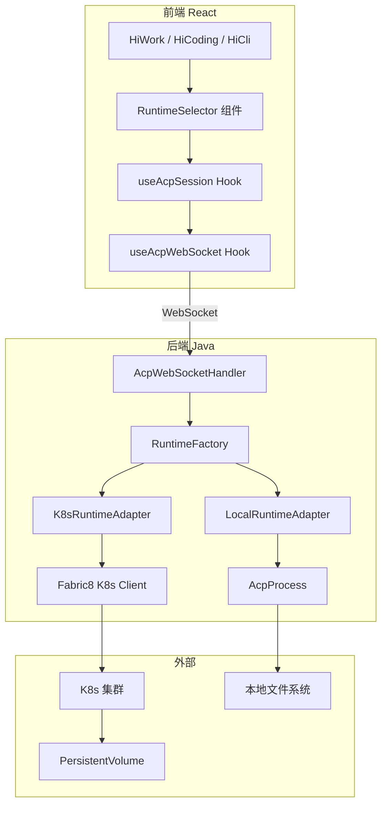
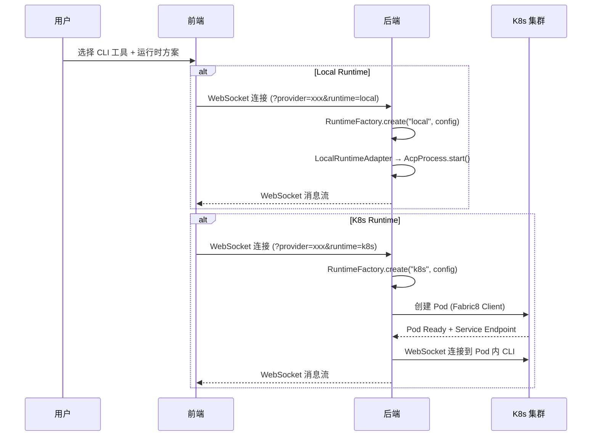

# 设计文档：沙箱运行时策略

## 概述

本设计为 HiMarket 平台实现多运行时策略架构，通过运行时抽象层统一管理两种 CLI Agent 运行环境：Local（本地进程）和 K8s（Kubernetes Pod）。

核心设计思路：在现有 `AcpProcess` + `AcpWebSocketHandler` 架构基础上，引入 `RuntimeAdapter` 接口层，将 CLI 进程的生命周期管理、消息通信、文件操作抽象为统一接口。上层业务代码（`AcpWebSocketHandler`、前端 `useAcpSession`）通过接口编程，无需感知底层运行时差异。

两种运行时均由后端 Java 服务统一管理，前端仅负责运行时选择 UI 和会话交互。

### 关键设计决策

1. **策略模式 + 工厂模式**：`RuntimeAdapter` 接口定义统一契约，两种运行时各自实现。`RuntimeFactory` 根据配置和用户选择创建对应实例。
2. **后端统一管理**：两种运行时均由后端 Java 服务管理，前端通过 WebSocket 与后端通信，后端负责将消息转发到对应运行时。
3. **渐进式改造**：`LocalRuntimeAdapter` 封装现有 `AcpProcess`，保持向后兼容；K8s 运行时以插件方式接入。
4. **K8s 客户端集成**：使用 Fabric8 Kubernetes Client 连接用户提供的 kubeconfig，动态创建/管理 Pod。
5. **文件持久化分层**：Local 用本地磁盘、K8s 用 PersistentVolume。

## 架构

### 整体架构图



### 运行时选择流程



## 组件与接口

### 后端组件

#### 1. RuntimeAdapter 接口

运行时抽象层的核心接口，定义所有运行时实现必须遵循的契约。

**文件位置**: `himarket-server/src/main/java/com/alibaba/himarket/service/acp/runtime/RuntimeAdapter.java`

```java
public interface RuntimeAdapter {

    /** 运行时类型标识 */
    RuntimeType getType();

    /** 启动运行时实例，返回实例 ID */
    String start(RuntimeConfig config) throws RuntimeException;

    /** 发送 JSON-RPC 消息到 CLI 进程 */
    void send(String jsonLine) throws IOException;

    /** 获取 CLI 进程输出的响应式流 */
    Flux<String> stdout();

    /** 查询运行时实例状态 */
    RuntimeStatus getStatus();

    /** 检查运行时是否存活 */
    boolean isAlive();

    /** 优雅关闭运行时实例 */
    void close();

    /** 获取文件系统适配器 */
    FileSystemAdapter getFileSystem();
}
```

```java
public enum RuntimeType {
    LOCAL, K8S
}

public enum RuntimeStatus {
    CREATING, RUNNING, STOPPED, ERROR
}
```

#### 2. RuntimeConfig

运行时配置数据类，封装创建运行时实例所需的全部参数。

```java
public class RuntimeConfig {
    private String userId;
    private String providerKey;
    private String command;
    private List<String> args;
    private String cwd;
    private Map<String, String> env;
    private boolean isolateHome;
    
    // K8s 专用
    private String k8sConfigId;       // 引用已存储的 kubeconfig
    private String containerImage;
    private ResourceLimits resourceLimits;
    
    public static class ResourceLimits {
        private String cpuLimit;      // e.g. "2"
        private String memoryLimit;   // e.g. "4Gi"
        private String diskLimit;     // e.g. "10Gi"
    }
}
```

#### 3. LocalRuntimeAdapter

封装现有 `AcpProcess`，实现 `RuntimeAdapter` 接口。这是对现有代码的最小改造。

**文件位置**: `himarket-server/src/main/java/com/alibaba/himarket/service/acp/runtime/LocalRuntimeAdapter.java`

```java
public class LocalRuntimeAdapter implements RuntimeAdapter {
    private AcpProcess process;
    private RuntimeStatus status = RuntimeStatus.CREATING;
    private LocalFileSystemAdapter fileSystem;

    @Override
    public RuntimeType getType() { return RuntimeType.LOCAL; }

    @Override
    public String start(RuntimeConfig config) throws RuntimeException {
        this.fileSystem = new LocalFileSystemAdapter(config.getCwd());
        this.process = new AcpProcess(
            config.getCommand(), config.getArgs(),
            config.getCwd(), config.getEnv()
        );
        process.start();
        status = RuntimeStatus.RUNNING;
        return "local-" + process.pid();
    }

    @Override
    public void send(String jsonLine) throws IOException {
        process.send(jsonLine);
    }

    @Override
    public Flux<String> stdout() { return process.stdout(); }

    @Override
    public boolean isAlive() { return process.isAlive(); }

    @Override
    public RuntimeStatus getStatus() { return status; }

    @Override
    public void close() {
        process.close();
        status = RuntimeStatus.STOPPED;
    }

    @Override
    public FileSystemAdapter getFileSystem() { return fileSystem; }
}
```

#### 4. K8sRuntimeAdapter

通过 Fabric8 K8s Client 管理 Pod 生命周期，通过 Pod 内 Sidecar 的 WebSocket 端点与 CLI 进程通信。

**文件位置**: `himarket-server/src/main/java/com/alibaba/himarket/service/acp/runtime/K8sRuntimeAdapter.java`

```java
public class K8sRuntimeAdapter implements RuntimeAdapter {
    private final KubernetesClient k8sClient;
    private final Sinks.Many<String> stdoutSink = Sinks.many().multicast().onBackpressureBuffer();
    private String podName;
    private WebSocketClient podWsClient;
    private RuntimeStatus status = RuntimeStatus.CREATING;
    private final ScheduledExecutorService healthChecker;
    private PodFileSystemAdapter fileSystem;

    public K8sRuntimeAdapter(KubernetesClient k8sClient) {
        this.k8sClient = k8sClient;
        this.healthChecker = Executors.newSingleThreadScheduledExecutor();
    }

    @Override
    public RuntimeType getType() { return RuntimeType.K8S; }

    @Override
    public String start(RuntimeConfig config) throws RuntimeException {
        Pod pod = buildPodSpec(config);
        k8sClient.pods().inNamespace("himarket").create(pod);
        podName = pod.getMetadata().getName();
        waitForPodReady(podName, Duration.ofSeconds(60));
        String podIp = getPodIp(podName);
        connectToPodWebSocket(podIp);
        startHealthCheck();
        status = RuntimeStatus.RUNNING;
        fileSystem = new PodFileSystemAdapter(k8sClient, podName, "himarket");
        return podName;
    }

    private Pod buildPodSpec(RuntimeConfig config) {
        return new PodBuilder()
            .withNewMetadata()
                .withGenerateName("sandbox-" + config.getUserId() + "-")
                .withNamespace("himarket")
                .addToLabels("app", "sandbox")
                .addToLabels("userId", config.getUserId())
            .endMetadata()
            .withNewSpec()
                .addNewContainer()
                    .withName("cli-agent")
                    .withImage(config.getContainerImage())
                    .withCommand(config.getCommand())
                    .withArgs(config.getArgs())
                    .withNewResources()
                        .addToLimits("cpu", new Quantity(config.getResourceLimits().getCpuLimit()))
                        .addToLimits("memory", new Quantity(config.getResourceLimits().getMemoryLimit()))
                    .endResources()
                    .addNewVolumeMount()
                        .withName("workspace")
                        .withMountPath("/workspace")
                    .endVolumeMount()
                .endContainer()
                .addNewContainer()
                    .withName("acp-sidecar")
                    .withImage("himarket/acp-sidecar:latest")
                    .addNewPort().withContainerPort(8080).endPort()
                .endContainer()
                .addNewVolume()
                    .withName("workspace")
                    .withNewPersistentVolumeClaim()
                        .withClaimName("workspace-" + config.getUserId())
                    .endPersistentVolumeClaim()
                .endVolume()
            .endSpec()
            .build();
    }
    // ... 省略 WebSocket 连接、健康检查等实现细节
}
```

#### 5. FileSystemAdapter 接口

统一的文件操作接口。

```java
public interface FileSystemAdapter {
    String readFile(String relativePath) throws IOException;
    void writeFile(String relativePath, String content) throws IOException;
    List<FileEntry> listDirectory(String relativePath) throws IOException;
    void createDirectory(String relativePath) throws IOException;
    void delete(String relativePath) throws IOException;
    FileInfo getFileInfo(String relativePath) throws IOException;
}

public record FileEntry(String name, boolean isDirectory, long size, long lastModified) {}
public record FileInfo(String path, boolean isDirectory, long size, long lastModified, boolean readable, boolean writable) {}
```

#### 6. RuntimeFactory

根据运行时类型创建对应的 `RuntimeAdapter` 实例。

```java
@Component
public class RuntimeFactory {
    private final K8sConfigService k8sConfigService;

    public RuntimeAdapter create(RuntimeType type, RuntimeConfig config) {
        return switch (type) {
            case LOCAL -> new LocalRuntimeAdapter();
            case K8S -> {
                KubernetesClient client = k8sConfigService.getClient(config.getK8sConfigId());
                yield new K8sRuntimeAdapter(client);
            }
        };
    }
}
```

#### 7. K8sConfigService

管理 K8s 集群连接配置。

```java
@Service
public class K8sConfigService {
    private final Map<String, KubernetesClient> clientCache = new ConcurrentHashMap<>();

    public String registerConfig(String kubeconfig) {
        Config config = Config.fromKubeconfig(kubeconfig);
        KubernetesClient client = new KubernetesClientBuilder().withConfig(config).build();
        client.namespaces().list(); // 验证连接
        String configId = UUID.randomUUID().toString();
        clientCache.put(configId, client);
        return configId;
    }

    public KubernetesClient getClient(String configId) {
        KubernetesClient client = clientCache.get(configId);
        if (client == null) throw new IllegalArgumentException("K8s 配置不存在: " + configId);
        return client;
    }

    public List<K8sClusterInfo> listClusters() { ... }
}
```

#### 8. AcpWebSocketHandler 改造

将现有的直接 `AcpProcess` 管理改为通过 `RuntimeAdapter` 接口。

```java
@Component
public class AcpWebSocketHandler extends TextWebSocketHandler {
    private final RuntimeFactory runtimeFactory;
    private final AcpProperties properties;
    private final Map<String, RuntimeAdapter> runtimeMap = new ConcurrentHashMap<>();

    @Override
    public void afterConnectionEstablished(WebSocketSession session) {
        String runtimeType = (String) session.getAttributes().get("runtime");
        RuntimeType type = resolveRuntimeType(runtimeType);

        RuntimeConfig config = buildRuntimeConfig(session, type);
        RuntimeAdapter runtime = runtimeFactory.create(type, config);
        runtime.start(config);
        runtimeMap.put(session.getId(), runtime);

        runtime.stdout().subscribe(line -> {
            if (session.isOpen()) {
                synchronized (session) {
                    session.sendMessage(new TextMessage(line));
                }
            }
        });
    }

    @Override
    protected void handleTextMessage(WebSocketSession session, TextMessage message) {
        RuntimeAdapter runtime = runtimeMap.get(session.getId());
        if (runtime == null) return;
        String payload = rewriteSessionNewCwd(session.getId(), message.getPayload());
        runtime.send(payload);
    }

    @Override
    public void afterConnectionClosed(WebSocketSession session, CloseStatus status) {
        RuntimeAdapter runtime = runtimeMap.remove(session.getId());
        if (runtime != null) runtime.close();
    }
}
```

### 前端组件

#### 9. RuntimeSelector 组件

前端运行时选择 UI 组件。

**文件位置**: `himarket-web/himarket-frontend/src/components/common/RuntimeSelector.tsx`

```tsx
interface RuntimeOption {
  type: 'local' | 'k8s';
  label: string;
  description: string;
  available: boolean;
  unavailableReason?: string;
}

interface RuntimeSelectorProps {
  cliProvider: string;
  runtimeOptions: RuntimeOption[];
  selectedRuntime: string;
  onSelect: (runtimeType: string) => void;
}
```

#### 10. useAcpSession 改造

扩展现有 hook，支持运行时类型参数。

```typescript
interface UseAcpSessionOptions {
  wsUrl: string;
  runtimeType: 'local' | 'k8s';
}

// 两种运行时均通过 WebSocket 与后端通信
// 在 WebSocket URL 中携带 runtime 参数
```

## 数据模型

### CLI Provider 配置扩展

```java
public static class CliProviderConfig {
    private String displayName;
    private String command;
    private String args;
    private Map<String, String> env;
    private boolean isolateHome;
    
    // 新增字段
    private String containerImage;       // K8s 使用的容器镜像
    private String runtimeCategory;      // "native" | "nodejs" | "python"
}
```

### 配置文件示例 (application.yml)

```yaml
acp:
  default-provider: qodercli
  workspace-root: ./workspaces
  default-runtime: local
  
  providers:
    qodercli:
      display-name: "Qoder CLI"
      command: qodercli
      args: "--acp"
      runtime-category: native
      container-image: "himarket/cli-qodercli:latest"
    
    kiro-cli:
      display-name: "Kiro CLI"
      command: kiro-cli
      args: "acp"
      runtime-category: native
      container-image: "himarket/cli-kiro:latest"
    
    qwen:
      display-name: "Qwen Code"
      command: qwen
      args: "--acp"
      isolate-home: true
      runtime-category: python
      container-image: "himarket/cli-qwen:latest"
    
    claude-code:
      display-name: "Claude Code"
      command: npx
      args: "@zed-industries/claude-code-acp"
      runtime-category: nodejs
      container-image: "himarket/cli-claude:latest"
    
    codex:
      display-name: "Codex"
      command: npx
      args: "@zed-industries/codex-acp"
      runtime-category: nodejs
      container-image: "himarket/cli-codex:latest"

  k8s:
    idle-timeout-seconds: 600
    health-check-interval-seconds: 30
    pod-namespace: himarket
```

### K8s 集群配置数据模型

```java
public record K8sClusterInfo(
    String configId,
    String clusterName,
    String serverUrl,
    boolean connected,
    Instant registeredAt
) {}
```

### 运行时实例状态

```java
public record RuntimeInstance(
    String instanceId,
    RuntimeType type,
    RuntimeStatus status,
    String userId,
    String providerKey,
    Instant createdAt,
    Instant lastActiveAt
) {}
```

### 前端运行时类型定义

**文件位置**: `himarket-web/himarket-frontend/src/types/runtime.ts`

```typescript
export type RuntimeType = 'local' | 'k8s';

export interface RuntimeInfo {
  type: RuntimeType;
  label: string;
  description: string;
  available: boolean;
  unavailableReason?: string;
}

export interface CliProviderWithRuntime {
  key: string;
  displayName: string;
  command: string;
  runtimeCategory: 'native' | 'nodejs' | 'python';
  containerImage?: string;
}
```


## 正确性属性

*属性（Property）是系统在所有有效执行中都应保持为真的特征或行为——本质上是关于系统应该做什么的形式化陈述。属性是人类可读规格与机器可验证正确性保证之间的桥梁。*

以下属性基于需求文档中的验收标准推导而来，每个属性都包含显式的"对于所有"量化语句，适合通过属性基测试（Property-Based Testing）进行验证。

### Property 1: 消息 Round-Trip 一致性

*对于任意*运行时类型（Local、K8s）和任意合法的 JSON-RPC 消息，通过 RuntimeAdapter 的 send 接口发送消息后，CLI 进程的 stdout 流应该返回对应的 JSON-RPC 响应，且响应中的 id 字段与请求的 id 字段一致。

**Validates: Requirements 2.3, 2.4, 3.4, 3.5, 6.3, 6.4**

### Property 2: 文件操作 Round-Trip 一致性

*对于任意*运行时类型和任意合法的文件路径与文件内容，通过 FileSystemAdapter 写入文件后再读取，应该得到与写入内容完全相同的结果。

**Validates: Requirements 2.5, 3.6, 5.2, 5.3**

### Property 3: 路径遍历防护

*对于任意*包含路径遍历模式（如 `../`、绝对路径 `/etc/passwd`、`..\\` 等）的文件路径，FileSystemAdapter 的所有操作（读取、写入、列举、删除）应该拒绝该路径并返回安全错误，不执行任何文件系统操作。

**Validates: Requirements 5.4**

### Property 4: 文件操作错误格式一致性

*对于任意*运行时类型和任意导致失败的文件操作（如读取不存在的文件、写入只读路径），FileSystemAdapter 返回的错误信息应该包含 errorType 字段和 runtimeType 字段。

**Validates: Requirements 5.5**

### Property 5: 运行时选择过滤与可用性验证

*对于任意*环境状态（K8s 集群是否已配置），RuntimeSelector 应该：(a) 正确标识每种运行时的可用性；(b) 当仅有一种运行时可用时，自动选中该运行时；(c) 当 K8s 未配置时，K8s 选项标记为不可用并显示原因。

**Validates: Requirements 4.2, 4.3, 4.4, 4.5, 9.4**

### Property 6: 默认运行时优先级

*对于任意*运行时优先级配置和环境可用性状态，当用户未主动选择运行时时，RuntimeSelector 应该按照配置的优先级顺序选择第一个可用的运行时作为默认值。

**Validates: Requirements 4.6**

### Property 7: Pod Spec 完整性

*对于任意* RuntimeConfig（包含 CPU/内存限制、用户 ID 和容器镜像），K8sRuntimeAdapter 生成的 Pod Spec 应该：(a) 包含与配置一致的资源 limits；(b) 使用配置指定的容器镜像；(c) 包含以用户 ID 命名的 PersistentVolumeClaim 挂载。

**Validates: Requirements 3.7, 3.9, 8.2**

### Property 8: 无效 Kubeconfig 验证

*对于任意*格式错误或指向不可达集群的 kubeconfig 字符串，K8sConfigService 的注册操作应该返回验证失败错误，不将无效配置存入缓存。

**Validates: Requirements 3.10, 9.2**

### Property 9: 运行时异常通知一致性

*对于任意*运行时类型，当运行时实例状态变为异常（通信中断或健康检查失败）时，发送给客户端的通知应该包含故障类型（faultType）、运行时类型（runtimeType）和建议操作（suggestedAction）字段。

**Validates: Requirements 6.5, 7.3, 7.4**

### Property 10: 健康检查失败阈值销毁

*对于任意*正整数阈值 N 和任意运行时实例，当连续 N 次健康检查失败后，该实例应该被强制销毁且状态变为 STOPPED；连续失败次数小于 N 时，实例不应被销毁。

**Validates: Requirements 7.5**

### Property 11: 消息顺序性保证

*对于任意*运行时类型和任意有序消息序列 [m1, m2, ..., mn]，通过 Communication_Adapter 按顺序发送后，接收端收到的消息顺序应该与发送顺序一致。

**Validates: Requirements 6.6**

### Property 12: HOME 环境变量隔离

*对于任意*支持 isolateHome 的 CLI_Provider 配置和任意用户 ID，Local_Runtime 启动的子进程应该使用以用户 ID 为区分的隔离 HOME 目录，而非系统默认 HOME。

**Validates: Requirements 2.6**

### Property 13: 文件持久化 Round-Trip

*对于任意*文件路径与内容集合，在 K8s_Runtime 实例中写入文件后销毁 Pod，再创建新 Pod 并挂载相同的 PersistentVolume，读取的文件内容应该与原始写入内容一致。

**Validates: Requirements 8.3**

## 错误处理

### 运行时创建失败

| 场景 | 处理方式 |
|------|---------|
| Local: CLI 命令不存在 | 抛出 RuntimeException，AcpWebSocketHandler 关闭 WebSocket 并返回 SERVER_ERROR |
| K8s: K8s 集群不可达 | 抛出 RuntimeException，返回包含集群连接错误详情的错误消息 |
| K8s: Pod 启动超时（60s） | 清理已创建的 Pod，抛出超时异常 |

### 运行时通信故障

| 场景 | 处理方式 |
|------|---------|
| Local: 子进程崩溃 | 检测到 stdout 流结束，标记为 ERROR 状态，通知前端 |
| K8s: Pod 被驱逐 | K8s Watch 检测到 Pod 状态变化，标记为 ERROR，通知前端 |
| K8s: 网络分区 | WebSocket 心跳超时，标记为 ERROR，尝试重连 |

### 文件操作错误

| 场景 | 错误类型 | 处理方式 |
|------|---------|---------|
| 路径遍历攻击 | PATH_TRAVERSAL | 拒绝操作，记录安全日志 |
| 文件不存在 | FILE_NOT_FOUND | 返回 404 错误 |
| 权限不足 | PERMISSION_DENIED | 返回 403 错误 |
| 磁盘空间不足 | DISK_FULL | 返回 507 错误 |
| 网络超时（K8s） | NETWORK_TIMEOUT | 重试一次，仍失败则返回错误 |

## 测试策略

### 属性基测试（Property-Based Testing）

使用 **jqwik**（后端 Java）和 **fast-check**（前端 TypeScript）作为属性基测试库。

每个属性测试配置最少 100 次迭代，每个测试通过注释引用设计文档中的属性编号。

**标签格式**: `Feature: sandbox-runtime-strategy, Property {number}: {property_text}`

**后端属性测试（Java + jqwik）**:

| 属性 | 测试目标 | 生成器 |
|------|---------|--------|
| P3: 路径遍历防护 | FileSystemAdapter 路径校验 | 生成包含 `../`、绝对路径、`..\\` 等模式的随机路径 |
| P4: 文件操作错误格式 | FileSystemAdapter 错误返回 | 生成随机运行时类型 + 随机无效文件操作 |
| P5: 运行时选择过滤 | RuntimeSelector 选择逻辑 | 生成随机环境状态（K8s 配置状态） |
| P6: 默认运行时优先级 | RuntimeSelector 默认选择 | 生成随机优先级配置 + 随机环境可用性 |
| P7: Pod Spec 完整性 | K8sRuntimeAdapter Pod Spec 生成 | 生成随机 RuntimeConfig（CPU/内存/用户 ID/镜像） |
| P8: 无效 Kubeconfig 验证 | K8sConfigService 验证逻辑 | 生成随机无效 kubeconfig 字符串 |
| P9: 运行时异常通知 | 异常通知格式 | 生成随机运行时类型 + 随机异常场景 |
| P10: 健康检查阈值 | HealthChecker 销毁逻辑 | 生成随机阈值 N + 随机失败序列 |
| P12: HOME 隔离 | LocalRuntimeAdapter 环境变量 | 生成随机用户 ID + 随机 CLI Provider 配置 |

**前端属性测试（TypeScript + fast-check）**:

| 属性 | 测试目标 | 生成器 |
|------|---------|--------|
| P3: 路径遍历防护 | 前端路径校验工具函数 | 生成包含遍历模式的随机路径 |
| P5: 运行时选择过滤 | RuntimeSelector 组件逻辑 | 生成随机环境状态 |

### 单元测试

单元测试聚焦于具体示例和边界情况，与属性测试互补：

- **LocalRuntimeAdapter**: 验证 AcpProcess 封装正确性、HOME 隔离配置
- **K8sRuntimeAdapter**: 验证 Pod Spec 生成、资源限制、PV 挂载、空闲超时清理、镜像版本管理
- **RuntimeFactory**: 验证根据类型创建正确的适配器实例
- **K8sConfigService**: 验证多集群注册、加密存储、无效配置拒绝
- **RuntimeSelector 组件**: 验证 UI 过滤逻辑、自动选中、不可用提示

### 集成测试

- **Local Runtime E2E**: 通过 LocalRuntimeAdapter 启动真实 CLI 进程，执行 initialize 握手
- **文件操作 Round-Trip**: 对每种运行时实现，写入文件后读取验证一致性
- **文件持久化 Round-Trip**: 写入文件 → 销毁 Pod → 创建新 Pod → 验证文件内容一致
- **运行时选择全链路**: 前端选择 CLI + 运行时 → 后端创建实例 → 通信验证
