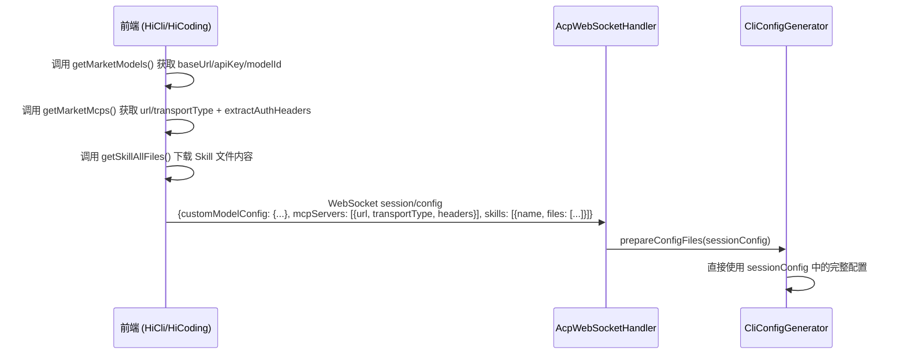
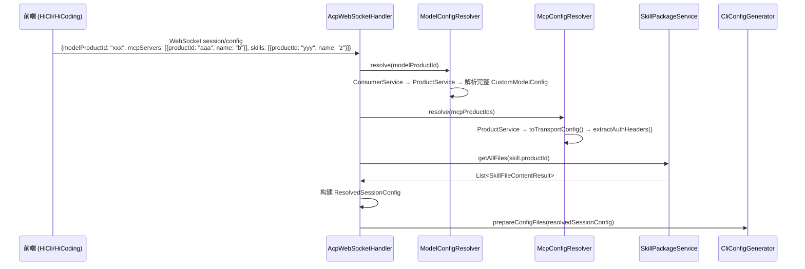

# 设计文档：会话配置统一化

## 概述

本设计将 HiCli 和 HiCoding 的会话配置传递逻辑统一为"前端只传标识符，后端统一解析完整配置"的终态架构。

当前架构中，前端（HiCli 的 `MarketModelSelector`、`MarketSkillSelector`、`MarketMcpSelector`）在客户端拼装完整的 `CustomModelConfig`（含 baseUrl、apiKey、modelId、protocolType）、MCP Server 连接信息（url、transportType、headers）和 Skill 文件内容，通过 WebSocket 传递给后端。这导致：
- 前端内存状态丢失时引发 NPE（如 apiKey 为 null）
- Skill 文件内容和 MCP 认证头通过 WebSocket 传输，增加消息体积和安全风险
- 两个前端各自维护配置拼装逻辑，代码重复

改造后：
- 前端仅传递 `modelProductId`（市场产品 ID）、MCP 的 `productId` + `name`、Skill 的 `productId` + `name`
- 后端新建 `ModelConfigResolver` 服务，根据 `modelProductId` 解析完整模型配置
- 后端新建 `McpConfigResolver` 服务，根据 MCP `productId` 解析完整连接信息（url、transportType、headers）
- 后端通过已有的 `SkillPackageService.getAllFiles()` 自动下载 Skill 文件
- `CliConfigGenerator` 接口签名从接收 `CliSessionConfig` 改为接收 `ResolvedSessionConfig`

## 架构

### 改造前数据流



### 改造后数据流



### 设计决策

1. **新建 `ResolvedSessionConfig` 而非修改 `CliSessionConfig`**：前端 DTO 和后端内部 DTO 职责分离，`CliSessionConfig` 保持为纯传输对象，`ResolvedSessionConfig` 承载解析后的完整数据。
2. **`ModelConfigResolver` 和 `McpConfigResolver` 作为独立 Spring Service**：复用已有的 `ConsumerService`、`ProductService`，便于单元测试和后续扩展。`McpConfigResolver` 复用 `CliProviderController.buildMarketMcpInfo()` 和 `extractAuthHeaders()` 中的逻辑。
3. **Skill 文件下载和 MCP 配置解析在 `prepareConfigFiles` 中完成**：与模型配置解析在同一流程中，保持 `CliConfigGenerator` 接口不感知解析逻辑。
4. **不考虑向后兼容**：直接面向终态方案，移除 `customModelConfig`、`skillMdContent`、`files`、`McpServerEntry.url/transportType/headers` 等旧字段。

## 组件与接口

### 1. `CliSessionConfig`（修改）

前端传入的纯标识符 DTO，移除完整配置字段：

```java
@Data
public class CliSessionConfig {
    /** 市场模型产品 ID（可选） */
    private String modelProductId;

    /** 选中的 MCP Server 列表（简化为标识符） */
    private List<McpServerEntry> mcpServers;

    /** 选中的 Skill 列表（简化为标识符） */
    private List<SkillEntry> skills;

    /** 认证凭据（保持不变） */
    private String authToken;

    @Data
    public static class McpServerEntry {
        /** MCP 产品 ID */
        private String productId;
        /** MCP 服务名称 */
        private String name;
    }

    @Data
    public static class SkillEntry {
        /** Skill 产品 ID */
        private String productId;
        /** Skill 名称 */
        private String name;
    }
}
```

**移除的字段**：
- `customModelConfig`（整个字段）
- `McpServerEntry.url`、`McpServerEntry.transportType`、`McpServerEntry.headers`
- `SkillEntry.skillMdContent`
- `SkillEntry.files`（及嵌套的 `SkillFileEntry` 类）

### 2. `ResolvedSessionConfig`（新建）

后端解析后的完整配置 DTO：

```java
@Data
public class ResolvedSessionConfig {
    /** 解析后的完整模型配置（可能为 null） */
    private CustomModelConfig customModelConfig;

    /** 解析后的 MCP Server 列表（含完整连接信息） */
    private List<ResolvedMcpEntry> mcpServers;

    /** 解析后的 Skill 列表（含文件内容） */
    private List<ResolvedSkillEntry> skills;

    /** 认证凭据（直接透传） */
    private String authToken;

    @Data
    public static class ResolvedMcpEntry {
        /** MCP 服务名称 */
        private String name;
        /** MCP 端点 URL */
        private String url;
        /** 传输协议类型：sse 或 streamable-http */
        private String transportType;
        /** 认证请求头（可能为 null） */
        private Map<String, String> headers;
    }

    @Data
    public static class ResolvedSkillEntry {
        /** Skill 名称 */
        private String name;
        /** 完整文件列表 */
        private List<SkillFileContentResult> files;
    }
}
```

### 3. `ModelConfigResolver`（新建）

Spring Service，负责根据 `modelProductId` 解析完整模型配置：

```java
@Service
@RequiredArgsConstructor
public class ModelConfigResolver {

    private final ConsumerService consumerService;
    private final ProductService productService;

    /**
     * 根据市场产品 ID 解析完整模型配置。
     * @return 解析后的 CustomModelConfig，解析失败时返回 null
     */
    public CustomModelConfig resolve(String modelProductId) {
        // 1. getPrimaryConsumer() → 获取 consumerId
        // 2. listConsumerSubscriptions(consumerId) → 筛选 APPROVED 且匹配 productId
        // 3. getProducts([modelProductId]) → 获取产品详情
        // 4. BaseUrlExtractor.extract(routes) → baseUrl
        // 5. ProtocolTypeMapper.map(aiProtocols) → protocolType
        // 6. 产品 feature → modelId
        // 7. getCredential(consumerId) → apiKey
        // 8. 组装 CustomModelConfig
    }
}
```

### 4. `McpConfigResolver`（新建）

Spring Service，负责根据 MCP `productId` 列表解析完整 MCP 连接配置。复用 `CliProviderController.buildMarketMcpInfo()` 和 `extractAuthHeaders()` 中的逻辑：

```java
@Service
@RequiredArgsConstructor
public class McpConfigResolver {

    private final ConsumerService consumerService;
    private final ProductService productService;
    private final ContextHolder contextHolder;

    /**
     * 根据 MCP 产品 ID 列表解析完整 MCP 连接配置。
     * @param mcpEntries 前端传入的 MCP 标识符列表
     * @return 解析后的 ResolvedMcpEntry 列表（解析失败的条目被跳过）
     */
    public List<ResolvedSessionConfig.ResolvedMcpEntry> resolve(
            List<CliSessionConfig.McpServerEntry> mcpEntries) {
        // 1. 批量获取产品详情：productService.getProducts(productIds)
        // 2. 对每个产品：product.getMcpConfig().toTransportConfig() → url, transportType
        // 3. 获取认证头：consumerService.getDefaultCredential(userId) → headers
        // 4. 组装 ResolvedMcpEntry（name, url, transportType, headers）
        // 5. 解析失败的条目记录 WARN 日志并跳过
    }
}
```

### 5. `CliConfigGenerator`（修改接口签名）

`generateSkillConfig` 方法的参数类型从 `List<CliSessionConfig.SkillEntry>` 改为 `List<ResolvedSessionConfig.ResolvedSkillEntry>`，`generateMcpConfig` 方法的参数类型从 `List<CliSessionConfig.McpServerEntry>` 改为 `List<ResolvedSessionConfig.ResolvedMcpEntry>`，使 Config_Generator 直接接收已解析的完整配置：

```java
public interface CliConfigGenerator {
    String supportedProvider();

    Map<String, String> generateConfig(String workingDirectory, CustomModelConfig config)
            throws IOException;

    default void generateMcpConfig(
            String workingDirectory, List<ResolvedSessionConfig.ResolvedMcpEntry> mcpServers)
            throws IOException {}

    default void generateSkillConfig(
            String workingDirectory, List<ResolvedSessionConfig.ResolvedSkillEntry> skills)
            throws IOException {}
}
```

### 6. `AcpWebSocketHandler.prepareConfigFiles`（修改）

改造流程：
1. 接收 `CliSessionConfig`（纯标识符）
2. 若 `modelProductId` 非空，调用 `ModelConfigResolver.resolve()` 获取 `CustomModelConfig`
3. 遍历 `mcpServers`，调用 `McpConfigResolver.resolve()` 解析完整 MCP 连接配置
4. 遍历 `skills`，对每个有 `productId` 的条目调用 `SkillPackageService.getAllFiles()` 下载文件
5. 构建 `ResolvedSessionConfig`
6. 将 `ResolvedSessionConfig` 传递给 `CliConfigGenerator`

### 7. 前端组件改造

#### ConfigSidebar（HiCoding）
- `buildFinalConfig()` 中模型配置改为传递 `modelProductId`（产品 ID 字符串），不再拼装 `customModelConfig`
- MCP 条目改为传递 `{ productId, name }`，不再包含 url、transportType、headers
- Skill 条目改为传递 `{ productId, name }`，不再包含文件内容
- 移除 `marketModels`、`marketModelsApiKey` 状态变量及 `fetchModels()` 中的 apiKey 获取逻辑
- 移除 `mcpAuthHeaders` 状态变量及 `extractAuthHeaders` 获取逻辑
- 模型下拉列表展示产品名称（`name`），不再展示 `modelId`

#### CliSelector（HiCli）
- `handleConnect()` 中模型配置改为传递 `modelProductId`，不再传递 `customModelConfig`
- MCP 条目改为传递 `{ productId, name }`，不再包含 url、transportType、headers
- Skill 条目改为传递 `{ productId, name }`

#### MarketModelSelector（HiCli）
- `onChange` 回调改为返回 `{ productId, name }` 而非 `CustomModelFormData`
- 移除 apiKey 获取和 `CustomModelFormData` 拼装逻辑
- 下拉列表展示产品名称（`name`），不再展示 `modelId`

#### MarketSkillSelector（HiCli）
- 选中 Skill 时仅传递 `{ productId, name }`
- 移除 `getSkillAllFiles()` 和 `downloadSkill()` 调用
- 移除 `downloadedContent` 缓存和 `downloadingIds` 状态

#### MarketMcpSelector（HiCli）
- 选中 MCP 时仅传递 `{ productId, name }`
- 移除 url、transportType、headers 的拼装逻辑

#### TypeScript 类型定义
```typescript
export interface CliSessionConfig {
  modelProductId?: string;
  mcpServers?: McpServerEntry[];
  skills?: SkillEntry[];
  authToken?: string;
}

export interface McpServerEntry {
  productId: string;
  name: string;
}

export interface SkillEntry {
  productId: string;
  name: string;
}
```
移除 `customModelConfig`、`McpServerEntry.url/transportType/headers`、`SkillEntry.skillMdContent`、`SkillEntry.files`。

## 数据模型

### CliSessionConfig（前端 → 后端 WebSocket 传输）

| 字段 | 类型 | 必填 | 说明 |
|------|------|------|------|
| `modelProductId` | String | 否 | 市场模型产品 ID |
| `mcpServers` | List\<McpServerEntry\> | 否 | MCP Server 标识符列表 |
| `skills` | List\<SkillEntry\> | 否 | Skill 标识符列表 |
| `authToken` | String | 否 | 认证凭据 |

#### McpServerEntry（简化后）

| 字段 | 类型 | 必填 | 说明 |
|------|------|------|------|
| `productId` | String | 是 | MCP 产品 ID |
| `name` | String | 是 | MCP 服务名称 |

#### SkillEntry（简化后）

| 字段 | 类型 | 必填 | 说明 |
|------|------|------|------|
| `productId` | String | 是 | Skill 产品 ID |
| `name` | String | 是 | Skill 名称 |

### ResolvedSessionConfig（后端内部）

| 字段 | 类型 | 说明 |
|------|------|------|
| `customModelConfig` | CustomModelConfig | 解析后的完整模型配置，可能为 null |
| `mcpServers` | List\<ResolvedMcpEntry\> | 解析后的 MCP Server 列表（含完整连接信息） |
| `skills` | List\<ResolvedSkillEntry\> | 含文件内容的 Skill 列表 |
| `authToken` | String | 直接透传 |

#### ResolvedMcpEntry

| 字段 | 类型 | 说明 |
|------|------|------|
| `name` | String | MCP 服务名称 |
| `url` | String | MCP 端点 URL |
| `transportType` | String | 传输协议类型（sse / streamable-http） |
| `headers` | Map\<String, String\> | 认证请求头（可能为 null） |

#### ResolvedSkillEntry

| 字段 | 类型 | 说明 |
|------|------|------|
| `name` | String | Skill 名称 |
| `files` | List\<SkillFileContentResult\> | 完整文件列表（path、content、encoding） |

### CustomModelConfig（后端内部，不变）

| 字段 | 类型 | 说明 |
|------|------|------|
| `baseUrl` | String | 模型接入点 URL |
| `apiKey` | String | API Key |
| `modelId` | String | 模型 ID |
| `modelName` | String | 模型显示名称 |
| `protocolType` | String | 协议类型（openai/anthropic/gemini） |


## 正确性属性

*属性（Property）是指在系统所有合法执行路径中都应成立的特征或行为——本质上是对系统应做什么的形式化陈述。属性是人类可读规格说明与机器可验证正确性保证之间的桥梁。*

### 属性 1：ModelConfigResolver 解析完整性

*对于任意*非空的 `modelProductId`，当对应的产品存在、开发者有 Primary Consumer、订阅状态为 APPROVED 且凭证有效时，`ModelConfigResolver.resolve()` 返回的 `CustomModelConfig` 应包含非空的 `baseUrl`、`apiKey`、`modelId` 和 `protocolType` 四个字段。

**验证需求：1.6, 2.1**

### 属性 2：订阅筛选只保留 APPROVED 状态

*对于任意*订阅列表（包含 APPROVED、PENDING、REJECTED 等各种状态），`ModelConfigResolver` 在筛选订阅时应只保留状态为 APPROVED 的订阅，其余状态的订阅不应参与后续的产品匹配。

**验证需求：2.3**

### 属性 3：Skill 文件下载与传递完整性

*对于任意*包含 `productId` 的 `SkillEntry` 列表，`prepareConfigFiles` 解析后生成的 `ResolvedSessionConfig` 中，每个成功下载的 `ResolvedSkillEntry` 的文件列表应与 `SkillPackageService.getAllFiles(productId)` 返回的文件列表一致（路径、内容、编码均相同）。

**验证需求：3.1, 3.2**

### 属性 4：Skill 配置生成 NPE 防护

*对于任意* `ResolvedSkillEntry` 列表，`generateSkillConfig()` 应跳过 `name` 为 null 或文件列表为空的条目，且不影响其余有效条目的正常写入。即：有效条目数量 = 输入列表中 `name` 非 null 且文件列表非空的条目数量。

**验证需求：4.1, 4.2**

### 属性 5：前端输出仅含标识符

*对于任意*用户选择的模型、MCP 和 Skill 组合，前端构建的 `cliSessionConfig` JSON 中：模型配置应为 `modelProductId` 字符串（而非 `customModelConfig` 对象），MCP 条目应仅包含 `productId` 和 `name` 两个字段（不包含 `url`、`transportType` 或 `headers`），Skill 条目应仅包含 `productId` 和 `name` 两个字段（不包含 `skillMdContent` 或 `files`）。

**验证需求：6.1, 6.2, 6.5, 6.6, 7.4, 7.5, 7.6**

### 属性 6：MCP 配置解析完整性

*对于任意*包含 `productId` 的 MCP 条目，当对应的产品存在且 mcpConfig 有效时，`McpConfigResolver.resolve()` 返回的 `ResolvedMcpEntry` 应包含非空的 `name`、`url` 和 `transportType` 字段。认证头 `headers` 可能为 null（当 `getDefaultCredential` 失败时）。

**验证需求：3.1, 3.2, 3.4, 3.5**

### 属性 7：ModelConfigResolver 错误处理返回空

*对于任意*导致解析失败的场景（无 Primary Consumer、产品未找到、产品未订阅、apiKey 提取失败），`ModelConfigResolver.resolve()` 应返回 null 而非抛出异常，且不影响后续流程的正常执行。

**验证需求：2.6, 2.7, 2.8**

## 错误处理

### 后端错误处理

| 场景 | 处理方式 | 日志级别 |
|------|----------|----------|
| 无 Primary Consumer | `ModelConfigResolver` 返回 null，跳过模型配置 | DEBUG |
| `modelProductId` 对应产品未找到 | `ModelConfigResolver` 返回 null，跳过模型配置 | WARN |
| 产品未订阅（无 APPROVED 订阅） | `ModelConfigResolver` 返回 null，跳过模型配置 | WARN |
| apiKey 提取失败 | `ModelConfigResolver` 返回 null，跳过模型配置 | WARN |
| MCP 产品未找到或 mcpConfig 不完整 | `McpConfigResolver` 跳过该条目 | WARN |
| MCP 认证头提取失败 | `McpConfigResolver` 仍返回配置（headers 为空） | DEBUG |
| Skill 文件下载失败 | 跳过该 Skill，继续处理其余 Skill | ERROR |
| SkillEntry name 为 null | `generateSkillConfig` 跳过该条目 | WARN |
| Skill 文件列表为空 | `generateSkillConfig` 跳过该条目 | WARN |

### 前端错误处理

- 模型列表加载失败：展示错误提示，允许重试
- Skill 列表加载失败：静默处理，不影响其他配置
- MCP 列表加载失败：静默处理，不影响其他配置

### 设计原则

- **优雅降级**：任何单个配置项解析失败不应阻断整个会话建立流程
- **不抛异常**：`ModelConfigResolver`、`McpConfigResolver` 和 Skill 下载失败均返回空/跳过，由调用方决定是否继续
- **日志分级**：预期的空状态用 DEBUG，异常但可恢复的用 WARN，不可恢复的用 ERROR

## 测试策略

### 双重测试方法

本特性采用单元测试 + 属性测试的双重策略：

- **单元测试**：验证具体示例、边界条件和错误场景
- **属性测试**：验证跨所有输入的通用属性

### 属性测试配置

- 属性测试库：后端使用 **jqwik**（Java 属性测试框架），前端使用 **fast-check**（TypeScript 属性测试框架）
- 每个属性测试最少运行 **100 次迭代**
- 每个属性测试必须通过注释引用设计文档中的属性编号
- 标签格式：`Feature: session-config-unification, Property {number}: {property_text}`

### 后端测试

#### 属性测试

| 属性 | 测试内容 | 生成器 |
|------|----------|--------|
| 属性 1 | ModelConfigResolver 解析完整性 | 随机 productId + mock 服务返回有效数据 |
| 属性 2 | 订阅筛选只保留 APPROVED | 随机生成包含各种状态的订阅列表 |
| 属性 3 | Skill 文件下载与传递完整性 | 随机 SkillEntry 列表 + mock SkillPackageService |
| 属性 4 | NPE 防护 | 随机生成包含 null name / 空文件列表的 ResolvedSkillEntry 列表 |
| 属性 6 | MCP 配置解析完整性 | 随机 MCP productId + mock ProductService |
| 属性 7 | 错误处理返回空 | 随机错误场景（null consumer、空产品、无凭证） |

#### 单元测试

- `CliSessionConfig` 序列化/反序列化：验证新字段结构
- `ResolvedSessionConfig` 构建：验证从 CliSessionConfig 到 ResolvedSessionConfig 的转换
- `ModelConfigResolver`：各错误场景的具体示例
- `McpConfigResolver`：各错误场景的具体示例（产品未找到、mcpConfig 不完整、认证头失败）
- `QwenCodeConfigGenerator.generateSkillConfig`：NPE 防护的具体示例
- `ClaudeCodeConfigGenerator.generateSkillConfig`：NPE 防护的具体示例
- `OpenCodeConfigGenerator.generateSkillConfig`：NPE 防护的具体示例

### 前端测试

#### 属性测试

| 属性 | 测试内容 | 生成器 |
|------|----------|--------|
| 属性 5 | 前端输出仅含标识符 | 随机生成模型 + MCP + Skill 选择组合 |

#### 单元测试

- TypeScript 类型定义：编译期验证字段存在性
- `ConfigSidebar.buildFinalConfig()`：具体配置组合的输出验证（含 MCP 标识符）
- `CliSelector.handleConnect()`：具体配置组合的输出验证（含 MCP 标识符）
- `MarketModelSelector`：选择模型后回调参数验证
- `MarketSkillSelector`：选择 Skill 后回调参数验证
- `MarketMcpSelector`：选择 MCP 后回调参数验证
