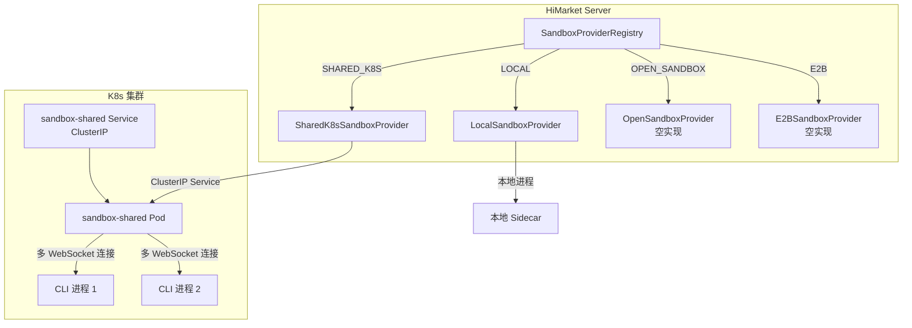
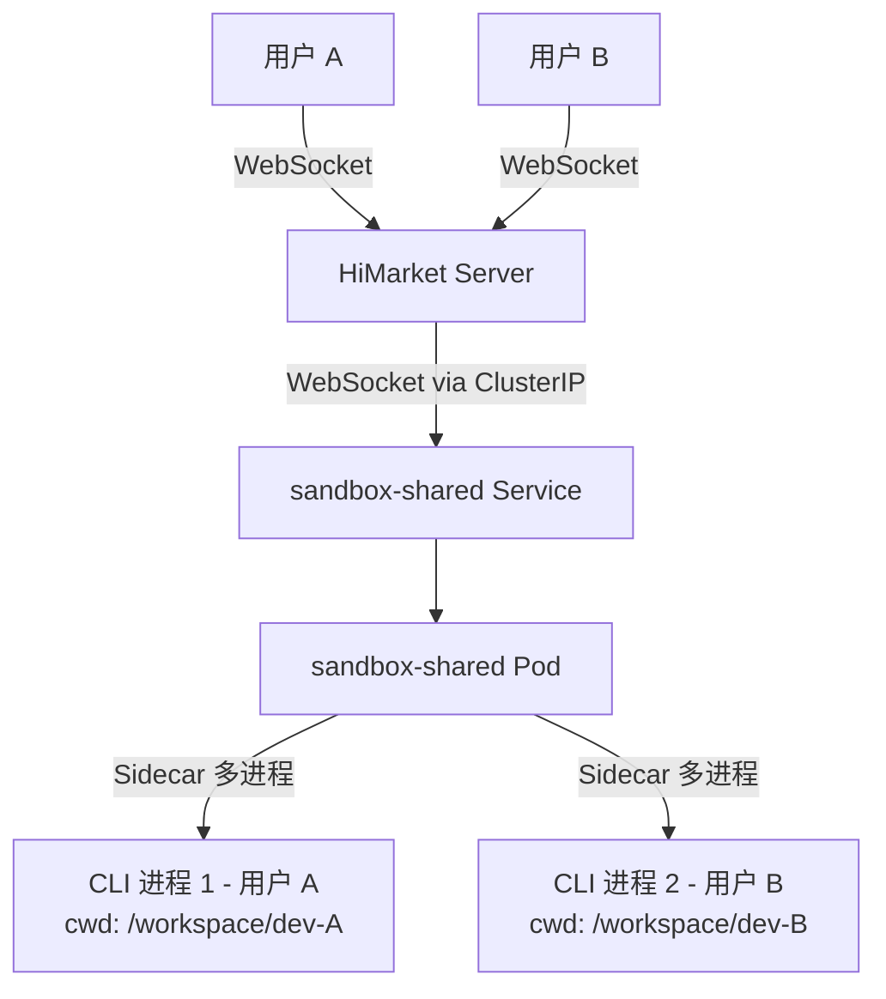
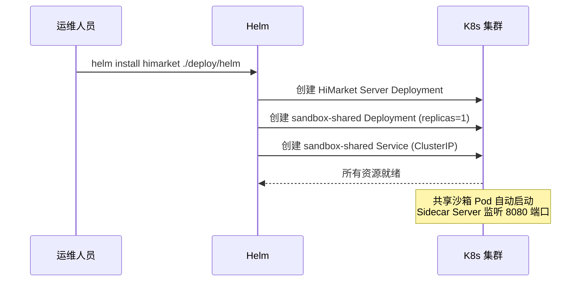
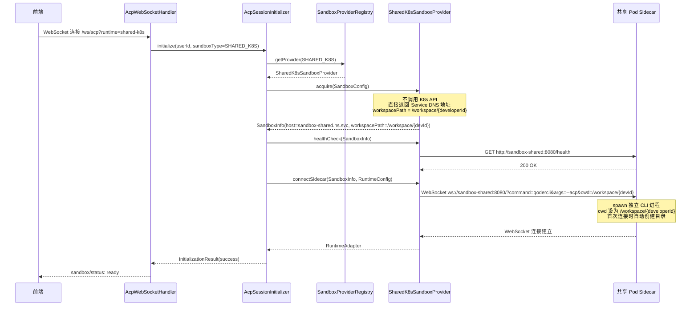
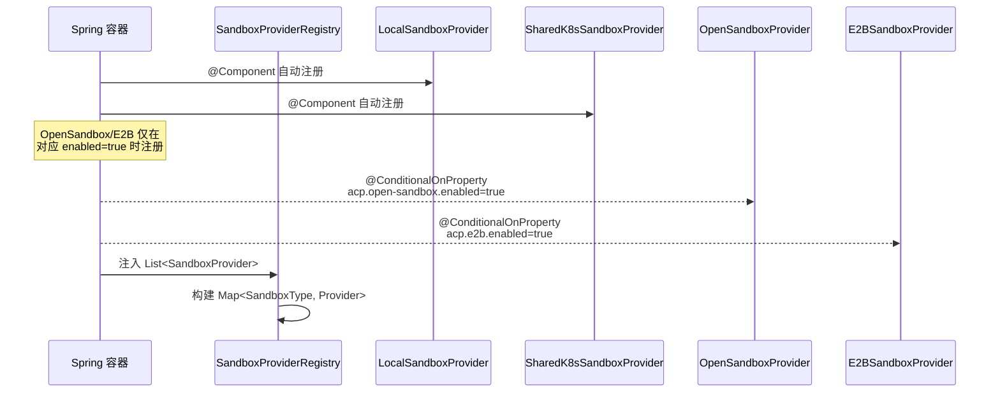
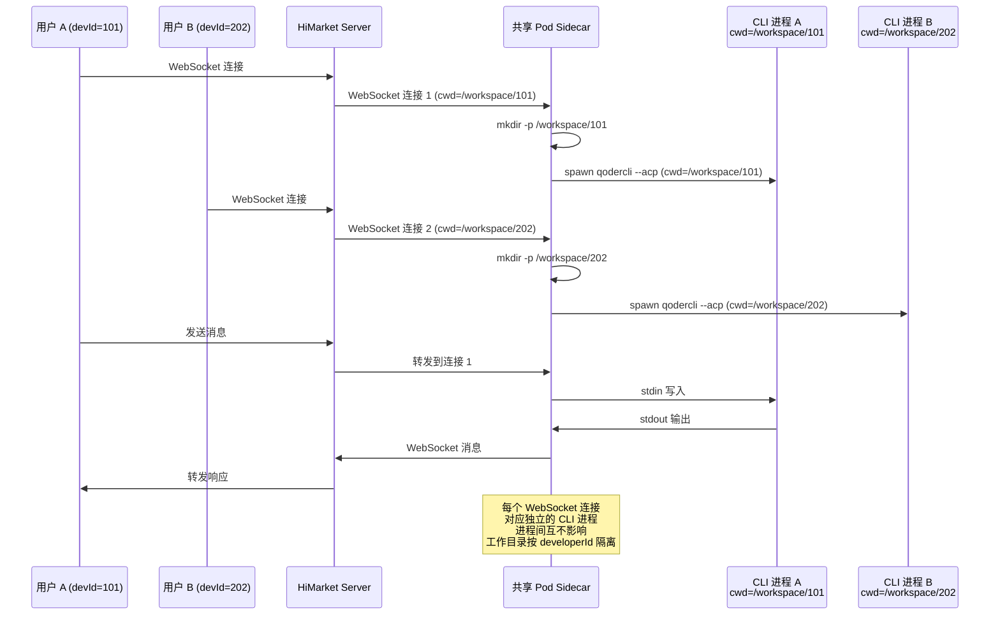

# 设计文档：沙箱多形态架构改造（shared-sandbox-pod）

## 概述

当前 HiMarket 的沙箱体系只有 `LOCAL`、`K8S`、`E2B` 三种类型，其中 `K8S` 类型绑定了 `PodReuseManager` 的动态 Pod 创建逻辑，部署门槛高。本次改造的核心目标是：

1. 重新定义沙箱类型枚举为四种最终形态：`LOCAL`、`SHARED_K8S`、`OPEN_SANDBOX`、`E2B`
2. 移除旧的 `K8S` 类型和 `K8sSandboxProvider`（含 `PodReuseManager`），不再保留向后兼容
3. `SharedK8sSandboxProvider` 作为默认实现，连接 Helm 预置的共享沙箱 Pod
4. `OpenSandboxProvider` 和 `E2BSandboxProvider` 允许空实现（`UnsupportedOperationException`），预留接口
5. 移除 `acp.k8s.shared-mode` 配置开关，因为不再需要在共享和动态模式间切换

核心改动范围：
1. **SandboxType 枚举**：`LOCAL`、`SHARED_K8S`、`OPEN_SANDBOX`、`E2B`（移除 `K8S`）
2. **SandboxProvider 实现**：四个 Provider 对应四种类型，`OpenSandbox` 和 `E2B` 暂为空实现
3. **Helm Chart**：新增共享沙箱 Pod 的 Deployment + Service 模板
4. **配置**：移除 `shared-mode` 开关，新增 `shared-service-name`；默认运行时改为 `shared-k8s`
5. **RuntimeSelector**：适配新的四种沙箱类型

## 架构

### 目标架构（四种沙箱形态）



### 共享 Pod 模式详细架构



**优势**：
- Helm 安装即就绪，无需动态创建任何 K8s 资源
- 不需要 Pod/PVC/Service 的 CRUD 权限
- 不依赖 StorageClass 和 LoadBalancer
- 所有用户共用一个 Pod，Sidecar 天然支持多 WebSocket 连接
- 每个用户拥有独立的工作目录 `/workspace/{developerId}`，文件系统层面隔离


## 组件与接口

### 组件 1：SandboxType 枚举重构

**用途**：统一标识四种沙箱形态，移除旧的 `K8S` 类型。

```java
public enum SandboxType {
    /** 本地 Mac 沙箱：本地启动 Sidecar + CLI */
    LOCAL("local"),

    /** 共享 K8s Pod 沙箱：Helm 预置的常驻共享 Pod */
    SHARED_K8S("shared-k8s"),

    /** OpenSandbox 沙箱：通过 OpenSandbox Server API 管理 */
    OPEN_SANDBOX("open-sandbox"),

    /** E2B 云沙箱：通过 E2B SDK 管理 */
    E2B("e2b");

    private final String value;
    // ... fromValue() 等方法不变
}
```

**变更要点**：
- 移除 `K8S("k8s")`，新增 `SHARED_K8S("shared-k8s")` 和 `OPEN_SANDBOX("open-sandbox")`
- `fromValue()` 需要兼容旧值 `"k8s"` 映射到 `SHARED_K8S`（数据库/前端过渡期）
- JSON 序列化值：`"local"`、`"shared-k8s"`、`"open-sandbox"`、`"e2b"`

### 组件 2：SandboxProvider 接口（无变更）

现有 `SandboxProvider` 接口已经足够通用，四种形态都可以实现。接口方法保持不变：

```java
public interface SandboxProvider {
    SandboxType getType();
    SandboxInfo acquire(SandboxConfig config);
    void release(SandboxInfo info);
    boolean healthCheck(SandboxInfo info);
    void writeFile(SandboxInfo info, String relativePath, String content) throws IOException;
    String readFile(SandboxInfo info, String relativePath) throws IOException;
    default int extractArchive(SandboxInfo info, byte[] tarGzBytes) throws IOException;
    RuntimeAdapter connectSidecar(SandboxInfo info, RuntimeConfig config);
}
```

### 组件 3：SharedK8sSandboxProvider（核心实现）

**用途**：默认的 K8s 沙箱实现，直接连接 Helm 预置的共享 Pod。

```java
@Component
public class SharedK8sSandboxProvider implements SandboxProvider {

    private final K8sConfigService k8sConfigService;
    private final SandboxHttpClient sandboxHttpClient;
    private final AcpProperties acpProperties;

    @Override
    public SandboxType getType() {
        return SandboxType.SHARED_K8S;
    }

    @Override
    public SandboxInfo acquire(SandboxConfig config) {
        // 不调用 K8s API，直接返回共享 Pod 的 Service DNS 地址
        String host = sharedServiceName + "." + namespace + ".svc.cluster.local";
        // 根据 developerId 构建隔离的工作目录
        String workspacePath = "/workspace/" + config.userId();
        return new SandboxInfo(
            SandboxType.SHARED_K8S,
            "sandbox-shared",
            host, SIDECAR_PORT, workspacePath,
            true,  // 始终视为复用
            Map.of("namespace", namespace)
        );
    }

    @Override
    public void release(SandboxInfo info) {
        // 空操作：共享 Pod 生命周期由 Helm 管理
    }

    @Override
    public boolean healthCheck(SandboxInfo info) {
        return sandboxHttpClient.healthCheckWithLog(sidecarBaseUrl(info), info.sandboxId());
    }

    // writeFile / readFile / extractArchive 委托给 SandboxHttpClient
    // connectSidecar 复用 K8sRuntimeAdapter
}
```

**职责**：
- `acquire()`：返回共享 Pod 的固定连接信息（Service DNS + 端口），零 K8s API 调用
- `release()`：空操作
- `healthCheck()`：通过 HTTP 调用 Sidecar `/health` 端点
- 文件操作：委托给 `SandboxHttpClient`
- `connectSidecar()`：构建 WebSocket URI 连接到共享 Pod

### 组件 4：OpenSandboxProvider（空实现）

**用途**：预留 OpenSandbox 对接接口，暂时为空实现。

```java
@Component
@ConditionalOnProperty(name = "acp.open-sandbox.enabled", havingValue = "true")
public class OpenSandboxProvider implements SandboxProvider {

    @Override
    public SandboxType getType() {
        return SandboxType.OPEN_SANDBOX;
    }

    @Override
    public SandboxInfo acquire(SandboxConfig config) {
        throw new UnsupportedOperationException("OpenSandbox 尚未实现");
    }

    @Override
    public void release(SandboxInfo info) {
        // 空实现
    }

    @Override
    public boolean healthCheck(SandboxInfo info) {
        return false;
    }

    @Override
    public void writeFile(SandboxInfo info, String relativePath, String content) throws IOException {
        throw new UnsupportedOperationException("OpenSandbox 尚未实现");
    }

    @Override
    public String readFile(SandboxInfo info, String relativePath) throws IOException {
        throw new UnsupportedOperationException("OpenSandbox 尚未实现");
    }

    @Override
    public RuntimeAdapter connectSidecar(SandboxInfo info, RuntimeConfig config) {
        throw new UnsupportedOperationException("OpenSandbox 尚未实现");
    }
}
```

### 组件 5：E2BSandboxProvider（空实现）

**用途**：预留 E2B 对接接口，暂时为空实现。结构与 `OpenSandboxProvider` 类似。

```java
@Component
@ConditionalOnProperty(name = "acp.e2b.enabled", havingValue = "true")
public class E2BSandboxProvider implements SandboxProvider {

    @Override
    public SandboxType getType() {
        return SandboxType.E2B;
    }

    // 所有方法抛出 UnsupportedOperationException
    // 结构同 OpenSandboxProvider
}
```

### 组件 6：SandboxProviderRegistry（微调）

**用途**：现有的 Registry 逻辑无需大改，Spring 自动注入所有 `SandboxProvider` Bean。

```java
@Component
public class SandboxProviderRegistry {
    private final Map<SandboxType, SandboxProvider> providers;

    public SandboxProviderRegistry(List<SandboxProvider> providerList) {
        this.providers = providerList.stream()
            .collect(Collectors.toMap(SandboxProvider::getType, Function.identity()));
    }

    public SandboxProvider getProvider(SandboxType type) {
        SandboxProvider provider = providers.get(type);
        if (provider == null) {
            throw new IllegalArgumentException("不支持的沙箱类型: " + type);
        }
        return provider;
    }
}
```

**变更要点**：
- 不再需要 `@ConditionalOnProperty` 做 `K8sSandboxProvider` 和 `SharedK8sSandboxProvider` 的互斥注册
- `OpenSandboxProvider` 和 `E2BSandboxProvider` 通过各自的 `@ConditionalOnProperty` 控制是否注册
- 默认情况下只有 `LocalSandboxProvider` 和 `SharedK8sSandboxProvider` 被注册

### 组件 7：RuntimeSelector 适配

**用途**：适配新的四种沙箱类型，更新可用性检查和 UI 展示信息。

```java
public boolean isSandboxAvailable(SandboxType type) {
    return switch (type) {
        case LOCAL -> acpProperties.isLocalEnabled();
        case SHARED_K8S -> k8sConfigService.hasAnyCluster();
        case OPEN_SANDBOX -> false; // 未来：检查 OpenSandbox Server 是否可达
        case E2B -> false;          // 未来：检查 E2B API Key 是否配置
    };
}

private String getLabelForType(SandboxType type) {
    return switch (type) {
        case LOCAL -> "本地运行";
        case SHARED_K8S -> "K8s 共享沙箱";
        case OPEN_SANDBOX -> "OpenSandbox";
        case E2B -> "E2B 云沙箱";
    };
}

private String getDescriptionForType(SandboxType type) {
    return switch (type) {
        case LOCAL -> "在服务器本地通过进程启动 CLI Agent，适用于开发调试";
        case SHARED_K8S -> "通过 Helm 预置的共享 K8s Pod 提供沙箱环境";
        case OPEN_SANDBOX -> "通过 OpenSandbox Server 管理沙箱实例（未实现）";
        case E2B -> "通过 E2B SDK 管理远程云沙箱（未实现）";
    };
}
```

### 组件 8：Helm Chart 共享沙箱模板

**用途**：在 Helm 安装时创建常驻的共享沙箱 Deployment 和 ClusterIP Service。

**新增模板文件**：
- `deploy/helm/templates/sandbox-shared-deployment.yaml`
- `deploy/helm/templates/sandbox-shared-service.yaml`

**Deployment 关键设计**：
- `replicas: 1`（单实例）
- 使用与现有沙箱相同的镜像（`sandbox:latest`）
- 通过 `emptyDir` 挂载 `/workspace`
- 标签：`app: sandbox-shared`

**Service 关键设计**：
- 类型：`ClusterIP`（集群内访问）
- 端口映射：`8080 → 8080`（Sidecar WebSocket 端口）

**values.yaml 新增配置**：

```yaml
sandbox:
  enabled: true
  image:
    repository: sandbox
    tag: "latest"
    pullPolicy: Always
  resources:
    requests:
      cpu: "1"
      memory: "1Gi"
    limits:
      cpu: "4"
      memory: "8Gi"
  allowedCommands: "qodercli,qwen,npx,opencode"
```

### 组件 9：配置变更

**移除的配置**：
- `acp.k8s.shared-mode`（不再需要模式切换）
- `acp.k8s.reuse-pod-idle-timeout`（不再有动态 Pod）
- `acp.k8s.sandbox-access-via-service`（共享模式始终通过 Service 访问）

**新增/保留的配置**：

```java
public static class K8sConfig {
    /** K8s 命名空间 */
    private String namespace = "default";

    /** 共享沙箱 Pod 的 Service 名称 */
    private String sharedServiceName = "sandbox-shared";

    /** Sidecar 允许的命令白名单 */
    private String allowedCommands = "qodercli,qwen,npx,opencode";
}
```

**application.yml**：

```yaml
acp:
  default-runtime: shared-k8s   # 默认运行时改为 shared-k8s
  k8s:
    namespace: ${ACP_K8S_NAMESPACE:default}
    shared-service-name: ${ACP_K8S_SHARED_SERVICE_NAME:sandbox-shared}
```


## 数据模型

### SandboxType 枚举值对照

| 枚举值 | JSON 值 | Provider 类 | 状态 |
|--------|---------|-------------|------|
| `LOCAL` | `"local"` | `LocalSandboxProvider` | 已实现 |
| `SHARED_K8S` | `"shared-k8s"` | `SharedK8sSandboxProvider` | 本次实现 |
| `OPEN_SANDBOX` | `"open-sandbox"` | `OpenSandboxProvider` | 空实现 |
| `E2B` | `"e2b"` | `E2BSandboxProvider` | 空实现 |

### SandboxInfo 各形态字段使用

| 字段 | LOCAL | SHARED_K8S | OPEN_SANDBOX | E2B |
|------|-------|-----------|--------------|-----|
| `type` | `LOCAL` | `SHARED_K8S` | `OPEN_SANDBOX` | `E2B` |
| `sandboxId` | `local-{port}` | `sandbox-shared` | OpenSandbox ID | E2B ID |
| `host` | `localhost` | `{svc}.{ns}.svc.cluster.local` | OpenSandbox Host | E2B Host |
| `sidecarPort` | 动态端口 | `8080` | TBD | TBD |
| `workspacePath` | 本地路径 | `/workspace/{developerId}` | TBD | TBD |
| `reused` | `false` | `true` | TBD | TBD |

### SandboxConfig 变更

```java
public record SandboxConfig(
    String userId,
    SandboxType type,
    String workspacePath,
    Map<String, String> env,
    // K8s 共享模式配置
    String k8sConfigId,
    Map<String, String> resources,
    // OpenSandbox 配置（未来）
    String openSandboxTemplate,
    // E2B 配置（未来）
    String e2bTemplate,
    // 本地配置
    int localSidecarPort
) {}
```

## 主要流程

### 流程 1：Helm 安装部署



### 流程 2：用户连接沙箱（SHARED_K8S 模式）



### 流程 3：Provider 注册与路由



### 流程 4：多用户并发使用




## 关键函数与形式化规约

### 函数 1：SharedK8sSandboxProvider.acquire()

```java
public SandboxInfo acquire(SandboxConfig config) {
    String host = sharedServiceName + "." + namespace + ".svc.cluster.local";
    // 根据 developerId 构建隔离的工作目录
    String workspacePath = "/workspace/" + config.userId();
    return new SandboxInfo(
        SandboxType.SHARED_K8S,
        "sandbox-shared",
        host,
        SIDECAR_PORT,
        workspacePath,
        true,
        Map.of("namespace", namespace)
    );
}
```

**前置条件：**
- `config` 非 null
- `config.userId()` 非 null 且非空（用于构建隔离工作目录）
- `sharedServiceName` 和 `namespace` 已配置且非空

**后置条件：**
- 返回的 `SandboxInfo` 非 null
- `type` 为 `SHARED_K8S`
- `host` 为合法的 K8s Service DNS 名称
- `sandboxId` 固定为 `"sandbox-shared"`
- `workspacePath` 为 `/workspace/{config.userId()}`，包含 developerId 实现目录隔离
- `reused` 始终为 `true`
- 不调用任何 K8s API，不产生副作用

### 函数 2：SharedK8sSandboxProvider.connectSidecar()

```java
public RuntimeAdapter connectSidecar(SandboxInfo info, RuntimeConfig config) {
    K8sRuntimeAdapter adapter = new K8sRuntimeAdapter(
        k8sConfigService.getClient(config.getK8sConfigId()),
        namespace
    );
    adapter.setReuseMode(true);

    String command = config.getCommand();
    String args = config.getArgs() != null ? String.join(" ", config.getArgs()) : null;
    // 将 workspacePath（含 developerId）作为 cwd 传递给 Sidecar
    // Sidecar 在 spawn CLI 进程时会将 cwd 设为该路径，并在目录不存在时自动创建
    URI wsUri = info.sidecarWsUri(command, args != null ? args : "", config.getEnv(),
        info.workspacePath());  // cwd 参数

    PodInfo podInfo = new PodInfo(
        info.sandboxId(), info.host(), null, wsUri, true
    );

    adapter.prepareForExistingPod(podInfo, config);
    adapter.connectAndStart();
    return adapter;
}
```

**前置条件：**
- `info.host()` 指向可达的共享 Pod Service
- `info.workspacePath()` 格式为 `/workspace/{developerId}`，developerId 非空
- `config.getCommand()` 在 Sidecar 的 `ALLOWED_COMMANDS` 白名单中
- 共享 Pod 的 Sidecar 正在运行且接受 WebSocket 连接

**后置条件：**
- 返回已连接的 `RuntimeAdapter`
- Sidecar 已为此连接 spawn 独立的 CLI 进程，cwd 设为 `/workspace/{developerId}`
- 若 `/workspace/{developerId}` 目录不存在，Sidecar 在 spawn 前自动创建（`mkdir -p`）
- 环境变量通过 WebSocket URI query param 传递给 Sidecar

### 函数 3：SandboxType.fromValue() 兼容旧值

```java
@JsonCreator
public static SandboxType fromValue(String value) {
    // 兼容旧的 "k8s" 值，映射到 SHARED_K8S
    if ("k8s".equalsIgnoreCase(value)) {
        return SHARED_K8S;
    }
    for (SandboxType type : values()) {
        if (type.value.equalsIgnoreCase(value) || type.name().equalsIgnoreCase(value)) {
            return type;
        }
    }
    throw new IllegalArgumentException("未知的沙箱类型: " + value);
}
```

**前置条件：**
- `value` 非 null

**后置条件：**
- `"k8s"` 映射到 `SHARED_K8S`（向后兼容）
- `"shared-k8s"` 映射到 `SHARED_K8S`
- `"open-sandbox"` 映射到 `OPEN_SANDBOX`
- 未知值抛出 `IllegalArgumentException`

## 算法伪代码

### Provider 注册与路由算法

```pascal
ALGORITHM registerProviders()
INPUT: Spring 容器中所有 SandboxProvider Bean
OUTPUT: SandboxProviderRegistry

BEGIN
  providers ← 空 Map<SandboxType, SandboxProvider>

  // 始终注册的 Provider
  providers[LOCAL] ← LocalSandboxProvider    // @Component, 受 local-enabled 控制
  providers[SHARED_K8S] ← SharedK8sSandboxProvider  // @Component, 始终注册

  // 按需注册的 Provider（空实现）
  IF config("acp.open-sandbox.enabled") = true THEN
    providers[OPEN_SANDBOX] ← OpenSandboxProvider
  END IF

  IF config("acp.e2b.enabled") = true THEN
    providers[E2B] ← E2BSandboxProvider
  END IF

  RETURN SandboxProviderRegistry(providers)
END
```

### 共享沙箱获取算法

```pascal
ALGORITHM acquireSharedSandbox(config)
INPUT: config of type SandboxConfig
OUTPUT: info of type SandboxInfo

BEGIN
  ASSERT config.userId IS NOT NULL AND config.userId IS NOT EMPTY

  // 直接构建 Service DNS 地址，不调用 K8s API
  host ← sharedServiceName + "." + namespace + ".svc.cluster.local"

  // 根据 developerId 构建隔离的工作目录
  workspacePath ← "/workspace/" + config.userId

  info ← SandboxInfo(
    type = SHARED_K8S,
    sandboxId = "sandbox-shared",
    host = host,
    sidecarPort = 8080,
    workspacePath = workspacePath,
    reused = true,
    metadata = { namespace }
  )

  RETURN info
END
```

### 运行时可用性检查算法

```pascal
ALGORITHM isSandboxAvailable(type)
INPUT: type of type SandboxType
OUTPUT: available of type boolean

BEGIN
  CASE type OF
    LOCAL:
      RETURN acpProperties.localEnabled
    SHARED_K8S:
      RETURN k8sConfigService.hasAnyCluster()
    OPEN_SANDBOX:
      RETURN false  // 未来：检查 OpenSandbox Server 可达性
    E2B:
      RETURN false  // 未来：检查 E2B API Key 配置
  END CASE
END
```

## 示例用法

### Helm 安装

```bash
# 最简安装：自动部署共享沙箱 Pod
helm install himarket ./deploy/helm

# 自定义沙箱资源限制
helm install himarket ./deploy/helm \
  --set sandbox.resources.limits.cpu=8 \
  --set sandbox.resources.limits.memory=16Gi

# 禁用共享沙箱（不部署沙箱 Pod）
helm install himarket ./deploy/helm \
  --set sandbox.enabled=false
```

### 后端配置

```yaml
acp:
  default-runtime: shared-k8s
  k8s:
    namespace: default
    shared-service-name: sandbox-shared
  # 启用 OpenSandbox（空实现，仅注册 Provider）
  # open-sandbox:
  #   enabled: true
  # 启用 E2B（空实现，仅注册 Provider）
  # e2b:
  #   enabled: true
```


## 正确性属性

*属性是系统在所有有效执行中都应保持为真的特征或行为——本质上是关于系统应该做什么的形式化陈述。属性是人类可读规范与机器可验证正确性保证之间的桥梁。*

### Property 1: SandboxType 序列化 round-trip

*For any* SandboxType 枚举值，将其序列化为 JSON 字符串后再通过 fromValue() 反序列化，应得到原始枚举值。

**Validates: Requirements 1.7**

### Property 2: fromValue 对未知值的拒绝

*For any* 不在合法值集合（"local"、"shared-k8s"、"open-sandbox"、"e2b"、"k8s"、"LOCAL"、"SHARED_K8S"、"OPEN_SANDBOX"、"E2B"）中的字符串，fromValue() 应抛出 IllegalArgumentException。

**Validates: Requirement 1.6**

### Property 3: acquire 输出正确性

*For any* 合法的 userId（非空、不含路径穿越字符），SharedK8sSandboxProvider.acquire() 返回的 SandboxInfo 应满足：type 为 SHARED_K8S，host 格式为 "{sharedServiceName}.{namespace}.svc.cluster.local"，workspacePath 格式为 "/workspace/{userId}"。

**Validates: Requirements 2.2, 2.3**

### Property 4: workspacePath 由 userId 唯一确定

*For any* 两个不同的合法 userId A 和 B，acquire() 返回的 workspacePath 互不相同；对于相同的 userId，多次调用 acquire() 返回的 workspacePath 一致。

**Validates: Requirements 9.1, 9.2**

### Property 5: 路径穿越输入拒绝

*For any* 包含 ".." 或 "/" 字符的 userId 字符串，SharedK8sSandboxProvider.acquire() 应拒绝请求（抛出异常或返回错误）。

**Validates: Requirement 9.3**

### Property 6: Registry 路由正确性

*For any* 已注册的 SandboxProvider 集合，SandboxProviderRegistry 中每个 SandboxType 最多对应一个 Provider 实例，且 getProvider(type) 返回的 Provider 的 getType() 与请求的 type 一致。

**Validates: Requirements 4.2, 4.3**

### Property 7: RuntimeSelector 标签完备性

*For any* SandboxType 枚举值，RuntimeSelector 的 getLabelForType() 和 getDescriptionForType() 应返回非空字符串。

**Validates: Requirement 5.4**

## 错误处理

### 错误场景 1：共享 Pod 未就绪

**条件**：Helm 安装后共享 Pod 尚未启动完成，或 Pod 异常重启中
**响应**：`healthCheck()` 返回 `false`，`FileSystemReadyPhase` 失败，前端收到 `sandbox/status: error`
**恢复**：Pod 自动重启后恢复（Deployment 的 `restartPolicy: Always`）

### 错误场景 2：共享 Pod 资源耗尽

**条件**：多用户并发使用导致 Pod 内 CPU/内存达到 limits
**响应**：新的 CLI 进程可能无法 spawn，Sidecar 返回错误
**恢复**：运维人员通过 `helm upgrade --set sandbox.resources.limits.cpu=8` 调整资源限制

### 错误场景 3：共享 Pod 被意外删除

**条件**：运维人员手动删除了共享 Pod，或节点故障导致 Pod 被驱逐
**响应**：Deployment Controller 自动重建 Pod，期间所有新连接失败
**恢复**：Pod 重建后自动恢复，已有 WebSocket 连接会断开，前端需重连

### 错误场景 4：调用空实现 Provider

**条件**：前端传入 `runtime=open-sandbox` 或 `runtime=e2b`，但对应 Provider 未启用或为空实现
**响应**：
- Provider 未注册：`SandboxProviderRegistry.getProvider()` 抛出 `IllegalArgumentException`
- Provider 已注册但为空实现：`acquire()` 抛出 `UnsupportedOperationException`
**恢复**：前端应根据 `RuntimeSelector.getAllRuntimeAvailability()` 返回的可用性状态禁用不可用的运行时选项

### 错误场景 5：旧版前端传入 `runtime=k8s`

**条件**：前端尚未更新，仍然传入旧的 `"k8s"` 值
**响应**：`SandboxType.fromValue("k8s")` 返回 `SHARED_K8S`，正常路由到 `SharedK8sSandboxProvider`
**恢复**：无需恢复，兼容处理

## 测试策略

### 单元测试

1. **SandboxType 枚举测试**：
   - 验证四个枚举值的 JSON 序列化值正确
   - 验证 `fromValue("k8s")` 返回 `SHARED_K8S`（向后兼容）
   - 验证 `fromValue("shared-k8s")` 返回 `SHARED_K8S`
   - 验证 `fromValue("open-sandbox")` 返回 `OPEN_SANDBOX`

2. **SharedK8sSandboxProvider 测试**：
   - `acquire()` 返回正确的 `SandboxInfo`（host 格式、sandboxId、type=SHARED_K8S）
   - `acquire()` 的 `workspacePath` 包含 `config.userId()`，格式为 `/workspace/{userId}`
   - 不同 userId 的 `acquire()` 返回不同的 `workspacePath`
   - `release()` 不抛异常
   - `healthCheck()` 委托给 `SandboxHttpClient`

3. **空实现 Provider 测试**：
   - `OpenSandboxProvider.acquire()` 抛出 `UnsupportedOperationException`
   - `E2BSandboxProvider.healthCheck()` 返回 `false`
   - `release()` 不抛异常

4. **SandboxProviderRegistry 测试**：
   - 注册四种 Provider 后，每种类型都能正确获取
   - 未注册的类型抛出 `IllegalArgumentException`

5. **RuntimeSelector 测试**：
   - `isSandboxAvailable(SHARED_K8S)` 在 K8s 配置存在时返回 `true`
   - `isSandboxAvailable(OPEN_SANDBOX)` 返回 `false`
   - `isSandboxAvailable(E2B)` 返回 `false`
   - `getAllRuntimeAvailability()` 返回所有四种类型的状态

### 属性测试

**属性测试库**：jqwik

1. **Provider 类型一致性**：对于任意 `SandboxProvider` 实例，`provider.getType()` 返回的类型与 Registry 中注册的 key 一致
2. **acquire 幂等性**：`SharedK8sSandboxProvider.acquire()` 对相同输入始终返回相同的 `SandboxInfo`（host、sandboxId、type、workspacePath 不变）
3. **fromValue 兼容性**：对于所有旧枚举值（`"local"`、`"k8s"`、`"e2b"`），`fromValue()` 都能返回有效的 `SandboxType`
4. **workspacePath 隔离性**：对于任意不同的 userId，`acquire()` 返回的 `workspacePath` 互不相同且均以 `/workspace/` 为前缀

### 集成测试

1. **Helm Chart 渲染测试**：
   - `sandbox.enabled=true` 时渲染 Deployment + Service
   - `sandbox.enabled=false` 时不渲染沙箱相关资源

2. **端到端连接测试**：
   - 通过 WebSocket 连接 `/ws/acp?runtime=shared-k8s` 验证沙箱初始化成功
   - 传入 `runtime=k8s` 验证向后兼容

## 性能考虑

- **资源共享**：所有用户共用一个 Pod 的 CPU/内存，需要根据预期并发用户数合理配置 `resources.limits`
- **建议配置**：每个 CLI 进程约需 0.5 CPU + 512Mi 内存，4 核 8G 可支持约 8 个并发用户
- **扩展方案**：如需支持更多并发，可增加 Pod 资源限制，或后续考虑多副本 + 负载均衡

## 安全考虑

- **工作目录隔离**：每个用户的工作目录为 `/workspace/{developerId}`，通过路径隔离实现文件系统层面的用户数据分离。Sidecar 在 spawn CLI 进程时将 cwd 设为该路径，CLI 进程默认只在自己的目录下操作
- **目录自动创建**：Sidecar 在 spawn CLI 进程前，若目标 cwd 目录不存在则自动执行 `mkdir -p` 创建，无需额外的初始化流程
- **路径安全校验**：`acquire()` 中 `config.userId()` 必须非空，且应校验不包含 `..`、`/` 等路径穿越字符，防止恶意构造 workspacePath 访问其他用户目录
- **进程隔离**：共享 Pod 内多个 CLI 进程共享同一个文件系统和网络命名空间。对于开源场景（通常是单租户或信任环境），这是可接受的。工作目录隔离提供了基本的文件层面隔离，但非强制安全边界
- **环境变量隔离**：每个 CLI 进程的环境变量通过 WebSocket URI query param 传递，由 Sidecar 在 spawn 时注入，不会泄露给其他进程
- **命令白名单**：`ALLOWED_COMMANDS` 环境变量限制可执行的命令，防止任意命令执行

## 依赖

- **现有依赖**（无新增）：
  - `sandbox:latest` 镜像
  - `SandboxHttpClient`（复用，用于文件操作和健康检查）
  - `K8sRuntimeAdapter`（复用，用于 WebSocket 连接管理）
  - Helm 3

- **移除的依赖**：
  - `K8sSandboxProvider`（整个类移除）
  - `PodReuseManager`（不再被沙箱 Provider 使用，但 `TerminalWebSocketHandler` 和 `K8sWorkspaceService` 仍有引用，需要后续迁移）
  - StorageClass（不再需要动态 PVC）
  - LoadBalancer（不再需要外部 Service IP）
  - ServiceAccount 的 Pod/PVC/Service CRUD 权限

## 迁移计划

### 需要同步修改的引用点

以下代码引用了旧的 `SandboxType.K8S` 或 `K8sSandboxProvider`，需要在实现时同步修改：

1. **`TerminalWebSocketHandler`**：引用了 `PodReuseManager`，需要改为通过 `SharedK8sSandboxProvider` 获取共享 Pod 信息
2. **`K8sWorkspaceService`**：引用了 `PodReuseManager.getHealthyPodEntryWithDefaultClient()`，需要改为使用共享 Pod 的固定地址
3. **`CliProviderConfig.compatibleRuntimes`**：配置文件中的 `k8s` 值需要改为 `shared-k8s`
4. **`RuntimeSelector`**：所有 `switch` 语句需要覆盖四种新类型
5. **`RuntimeSelectorTest` / `SandboxProviderRegistryTest`**：测试中的 `SandboxType.K8S` 引用需要更新
6. **`K8sSandboxProviderPropertyTest`**：需要重写为 `SharedK8sSandboxProviderPropertyTest`
7. **前端**：`runtime` 参数从 `"k8s"` 改为 `"shared-k8s"`（`fromValue` 兼容旧值过渡）
