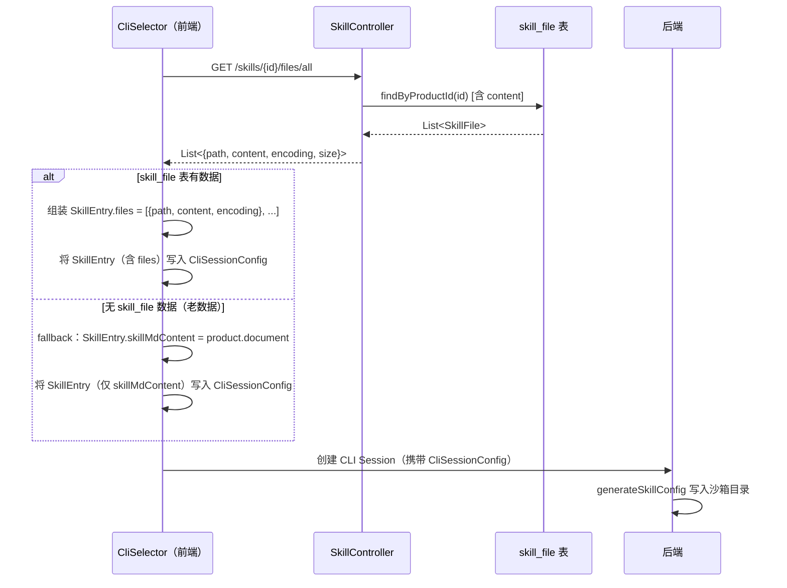
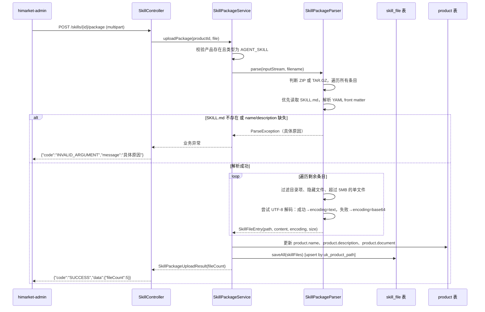
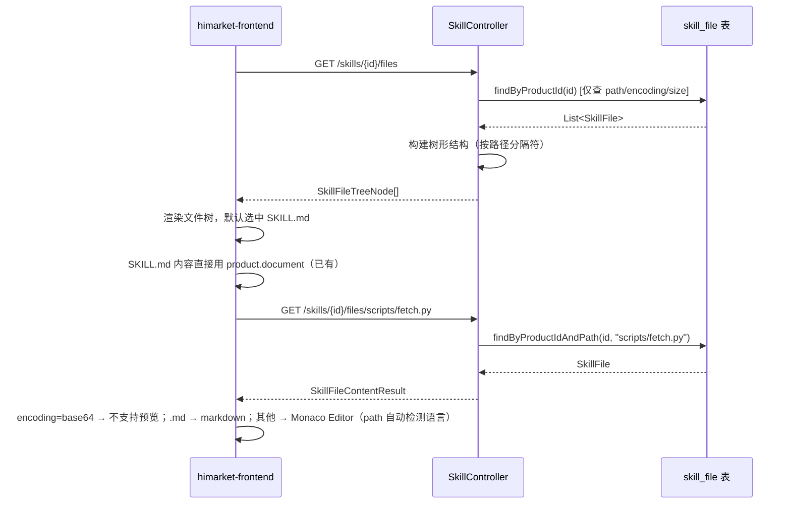

# 设计文档：Skill Package Upload & Preview

## 概述

为 himarket 的 AGENT_SKILL 类型产品新增 skill 包上传与预览能力。管理员可上传 zip/tar.gz 压缩包，系统解析后将文件存入 `skill_file` 表；前台开发者门户展示文件树并支持逐文件预览，下载按钮改为下载完整 skill 包。

## 系统架构

```mermaid
graph TD
    A[himarket-admin<br/>Skill Package Tab] -->|POST /skills/{id}/package<br/>multipart/form-data| B[SkillController]
    C[himarket-frontend<br/>SkillDetail] -->|GET /skills/{id}/files| B
    C -->|GET /skills/{id}/files/{path}| B
    C -->|GET /skills/{id}/files/all| B
    C -->|GET /skills/{id}/package 下载zip| B
    D2[hicli/hiwork/hiCoding<br/>CliSelector] -->|GET /skills/{id}/files/all| B
    B --> D[SkillPackageService]
    D --> E[SkillFileRepository]
    D --> F[ProductRepository]
    E --> G[(skill_file 表)]
    F --> H[(product 表)]
    D --> I[SkillPackageParser<br/>ZIP/TAR.GZ 解析]
    D --> J[SkillMdParser<br/>已有组件]
```

## 数据模型设计

### product 表变更（V8 迁移）

两处变更：
1. `name` 字段去掉唯一约束（未来支持用户自己录入 skill，名称允许重复）
2. `description` 字段从 `VARCHAR(256)` 扩展为 `VARCHAR(1000)`

```sql
-- V8 迁移中执行
ALTER TABLE product DROP INDEX uk_name;
ALTER TABLE product MODIFY COLUMN description VARCHAR(1000) DEFAULT NULL;
```

注意：`Product.java` 实体的 `@UniqueConstraint` 注解也需要同步去掉 `name` 的约束，`description` 字段长度改为 1000。

### skill_file 表（新增，V8 迁移）

```sql
CREATE TABLE skill_file (
    id          BIGINT AUTO_INCREMENT PRIMARY KEY,
    product_id  VARCHAR(64) NOT NULL,
    path        VARCHAR(256) NOT NULL,   -- 相对路径，如 scripts/fetch.py、SKILL.md
    encoding    VARCHAR(16) NOT NULL DEFAULT 'text',  -- 'text' | 'base64'
    content     MEDIUMTEXT NOT NULL,     -- 文本内容 或 Base64 编码内容
    size        INT DEFAULT 0,           -- 原始文件字节数
    created_at  DATETIME(3) DEFAULT CURRENT_TIMESTAMP(3),
    updated_at  DATETIME(3) DEFAULT CURRENT_TIMESTAMP(3) ON UPDATE CURRENT_TIMESTAMP(3),
    UNIQUE KEY uk_product_path (product_id, path)
);
```

Flyway 迁移文件：`V8__Add_skill_file_table.sql`（同时包含 product 表变更）

### SkillFile 实体（新增）

```java
@Entity
@Table(name = "skill_file")
public class SkillFile extends BaseEntity {
    @Id @GeneratedValue(strategy = GenerationType.IDENTITY)
    private Long id;

    @Column(name = "product_id", length = 64, nullable = false)
    private String productId;

    @Column(name = "path", length = 256, nullable = false)
    private String path;

    @Column(name = "encoding", length = 16, nullable = false)
    private String encoding;  // "text" | "base64"

    @Column(name = "content", columnDefinition = "mediumtext", nullable = false)
    private String content;

    @Column(name = "size")
    private Integer size;
}
```

说明：
- 文本文件（UTF-8 可解码）：`encoding = "text"`，`content` 直接存储文本内容
- 二进制文件（如 `.png`、`.docx`、`.xsd` 等）：`encoding = "base64"`，`content` 存储 Base64 编码后的字符串
- 不维护文件类型枚举，文件类型由前端 Monaco Editor 根据扩展名自动检测

## 后端 API 接口设计

### 新增接口

#### POST /skills/{productId}/package
上传 skill 包（zip 或 tar.gz）。

- 认证：`@AdminAuth`
- Content-Type：`multipart/form-data`
- 参数：`file`（MultipartFile）
- 逻辑：
  1. 校验 productId 对应产品存在且类型为 `AGENT_SKILL`
  2. 解析压缩包，**优先找到 `SKILL.md`**，解析其 YAML front matter
  3. 从 front matter 提取 `name` 和 `description`：
     - 若找不到 `SKILL.md`：返回错误 `"压缩包中未找到 SKILL.md 文件"`
     - 若 front matter 缺少 `name`：返回错误 `"SKILL.md 缺少 name 字段"`
     - 若 front matter 缺少 `description`：返回错误 `"SKILL.md 缺少 description 字段"`
  4. 用解析出的 `name` 和 `description` 更新 `product` 表对应字段
  5. 继续提取所有文件（过滤目录项、隐藏文件、超过 5MB 的单文件）
  6. 文本文件（UTF-8 可解码）：`encoding = "text"`，直接存储内容
  7. 二进制文件：`encoding = "base64"`，Base64 编码后存储
  8. 批量 upsert 到 `skill_file` 表（基于 `uk_product_path` 唯一键）
  9. 将 `SKILL.md` 内容同步写入 `product.document`（向后兼容）
- 响应：`{"code":"SUCCESS","data":{"fileCount":5}}`
- 错误响应示例：`{"code":"INVALID_ARGUMENT","message":"SKILL.md 缺少 name 字段"}`

**SKILL.md front matter 格式**（固定格式，YAML 块位于文件开头 `---` 之间）：
```yaml
---
name: xlsx
description: "Advanced spreadsheet toolkit..."
description_zh: "高级电子表格工具包..."   # 可选
license: Proprietary                      # 可选
---
```

解析逻辑：读取文件内容，提取第一个 `---` 和第二个 `---` 之间的 YAML 块，用 SnakeYAML 解析，取 `name` 和 `description` 字段。

#### GET /skills/{productId}/files
返回文件树（不含内容）。

- 认证：无（公开）
- 响应：
```json
{
  "code": "SUCCESS",
  "data": [
    { "name": "SKILL.md", "path": "SKILL.md", "type": "file", "size": 1024, "encoding": "text" },
    { "name": "scripts", "path": "scripts", "type": "directory", "children": [
      { "name": "fetch.py", "path": "scripts/fetch.py", "type": "file", "size": 512, "encoding": "text" }
    ]},
    { "name": "assets", "path": "assets", "type": "directory", "children": [
      { "name": "template.docx", "path": "assets/template.docx", "type": "file", "size": 20480, "encoding": "base64" }
    ]}
  ]
}
```

#### GET /skills/{productId}/files/{filePath}
返回单个文件内容（`filePath` 支持 `/` 分隔的路径，用 `**` PathVariable 捕获）。

- 认证：无（公开）
- 响应：`{"code":"SUCCESS","data":{"path":"scripts/fetch.py","content":"...","encoding":"text","size":512}}`

#### GET /skills/{productId}/files/all
一次性返回所有文件的 path + content，供 CliSelector 组装 `SkillEntry.files` 使用，避免多次请求。

- 认证：无（公开）
- 响应：
```json
{
  "code": "SUCCESS",
  "data": [
    { "path": "SKILL.md", "content": "...", "encoding": "text", "size": 1024 },
    { "path": "scripts/fetch.py", "content": "...", "encoding": "text", "size": 512 },
    { "path": "assets/template.docx", "content": "<base64>", "encoding": "base64", "size": 20480 }
  ]
}
```
- 逻辑：从 `skill_file` 表读取所有文件（含内容），按路径排序返回

#### GET /skills/{productId}/package
打包下载整个 skill 包（zip）。

- 认证：无（公开）
- 响应：`application/zip`，文件名 `{skillName}.zip`
- 逻辑：从 `skill_file` 表读取所有文件，`encoding = "text"` 直接写入，`encoding = "base64"` 先 Base64 解码再写入，动态打包为 zip 流输出

#### GET /skills/{productId}/download（保持不变）
向后兼容，返回 `product.document` 内容（SKILL.md 全文）。若 `skill_file` 表无数据，前端 fallback 到此接口。

### DTO 设计

```java
// 文件树节点（不含内容）
public class SkillFileTreeNode {
    private String name;
    private String path;
    private String type;          // "file" | "directory"
    private String encoding;      // "text" | "base64"，仅 file 节点有值
    private Integer size;
    private List<SkillFileTreeNode> children;  // 仅 directory 节点有值
}

// 单文件内容（用于 /files/{path} 和 /files/all）
public class SkillFileContentResult {
    private String path;
    private String content;       // 文本内容 或 Base64 字符串
    private String encoding;      // "text" | "base64"
    private Integer size;
}

// 上传结果
public class SkillPackageUploadResult {
    private int fileCount;
}
```

## 前端组件设计

### 文件渲染策略

前端不维护文件类型枚举，统一使用以下规则：

| 条件 | 渲染方式 |
|------|---------|
| `encoding = "base64"` | 显示"二进制文件，不支持预览"提示 |
| `path` 以 `.md` 结尾 | `react-markdown` 渲染 |
| 其他文本文件 | Monaco Editor（只读），传入 `path` 属性，Monaco 根据扩展名自动检测语言 |

Monaco Editor 的语言自动检测：`@monaco-editor/react` 的 `Editor` 组件接受 `path` 属性，会根据文件扩展名自动映射语言模式（如 `.py` → Python，`.yaml` → YAML，`.ts` → TypeScript 等），无需手动维护映射表。

### himarket-admin 改造

#### 新增 Tab：Skill Package

在 `ApiProductDetail.tsx` 的 `menuItems` 中，当 `productType === 'AGENT_SKILL'` 时动态插入：

```typescript
{ key: "skill-package", label: "Skill Package", description: "技能包管理", icon: InboxOutlined }
```

#### 新增组件：`ApiProductSkillPackage.tsx`

布局：上方上传区 + 下方文件浏览区（左树右预览）

```
┌─────────────────────────────────────────────────────┐
│  拖拽或点击上传 .zip / .tar.gz                        │
│  [Upload 组件，Dragger 模式]                          │
└─────────────────────────────────────────────────────┘
┌──────────────┬──────────────────────────────────────┐
│  文件树       │  文件内容预览                          │
│  SKILL.md ✓  │  [Markdown 渲染 / Monaco Editor]      │
│  scripts/    │  [二进制文件：不支持预览提示]             │
│    fetch.py  │                                       │
│  references/ │                                       │
└──────────────┴──────────────────────────────────────┘
```

关键逻辑：
- 上传成功后调用 `GET /skills/{id}/files` 刷新文件树
- 默认选中 `SKILL.md`，调用 `GET /skills/{id}/files/SKILL.md` 获取内容
- SKILL.md 用 `react-markdown` 渲染，其他文本文件用 Monaco Editor（只读，传 `path` 自动检测语言），`encoding = "base64"` 的文件显示不支持预览提示

#### Admin 新增 API 方法（`lib/api.ts`）

```typescript
uploadSkillPackage: (productId: string, file: File) => {
  const formData = new FormData()
  formData.append('file', file)
  return api.post(`/skills/${productId}/package`, formData, {
    headers: { 'Content-Type': 'multipart/form-data' },
    timeout: 60000
  })
},
getSkillFiles: (productId: string) =>
  api.get(`/skills/${productId}/files`),
getSkillFileContent: (productId: string, filePath: string) =>
  api.get(`/skills/${productId}/files/${filePath}`),
```

### himarket-frontend 改造

#### SkillDetail.tsx 布局调整

新增可折叠文件树侧边栏，左侧主区域保持 SKILL.md markdown 渲染，右侧信息栏将 `InstallCommand` 改为"下载 Skill 包"按钮：

```
┌──────────────────────────────────────────────────────────────┐
│  [← 返回]  技能名称  标签                                      │
├──────────────┬───────────────────────────────┬───────────────┤
│ 文件树        │  主内容区（SKILL.md / 文件预览）│  右侧信息栏    │
│ [可折叠]      │                               │  [下载Skill包] │
│ SKILL.md ✓   │  [MarkdownRender / Monaco]    │  SkillMdViewer│
│ scripts/     │  [二进制：不支持预览]            │  RelatedSkills│
│   fetch.py   │                               │               │
└──────────────┴───────────────────────────────┴───────────────┘
```

关键逻辑：
- 页面加载时调用 `GET /skills/{id}/files`，若返回非空则显示文件树侧边栏
- 若 `skill_file` 表无数据（老数据），文件树不显示，保持原有布局
- 默认选中 `SKILL.md`，内容来自 `product.document`（无需额外请求，向后兼容）
- 点击其他文件时调用 `GET /skills/{id}/files/{path}` 获取内容
- 文件渲染：`encoding = "base64"` 显示不支持预览；`.md` 用 markdown 渲染；其他传 `path` 给 Monaco Editor 自动检测语言
- 右侧栏移除 `InstallCommand` 组件，改为"下载 Skill 包"按钮：
  - 若 `skill_file` 表有数据：点击触发 `GET /skills/{id}/package` 下载 zip
  - 若无 skill_file 数据（老数据）：fallback 到 `GET /skills/{id}/download`（下载 SKILL.md）

#### 新增组件：`SkillFileTree.tsx`（`components/skill/`）

轻量封装，复用 `FileTree` 组件逻辑，适配 skill 文件树的数据格式和样式。

#### Frontend 新增 API 方法

```typescript
getSkillFiles: (productId: string) =>
  request.get(`/skills/${productId}/files`),
getSkillFileContent: (productId: string, filePath: string) =>
  request.get(`/skills/${productId}/files/${encodeURIComponent(filePath)}`),
getSkillAllFiles: (productId: string) =>
  request.get(`/skills/${productId}/files/all`),
getSkillPackageUrl: (productId: string) =>
  `/api/skills/${productId}/package`,
```

#### Frontend SkillEntry 类型扩展

```typescript
export interface SkillFileEntry {
  path: string;      // 相对路径，如 SKILL.md、scripts/fetch.py
  content: string;   // 文本内容 或 Base64 字符串
  encoding: string;  // "text" | "base64"
}

export interface SkillEntry {
  name: string;
  skillMdContent?: string;  // 保留，向后兼容
  files?: SkillFileEntry[]; // 新增：完整文件列表，非空时优先使用
}
```

## 关键流程说明

### CliSessionConfig.SkillEntry 数据模型（后端）

```java
@Data
public static class SkillEntry {
    private String name;
    private String skillMdContent;  // 保留，向后兼容

    // 新增：完整文件列表（path → content）
    // 若非空，generateSkillConfig 优先按 files 写入整个目录结构
    private List<SkillFileEntry> files;

    @Data
    public static class SkillFileEntry {
        private String path;      // 相对路径，如 SKILL.md、scripts/fetch.py
        private String content;   // 文本内容 或 Base64 字符串
        private String encoding;  // "text" | "base64"
    }
}
```

### generateSkillConfig 逻辑

```java
public void generateSkillConfig(String workingDirectory, List<CliSessionConfig.SkillEntry> skills) throws IOException {
    for (CliSessionConfig.SkillEntry skill : skills) {
        String dirName = toKebabCase(skill.getName());
        Path skillDir = Path.of(workingDirectory, QWEN_DIR, "skills", dirName);
        Files.createDirectories(skillDir);

        if (skill.getFiles() != null && !skill.getFiles().isEmpty()) {
            // 新路径：写入完整目录结构
            for (CliSessionConfig.SkillEntry.SkillFileEntry file : skill.getFiles()) {
                Path filePath = skillDir.resolve(file.getPath());
                Files.createDirectories(filePath.getParent());
                if ("base64".equals(file.getEncoding())) {
                    // 二进制文件：Base64 解码后写入
                    byte[] bytes = Base64.getDecoder().decode(file.getContent());
                    Files.write(filePath, bytes);
                } else {
                    Files.writeString(filePath, file.getContent());
                }
            }
        } else {
            // 向后兼容：只写 SKILL.md
            Files.writeString(skillDir.resolve("SKILL.md"), skill.getSkillMdContent());
        }
    }
}
```

### CliSelector 选择 skill 时的数据填充流程



CLI 工具 skill 目录规范：
- Qwen Code：`.qwen/skills/{kebab-case-name}/`
- Claude Code：`.claude/skills/{kebab-case-name}/`（待实现）
- QoderCli：`.qoder/skills/{kebab-case-name}/`（待实现）

### 上传解析流程



### 文件预览流程



## 后端模块划分

```
himarket-dal/
  entity/SkillFile.java                    # 新增实体
  repository/SkillFileRepository.java      # 新增 Repository

himarket-server/
  controller/SkillController.java          # 新增 5 个接口
  service/SkillPackageService.java         # 新增 Service 接口
  service/impl/SkillPackageServiceImpl.java
  core/skill/SkillPackageParser.java       # 新增 ZIP/TAR.GZ 解析器
  dto/result/skill/
    SkillFileTreeNode.java
    SkillFileContentResult.java
    SkillPackageUploadResult.java

himarket-bootstrap/
  db/migration/V8__Add_skill_file_table.sql
```

## 依赖说明

后端需要 `commons-compress` 处理 tar.gz：

```xml
<!-- himarket-server/pom.xml -->
<dependency>
  <groupId>org.apache.commons</groupId>
  <artifactId>commons-compress</artifactId>
  <version>1.26.1</version>
</dependency>
```

ZIP 格式使用 Java 标准库 `java.util.zip.ZipInputStream`，无需额外依赖。

SKILL.md front matter 解析使用 SnakeYAML，Spring Boot 已通过 `spring-boot-starter` 传递依赖，无需额外引入。

## 安全与限制

- 单文件大小限制：5MB（超出跳过，记录警告日志）
- 压缩包总大小限制：Spring Boot `spring.servlet.multipart.max-file-size=50MB`
- 路径安全：过滤包含 `..` 的路径（防止路径穿越）
- 文件数量上限：500 个（超出截断）
- 目录结构：不强制标准目录，保留压缩包内原始路径结构
