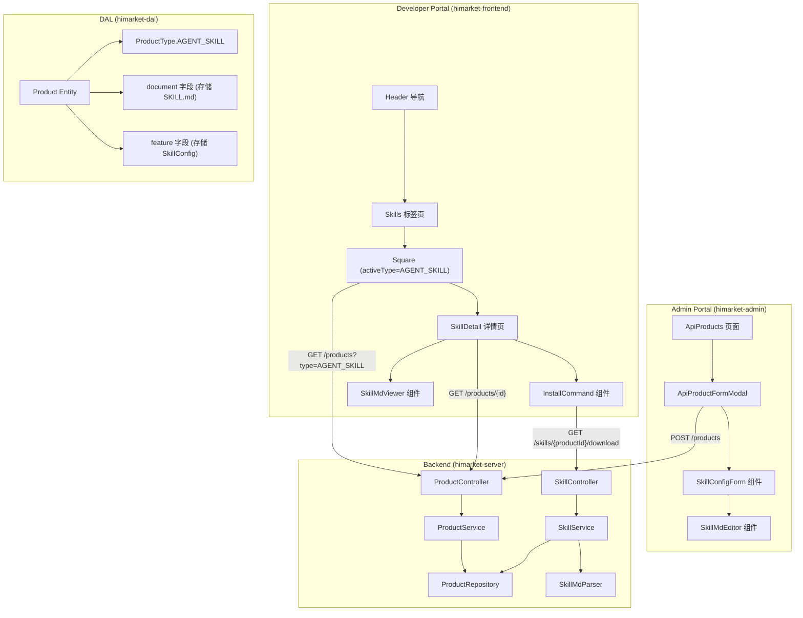

# 设计文档：Agent Skills 市场

## 概述

本设计为 HiMarket 平台新增 AGENT_SKILL 产品类型，使其与现有的 REST_API、MCP_SERVER、AGENT_API、MODEL_API 并列。设计遵循最小侵入原则，复用现有的 Product 实体、发布流程和门户基础设施，仅在必要处扩展。

核心变更：
- 后端：在 `ProductType` 枚举中新增 `AGENT_SKILL`，新增 `SkillConfig` 数据模型，新增技能下载 API 端点
- Admin 前端：在产品创建/编辑表单中新增 AGENT_SKILL 类型选项及对应的 SKILL.md 编辑器
- Developer 前端：新增 Skills 导航标签页、技能列表页（复用 Square 组件模式）、技能详情页

安装体验简洁直接：门户详情页提供 curl 下载命令和 SKILL.md 内容复制，开发者一键即可将技能下载到本地项目。

## 架构



## 组件与接口

### 后端组件

#### 1. ProductType 枚举扩展

在 `ProductType.java` 中新增 `AGENT_SKILL` 枚举值：

```java
public enum ProductType {
    REST_API,
    HTTP_API,
    MCP_SERVER,
    AGENT_API,
    MODEL_API,
    AGENT_SKILL,  // 新增
    ;
}
```

#### 2. SkillConfig 数据模型

复用 Product 实体的 `feature` 字段（JSON 类型）存储技能配置，无需新增数据库表：

```java
public class SkillConfig {
    private List<String> skillTags;      // 技能标签
    private Long downloadCount;          // 下载次数
}
```

#### 3. SkillController（新增）

新增独立的技能下载控制器：

```java
@RestController
@RequestMapping("/skills")
public class SkillController {

    // 下载技能 SKILL.md 原始内容
    @GetMapping("/{productId}/download")
    public ResponseEntity<String> downloadSkill(@PathVariable String productId);
}
```

#### 4. SkillService（新增）

```java
public interface SkillService {
    // 下载技能并递增下载计数
    String downloadSkill(String productId);

    // 解析 SKILL.md 的 YAML frontmatter
    SkillMetadata parseSkillMd(String content);

    // 序列化为 SKILL.md 格式
    String serializeSkillMd(SkillMetadata metadata, String markdownBody);
}
```

#### 5. SkillMdParser（新增）

SKILL.md 解析器，处理 YAML frontmatter + Markdown 格式：

```java
public class SkillMdParser {
    // 解析 SKILL.md，提取 frontmatter 和 body
    public SkillMdDocument parse(String content);

    // 序列化回 SKILL.md 格式
    public String serialize(SkillMdDocument document);
}

public class SkillMdDocument {
    private Map<String, Object> frontmatter;  // YAML frontmatter 键值对
    private String body;                       // Markdown 正文
}
```

#### 6. 现有 ProductController 复用

技能的 CRUD 操作完全复用现有的 `ProductController`：
- `POST /products` — 创建技能（type=AGENT_SKILL）
- `GET /products?type=AGENT_SKILL` — 列表查询
- `GET /products/{productId}` — 获取详情
- `PUT /products/{productId}` — 更新
- `DELETE /products/{productId}` — 删除
- `POST /products/{productId}/publications` — 发布到门户

### Admin 前端组件

#### 1. ApiProductFormModal 扩展

在现有的产品创建/编辑弹窗中，当 type 选择 `AGENT_SKILL` 时，展示技能专属表单：

- 产品类型下拉框新增 "Agent Skill" 选项
- 选择后展示 SkillConfigForm 组件

#### 2. SkillConfigForm 组件（新增）

技能配置表单，包含：
- 技能标签输入（Tag 多选输入）

#### 3. SkillMdEditor 组件（新增）

SKILL.md 在线编辑器，复用项目已有的 `react-markdown-editor-lite` 和 `monaco-editor`：
- 左侧：Monaco Editor（Markdown 编辑）
- 右侧：react-markdown 实时预览
- 保存时写入 Product 的 `document` 字段

该编辑器集成到 ApiProductDetail 页面的 "Usage Guide" tab 中，当产品类型为 AGENT_SKILL 时替换原有内容。

### Developer 前端组件

#### 1. Header 导航扩展

在 `Header.tsx` 的 tabs 数组中新增：

```typescript
{ path: "/skills", label: "Skills" }
```

#### 2. Skills 列表页（复用 Square）

在 `router.tsx` 中新增路由：

```typescript
<Route path="/skills" element={<Square activeType="AGENT_SKILL" />} />
```

完全复用现有的 Square 组件，通过 `activeType="AGENT_SKILL"` 参数过滤技能产品。

#### 3. SkillDetail 详情页（新增）

新增 `SkillDetail.tsx` 页面，包含：
- 技能名称、描述、标签展示
- SKILL.md 内容渲染（Markdown 渲染）
- 安装命令区域（InstallCommand 组件）
- SKILL.md 源码查看（代码高亮）

路由：`/skills/:skillProductId`

#### 4. InstallCommand 组件（新增）

展示下载命令并支持一键复制：

```
curl -o .agents/skills/<skill-name>/SKILL.md <portal-url>/api/skills/<productId>/download
```

命令旁边有复制按钮，点击后复制到剪贴板。同时提供"复制 SKILL.md 内容"按钮，直接复制原始文本。

### 前端类型扩展

#### frontend types/index.ts

```typescript
// 新增 SkillConfig 接口
export interface ApiProductSkillConfig {
  skillTags?: string[];
  downloadCount?: number;
}

// ProductType 新增
export const ProductType = {
  REST_API: 'REST_API',
  MCP_SERVER: 'MCP_SERVER',
  AGENT_API: 'AGENT_API',
  MODEL_API: 'MODEL_API',
  AGENT_SKILL: 'AGENT_SKILL',  // 新增
} as const;

// ApiProduct 接口新增 skillConfig 字段
export interface ApiProduct {
  // ... 现有字段
  skillConfig?: ApiProductSkillConfig;
}
```

#### admin types/api-product.ts

```typescript
// ApiProduct 接口新增
export interface ApiProduct {
  // ... 现有字段
  type: 'REST_API' | 'MCP_SERVER' | 'AGENT_API' | 'MODEL_API' | 'AGENT_SKILL';
  skillConfig?: {
    skillTags?: string[];
    downloadCount?: number;
  };
}
```

## 数据模型

### Product 实体（复用，无需新增表）

| 字段 | 用途（AGENT_SKILL 场景） |
|------|--------------------------|
| `product_id` | 技能唯一标识 |
| `name` | 技能名称 |
| `description` | 技能描述 |
| `type` | `AGENT_SKILL` |
| `document` | 存储 SKILL.md 完整内容（longtext） |
| `icon` | 技能图标 |
| `status` | 产品状态（PENDING/READY） |
| `feature` | JSON 字段，存储 SkillConfig（skillTags, downloadCount） |

### SkillMdDocument（内存模型）

```
SkillMdDocument
├── frontmatter: Map<String, Object>
│   ├── name: String          // 技能名称
│   ├── description: String   // 技能描述
│   └── ... (其他 YAML 字段)
└── body: String              // Markdown 正文
```

### SKILL.md 格式规范

```markdown
---
name: skill-name
description: "技能描述"
---

# 技能标题

## 使用说明

技能的 Markdown 正文内容...
```

YAML frontmatter 以 `---` 分隔符包裹，后跟 Markdown 正文。


## 正确性属性

*正确性属性是系统在所有合法执行中都应保持为真的特征或行为——本质上是关于系统应该做什么的形式化陈述。属性是人类可读规范与机器可验证正确性保证之间的桥梁。*

### Property 1: 技能产品创建往返一致性

*For any* 合法的 AGENT_SKILL 产品数据（包含名称、描述、skillTags、document），创建产品后通过 API 查询，返回的产品数据中的名称、描述、skillTags 和 document 字段应与创建时提交的数据等价。

**Validates: Requirements 1.3, 2.2, 3.3, 7.1**

### Property 2: 发布状态与门户可见性一致

*For any* AGENT_SKILL 产品和门户，当产品已发布到该门户时，通过该门户查询 AGENT_SKILL 类型产品列表应包含该产品；当产品从该门户下线后，查询结果不应包含该产品。

**Validates: Requirements 4.2, 4.3**

### Property 3: 搜索过滤正确性

*For any* 搜索关键词和 AGENT_SKILL 产品列表，搜索返回的每个结果的名称或描述中应包含该关键词（不区分大小写）。

**Validates: Requirements 5.2**

### Property 4: 分类过滤正确性

*For any* 分类 ID 和 AGENT_SKILL 产品列表，按分类过滤返回的每个结果应属于该分类。

**Validates: Requirements 5.3**

### Property 5: 安装命令格式正确性

*For any* 技能产品 ID 和名称，生成的 curl 下载命令应包含正确的下载 URL 且符合 `curl -o .agents/skills/<name>/SKILL.md <url>` 格式。

**Validates: Requirements 6.2**

### Property 6: 下载计数递增不变量

*For any* 已发布的 AGENT_SKILL 产品，每次调用下载接口后，该产品的 downloadCount 应恰好递增 1。

**Validates: Requirements 7.2**

### Property 7: SKILL.md 解析往返一致性

*For any* 合法的 SKILL.md 内容（包含 YAML frontmatter 和 Markdown body），解析后再序列化再解析，应产生与首次解析等价的 SkillMdDocument 对象。即 `parse(serialize(parse(content))) == parse(content)`。

**Validates: Requirements 8.1, 8.2, 8.3**

### Property 8: 技能卡片信息完整性

*For any* AGENT_SKILL 产品，渲染的技能卡片应包含该产品的名称、描述和标签信息。

**Validates: Requirements 5.1**

## 错误处理

| 场景 | 处理方式 |
|------|----------|
| SKILL.md 内容为空 | Admin 前端阻止保存，提示"SKILL.md 内容不能为空" |
| SKILL.md YAML frontmatter 格式错误 | 后端返回 400，错误信息指明 YAML 解析失败的位置 |
| SKILL.md 缺少 `---` 分隔符 | 后端返回 400，提示"缺少 YAML frontmatter 分隔符" |
| 下载不存在的技能 | 后端返回 404，提示"技能不存在" |
| 下载未发布到当前门户的技能 | 后端返回 404，提示"技能未发布到当前门户" |
| 创建技能时名称重复 | 复用现有 Product 的唯一约束，返回 409 |
| 技能标签超过最大数量 | 后端校验，返回 400，提示"标签数量不能超过 20 个" |

## 测试策略

### 单元测试

- **SkillMdParser**: 测试各种合法和非法 SKILL.md 输入的解析行为
- **SkillService**: 测试下载计数递增、404 错误场景
- **InstallCommand 组件**: 测试命令生成和剪贴板复制
- **SkillConfigForm 组件**: 测试表单渲染和验证

### 属性测试

使用 **jqwik**（Java 后端）和 **fast-check**（TypeScript 前端）作为属性测试库。

每个属性测试配置最少 100 次迭代，每个测试通过注释引用设计文档中的属性编号。

标签格式：**Feature: skills-marketplace, Property {number}: {property_text}**

- **Property 1 (产品创建往返)**: 生成随机的产品名称、描述、标签列表，创建后查询验证一致性
- **Property 3 (搜索过滤)**: 生成随机关键词和产品列表，验证过滤结果的正确性
- **Property 5 (安装命令格式)**: 生成随机技能名称和产品 ID，验证 curl 命令格式
- **Property 6 (下载计数递增)**: 生成随机下载次数，验证递增不变量
- **Property 7 (SKILL.md 往返)**: 生成随机的 YAML frontmatter 和 Markdown body，验证 parse → serialize → parse 往返一致性

### 测试互补性

- 单元测试覆盖具体示例、边界条件和错误场景
- 属性测试覆盖所有合法输入空间的通用属性
- 两者互补：单元测试捕获具体 bug，属性测试验证通用正确性
