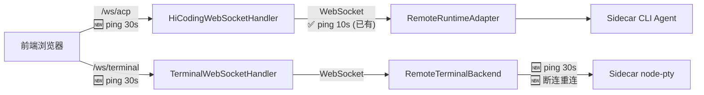

# 设计文档：Terminal 心跳保活与断连重连

## 概述

本设计为 HiCoding 的 WebSocket 连接链路添加心跳保活和断连重连机制，解决空闲连接被网络中间层超时断开的问题。

核心改动分为三层：
1. **前端→后端链路**：`HiCodingWebSocketHandler` 和 `TerminalWebSocketHandler` 添加 WebSocket 协议级 ping 定时器
2. **后端→Sidecar 链路**：`RemoteTerminalBackend` 添加心跳保活 + 指数退避重连
3. **基础设施**：`WebSocketConfig` 配置空闲超时

前端无需改动——WebSocket 协议级 ping frame（RFC 6455）由浏览器自动回复 pong。

## 架构

### 连接链路与心跳覆盖



### 设计决策

| 决策 | 选择 | 理由 |
|------|------|------|
| 前端→后端 ping 间隔 | 30 秒 | 大多数代理/防火墙超时 60-120 秒，30 秒足够保活 |
| 后端→Sidecar ping 间隔 | 30 秒 | 与前端→后端保持一致，简化配置 |
| 容器空闲超时 | 120 秒 | > 30s × 2 = 60s，允许连续丢失 2-3 个 ping 仍不超时 |
| 重连策略 | 指数退避，最多 5 次 | 平衡快速恢复与避免风暴，5 次覆盖 1+2+4+8+16=31 秒 |
| 线程模型 | 共享 ScheduledExecutorService | 避免每个 session 创建独立线程池，减少资源开销 |
| ping 类型 | WebSocket 协议级 ping frame | RFC 6455 标准，浏览器原生支持，无需应用层处理 |

## 组件与接口

### 1. WebSocketPingScheduler（新增工具类）

共享的 ping 调度器，供 `HiCodingWebSocketHandler` 和 `TerminalWebSocketHandler` 使用。

```java
package com.alibaba.himarket.service.hicoding.websocket;

/**
 * WebSocket 协议级 ping 调度器。
 * 管理共享的 ScheduledExecutorService，为每个 WebSocketSession 调度周期性 ping。
 */
@Component
public class WebSocketPingScheduler {

    private static final long PING_INTERVAL_SECONDS = 30;

    private final ScheduledExecutorService scheduler =
            Executors.newScheduledThreadPool(1, r -> {
                Thread t = new Thread(r, "ws-ping-scheduler");
                t.setDaemon(true);
                return t;
            });

    private final ConcurrentHashMap<String, ScheduledFuture<?>> pingFutures =
            new ConcurrentHashMap<>();

    /** 为指定 session 启动 ping 定时器 */
    public void startPing(WebSocketSession session);

    /** 停止指定 session 的 ping 定时器 */
    public void stopPing(String sessionId);
}
```

设计要点：
- 单例 `@Component`，两个 Handler 共享同一个实例
- 内部使用 `ConcurrentHashMap<sessionId, ScheduledFuture>` 管理每个 session 的定时器
- `startPing()` 在 `afterConnectionEstablished` 中调用
- `stopPing()` 在 `afterConnectionClosed` 和 `handleTransportError` 中调用
- ping 发送失败时捕获异常并 log warn，不影响其他 session
- 使用 `WebSocketSession.sendMessage(new PingMessage())` 发送 Spring 标准 ping

### 2. HiCodingWebSocketHandler（修改）

变更点：
- 注入 `WebSocketPingScheduler`
- `afterConnectionEstablished()` 末尾调用 `pingScheduler.startPing(session)`
- `afterConnectionClosed()` 调用 `pingScheduler.stopPing(session.getId())`
- `handleTransportError()` 调用 `pingScheduler.stopPing(session.getId())`

### 3. TerminalWebSocketHandler（修改）

变更点与 HiCodingWebSocketHandler 完全对称：
- 注入 `WebSocketPingScheduler`
- 在连接生命周期方法中调用 `startPing` / `stopPing`

### 4. RemoteTerminalBackend（修改）

新增能力：
- **心跳保活**：参照 `RemoteRuntimeAdapter.startWsPing()` 模式，使用 `ScheduledExecutorService` + daemon 线程，每 30 秒发送心跳消息
- **断连重连**：`doOnError` / `doOnComplete` 触发时，不直接 `emitComplete`，而是启动指数退避重连流程

```java
// 新增字段
private final ScheduledExecutorService scheduler;  // daemon 线程
private ScheduledFuture<?> pingFuture;
private final AtomicInteger reconnectAttempts = new AtomicInteger(0);
private volatile boolean reconnecting = false;

// 新增方法
private void startHeartbeat();           // 启动心跳定时器
private void stopHeartbeat();            // 停止心跳定时器
private void scheduleReconnect();        // 调度重连（指数退避）
private void doReconnect();              // 执行重连逻辑
```

重连流程：
1. 连接断开 → 检查 `closed` 标志，若为 true 则不重连
2. 停止心跳定时器
3. 计算退避延迟：`min(1000 * 2^attempt, 30000)` ms
4. 通过 scheduler 延迟执行 `doReconnect()`
5. `doReconnect()` 创建新的 `ReactorNettyWebSocketClient` 连接
6. 成功 → 重置计数器，启动心跳，将新 session 的 receive 流接入 `outputSink`
7. 失败 → `reconnectAttempts` +1，若 < 5 则再次 `scheduleReconnect()`，否则 `outputSink.tryEmitComplete()`

### 5. WebSocketConfig（修改）

```java
@Bean
public ServletServerContainerFactoryBean createWebSocketContainer() {
    ServletServerContainerFactoryBean container = new ServletServerContainerFactoryBean();
    container.setMaxTextMessageBufferSize(10 * 1024 * 1024);
    container.setMaxBinaryMessageBufferSize(10 * 1024 * 1024);
    container.setMaxSessionIdleTimeout(120_000L);  // 🆕 120 秒空闲超时
    return container;
}
```

## 数据模型

本特性不涉及数据库变更或新的持久化数据模型。

涉及的运行时状态：

| 状态 | 类型 | 所属组件 | 说明 |
|------|------|----------|------|
| `pingFutures` | `ConcurrentHashMap<String, ScheduledFuture<?>>` | WebSocketPingScheduler | sessionId → ping 定时器映射 |
| `reconnectAttempts` | `AtomicInteger` | RemoteTerminalBackend | 当前连续重连失败次数 |
| `reconnecting` | `volatile boolean` | RemoteTerminalBackend | 是否正在重连中 |
| `closed` | `volatile boolean` | RemoteTerminalBackend | 是否已主动关闭（已有） |
| `wsSessionRef` | `AtomicReference<WebSocketSession>` | RemoteTerminalBackend | 当前 WebSocket session 引用（已有） |


## 正确性属性

*属性（Property）是在系统所有合法执行中都应成立的特征或行为——本质上是对系统应做什么的形式化陈述。属性是人类可读规格说明与机器可验证正确性保证之间的桥梁。*

以下属性基于需求文档中的验收标准推导而来。每个属性都包含显式的"对于任意"全称量化语句，适合用属性基测试（Property-Based Testing）验证。

### 属性 1：Ping 调度器的注册与注销一致性

*对于任意* WebSocketSession，调用 `startPing(session)` 后，`pingFutures` 映射中应包含该 session 的条目且 ScheduledFuture 未被取消；调用 `stopPing(sessionId)` 后，该条目应被移除且 ScheduledFuture 已被取消。

**验证需求：1.1, 1.2, 1.3, 1.4, 5.1**

### 属性 2：RemoteTerminalBackend 心跳定时器生命周期

*对于任意* 成功启动的 RemoteTerminalBackend 实例，`start()` 完成后心跳定时器（pingFuture）应不为 null 且未被取消。

**验证需求：2.1, 2.2**

### 属性 3：RemoteTerminalBackend close() 资源清理完整性

*对于任意* 已启动的 RemoteTerminalBackend 实例，调用 `close()` 后，心跳定时器应已取消、重连标志应为 false、scheduler 应已 shutdown，且后续不会再发起新的重连尝试。

**验证需求：2.3, 3.5, 5.2**

### 属性 4：指数退避延迟计算正确性

*对于任意* 非负整数 n（重连次数），退避延迟应等于 `min(1000 * 2^n, 30000)` 毫秒。即延迟序列为 1s, 2s, 4s, 8s, 16s, 30s, 30s, ...

**验证需求：3.2**

### 属性 5：意外断连触发重连而非终止

*对于任意* 处于连接状态且未被主动 close 的 RemoteTerminalBackend 实例，当 WebSocket 连接意外断开时，outputSink 不应立即 complete，而是应进入重连流程（reconnecting 标志为 true）。

**验证需求：3.1, 3.3**

## 错误处理

| 场景 | 处理方式 |
|------|----------|
| ping 发送时 session 已关闭 | 捕获异常，log warn，不影响其他 session 的 ping 调度 |
| ping 发送时 session.sendMessage 抛出 IOException | 同上，捕获并忽略，等待 afterConnectionClosed 自然触发 cleanup |
| RemoteTerminalBackend 重连失败 | 递增 reconnectAttempts，若 < 5 则调度下次重连，否则 emitComplete |
| RemoteTerminalBackend 重连过程中 close() 被调用 | 设置 closed = true，取消 scheduler 中的重连任务，不再发起新连接 |
| ScheduledExecutorService 被 shutdown 后仍有任务提交 | 捕获 RejectedExecutionException，log debug |
| WebSocket 容器空闲超时触发 | Spring 自动关闭连接，触发 afterConnectionClosed → cleanup 流程 |
| startPing 对同一 sessionId 重复调用 | 先 stopPing 旧的，再注册新的，避免定时器泄漏 |

## 测试策略

### 双重测试方法

本特性采用单元测试 + 属性基测试的双重策略：

- **单元测试**：验证具体示例、边界条件和错误处理
- **属性基测试**：验证跨所有输入的通用属性

两者互补：单元测试捕获具体 bug，属性测试验证通用正确性。

### 属性基测试配置

- **测试库**：jqwik（Java 属性基测试框架，与 JUnit 5 集成）
- **每个属性最少运行 100 次迭代**
- **每个属性测试必须引用设计文档中的属性编号**
- **标签格式**：`Feature: terminal-heartbeat-keepalive, Property {number}: {property_text}`
- **每个正确性属性由一个属性基测试实现**

### 单元测试覆盖

| 测试场景 | 类型 | 说明 |
|----------|------|------|
| WebSocketPingScheduler startPing/stopPing | 单元测试 | 验证 ping 定时器的注册和注销 |
| ping 发送时 session 已关闭 | 单元测试（边界） | 验证异常被捕获不传播 |
| WebSocketConfig idle timeout = 120s | 单元测试（示例） | 验证配置值正确 |
| RemoteTerminalBackend daemon 线程 | 单元测试（示例） | 验证 scheduler 线程是 daemon |
| 重连连续失败 5 次后放弃 | 单元测试（边界） | 验证 outputSink.tryEmitComplete 被调用 |
| PingMessage 类型验证 | 单元测试（示例） | 验证发送的是 PingMessage 而非 TextMessage |

### 属性基测试覆盖

| 属性 | 测试内容 |
|------|----------|
| 属性 1 | 随机生成 session ID 序列，验证 startPing/stopPing 的注册注销一致性 |
| 属性 2 | 使用 mock WebSocket 服务器，验证 start() 后心跳定时器已启动 |
| 属性 3 | 随机生成 start/close 操作序列，验证 close() 后资源完全释放 |
| 属性 4 | 随机生成重连次数 n ∈ [0, 100]，验证退避延迟公式 |
| 属性 5 | 模拟随机时刻的连接断开，验证未 close 的实例进入重连而非终止 |
