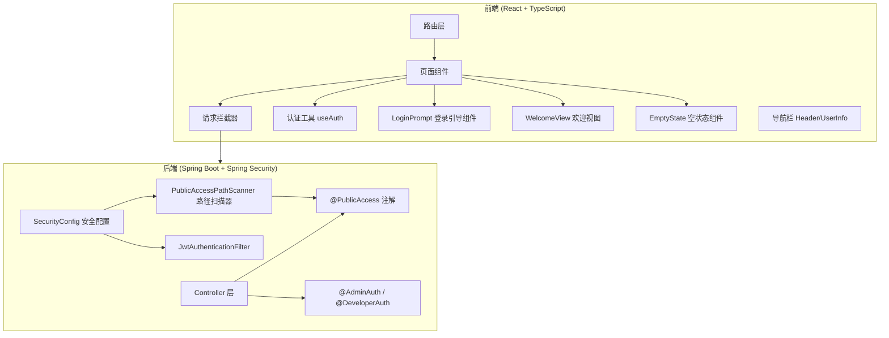
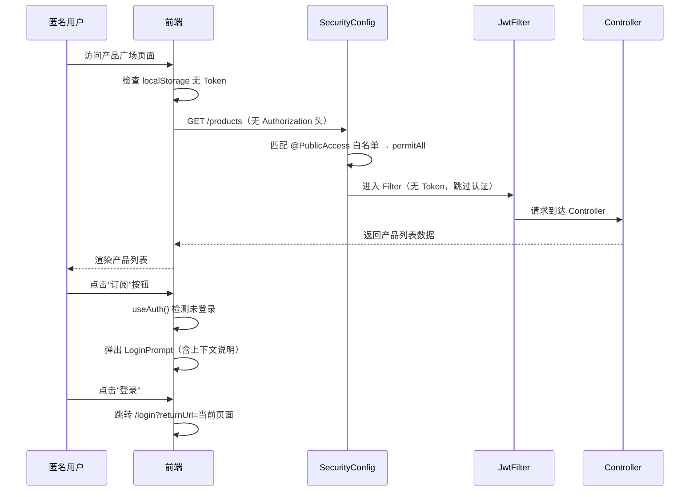

# 设计文档：匿名访问支持

## 概述

本设计为 HiMarket 前台门户实现匿名访问能力，使未登录用户可以浏览所有产品模块（HiChat、HiCoding、智能体、MCP、模型、API、Skills），同时保持需要用户身份的操作（订阅、购买、发送消息等）仍需登录认证。

核心设计思路：
- 后端：新增 `@PublicAccess` 注解，应用启动时自动扫描并注册到 Spring Security 白名单，避免手动维护 URL 列表
- 前端：改造请求拦截器区分公开/认证接口的 401 处理，新增登录引导组件和匿名欢迎视图

## 架构

### 系统架构总览



### 请求处理流程



## 组件和接口

### 后端组件

#### 1. @PublicAccess 注解

新增注解，用于标记无需认证即可访问的 Controller 方法或类。

```java
// 位置: himarket-server/src/main/java/com/alibaba/himarket/core/annotation/PublicAccess.java
@Target({ElementType.METHOD, ElementType.TYPE})
@Retention(RetentionPolicy.RUNTIME)
public @interface PublicAccess {}
```

设计决策：采用与现有 `@AdminAuth`、`@DeveloperAuth` 相同的注解模式（`@Target` 支持方法和类级别），保持一致性。不使用 `@PreAuthorize`，因为公开访问是在 SecurityConfig 层面通过 `permitAll()` 实现，而非方法级安全。

#### 2. PublicAccessPathScanner

应用启动时扫描所有标记 `@PublicAccess` 的 Controller 方法，提取 HTTP 路径并注册到 SecurityConfig。

```java
// 位置: himarket-server/src/main/java/com/alibaba/himarket/core/security/PublicAccessPathScanner.java
@Component
public class PublicAccessPathScanner implements ApplicationContextAware {
    
    // 扫描所有 @RestController / @Controller 类
    // 查找标记 @PublicAccess 的方法或类
    // 结合类级 @RequestMapping 和方法级 @GetMapping 等拼接完整路径
    // 返回 String[] 路径数组供 SecurityConfig 使用
    public String[] getPublicAccessPaths() { ... }
}
```

设计决策：
- 使用 `ApplicationContextAware` 在 Spring 容器初始化后扫描 Bean，确保所有 Controller 已注册
- 当 `@PublicAccess` 标记在类级别时，该类所有未标记认证注解（`@AdminAuth`/`@DeveloperAuth`/`@AdminOrDeveloperAuth`）的方法均视为公开
- 当方法同时标记 `@PublicAccess` 和认证注解时，认证注解优先（不加入白名单）

#### 3. SecurityConfig 改造

在现有 `SecurityConfig` 中注入 `PublicAccessPathScanner`，将扫描到的路径加入 `permitAll()` 列表。

```java
// 改造点: SecurityConfig.filterChain()
@Bean
public SecurityFilterChain filterChain(HttpSecurity http, 
        PublicAccessPathScanner publicAccessPathScanner) throws Exception {
    String[] publicPaths = publicAccessPathScanner.getPublicAccessPaths();
    
    http.authorizeHttpRequests(auth -> auth
        // ... 现有白名单保持不变 ...
        .requestMatchers(publicPaths).permitAll()  // 新增：注解扫描的公开路径
        .anyRequest().authenticated()
    );
}
```

设计决策：保留现有的 `AUTH_WHITELIST`、`SWAGGER_WHITELIST`、`SYSTEM_WHITELIST` 不变，注解扫描的路径作为补充。这样既保持向后兼容，又支持新的注解驱动方式。

#### 4. 需要标记 @PublicAccess 的接口

| Controller | 方法 | 路径 | 当前认证 | 改造 |
|---|---|---|---|---|
| ProductController | listProducts | GET /products | 无注解（需认证） | 加 @PublicAccess |
| ProductController | getProduct | GET /products/{productId} | 无注解 | 加 @PublicAccess |
| ProductController | getProductRef | GET /products/{productId}/ref | 无注解 | 加 @PublicAccess |
| ProductController | listMcpTools | GET /products/{productId}/tools | @AdminOrDeveloperAuth | 改为 @PublicAccess |
| ProductCategoryController | listProductCategories | GET /product-categories | @AdminOrDeveloperAuth | 加 @PublicAccess |
| ProductCategoryController | getProductCategory | GET /product-categories/{categoryId} | @AdminOrDeveloperAuth | 加 @PublicAccess |
| SkillController | getFileTreeByProduct | GET /skills/{productId}/files | @AdminOrDeveloperAuth | 加 @PublicAccess |
| SkillController | getFileContentByProduct | GET /skills/{productId}/files/{*filePath} | @AdminOrDeveloperAuth | 加 @PublicAccess |

注意：`GET /skills/{productId}/download` 已在 `AUTH_WHITELIST` 中，无需改动。

### 前端组件

#### 1. useAuth Hook

提供统一的认证状态判断能力。

```typescript
// 位置: himarket-web/himarket-frontend/src/hooks/useAuth.ts
export function useAuth() {
  const isLoggedIn: boolean;      // 是否已登录（检查 localStorage access_token）
  const login: (returnUrl?: string) => void;  // 跳转登录页
  const token: string | null;     // 当前 Token
}
```

设计决策：基于 `localStorage.getItem('access_token')` 判断登录状态，与现有 `UserInfo` 组件和请求拦截器的逻辑保持一致。不引入 React Context，因为登录状态变更频率低，直接读取 localStorage 足够。

#### 2. LoginPrompt 组件

登录引导弹窗，当匿名用户尝试执行需要认证的操作时展示。

```typescript
// 位置: himarket-web/himarket-frontend/src/components/LoginPrompt.tsx
interface LoginPromptProps {
  open: boolean;                  // 是否显示
  onClose: () => void;            // 关闭回调
  contextMessage: string;         // 上下文说明文案
  returnUrl?: string;             // 登录后返回的 URL
}
```

设计决策：使用 Ant Design `Modal` 实现，支持通过 `contextMessage` 参数传入不同场景的引导文案。包含"登录"和"注册"两个按钮，登录按钮携带 `returnUrl` 参数跳转。

#### 3. WelcomeView 组件

HiChat 和 HiCoding 页面的匿名欢迎视图。

```typescript
// 位置: himarket-web/himarket-frontend/src/components/WelcomeView.tsx
interface WelcomeViewProps {
  type: 'chat' | 'coding';       // 页面类型，决定展示内容
}
```

包含：欢迎文案、功能介绍、CTA 按钮（"登录后开始对话"/"登录后开始编码"）、注册入口。

#### 4. EmptyState 组件

产品广场空状态视图。

```typescript
// 位置: himarket-web/himarket-frontend/src/components/EmptyState.tsx
interface EmptyStateProps {
  productType: string;            // 产品类型，决定说明文案
}
```

#### 5. 请求拦截器改造

改造 `request.ts` 中的响应拦截器，区分公开页面和认证操作的 401/403 处理。

```typescript
// 核心逻辑：定义公开页面路径列表
const PUBLIC_PATHS = ['/models', '/mcp', '/agents', '/apis', '/skills', '/chat', '/coding'];

// 401/403 处理：
// - 如果当前页面路径匹配 PUBLIC_PATHS → 不跳转登录页，静默处理
// - 否则 → 保持现有跳转逻辑
```

设计决策：通过 `window.location.pathname` 判断当前页面是否为公开浏览页面，而非通过请求 URL 判断。原因是同一个页面可能同时发起公开接口和认证接口的请求（如产品详情页同时请求产品信息和订阅状态），以页面维度判断更合理。

#### 6. UserInfo 组件改造

现有 `UserInfo` 组件已具备未登录时展示"登录"按钮的逻辑（代码末尾的 fallback），但当前在未登录时会因 `getDeveloperInfo()` 接口 401 触发跳转。改造后：
- 请求拦截器不再对公开页面的 401 跳转
- `UserInfo` 组件在 `catch` 中静默处理，展示"登录"按钮

## 数据模型

本功能不涉及数据库 schema 变更。核心数据流转如下：

### 后端数据模型

```
@PublicAccess 注解元数据
  ├── 标记位置: Controller 类 或 方法
  ├── 扫描时机: 应用启动时（Bean 初始化后）
  └── 输出: String[] publicPaths → SecurityConfig.permitAll()

SecurityConfig 白名单结构（运行时）
  ├── AUTH_WHITELIST: String[]        （现有，保持不变）
  ├── SWAGGER_WHITELIST: String[]     （现有，保持不变）
  ├── SYSTEM_WHITELIST: String[]      （现有，保持不变）
  └── publicAccessPaths: String[]     （新增，注解扫描）
```

### 前端数据模型

```
认证状态
  ├── 来源: localStorage.getItem('access_token')
  ├── 已登录: Token 存在且有效
  └── 未登录: Token 不存在

公开页面路径配置
  ├── PUBLIC_PATHS: string[]
  └── 用途: 请求拦截器判断是否静默处理 401/403

LoginPrompt 状态
  ├── open: boolean
  ├── contextMessage: string（按场景不同）
  └── returnUrl: string（当前页面路径）
```


## 正确性属性

*属性（Property）是指在系统所有合法执行中都应成立的特征或行为——本质上是对系统应做什么的形式化陈述。属性是人类可读规格说明与机器可验证正确性保证之间的桥梁。*

### 属性 1：PublicAccess 扫描器正确性

*对于任意*一组 Controller Bean，其中部分方法标记了 `@PublicAccess`，`PublicAccessPathScanner.getPublicAccessPaths()` 返回的路径集合应恰好包含所有标记了 `@PublicAccess` 且未同时标记认证注解的方法对应的 HTTP 路径。

**验证需求: 1.2, 1.4, 2.2, 2.3**

### 属性 2：认证注解优先级

*对于任意*同时标记了 `@PublicAccess` 和认证注解（`@AdminAuth`、`@DeveloperAuth`、`@AdminOrDeveloperAuth`）的 Controller 方法，`PublicAccessPathScanner` 不应将该方法的路径加入公开白名单。

**验证需求: 1.3**

### 属性 3：默认认证策略

*对于任意*未标记 `@PublicAccess` 且不在现有白名单（AUTH_WHITELIST、SWAGGER_WHITELIST、SYSTEM_WHITELIST）中的接口路径，无 Token 请求应返回 401 状态码。

**验证需求: 2.1, 2.4**

### 属性 4：公开页面错误静默处理

*对于任意* `PUBLIC_PATHS` 中的页面路径，当请求拦截器收到 401 或 403 状态码时，不应触发页面跳转到登录页。

**验证需求: 5.4, 7.1, 7.3**

### 属性 5：非公开页面 401 跳转

*对于任意*不在 `PUBLIC_PATHS` 中的页面路径（且非 /login 页面），当请求拦截器收到 401 状态码时，应跳转到登录页并携带 returnUrl 参数。

**验证需求: 7.2**

### 属性 6：无 Token 时不附加 Authorization 头

*对于任意*请求，当 `localStorage` 中不存在 `access_token` 时，请求拦截器不应在请求头中添加 `Authorization` 字段。

**验证需求: 7.4**

### 属性 7：LoginPrompt 上下文文案渲染

*对于任意*非空字符串作为 `contextMessage` 传入 `LoginPrompt` 组件，组件渲染输出应包含该字符串内容。

**验证需求: 6.4, 6.7**

### 属性 8：LoginPrompt 登录跳转携带 returnUrl

*对于任意* URL 路径字符串作为 `returnUrl` 传入 `LoginPrompt` 组件，登录按钮的跳转链接应包含 `returnUrl=<编码后的路径>` 参数。

**验证需求: 6.5**

### 属性 9：产品广场空状态与列表渲染

*对于任意*产品类型，当产品列表为空时，页面应渲染 `EmptyState` 组件并展示该产品类型对应的说明文案；当产品列表非空时，应渲染产品卡片列表而非 `EmptyState`。

**验证需求: 10.1, 10.2, 10.5**

## 错误处理

### 后端错误处理

| 场景 | 处理方式 |
|---|---|
| @PublicAccess 扫描失败 | 记录 WARN 日志，不影响应用启动，未扫描到的路径保持默认 authenticated |
| 匿名请求访问非公开接口 | Spring Security 返回 401 Unauthorized |
| Token 过期或无效 | JwtAuthenticationFilter 清除 SecurityContext，后续由 Spring Security 判断是否需要认证 |
| @PublicAccess 接口的后端业务异常 | 正常返回业务错误码，与认证无关 |

### 前端错误处理

| 场景 | 处理方式 |
|---|---|
| 公开页面接口 401/403 | 静默处理，不跳转登录页，不清除 Token |
| 非公开页面接口 401 | 清除 Token，跳转登录页（携带 returnUrl） |
| UserInfo 获取用户信息失败（匿名） | catch 中静默处理，展示"登录"按钮 |
| 公开接口网络错误 | 展示 antd message 错误提示 |
| LoginPrompt 登录跳转后返回 | 通过 returnUrl 参数自动返回原页面 |

## 测试策略

### 测试方法

采用单元测试 + 属性测试的双重策略：

- 单元测试：验证具体示例、边界情况和错误条件
- 属性测试：验证跨所有输入的通用属性

两者互补，单元测试捕获具体 bug，属性测试验证通用正确性。

### 属性测试配置

- 属性测试库：
  - 后端 Java：使用 **jqwik**（JUnit 5 属性测试框架）
  - 前端 TypeScript：使用 **fast-check**（与 Vitest 集成）
- 每个属性测试最少运行 100 次迭代
- 每个属性测试必须通过注释引用设计文档中的属性编号
- 标签格式：**Feature: anonymous-access-support, Property {number}: {property_text}**
- 每个正确性属性由一个属性测试实现

### 后端测试

#### 属性测试

| 属性 | 测试内容 | 框架 |
|---|---|---|
| 属性 1 | PublicAccessPathScanner 扫描正确性 | jqwik |
| 属性 2 | 认证注解优先级 | jqwik |
| 属性 3 | 默认认证策略（集成测试） | Spring Boot Test + MockMvc |

#### 单元测试

- SecurityConfig 改造后仍包含原有白名单（需求 2.5）
- 各公开接口无 Token 可访问（需求 3.1-3.6, 4.1-4.3）
- Skill 管理接口保持 @AdminAuth（需求 4.4）

### 前端测试

#### 属性测试

| 属性 | 测试内容 | 框架 |
|---|---|---|
| 属性 4 | 公开页面错误静默处理 | fast-check + Vitest |
| 属性 5 | 非公开页面 401 跳转 | fast-check + Vitest |
| 属性 6 | 无 Token 时不附加 Authorization 头 | fast-check + Vitest |
| 属性 7 | LoginPrompt 上下文文案渲染 | fast-check + React Testing Library |
| 属性 8 | LoginPrompt returnUrl 参数 | fast-check + Vitest |
| 属性 9 | 产品广场空状态与列表渲染 | fast-check + React Testing Library |

#### 单元测试

- UserInfo 未登录时展示登录按钮（需求 8.1）
- WelcomeView 按类型渲染不同内容（需求 9.1-9.5）
- HiChat/HiCoding 已登录用户不展示 WelcomeView（需求 9.8, 9.9）
- LoginPrompt 包含登录和注册按钮（需求 6.5, 6.6）
- EmptyState 包含引导文案和视觉元素（需求 10.3）
